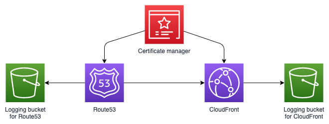

# aws-route53-cloudfront module
<!--BEGIN STABILITY BANNER-->

---


> All classes are under active development and subject to non-backward compatible changes or removal in any
> future version. These are not subject to the [Semantic Versioning](https://semver.org/) model.
> This means that while you may use them, you may need to update your source code when upgrading to a newer version of this package.

---
<!--END STABILITY BANNER-->

| **Reference Documentation**:| <span style="font-weight: normal">https://docs.aws.amazon.com/solutions/latest/constructs/</span>|
|:-------------|:-------------|
<div style="height:8px"></div>

| **Language**     | **Package**        |
|:-------------|-----------------|
| Python|`aws_solutions_constructs.aws_route53_cloudfront`|
| Typescript|`@aws-solutions-constructs/aws-route53-cloudfront`|
| Java|`software.amazon.awsconstructs.services.route53cloudfront`|

This AWS Solutions Construct implements an AWS CloudFront distribution against a custom domain and protected with SSL certificate. It lets you specify overrides for CloudFront distribution props so that you can use this pattern with different types of origins.

Here is a minimal deployable pattern definition in Typescript. It assumes that you have a domain purchased from Route53, and hence a corresponding hosted zone already existing.

``` typescript
import route53 from '@aws-cdk/aws-route53';
import { Route53ToCloudFront } from '@aws-solutions-constructs/aws-route53-cloudfront';

const hostedZone = route53.HostedZone.fromHostedZoneAttributes(this, 'HostedZone', {
        hostedZoneId: 'Z00382491YVBQ98RPC5W9',
        zoneName: 'example.com',
    });

new Route53ToCloudFront(this, 'test-route53-cloudfront', {
        existingHostedZoneObj: hostedZone
    });

```

## Initializer

``` text
new Route53ToCloudFront(scope: Construct, id: string, props: Route53ToCloudFrontProps);
```

_Parameters_

* scope [`Construct`](https://docs.aws.amazon.com/cdk/api/latest/docs/@aws-cdk_core.Construct.html)
* id `string`
* props [`Route53ToCloudFrontProps`](#pattern-construct-props)

## Pattern Construct Props

| **Name**     | **Type**        | **Description** |
|:-------------|:----------------|-----------------|
|existingHostedZoneObj?|[`route53.HostedZone`](https://docs.aws.amazon.com/cdk/api/latest/docs/@aws-cdk_aws-route53.HostedZone.html)|Existing instance of Route53 hosted zone object. If it is not provided, a hosted zone will be created based on the given domainName.|
|domainName?|`string`|The domain name to be used while creating the hosted zone. This is used only if existingHostedZoneObj is not provided.|
|hostedZoneProps?|[`route53.HostedZoneProps`](https://docs.aws.amazon.com/cdk/api/latest/docs/@aws-cdk_aws-route53.HostedZoneProps.html)|Optional user provided props to override the default props for the Route53 hosted zone.|
|certificateArn?|`string`|ARN of an existing certificate from us-east-1 region in ACM. If it is not provided, a certificate will be automatically provisioned for the domain using ACM's DNS based validation. <span style="color:orange">***Please note that the hosted zone needs to be reachabe from the internet in order for the automatic validation to be successful. Please see the [footnotes](#footnotes) for more details.***|</span>
|cloudFrontDistributionProps?|[`cloudfront.DistributionProps`](https://docs.aws.amazon.com/cdk/api/latest/docs/@aws-cdk_aws-cloudfront.DistributionProps.html)|Optional user provided props to override the default props for CloudFront Distribution|

## Pattern Properties

| **Name**     | **Type**        | **Description** |
|:-------------|:----------------|-----------------|
|cloudFrontWebDistribution|[`cloudfront.CloudFrontWebDistribution`](https://docs.aws.amazon.com/cdk/api/latest/docs/@aws-cdk_aws-cloudfront.CloudFrontWebDistribution.html)|Returns an instance of cloudfront.CloudFrontWebDistribution created by the construct|
|cloudFrontLoggingBucket|[`s3.Bucket`](https://docs.aws.amazon.com/cdk/api/latest/docs/aws-s3-readme.html)|Returns an instance of the logging bucket for CloudFront WebDistribution.|
|hostedZone?|[`route53.HostedZone`](https://docs.aws.amazon.com/cdk/api/latest/docs/@aws-cdk_aws-route53.HostedZone.html)|Returns an instance of Route53 hosted zone created by the construct.|
|hostedZoneLoggingBucket|[`s3.Bucket`](https://docs.aws.amazon.com/cdk/api/latest/docs/aws-s3-readme.html)|Returns an instance of the logging bucket for the Route53 hosted zone|
|certificateArn?|`string`|ARN of an existing certificate from us-east-1 region in ACM.|

## Default settings

Out of the box implementation of the Construct with only the existingHostedZoneObj given, without any override will set the following defaults:

### AWS CloudFront
* Configure custom domain for the CloudFront WebDistribution
* Configure SSL certificate for the CloudFront WebDistribution
* Configure Access logging for CloudFront WebDistribution
* Configure origin as HTTP endpoint of amazon.com

### AWS Certificate manager
* Automatically provision and validate an SSL certificate for the given domain

### Amazon Route53
* Associate the domain with the CloudFront distribution
* Configure Access logging for the hosted zone

## Architecture


## Footnotes
Automatic domain ownership verification by  ACM is achieved by inserting a CNAME record into the given hosted zone and then checking that this record in fact can be retrieved from the open internet. This has some implications depending on whom the domain was purchased from and who is currently the domain registrar.
* In the case when the domain was purchased from Route53, then the certificate verification is fully automatic. That is because Route53 will automatically create a hosted zone by the same name and will have the NS records already mapped. This means that you only just need to pass the Route53.HostedZone object of the already existing hosted zone to this construct and an SSL certificate will be provisioned and validated automatically.
* However, if the domain was purchased from a different domain registrar or if it was trasferred into Route53 from a different registrar, then the previously mentioned NS record configuration won't be in place. In such cases, the certificate validation needs a manual step. Instead of a Route53.HostedZone object, you will pass just the domain name to this construct. This construct will then create a matching hosted zone automatically. But then, you will have to manually copy the NS records of this hosted zone into the domain registrar, be it Route53 or third party. Note that until this is done, the certificate will not be verified and the stack creation will timeout after 9 minutes. This means that while deploying a stack containing this construct and if your domain was not purchased from Route53, you will have to go to Route53(while the stack is still deploying), look for the hosted zone that has been created, copy the NS records and add them to the active domain registrar before the stack timesout. Keep in mind that this is to be done while the stack is still deploying, but as soon as the hosted zone has been provisioned. 
* If for some reason you couldn't setup the NS records before the stack timeout happens, then you have to provision the certificate ahead of time manually in ACM from us-east-1 region, and then pass its ARN as an argument into this construct. Please find more details [here](https://docs.aws.amazon.com/cdk/api/latest/docs/aws-certificatemanager-readme.html)

***
&copy; Copyright 2021 Amazon.com, Inc. or its affiliates. All Rights Reserved.