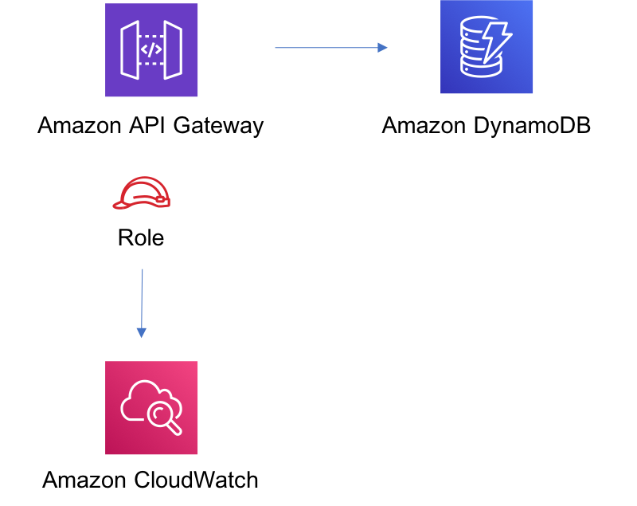

//!!NODE_ROOT <section>
//== aws-apigateway-dynamodb module

[.topic]
= aws-apigateway-dynamodb
:info_doctype: section
:info_title: aws-apigateway-dynamodb

image::https://img.shields.io/badge/stability-Experimental-important.svg?style=for-the-badge[Stability:Experimental]

____
All classes are under active development and subject to non-backward
compatible changes or removal in any future version. These are not
subject to the https://semver.org/[Semantic Versioning] model. This
means that while you may use them, you may need to update your source
code when upgrading to a newer version of this package.
____

[width="100%",cols="<50%,<50%",options="header",]
|===
|*Reference Documentation*:
|https://docs.aws.amazon.com/solutions/latest/constructs/
|===

[width="100%",cols="<46%,54%",options="header",]
|===
|*Language* |*Package*
|image:https://docs.aws.amazon.com/cdk/api/latest/img/python32.png[Python
Logo] Python
|`aws_solutions_constructs.aws_apigateway_dynamodb`

|image:https://docs.aws.amazon.com/cdk/api/latest/img/typescript32.png[Typescript
Logo] Typescript |`@aws-solutions-constructs/aws-apigateway-dynamodb`

|image:https://docs.aws.amazon.com/cdk/api/latest/img/java32.png[Java
Logo] Java |`software.amazon.awsconstructs.services.apigatewaydynamodb`
|===

== Overview

This AWS Solutions Construct implements an Amazon API Gateway REST API
connected to Amazon DynamoDB table.

Here is a minimal deployable pattern definition in:

====
[role="tablist"]
Typescript::
+
[source,typescript]
----
import { Construct } from 'constructs';
import { Stack, StackProps } from 'aws-cdk-lib';
import { ApiGatewayToDynamoDBProps, ApiGatewayToDynamoDB } from "@aws-solutions-constructs/aws-apigateway-dynamodb";

new ApiGatewayToDynamoDB(this, 'test-api-gateway-dynamodb-default', {});
----

Python::
+
[source,python]
----
from aws_solutions_constructs.aws_apigateway_dynamodb import ApiGatewayToDynamoDB
from aws_cdk import Stack
from constructs import Construct

ApiGatewayToDynamoDB(self, 'test-api-gateway-dynamodb-default')
----

Java::
+
[source,java]
----
import software.constructs.Construct;

import software.amazon.awscdk.Stack;
import software.amazon.awscdk.StackProps;
import software.amazon.awsconstructs.services.apigatewaydynamodb.*;

new ApiGatewayToDynamoDB(this, "test-api-gateway-dynamodb-default", new ApiGatewayToDynamoDBProps.Builder()
        .build());
----
====

== Pattern Construct Props

[width="100%",cols="<30%,<35%,35%",options="header",]
|===
|*Name* |*Type* |*Description*
|dynamoTableProps?
|https://docs.aws.amazon.com/cdk/api/v2/docs/aws-cdk-lib.aws_dynamodb.TableProps.html[`dynamodb.TableProps`]
|Optional user provided props to override the default props for DynamoDB
Table.

|existingTableObj?
|https://docs.aws.amazon.com/cdk/api/v2/docs/aws-cdk-lib.aws_dynamodb.Table.html[`dynamodb.Table`]
|Existing instance of DynamoDB table object, providing both this and
`dynamoTableProps` will cause an error.

|apiGatewayProps?
|https://docs.aws.amazon.com/cdk/api/v2/docs/aws-cdk-lib.aws_apigateway.RestApiProps.html[`api.RestApiProps`]
|Optional user-provided props to override the default props for the API
Gateway.

|createUsagePlan? |boolean |Whether to create a Usage Plan attached to
the API. Must be true if
apiGatewayProps.defaultMethodOptions.apiKeyRequired is true. @default -
true (to match legacy behavior)

|resourceName? |`string` |Optional name of the resource on the API
Gateway. Defaults to the table’s partitionKeyName

|allowCreateOperation? |`boolean` |Whether to deploy an API Gateway
Method for POST HTTP operations on the DynamoDB table
(i.e. dynamodb:PutItem).

|createRequestTemplate? |`string` |API Gateway Request Template for the
create method for the default `application/json` content-type. This
property is required if the `allowCreateOperation` property is set to
true.

|additionalCreateRequestTemplates?
|`{ [contentType: string]: string;  }` |Optional Create
Request Templates for content-types other than `application/json`. Use
the `createRequestTemplate` property to set the request template for the
`application/json` content-type. This property can only be specified if
the `allowCreateOperation` property is set to true.

|createIntegrationResponses?
|https://docs.aws.amazon.com/cdk/api/v2/docs/aws-cdk-lib.aws_apigateway.IntegrationResponse.html[`api.IntegrationResponses[]`]
|Optional, custom API Gateway Integration Response for the create
method. This property can only be specified if the
`allowCreateOperation` property is set to true.

|createMethodResponses?
|https://docs.aws.amazon.com/cdk/api/v2/docs/aws-cdk-lib.aws_apigateway.MethodResponse.html[`api.MethodResponses[]`]
|Optional, custom API Gateway Method Responses for the create action.
default: [{ statusCode: "`200`", responseParameters: {
"`method.response.header.Content-Type`": true }},{ statusCode:
"`500`", responseParameters: {
"`method.response.header.Content-Type`": true } } ]

|allowReadOperation? |`boolean` |Whether to deploy an API Gateway Method
for GET HTTP operations on DynamoDB table (i.e. dynamodb:Query).

|readRequestTemplate? |`string` |API Gateway Request Template for the
read method for the default `application/json` content-type. The default
template only supports a partition key and not partition {plus} sort
keys.

|additionalReadRequestTemplates?
|`{ [contentType: string]: string;  }` |Optional Read Request
Templates for content-types other than `application/json`. Use the
`readRequestTemplate` property to set the request template for the
`application/json` content-type.

|readIntegrationResponses?
|https://docs.aws.amazon.com/cdk/api/v2/docs/aws-cdk-lib.aws_apigateway.IntegrationResponse.html[`api.IntegrationResponses[]`]
|Optional, custom API Gateway Integration Response for the read method.

|allowUpdateOperation? |`boolean` |Whether to deploy API Gateway Method
for PUT HTTP operations on DynamoDB table (i.e. dynamodb:UpdateItem).

|readMethodResponses?
|https://docs.aws.amazon.com/cdk/api/v2/docs/aws-cdk-lib.aws_apigateway.MethodResponse.html[`api.MethodResponses[]`]
|Optional, custom API Gateway Method Responses for the read action.
default: [{ statusCode: "`200`", responseParameters: {
"`method.response.header.Content-Type`": true }},{ statusCode:
"`500`", responseParameters: {
"`method.response.header.Content-Type`": true } } ]

|updateRequestTemplate? |`string` |API Gateway Request Template for the
update method. This property is required if the `allowUpdateOperation`
property is set to true.

|additionalUpdateRequestTemplates?
|`{ [contentType: string]: string;  }` |Optional Update
Request Templates for content-types other than `application/json`. Use
the `updateRequestTemplate` property to set the request template for the
`application/json` content-type. This property can only be specified if
the `allowUpdateOperation` property is set to true.

|updateIntegrationResponses?
|https://docs.aws.amazon.com/cdk/api/v2/docs/aws-cdk-lib.aws_apigateway.IntegrationResponse.html[`api.IntegrationResponses[]`]
|Optional, custom API Gateway Integration Response for the update
method. This property can only be specified if the
`allowUpdateOperation` property is set to true.

|updateMethodResponses?
|https://docs.aws.amazon.com/cdk/api/v2/docs/aws-cdk-lib.aws_apigateway.MethodResponse.html[`api.MethodResponses[]`]
|Optional, custom API Gateway Method Responses for the update action.
default: [{ statusCode: "`200`", responseParameters: {
"`method.response.header.Content-Type`": true }},{ statusCode:
"`500`", responseParameters: {
"`method.response.header.Content-Type`": true } } ]

|allowDeleteOperation? |`boolean` |Whether to deploy API Gateway Method
for DELETE HTTP operations on DynamoDB table (i.e. dynamodb:DeleteItem).

|deleteRequestTemplate? |`string` |API Gateway Request Template for the
delete method for the default `application/json` content-type.

|additionalDeleteRequestTemplates?
|`{ [contentType: string]: string;  }` |Optional Delete
request templates for content-types other than `application/json`. Use
the `deleteRequestTemplate` property to set the request template for the
`application/json` content-type. This property can only be specified if
the `allowDeleteOperation` property is set to true.

|deleteIntegrationResponses?
|https://docs.aws.amazon.com/cdk/api/v2/docs/aws-cdk-lib.aws_apigateway.IntegrationResponse.html[`api.IntegrationResponses[]`]
|Optional, custom API Gateway Integration Response for the delete
method. This property can only be specified if the
`allowDeleteOperation` property is set to true.

|deleteMethodResponses?
|https://docs.aws.amazon.com/cdk/api/v2/docs/aws-cdk-lib.aws_apigateway.MethodResponse.html[`api.MethodResponses[]`]
|Optional, custom API Gateway Method Responses for the delete action.
default: [{ statusCode: "`200`", responseParameters: {
"`method.response.header.Content-Type`": true }},{ statusCode:
"`500`", responseParameters: {
"`method.response.header.Content-Type`": true } } ]

|logGroupProps?
|https://docs.aws.amazon.com/cdk/api/v2/docs/aws-cdk-lib.aws_logs.LogGroupProps.html[`logs.LogGroupProps`]
|User provided props to override the default props for for the
CloudWatchLogs LogGroup.
|===

== Pattern Properties

[width="100%",cols="<30%,<35%,35%",options="header",]
|===
|*Name* |*Type* |*Description*
|apiGateway
|https://docs.aws.amazon.com/cdk/api/v2/docs/aws-cdk-lib.aws_apigateway.RestApi.html[`api.RestApi`]
|Returns an instance of the api.RestApi created by the construct.

|apiGatewayRole
|https://docs.aws.amazon.com/cdk/api/v2/docs/aws-cdk-lib.aws_iam.Role.html[`iam.Role`]
|Returns an instance of the iam.Role created by the construct for API
Gateway.

|dynamoTable
|https://docs.aws.amazon.com/cdk/api/v2/docs/aws-cdk-lib.aws_dynamodb.Table.html[`dynamodb.Table`]
|Returns an instance of dynamodb.Table created by the construct.

|apiGatewayCloudWatchRole?
|https://docs.aws.amazon.com/cdk/api/v2/docs/aws-cdk-lib.aws_iam.Role.html[`iam.Role`]
|Returns an instance of the iam.Role created by the construct for API
Gateway for CloudWatch access.

|apiGatewayLogGroup
|https://docs.aws.amazon.com/cdk/api/v2/docs/aws-cdk-lib.aws_logs.LogGroup.html[`logs.LogGroup`]
|Returns an instance of the LogGroup created by the construct for API
Gateway access logging to CloudWatch.
|===

== API Gateway Request/Response Template Properties Overview

This construct allows you to implement four DynamoDB API operations,
CREATE/READ/UPDATE/DELETE (corresponding the HTTP POST/GET/PUT/DELETE
requests respectively). They are completely independent and each follows
the same pattern: * Setting `allowCreateOperation` to true will
implement the `application/json` content-type with default request and
response templates * The request template for `application/json`
requests can be customized using the `createRequestTemplate` prop value
* _Additional_ request templates can be specified using the
`additionalCreateRequestTemplates` prop value. Note - these DO NOT
replace the `application/json` content-type * Customized integration
responses can be specified for any content type in the
`createIntegrationResponses` prop value.

Supplying any of these values without setting allowCreateOperation to
true will result in an error. This pattern is the same for all four API
operations.

== Default settings

Out of the box implementation of the Construct without any override will
set the following defaults:

=== Amazon API Gateway

* Deploy an edge-optimized API endpoint
* Enable CloudWatch logging for API Gateway
* Configure least privilege access IAM role for API Gateway
* Set the default authorizationType for all API methods to IAM
* Enable X-Ray Tracing

=== Amazon DynamoDB Table

* Set the billing mode for DynamoDB Table to On-Demand (Pay per request)
* Enable server-side encryption for DynamoDB Table using AWS managed KMS
Key
* Creates a partition key called '`id`' for DynamoDB Table
* Retain the Table when deleting the CloudFormation stack
* Enable continuous backups and point-in-time recovery

== Architecture

image::images/GitHub-Mark-32px.png[The github logo.,scaledwidth=100%]

'''''

© Copyright Amazon.com, Inc. or its affiliates. All Rights Reserved.
