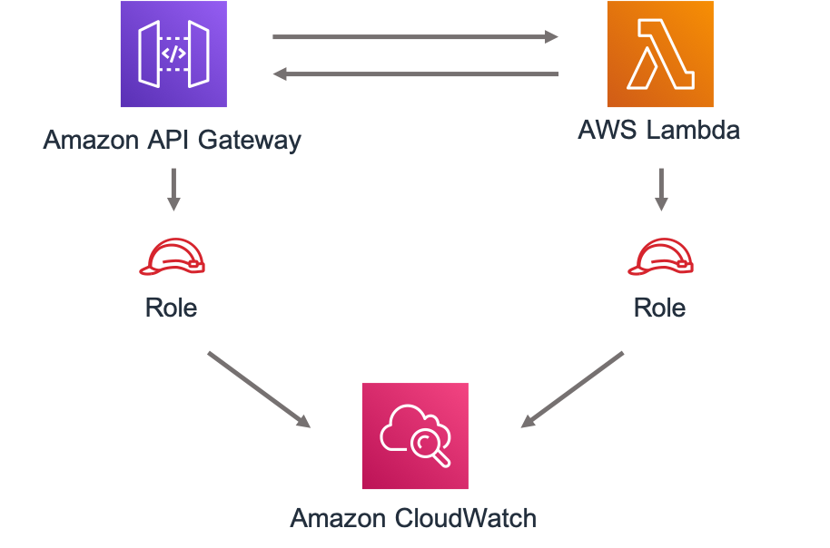

//!!NODE_ROOT <section>
//== aws-apigateway-lambda module

[.topic]
= aws-apigateway-lambda
:info_doctype: section
:info_title: aws-apigateway-lambda

image:https://img.shields.io/badge/cfn--resources-stable-success.svg?style=for-the-badge[Stability:Stable]

[width="100%",cols="<50%,<50%",options="header",]
|===
|*Reference Documentation*:
|https://docs.aws.amazon.com/solutions/latest/constructs/
|===

[width="100%",cols="<46%,54%",options="header",]
|===
|*Language* |*Package*
|image:https://docs.aws.amazon.com/images/solutions/latest/constructs/images/python32.png[Python
Logo] Python
|`aws_solutions_constructs.aws_apigateway_lambda`

|image:https://docs.aws.amazon.com/images/solutions/latest/constructs/images/typescript32.png[Typescript
Logo] Typescript |`@aws-solutions-constructs/aws-apigateway-lambda`

|image:https://docs.aws.amazon.com/images/solutions/latest/constructs/images/java32.png[Java
Logo] Java |`software.amazon.awsconstructs.services.apigatewaylambda`
|===

== Overview

This AWS Solutions Construct implements an Amazon API Gateway REST API
connected to an AWS Lambda function pattern.

Here is a minimal deployable pattern definition:

====
[role="tablist"]
Typescript::
+
[source,typescript]
----
import { Construct } from 'constructs';
import { Stack, StackProps } from 'aws-cdk-lib';
import { ApiGatewayToLambda } from '@aws-solutions-constructs/aws-apigateway-lambda';
import * as lambda from 'aws-cdk-lib/aws-lambda';

new ApiGatewayToLambda(this, 'ApiGatewayToLambdaPattern', {
  lambdaFunctionProps: {
    runtime: lambda.Runtime.NODEJS_22_X,
    handler: 'index.handler',
    code: lambda.Code.fromAsset(`lambda`)
  }
});
----

Python::
+
[source,python]
----
from aws_solutions_constructs.aws_apigateway_lambda import ApiGatewayToLambda
from aws_cdk import (
    aws_lambda as _lambda,
    Stack
)
from constructs import Construct

ApiGatewayToLambda(self, 'ApiGatewayToLambdaPattern',
            lambda_function_props=_lambda.FunctionProps(
                runtime=_lambda.Runtime.PYTHON_3_14,
                handler='index.handler',
                code=_lambda.Code.from_asset('lambda')
            )
            )
----

Java::
+
[source,java]
----
import software.constructs.Construct;

import software.amazon.awscdk.Stack;
import software.amazon.awscdk.StackProps;
import software.amazon.awscdk.services.lambda.*;
import software.amazon.awscdk.services.lambda.Runtime;
import software.amazon.awsconstructs.services.apigatewaylambda.*;

new ApiGatewayToLambda(this, "ApiGatewayToLambdaPattern", new ApiGatewayToLambdaProps.Builder()
        .lambdaFunctionProps(new FunctionProps.Builder()
                .runtime(Runtime.NODEJS_22_X)
                .code(Code.fromAsset("lambda"))
                .handler("index.handler")
                .build())
        .build());
----
====

== Pattern Construct Props

[width="100%",cols="<30%,<35%,35%",options="header",]
|===
|*Name* |*Type* |*Description*
|existingLambdaObj?
|https://docs.aws.amazon.com/cdk/api/v2/docs/aws-cdk-lib.aws_lambda.Function.html[`lambda.Function`]
|Optional - instance of an existing Lambda Function object, providing both this and
`lambdaFunctionProps` will cause an error.

|lambdaFunctionProps?
|https://docs.aws.amazon.com/cdk/api/v2/docs/aws-cdk-lib.aws_lambda.FunctionProps.html[`lambda.FunctionProps`]
|Optional - user provided props to override the default props for the Lambda function. Providing both this and `existingLambdaObj` causes an error.

|apiGatewayProps?
|https://docs.aws.amazon.com/cdk/api/v2/docs/aws-cdk-lib.aws_apigateway.LambdaRestApi.html[`api.LambdaRestApiProps`]
|Optional - user-provided props to override the default props for the API Gateway API.

|createUsagePlan? |boolean |Whether to create a Usage Plan attached to
the API. Must be true if
apiGatewayProps.defaultMethodOptions.apiKeyRequired is true. @default -
true (to match legacy behavior)

|logGroupProps?
|https://docs.aws.amazon.com/cdk/api/v2/docs/aws-cdk-lib.aws_logs.LogGroupProps.html[`logs.LogGroupProps`]
|User provided props to override the default props for for the
CloudWatchLogs LogGroup.
|===

== Pattern Properties

[width="100%",cols="<30%,<35%,35%",options="header",]
|===
|*Name* |*Type* |*Description*
|lambdaFunction
|https://docs.aws.amazon.com/cdk/api/v2/docs/aws-cdk-lib.aws_lambda.Function.html[`lambda.Function`]
|Returns an instance of the Lambda function created by the pattern.

|apiGateway
|https://docs.aws.amazon.com/cdk/api/v2/docs/aws-cdk-lib.aws_apigateway.LambdaRestApi.html[`api.LambdaRestApi`]
|Returns an instance of the API Gateway REST API created by the pattern.

|apiGatewayCloudWatchRole?
|https://docs.aws.amazon.com/cdk/api/v2/docs/aws-cdk-lib.aws_iam.Role.html[`iam.Role`]
|Returns an instance of the iam.Role created by the construct for API
Gateway for CloudWatch access.

|apiGatewayLogGroup
|https://docs.aws.amazon.com/cdk/api/v2/docs/aws-cdk-lib.aws_logs.LogGroup.html[`logs.LogGroup`]
|Returns an instance of the LogGroup created by the construct for API
Gateway access logging to CloudWatch.
|===

== Default settings

Out of the box implementation of the Construct without any override will
set the following defaults:

=== Amazon API Gateway

* Deploy an edge-optimized API endpoint
* Enable CloudWatch logging for API Gateway
* Configure least privilege access IAM role for API Gateway
* Set the default authorizationType for all API methods to IAM
* Enable X-Ray Tracing

=== AWS Lambda Function

* Configure limited privilege access IAM role for Lambda function
* Enable reusing connections with Keep-Alive for NodeJs Lambda function
* Enable X-Ray Tracing
* Set Environment Variables
** AWS_NODEJS_CONNECTION_REUSE_ENABLED (for Node 10.x
and higher functions)

== Architecture

== Github

Go to the https://github.com/awslabs/aws-solutions-constructs/tree/main/source/patterns/%40aws-solutions-constructs/aws-apigateway-lambda[Github repo] for this pattern to view the code, read/create issues and pull requests and more.

'''''

