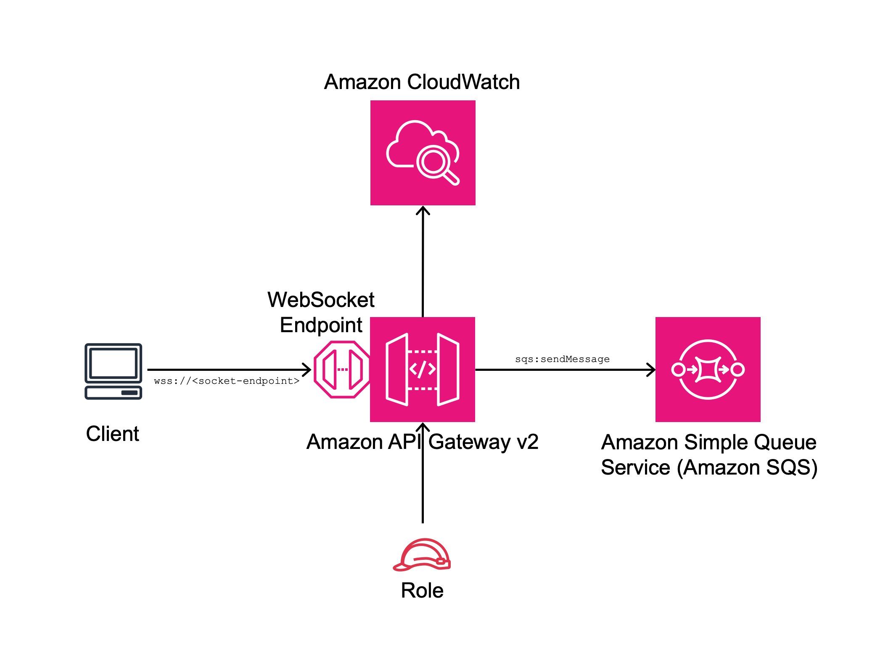

//!!NODE_ROOT <section>
//== aws-apigatewayv2websocket-sqs module

[.topic]
= aws-apigatewayv2websocket-sqs
:info_doctype: section
:info_title: aws-apigatewayv2websocket-sqs

image::https://img.shields.io/badge/cfn--resources-stable-success.svg?style=for-the-badge[Stability:Stable]

[width="100%",cols="<50%,<50%",options="header",]
|===
|*Reference Documentation*:
|https://docs.aws.amazon.com/solutions/latest/constructs/
|===

[width="100%",cols="<46%,54%",options="header",]
|===
|*Language* |*Package*
|image:https://docs.aws.amazon.com/cdk/api/latest/img/python32.png[Python
Logo] Python
|`aws_solutions_constructs.aws_apigatewayv2websocket_sqs`

|image:https://docs.aws.amazon.com/cdk/api/latest/img/typescript32.png[Typescript
Logo] Typescript
|`@aws-solutions-constructs/aws-apigatewayv2websocket-sqs`

|image:https://docs.aws.amazon.com/cdk/api/latest/img/java32.png[Java
Logo] Java
|`software.amazon.awsconstructs.services.apigatewayv2websocketsqs`
|===

== Overview

This AWS Solutions Construct implements an Amazon API Gateway WebSocket
connected to an Amazon SQS queue pattern.

Here is a minimal deployable pattern definition:

====
[role="tablist"]
Typescript::
+
[source,typescript]
----
import { Construct } from "constructs";
import { Stack, StackProps } from "aws-cdk-lib";
import {
    ApiGatewayV2WebSocketToSqs,
    ApiGatewayV2WebSocketToSqsProps,
} from "@aws-solutions-constructs/aws-apigatewayv2websocket-sqs";
import { WebSocketLambdaAuthorizer } from 'aws-cdk-lib/aws-apigatewayv2-authorizers';

const authorizer = new WebSocketLambdaAuthorizer('Authorizer', authHandler);

new ApiGateApiGatewayV2WebSocketToSqswayToSqs(this, "ApiGatewayV2WebSocketToSqsPattern", {
    webSocketApiProps: {
        connectRouteOptions: {
            integration: new WebSocketLambdaIntegration("ConnectIntegration", connectLambda),
            authorizer: authorizer,
        },
        disconnectRouteOptions: {
            integration: new WebSocketLambdaIntegration("DisconnectIntegration", disconnectLambda),
        },
    },
        createDefaultRoute: true
});
----

Python::
+
[source,python]
----
from aws_solutions_constructs.aws_apigateway_sqs import ApiGatewayV2WebSocketToSqs
from aws_cdk.aws_apigatewayv2_authorizers import WebSocketLambdaAuthorizer
from aws_cdk import Stack
from constructs import Construct

authorizer = WebSocketLambdaAuthorizer("Authorizer", auth_handler)

ApiGatewayV2WebSocketToSqs(self, 'ApiGatewayV2WebSocketToSqsPattern', 
    connect_route_options=apigwv2.WebSocketRouteOptions(
        integration=WebSocketLambdaIntegration("ConnectIntegration", connect_lambda),
        authorizer=authorizer
    ),
    disconnect_route_options=apigwv2.WebSocketRouteOptions(
        integration=WebSocketLambdaIntegration("DisConnectIntegration", disconnect_lambda),
    ),
    create_default_route=True
)
----

Java::
+
[source,java]
----
import software.constructs.Construct;

import software.amazon.awscdk.Stack;
import software.amazon.awscdk.StackProps;
import software.amazon.awscdk.aws_apigatewayv2_authorizers.*;
import software.amazon.awscdk.aws_apigatewayv2_integrations.*;
import software.amazon.awsconstructs.services.apigatewaysqs.*;

new ApiGatewayV2WebSocketToSqs(this, "ApiGatewayV2WebSocketToSqsPattern", new ApiGatewayV2WebSocketToSqsProps.Builder()
        .webSocketApiProps(new WebSocketApiProps.Builder()
                .connectRouteOptions(new WebSocketRouteOptions.builder()
                        .integration(new WebSocketLambdaIntegration("ConnectIntegration", connect_lambda)))
                .disconnectRouteOptions(new WebSocketRouteOptions.builder()
                        .integration(new WebSocketLambdaIntegration("DisConnectIntegration", disconnect_lambda)))
                .createDefaultRoute(true)
        .build());
----
====

== Pattern Construct Props

[width="100%",cols="<30%,<35%,35%",options="header",]
|===
|*Name* |*Type* |*Description*
|existingWebSocketApi?
|https://docs.aws.amazon.com/cdk/api/v2/docs/aws-cdk-lib.aws_apigatewayv2.WebSocketApi.html[`apigwv2.WebSocketApi`]
|Optional API Gateway WebSocket instance. Providing both
existingWebSocketApi and webSocketApiProps will cause an error.

|webSocketApiProps?
|https://docs.aws.amazon.com/cdk/api/v2/docs/aws-cdk-lib.aws_apigatewayv2.WebSocketApiProps.html[`apigwv2.WebSocketApiProps`]
|Optional user-provided props to override the default props for the API
Gateway. Providing both existingWebSocketApi and webSocketApiProps will
cause an error.

|queueProps?
|https://docs.aws.amazon.com/cdk/api/v2/docs/aws-cdk-lib.aws_sqs.QueueProps.html[`sqs.QueueProps`]
|Optional user-provided props to override the default props for the
queue. Providing both existingQueueObj and queueProps will cause an
error.

|existingQueueObj?
|https://docs.aws.amazon.com/cdk/api/v2/docs/aws-cdk-lib.aws_sqs.Queue.html[`sqs.Queue`]
|Optional existing instance of SQS Queue. Providing both
existingQueueObj and queueProps will cause an error.

|deployDeadLetterQueue? |`boolean` |Whether to deploy a secondary queue
to be used as a dead letter queue. Defaults to `true`.

|deadLetterQueueProps?
|https://docs.aws.amazon.com/cdk/api/v2/docs/aws-cdk-lib.aws_sqs.QueueProps.html[`sqs.QueueProps`]
|Optional properties to use for creating dead letter queue. Note that if
you are creating a FIFO Queue, the dead letter queue should also be
FIFO.

|maxReceiveCount |`number` |The number of times a message can be
unsuccessfully dequeued before being moved to the dead-letter queue.

|createDefaultRoute? |`boolean` |Whether to create a default route. At
least one of createDefaultRoute or customRouteName must be provided. If
set to true, then it will use the value supplied with
`defaultRouteRequestTemplate`.

|defaultRouteRequestTemplate?
|`++{++ ++[++contentType: string++]++: string }` |Optional user provided
API Gateway Request Template for the default route and/ or customRoute
(if customRouteName is provided). This property will only be used if
createDefaultRoute is `true`. If createDefaultRoute is `true` and this
property is not provided, the construct will create the default route
with the following VTL mapping
`"Action=SendMessage&MessageGroupId=$input.path('$.MessageGroupId')&MessageDeduplicationId=$context.requestId&MessageAttribute.1.Name=connectionId&MessageAttribute.1.Value.StringValue=$context.connectionId&MessageAttribute.1.Value.DataType=String&MessageAttribute.2.Name=requestId&MessageAttribute.2.Value.StringValue=$context.requestId&MessageAttribute.2.Value.DataType=String&MessageBody=$util.urlEncode($input.json($util.escapeJavaScript('$').replaceAll(++\++"++\\\\++'++\++",++\++"'++\++")))"`.

|defaultIamAuthorization? |`boolean` |Add IAM authorization to the
latexmath:[connect path by default. Only set this to false if: 1) If plan to provide an authorizer with the `]connect`route; or 2) The API should be open (no authorization) (AWS recommends against deploying unprotected APIs). If an authorizer is specified in connectRouteOptions, this parameter is ignored and no default IAM authorizer will be created. {vbar} {vbar}customRouteName?{vbar}`string++`++
|===

== Pattern Properties

[width="100%",cols="<30%,<35%,35%",options="header",]
|===
|*Name* |*Type* |*Description*
|webSocketApi
|https://docs.aws.amazon.com/cdk/api/v2/docs/aws-cdk-lib.aws_apigatewayv2.WebSocketApi.html[`apigwv2.WebSocketApi`]
|Returns an instance of the API Gateway WebSocket API created by the
pattern.

|apiGatewayRole
|https://docs.aws.amazon.com/cdk/api/v2/docs/aws-cdk-lib.aws_iam.Role.html[`iam.Role`]
|Returns an instance of the iam.Role created by the construct for API
Gateway.

|webSocketStage
|https://docs.aws.amazon.com/cdk/api/v2/docs/aws-cdk-lib.aws_apigatewayv2.WebSocketStage.html[`apigwv2.WebSocketStage`]
|Returns an instance of the WebSocketStage created by the construct.

|apiGatewayLogGroup
|https://docs.aws.amazon.com/cdk/api/v2/docs/aws-cdk-lib.aws_logs.LogGroup.html[`logs.LogGroup`]
|Returns an instance of the LogGroup created by the construct for API
Gateway access logging to CloudWatch.

|sqsQueue
|https://docs.aws.amazon.com/cdk/api/v2/docs/aws-cdk-lib.aws_sqs.Queue.html[`sqs.Queue`]
|Returns an instance of the SQS queue created by the pattern.

|deadLetterQueue?
|https://docs.aws.amazon.com/cdk/api/v2/docs/aws-cdk-lib.aws_sqs.DeadLetterQueue.html[`sqs.DeadLetterQueue`]
|Returns an instance of the DeadLetterQueue created by the pattern.
|===

== Default settings

Out of the box implementation of the Construct without any override will
set the following defaults:

==== Amazon API Gateway

* Deploy a WebSocket endpoint
* Enable CloudWatch logging for API Gateway
* Configure least privilege access IAM role for API Gateway
* Enable X-Ray Tracing

==== Amazon SQS Queue

* Deploy SQS dead-letter queue for the source SQS Queue
* Enable server-side encryption for source SQS Queue using AWS Managed
KMS Key
* Enforce encryption of data in transit

== Architecture

[[github,topic.title]]
== GitHub

[cols=1,1, options=header]
|===
| 
To view the code for this pattern, create/view issues and pull requests, and more:

|

image::images/GitHub-Mark-32px.png[The github logo.,scaledwidth=100%]

|https://github.com/awslabs/aws-solutions-constructs/tree/master/source/patterns/%40aws-solutions-constructs/aws-aws-apigatewayv2websocket-sqs[-solutions-constructsaws-apigatewayv2websocket-sqs]
|===

'''''

© Copyright Amazon.com, Inc. or its affiliates. All Rights Reserved.
