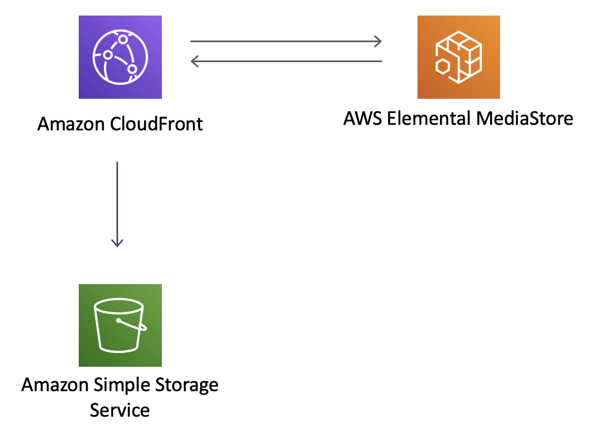

//!!NODE_ROOT <section>
//== aws-cloudfront-mediastore module

[.topic]
= aws-cloudfront-mediastore
:info_doctype: section
:info_title: aws-cloudfront-mediastore

image::https://img.shields.io/badge/cfn--resources-stable-success.svg?style=for-the-badge[Stability:Stable]

[width="100%",cols="<50%,<50%",options="header",]
|===
|*Reference Documentation*:
|https://docs.aws.amazon.com/solutions/latest/constructs/
|===

[width="100%",cols="<46%,54%",options="header",]
|===
|*Language* |*Package*
|image:https://docs.aws.amazon.com/cdk/api/latest/img/python32.png[Python
Logo] Python
|`aws_solutions_constructs.aws_cloudfront_mediastore`

|image:https://docs.aws.amazon.com/cdk/api/latest/img/typescript32.png[TypeScript
Logo] TypeScript |`@aws-solutions-constructs/aws-cloudfront-mediastore`

|image:https://docs.aws.amazon.com/cdk/api/latest/img/java32.png[Java
Logo] Java
|`software.amazon.awsconstructs.services.cloudfrontmediastore`
|===

== Overview

IMPORTANT NOTICE - AWS Elemental MediaStore will be discontinued on
November 13, 2025. All subsequent releases of AWS Solutions Constructs
will NOT include this construct.

This AWS Solutions Construct implements an Amazon CloudFront
distribution to an AWS Elemental MediaStore container.

Here is a minimal deployable pattern definition:

====
[role="tablist"]
Typescript::
+
[source,typescript]
----
import { Construct } from 'constructs';
import { Stack, StackProps } from 'aws-cdk-lib';
import { CloudFrontToMediaStore } from '@aws-solutions-constructs/aws-cloudfront-mediastore';

new CloudFrontToMediaStore(this, 'test-cloudfront-mediastore-default', {});
----

Python::
+
[source,python]
----
from aws_solutions_constructs.aws_cloudfront_mediastore import CloudFrontToMediaStore
from aws_cdk import Stack
from constructs import Construct

CloudFrontToMediaStore(self, 'test-cloudfront-mediastore-default')
----

Java::
+
[source,java]
----
import software.constructs.Construct;

import software.amazon.awscdk.Stack;
import software.amazon.awscdk.StackProps;
import software.amazon.awsconstructs.services.cloudfrontmediastore.*;

new CloudFrontToMediaStore(this, "test-cloudfront-mediastore-default", new CloudFrontToMediaStoreProps.Builder()
        .build());
----
====

== Pattern Construct Props

[width="100%",cols="<30%,<35%,35%",options="header",]
|===
|*Name* |*Type* |*Description*
|existingMediaStoreContainerObj?
|https://docs.aws.amazon.com/cdk/api/v2/docs/aws-cdk-lib.aws_mediastore.CfnContainer.html[`mediastore.CfnContainer`]
|Optional user provided MediaStore container to override the default
MediaStore container.

|mediaStoreContainerProps?
|https://docs.aws.amazon.com/cdk/api/v2/docs/aws-cdk-lib.aws_mediastore.CfnContainerProps.html[`mediastore.CfnContainerProps`]
|Optional user provided props to override the default props for the
MediaStore Container.

|cloudFrontDistributionProps?
|https://docs.aws.amazon.com/cdk/api/v2/docs/aws-cdk-lib.aws_cloudfront.DistributionProps.html[`cloudfront.DistributionProps`]{vbar}`any`
|Optional user provided props to override the default props for the
CloudFront Distribution.

|insertHttpSecurityHeaders? |`boolean` |Optional user provided props to
turn on/off the automatic injection of best practice HTTP security
headers in all responses from CloudFront

|responseHeadersPolicyProps?
|https://docs.aws.amazon.com/cdk/api/v2/docs/aws-cdk-lib.aws_cloudfront.ResponseHeadersPolicyProps.html[`cloudfront.ResponseHeadersPolicyProps`]
|Optional user provided configuration that cloudfront applies to all
http responses.

|cloudFrontLoggingBucketProps?
|https://docs.aws.amazon.com/cdk/api/v2/docs/aws-cdk-lib.aws_s3.BucketProps.html[`s3.BucketProps`]
|Optional user provided props to override the default props for the
CloudFront Logging Bucket.
|===

== Pattern Properties

[width="100%",cols="<30%,<35%,35%",options="header",]
|===
|*Name* |*Type* |*Description*
|cloudFrontWebDistribution
|https://docs.aws.amazon.com/cdk/api/v2/docs/aws-cdk-lib.aws_cloudfront.Distribution.html[`cloudfront.Distribution`]
|Returns an instance of cloudfront.Distribution created by the
construct.

|mediaStoreContainer
|https://docs.aws.amazon.com/cdk/api/v2/docs/aws-cdk-lib.aws_mediastore.CfnContainer.html[`mediastore.CfnContainer`]
|Returns an instance of mediastore.CfnContainer.

|cloudFrontLoggingBucket
|https://docs.aws.amazon.com/cdk/api/v2/docs/aws-cdk-lib.aws_s3.Bucket.html[`s3.Bucket`]
|Returns an instance of s3.Bucket as the logging bucket for the
CloudFront Web Distribution.

|cloudFrontOriginRequestPolicy
|https://docs.aws.amazon.com/cdk/api/v2/docs/aws-cdk-lib.aws_cloudfront.OriginRequestPolicy.html[`cloudfront.OriginRequestPolicy`]
|Returns an instance of cloudfront.OriginRequestPolicy created by the
construct for the CloudFront Web Distribution.

|cloudFrontOriginAccessIdentity?
|https://docs.aws.amazon.com/cdk/api/v2/docs/aws-cdk-lib.aws_cloudfront.OriginAccessIdentity.html[`cloudfront.OriginAccessIdentity`]
|Returns an instance of cloudfront.OriginAccessIdentity created by the
construct for the CloudFront Web Distribution origin custom headers and
the MediaStore Container policy.

|cloudFrontFunction?
|https://docs.aws.amazon.com/cdk/api/v2/docs/aws-cdk-lib.aws_cloudfront.Function.html[`cloudfront.Function`]
|Returns an instance of the Cloudfront function created by the pattern.
|===

== Default settings

Out of the box implementation of the Construct without any override will
set the following defaults:

=== Amazon CloudFront

* Configure access logging for CloudFront Web Distribution
* Enable CloudFront Origin Request Policy for AWS Elemental MediaStore
Container
* Set `User-Agent` custom header with CloudFront Origin Access Identity
* Enable automatic injection of best practice HTTP security headers in
all responses from CloudFront Distribution

=== AWS Elemental MediaStore

* Set the deletion policy to retain the resource
* Set the container name with the CloudFormation stack name
* Set the default
https://docs.aws.amazon.com/mediastore/latest/ug/cors-policy.html[Container
Cross-origin resource sharing (CORS) policy]
* Set the default
https://docs.aws.amazon.com/mediastore/latest/ug/policies-object-lifecycle.html[Object
Life Cycle policy]
* Set the default
https://docs.aws.amazon.com/mediastore/latest/ug/policies.html[Container
Policy] to allow only `aws:UserAgent` with CloudFront Origin Access
Identity
* Set the default
https://docs.aws.amazon.com/mediastore/latest/ug/policies-metric.html[Metric
Policy]
* Enable the access logging

== Architecture

== Github

Go to the https://github.com/awslabs/aws-solutions-constructs/tree/main/source/patterns/%40aws-solutions-constructs/aws-cloudfront-mediastore[Github repo] for this pattern to view the code, read/create issues and pull requests and more.

'''''

© Copyright Amazon.com, Inc. or its affiliates. All Rights Reserved.
