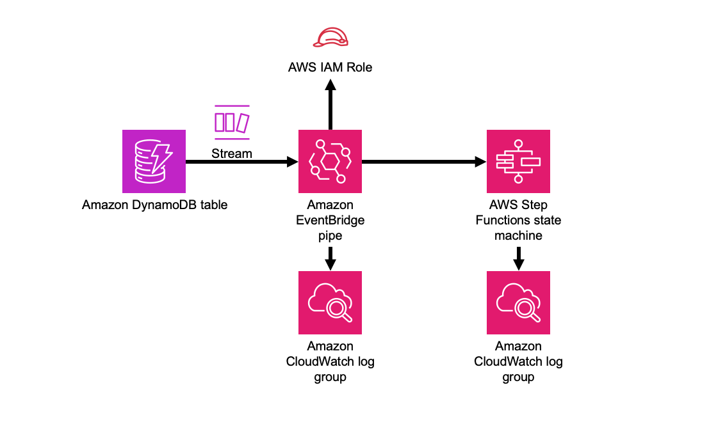

//!!NODE_ROOT <section>
//== aws-dynamodbstreams-pipes-stepfunctions module

[.topic]
= aws-dynamodbstreams-pipes-stepfunctions
:info_doctype: section
:info_title: aws-dynamodbstreams-pipes-stepfunctions

image::https://img.shields.io/badge/stability-Experimental-important.svg?style=for-the-badge[Stability:Experimental]

[width="100%",cols="<50%,<50%",options="header",]
|===
|*Reference Documentation*:
|https://docs.aws.amazon.com/solutions/latest/constructs/
|===

[width="100%",cols="<46%,54%",options="header",]
|===
|*Language* |*Package*
|image:https://docs.aws.amazon.com/cdk/api/latest/img/python32.png[Python
Logo] Python
|`aws_solutions_constructs.aws_dynamodbstreams_pipes_stepfunctions`

|image:https://docs.aws.amazon.com/cdk/api/latest/img/typescript32.png[Typescript
Logo] Typescript
|`@aws-solutions-constructs/aws-dynamodbstreams-pipes-stepfunctions`

|image:https://docs.aws.amazon.com/cdk/api/latest/img/java32.png[Java
Logo] Java
|`software.amazon.awsconstructs.services.dynamodbstreamspipesstepfunctions`
|===

== Overview

This AWS Solutions Construct implements an Amazon DynamoDB table with
stream that that executes an AWS Step Functions state machine via an
Amazon Eventbridge pipe.

Here is a minimal deployable pattern definition:

====
[role="tablist"]
Typescript::
+
[source,typescript]
----
import { Construct } from 'constructs';
import { Stack, StackProps } from 'aws-cdk-lib';
import * as sfn from 'aws-cdk-lib/aws-stepfunctions';
import { DynamoDBStreamsToPipesToStepfunctions, DynamoDBStreamsToPipesToStepfunctionsProps } from "@aws-solutions-constructs/aws-dynamodbstreams-pipes-stepfunctions";

    const startState = new sfn.Pass(this, 'StartState');
    
    new DynamoDBStreamsToPipesToStepfunctions(this, 'DynamoDBStreamsToPipesToStepfunctionsPattern', {
      stateMachineProps: {
        definitionBody: sfn.DefinitionBody.fromChainable(sfn.Chain.start(new sfn.Pass(this, 'Pass'))),
      }
    });
----

Python::
+
[source,python]
----
from constructs import Construct
from aws_cdk import (
    aws_stepfunctions as _sfn,
    Stack
)
from aws_solutions_constructs import (
    aws_dynamodbstreams_pipes_stepfunctions as dynamodbstreams_pipes_stepfunctions
)

dynamodbstreams_pipes_stepfunctions.DynamoDBStreamsToPipesToStepfunctions(
    self, 'DynamoDBStreamsToPipesToStepfunctions',
    state_machine_props=_sfn.StateMachineProps(
        definition_body=_sfn.DefinitionBody.from_chainable(_sfn.Chain.start(_sfn.Pass(self, "pass")))
    )
)
----

Java::
+
[source,java]
----
package com.myorg;

import software.constructs.Construct;
import software.amazon.awscdk.Stack;
import software.amazon.awscdk.StackProps;

import software.amazon.awscdk.services.stepfunctions.*;
import software.amazon.awsconstructs.services.dynamodbstreamspipesstepfunctions.DynamoDBStreamsToPipesToStepfunctions;
import software.amazon.awsconstructs.services.dynamodbstreamspipesstepfunctions.DynamoDBStreamsToPipesToStepfunctionsProps;

new DynamoDBStreamsToPipesToStepfunctions(this, "DynamoDBStreamsToPipesToStepfunctionsPattern",
    DynamoDBStreamsToPipesToStepfunctionsProps.builder()
        .stateMachineProps(StateMachineProps.builder()
            .definitionBody(DefinitionBody.fromChainable(Chain.start(new Pass(scope, "Pass"))))
            .build())
        .build());
----
====

== Pattern Construct Props

[width="100%",cols="<30%,<35%,35%",options="header",]
|===
|*Name* |*Type* |*Description*
|dynamoTableProps?
|https://docs.aws.amazon.com/cdk/api/v2/docs/aws-cdk-lib.aws_dynamodb.TableProps.html[`dynamodb.TableProps`]
|Optional user provided props to override the default props for DynamoDB
Table

|existingTableInterface?
|https://docs.aws.amazon.com/cdk/api/v2/docs/aws-cdk-lib.aws_dynamodb.ITable.html[`dynamodb.ITable`]
|Existing instance of DynamoDB table object or interface, providing both
this and `dynamoTableProps` will cause an error.

|dynamoEventSourceProps?
|https://docs.aws.amazon.com/cdk/api/v2/docs/aws-cdk-lib.aws_lambda_event_sources.DynamoEventSourceProps.html[`aws-lambda-event-sources.DynamoEventSourceProps`]
|Optional user provided props to override the default props for DynamoDB
Event Source

|deploySqsDlqQueue |boolean |Whether to deploy a SQS dead letter queue
when a data record reaches the Maximum Retry Attempts or Maximum Record
Age, its metadata like shard ID and stream ARN will be sent to an SQS
queue. The construct will create and configure the DLQ with a default
maximumRetryAttempts of 2. To customize this, you should set
maximumRecordAgeInSeconds and/or maximumRetryAttempts attempts in
pipeProps.sourceParameters.dynamoDbStreamParameters. Default - deploy
queue, MaximumRetryAttempts is set to 3, and maximumRecordAge is left to
default (-1, or infinite)

|sqsDlqQueueProps
|https://docs.aws.amazon.com/cdk/api/v2/docs/aws-cdk-lib.aws_sqs.QueueProps.html[sqs.QueueProps]
|Optional user provided properties for the SQS dead letter queue

|stateMachineProps
|https://docs.aws.amazon.com/cdk/api/v2/docs/aws-cdk-lib.aws_stepfunctions.StateMachineProps.html[`sfn.StateMachineProps`]
|User provided props for the sfn.StateMachine.

|existingStateMachineObj
|https://docs.aws.amazon.com/cdk/api/v2/docs/aws-cdk-lib.aws_stepfunctions.StateMachine.html[sfn.StateMachine]
|Optional existing state machine to incorporate into the construct

|createCloudWatchAlarms? |`boolean` |Whether to create recommended
CloudWatch alarms

|logGroupProps?
|https://docs.aws.amazon.com/cdk/api/v2/docs/aws-cdk-lib.aws_logs.LogGroupProps.html[logs.logGroupProps]
|Optional user provided props to override the default props for for the
CloudWatchLogs LogGroup for the state machine.

|pipeProps?
|https://docs.aws.amazon.com/cdk/api/v2/docs/aws-cdk-lib.aws_pipes.CfnPipeProps.html[pipes.CfnPipeProps]
|Optional customer provided ettings for the EventBridge pipe. source,
target and roleArn are set by the construct and cannot be overriden. The
construct will generate default sourceParameters, targetParameters and
logConfiguration that can be overriden by populating those values in
these props. If the client wants to implement enrichment or a filter,
this is where that information can be provided. Any other props can be
freely overridden. To control aspects of the Streams feed
(e.g. batchSize, startingPosition), do that here under
sourceParameters.dynamoDbStreamParameters.

|enrichmentFunction?
|https://docs.aws.amazon.com/cdk/api/v2/docs/aws-cdk-lib.aws_lambda.Function.html[lambda.Function]
|Optional - Lambda function that the construct will configure to be
called to enrich the message between source and target. The construct
will configure the pipe IAM role to allow invoking the function (but
will not affect the IArole assigned to the function). Specifying both
this and enrichmentStateMachine is an error. Default - undefined

|enrichmentStateMachine?
|https://docs.aws.amazon.com/cdk/api/v2/docs/aws-cdk-lib.aws_stepfunctions.StateMachine.html[sfn.StateMachine]
|Optional - Step Functions state machine that the construct will
configure to be called to enrich the message between source and target.
The construct will configure the pipe IAM role to allow executing the
state machine (but will not affect the IAM role assigned to the state
machine). Specifying both this and enrichmentStateMachine is an error.
Default - undefined

|logLevel? |PipesLogLevel |Threshold for what messages the new pipe
sends to the log, PipesLogLevel.OFF, PipesLogLevel.ERROR,
PipesLogLevel.INFO, PipesLogLevel.TRACE. The default is INFO. Setting
the level to OFF will prevent any log group from being created.
Providing pipeProps.logConfiguration will controls all aspects of
logging and any construct provided log configuration is disabled. If
pipeProps.logConfiguration is provided then specifying this or
pipeLogProps is an error.

|pipeLogProps? |link:[logs.LogGroupProps] |Default behavior is for the
this construct to create a new CloudWatch Logs log group for the pipe.
These props are used to override defaults set by AWS or this construct.
If there are concerns about the cost of log storage, this is where a
client can specify a shorter retention duration (in days)
|===

== Pattern Properties

[width="100%",cols="<30%,<35%,35%",options="header",]
|===
|*Name* |*Type* |*Description*
|dynamoTableInterface
|https://docs.aws.amazon.com/cdk/api/v2/docs/aws-cdk-lib.aws_dynamodb.ITable.html[`dynamodb.ITable`]
|Returns an instance of dynamodb.ITable created by the construct

|dynamoTable?
|https://docs.aws.amazon.com/cdk/api/v2/docs/aws-cdk-lib.aws_dynamodb.Table.html[`dynamodb.Table`]
|Returns an instance of dynamodb.Table created by the construct.
IMPORTANT: If existingTableInterface was provided in Pattern Construct

|stateMachineLogGroup
|https://docs.aws.amazon.com/cdk/api/v2/docs/aws-cdk-lib.aws_logs.ILogGroup.html[`logs.ILogGroup`]
|Returns an instance of the ILogGroup created by the construct for
StateMachine

|cloudwatchAlarms?
|https://docs.aws.amazon.com/cdk/api/v2/docs/aws-cdk-lib.aws_cloudwatch.Alarm.html[`cloudwatch.Alarm++[]++`]
|Returns a list of alarms created by the construct.

|pipe
|https://docs.aws.amazon.com/cdk/api/v2/docs/aws-cdk-lib.aws_pipes.CfnPipe.html[pipes.CfnPipe]
|The L1 pipe construct created by this Solutions Construct.

|pipeRole
|https://docs.aws.amazon.com/cdk/api/v2/docs/aws-cdk-lib.aws_iam.Role.html[iam.Role]
|The role created that allows the pipe to access both the source and the
target.
|===

== Default settings

Out of the box implementation of the Construct without any override will
set the following defaults:

==== Amazon DynamoDB Table

* Set the billing mode for DynamoDB Table to On-Demand (Pay per request)
* Enable server-side encryption for DynamoDB Table using AWS managed KMS
Key
* Creates a partition key called '`id`' for DynamoDB Table
* Retain the Table when deleting the CloudFormation stack
* Enable continuous backups and point-in-time recovery
* A DynamoDB stream based on the table.

==== AWS Step Functions State Machine

* Deploy Step Functions standard state machine
* Create CloudWatch log group with /vendedlogs/ prefix in name
* Deploy best practices CloudWatch Alarms for the Step Functions

==== AWS EventBridge Pipe

* Pipe configured with an DynamoDB stream source and state machine
target
* A least privilege IAM role assigned to the pipe to access the queue
and state machine
* CloudWatch logs set up at the '`INFO`' level
* Encrypted with an AWS managed KMS key

== Architecture

[[github,topic.title]]
== GitHub

[cols=1,1, options=header]
|===
| 
To view the code for this pattern, create/view issues and pull requests, and more:

|

image::images/GitHub-Mark-32px.png[The github logo.,scaledwidth=100%]

|https://github.com/awslabs/aws-solutions-constructs/tree/master/source/patterns/%40aws-solutions-constructs/aws-aws-dynamodbstreams-pipes-stepfunctions[-solutions-constructsaws-dynamodbstreams-pipes-stepfunctions]
|===

'''''

© Copyright Amazon.com, Inc. or its affiliates. All Rights Reserved.
