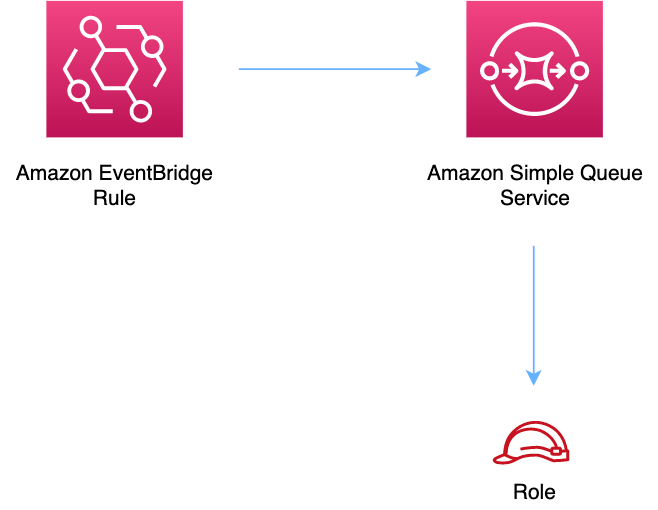

//!!NODE_ROOT <section>
//== aws-eventbridge-sqs module

[.topic]
= aws-eventbridge-sqs
:info_doctype: section
:info_title: aws-eventbridge-sqs

image::https://img.shields.io/badge/cfn--resources-stable-success.svg?style=for-the-badge[Stability:Stable]

[width="100%",cols="<50%,<50%",options="header",]
|===
|*Reference Documentation*:
|https://docs.aws.amazon.com/solutions/latest/constructs/
|===

[width="100%",cols="<46%,54%",options="header",]
|===
|*Language* |*Package*
|image:https://docs.aws.amazon.com/cdk/api/latest/img/python32.png[Python
Logo] Python
|`aws_solutions_constructs.aws_eventbridge_sqs`

|image:https://docs.aws.amazon.com/cdk/api/latest/img/typescript32.png[Typescript
Logo] Typescript |`@aws-solutions-constructs/aws-eventbridge-sqs`

|image:https://docs.aws.amazon.com/cdk/api/latest/img/java32.png[Java
Logo] Java |`software.amazon.awsconstructs.services.eventbridgesqs`
|===

== Overview

This AWS Solutions Construct implements an Amazon EventBridge rule and
an AWS SQS Queue.

Here is a minimal deployable pattern definition:

====
[role="tablist"]
Typescript::
+
[source,typescript]
----
import { Construct } from 'constructs';
import { Stack, StackProps, Duration } from 'aws-cdk-lib';
import * as events from 'aws-cdk-lib/aws-events';
import * as iam from 'aws-cdk-lib/aws-iam';
import { EventbridgeToSqsProps, EventbridgeToSqs } from "@aws-solutions-constructs/aws-eventbridge-sqs";

const constructProps: EventbridgeToSqsProps = {
  eventRuleProps: {
    schedule: events.Schedule.rate(Duration.minutes(5))
  }
};

const constructStack = new EventbridgeToSqs(this, 'test-construct', constructProps);

// Grant yourself permissions to use the Customer Managed KMS Key
const policyStatement = new iam.PolicyStatement({
  actions: ["kms:Encrypt", "kms:Decrypt"],
  effect: iam.Effect.ALLOW,
  principals: [new iam.AccountRootPrincipal()],
  resources: ["*"]
});

constructStack.encryptionKey?.addToResourcePolicy(policyStatement);
----

Python::
+
[source,python]
----
from aws_solutions_constructs.aws_eventbridge_sqs import EventbridgeToSqsProps, EventbridgeToSqs
from aws_cdk import (
    aws_events as events,
    aws_iam as iam,
    Duration,
    Stack
)
from constructs import Construct

construct_stack = EventbridgeToSqs(self, 'test-construct',
                                    event_rule_props=events.RuleProps(
                                        schedule=events.Schedule.rate(
                                            Duration.minutes(5))
                                    ))

# Grant yourself permissions to use the Customer Managed KMS Key
policy_statement = iam.PolicyStatement(
    actions=["kms:Encrypt", "kms:Decrypt"],
    effect=iam.Effect.ALLOW,
    principals=[iam.AccountRootPrincipal()],
    resources=["*"]
)

construct_stack.encryption_key.add_to_resource_policy(policy_statement)
----

Java::
+
[source,java]
----
import software.constructs.Construct;
import java.util.List;

import software.amazon.awscdk.Stack;
import software.amazon.awscdk.StackProps;
import software.amazon.awscdk.Duration;
import software.amazon.awscdk.services.events.*;
import software.amazon.awscdk.services.iam.*;
import software.amazon.awsconstructs.services.eventbridgesqs.*;

final EventbridgeToSqs constructStack = new EventbridgeToSqs(this, "test-construct",
        new EventbridgeToSqsProps.Builder()
                .eventRuleProps(new RuleProps.Builder()
                        .schedule(Schedule.rate(Duration.minutes(5)))
                        .build())
                .build());

// Grant yourself permissions to use the Customer Managed KMS Key
final PolicyStatement policyStatement = PolicyStatement.Builder.create()
        .actions(List.of("kms:Encrypt", "kms:Decrypt"))
        .effect(Effect.ALLOW)
        .principals(List.of(new AccountRootPrincipal()))
        .resources(List.of("*"))
        .build();

constructStack.getEncryptionKey().addToResourcePolicy(policyStatement);
----
====

== Pattern Construct Props

[width="100%",cols="<30%,<35%,35%",options="header",]
|===
|*Name* |*Type* |*Description*
|existingEventBusInterface?
|https://docs.aws.amazon.com/cdk/api/v2/docs/aws-cdk-lib.aws_events.IEventBus.html[`events.IEventBus`]
|Optional user-provided custom EventBus for construct to use. Providing
both this and `eventBusProps` results an error.

|eventBusProps?
|https://docs.aws.amazon.com/cdk/api/v2/docs/aws-cdk-lib.aws_events.EventBusProps.html[`events.EventBusProps`]
|Optional user-provided properties to override the default properties
when creating a custom EventBus. Setting this value to `{}` will
create a custom EventBus using all default properties. If neither this
nor `existingEventBusInterface` is provided the construct will use the
`default` EventBus. Providing both this and `existingEventBusInterface`
results an error.

|eventRuleProps
|https://docs.aws.amazon.com/cdk/api/v2/docs/aws-cdk-lib.aws_events.RuleProps.html[`events.RuleProps`]
|User provided eventRuleProps to override the defaults.

|targetProps?
|https://docs.aws.amazon.com/cdk/api/v2/docs/aws-cdk-lib.aws_events_targets.SqsQueueProps.html[`eventtargets.SqsQueueProps`]
|Optional user provided properties to define the SQS target on the Event
Rule. If you specify a deadLetterQueue for the rule here, you are
responsible for adding a resource policy to the queue allowing
events.amazonaws.com permission to SendMessage, GetQueueUrl and
GetQueueAttributes. You cannot send a DLQ in this property and set
deployEventRuleDlq to true. Default is undefined and all system defaults
are used.

|eventRuleDlqKeyProps
|https://docs.aws.amazon.com/cdk/api/v2/docs/aws-cdk-lib.aws_kms.KeyProps.html[kms.KeyProps]
|Optional properties to define the key created to protect the ruleDlq.
Only valid if deployRuleDlq is set to true. Defaults to CloudFormation
defaults.

|deployEventRuleDlq? |boolean |Whether to deploy a DLQ for the Event
Rule. If set to `true`, this DLQ will receive any messages that can’t be
delivered to the target SQS queue. Defaults to `false`.

|existingQueueObj?
|https://docs.aws.amazon.com/cdk/api/v2/docs/aws-cdk-lib.aws_sqs.Queue.html[`sqs.Queue`]
|An optional, existing SQS queue to be used instead of the default
queue. Providing both this and `queueProps` will cause an error.

|queueProps?
|https://docs.aws.amazon.com/cdk/api/v2/docs/aws-cdk-lib.aws_sqs.QueueProps.html[`sqs.QueueProps`]
|User provided props to override the default props for the SQS Queue.

|enableQueuePurging? |`boolean` |Whether to grant additional permissions
to the Lambda function enabling it to purge the SQS queue. Defaults to
`false`.

|deployDeadLetterQueue? |`boolean` |Whether to create a secondary queue
to be used as a dead letter queue. Defaults to `true`.

|deadLetterQueueProps?
|https://docs.aws.amazon.com/cdk/api/v2/docs/aws-cdk-lib.aws_sqs.QueueProps.html[`sqs.QueueProps`]
|Optional user-provided props to override the default props for the dead
letter queue. Only used if the `deployDeadLetterQueue` property is set
to true.

|maxReceiveCount? |`number` |The number of times a message can be
unsuccessfully dequeued before being moved to the dead letter queue.
Defaults to `15`.

|enableEncryptionWithCustomerManagedKey? |`boolean` |If no key is
provided, this flag determines whether the queue is encrypted with a new
CMK or an AWS managed key. This flag is ignored if any of the following
are defined: queueProps.encryptionMasterKey, encryptionKey or
encryptionKeyProps.

|encryptionKey?
|https://docs.aws.amazon.com/cdk/api/v2/docs/aws-cdk-lib.aws_kms.Key.html[`kms.Key`]
|An optional, imported encryption key to encrypt the SQS Queue with.

|encryptionKeyProps?
|https://docs.aws.amazon.com/cdk/api/v2/docs/aws-cdk-lib.aws_kms.Key.html#construct-props[`kms.KeyProps`]
|Optional user provided properties to override the default properties
for the KMS encryption key used to encrypt the SQS queue with.
|===

== Pattern Properties

[width="100%",cols="<30%,<35%,35%",options="header",]
|===
|*Name* |*Type* |*Description*
|eventBus?
|https://docs.aws.amazon.com/cdk/api/v2/docs/aws-cdk-lib.aws_events.IEventBus.html[`events.IEventBus`]
|Returns the instance of events.IEventBus used by the construct

|eventsRule
|https://docs.aws.amazon.com/cdk/api/v2/docs/aws-cdk-lib.aws_events.Rule.html[`events.Rule`]
|Returns an instance of events.Rule created by the construct

|eventRuleDlq?
|`sqs.Queue`](https://docs.aws.amazon.com/cdk/api/v2/docs/aws-cdk-lib.aws_sqs.Queue.html)
|If the client sets deployEventRuleDlq to '`true`', then this value will
contain the DLQ set up for the rule.

|eventRuleDlqKey
|https://docs.aws.amazon.com/cdk/api/v2/docs/aws-cdk-lib.aws_kms.IKey.html[kms.IKey]
|The key created to encrypt the eventRuleDlq.

|sqsQueue
|https://docs.aws.amazon.com/cdk/api/v2/docs/aws-cdk-lib.aws_sqs.Queue.html[`sqs.Queue`]
|Returns an instance of sqs.Queue created by the construct

|encryptionKey?
|https://docs.aws.amazon.com/cdk/api/v2/docs/aws-cdk-lib.aws_kms.Key.html[`kms.Key`]
|Returns an instance of kms Key used for the SQS queue.

|deadLetterQueue?
|https://docs.aws.amazon.com/cdk/api/v2/docs/aws-cdk-lib.aws_sqs.Queue.html[`sqs.Queue`]
|Returns an instance of the dead-letter SQS queue created by the
pattern.
|===

== Default settings

Out of the box implementation of the Construct without any override will
set the following defaults:

=== Amazon EventBridge Rule

* Grant least privilege permissions to EventBridge rule to publish to
the SQS Queue.

=== Amazon SQS Queue

* Deploy SQS dead-letter queue for the source SQS Queue.
* Enable server-side encryption for source SQS Queue using Customer
managed KMS Key.
* Enforce encryption of data in transit.

== Architecture

Go to the https://github.com/awslabs/aws-solutions-constructs/tree/main/source/patterns/%40aws-solutions-constructs/aws-eventbridge-sqs[Github repo] for this pattern to view the code, read/create issues and pull requests and more.

'''''

© Copyright Amazon.com, Inc. or its affiliates. All Rights Reserved.
