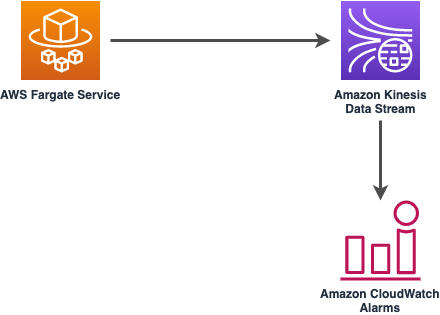

//!!NODE_ROOT <section>
//== aws-fargate-kinesisstreams module

[.topic]
= aws-fargate-kinesisstreams
:info_doctype: section
:info_title: aws-fargate-kinesisstreams

image::https://img.shields.io/badge/stability-Experimental-important.svg?style=for-the-badge[Stability:Experimental]

[width="100%",cols="<50%,<50%",options="header",]
|===
|*Reference Documentation*:
|https://docs.aws.amazon.com/solutions/latest/constructs/
|===

[width="100%",cols="<46%,54%",options="header",]
|===
|*Language* |*Package*
|image:https://docs.aws.amazon.com/cdk/api/latest/img/python32.png[Python
Logo] Python
|`aws_solutions_constructs.aws_fargate_kinesisstreams`

|image:https://docs.aws.amazon.com/cdk/api/latest/img/typescript32.png[Typescript
Logo] Typescript |`@aws-solutions-constructs/aws-fargate-kinesisstreams`

|image:https://docs.aws.amazon.com/cdk/api/latest/img/java32.png[Java
Logo] Java
|`software.amazon.awsconstructs.services.fargatekinesisstreams`
|===

== Overview

This AWS Solutions Construct deploys an AWS Fargate Service that can put
records on an Amazon Kinesis Data Stream.

Here is a minimal deployable pattern definition:

====
[role="tablist"]
Typescript::
+
[source,typescript]
----
import { Construct } from 'constructs';
import { Stack, StackProps } from 'aws-cdk-lib';
import { FargateToKinesisStreamsProps } from '@aws-solutions-constructs/aws-fargate-kinesisstreams';
import * as fargate from 'aws-cdk-lib/aws-fargate';

new FargateToKinesisStreams(this, 'FargateToKinesisStreams', {
  publicApi: true,
  ecrRepositoryArn: "arn:aws:ecr:us-east-1:123456789012:repository/your-ecr-repo",
});
----

Python::
+
[source,python]
----
from aws_solutions_constructs.aws_fargate_kinesisstreams import FargateToKinesisStreams
from aws_cdk import (
    aws_fargate as _fargate,
    Stack
)
from constructs import Construct

FargateToKinesisStreams(self, 'FargateToKinesisStreams',
                          public_api=True,
                          ecr_repository_arn="arn:aws:ecr:us-east-1:123456789012:repository/your-ecr-repo"
                       )
----

Java::
+
[source,java]
----
import software.constructs.Construct;

import software.amazon.awscdk.Stack;
import software.amazon.awscdk.StackProps;
import software.amazon.awscdk.services.fargate.*;
import software.amazon.awscdk.services.fargate.eventsources.*;
import software.amazon.awscdk.services.fargate.Runtime;
import software.amazon.awsconstructs.services.fargatekinesisstreams.*;

new FargateToKinesisStreams(this, "FargateToKinesisStreams", new FargateToKinesisStreamsProps.Builder()
        .publicApi(true)
        .ecrRepositoryArn("arn:aws:ecr:us-east-1:123456789012:repository/your-ecr-repo")
        .build());
----
====

== Pattern Construct Props

[width="100%",cols="<30%,<35%,35%",options="header",]
|===
|*Name* |*Type* |*Description*
|publicApi |`boolean` |True if the VPC provisioned by this construct
should contain Public/Private Subnets, otherwise False for the VPC to
contain Isolated Subnets only. Note this property is ignored if an
existing VPC is specified in the `existingVpc` property.

|vpcProps?
|https://docs.aws.amazon.com/cdk/api/v2/docs/aws-cdk-lib.aws_ec2.VpcProps.html[`ec2.VpcProps`]
|Optional custom properties for a new VPC the construct will create.
Providing both this and `existingVpc` is an error. An Amazon Kinesis
Streams Interface Endpoint will be added to this VPC.

|existingVpc?
|https://docs.aws.amazon.com/cdk/api/v2/docs/aws-cdk-lib.aws_ec2.IVpc.html[`ec2.IVpc`]
|An existing VPC in which to deploy the Fargate Service. Providing both
this and `vpcProps` is an error. If the client provides an existing
Fargate Service in the `existingFargateServiceObject` property, this
value must be the VPC where the service is running. An Amazon Kinesis
Streams Interface Endpoint will be added to this VPC.

|clusterProps?
|https://docs.aws.amazon.com/cdk/api/v2/docs/aws-cdk-lib.aws_ecs.ClusterProps.html[`ecs.ClusterProps`]
|Optional properties to create a new ECS cluster. To provide an existing
cluster, use the cluster attribute of fargateServiceProps.

|ecrRepositoryArn? |`string` |The arn of an ECR Repository containing
the image to use to generate the containers. Either this or the image
property of containerDefinitionProps must be provided. format:
arn:aws:ecr:_region_:_account number_:repository/_Repository Name_

|ecrImageVersion? |`string` |The version of the image to use from the
repository. Defaults to '`Latest`'

|containerDefinitionProps?
|https://docs.aws.amazon.com/cdk/api/v2/docs/aws-cdk-lib.aws_ecs.ContainerDefinitionProps.html[`ecs.ContainerDefinitionProps {vbar} any`]
|Optional props to define the container created for the Fargate Service.
(defaults found in fargate-defaults.ts)

|fargateTaskDefinitionProps?
|https://docs.aws.amazon.com/cdk/api/v2/docs/aws-cdk-lib.aws_ecs.FargateTaskDefinitionProps.html[`ecs.FargateTaskDefinitionProps {vbar} any`]
|Optional props to define the Fargate Task Definition for this
construct. (defaults found in fargate-defaults.ts)

|fargateServiceProps?
|https://docs.aws.amazon.com/cdk/api/v2/docs/aws-cdk-lib.aws_ecs.FargateServiceProps.html[`ecs.FargateServiceProps {vbar} any`]
|Optional values to override default Fargate Task definition properties
(fargate-defaults.ts). The construct will default to launching the
service is the most isolated subnets available (precedence: Isolated,
Private and Public). Override those and other defaults here.

|existingFargateServiceObject?
|https://docs.aws.amazon.com/cdk/api/v2/docs/aws-cdk-lib.aws_ecs.FargateService.html[`ecs.FargateService`]
|A Fargate Service already instantiated (probably by another Solutions
Construct). If this is specified, then no props defining a new service
can be provided, including: ecrImageVersion, containerDefinitionProps,
fargateTaskDefinitionProps, ecrRepositoryArn, fargateServiceProps,
clusterProps

|existingContainerDefinitionObject?
|https://docs.aws.amazon.com/cdk/api/v2/docs/aws-cdk-lib.aws_ecs.ContainerDefinition.html[`ecs.ContainerDefinition`]
|A container definition already instantiated as part of a Fargate
service. This must be the container in the
`existingFargateServiceObject`.

|existingStreamObj?
|https://docs.aws.amazon.com/cdk/api/v2/docs/aws-cdk-lib.aws_kinesis.Stream.html[`kinesis.Stream`]
|Existing instance of a Kinesis Data Stream. Providing both this and
`kinesisStreamProps` will cause an error.

|kinesisStreamProps?
|https://docs.aws.amazon.com/cdk/api/v2/docs/aws-cdk-lib.aws_kinesis.StreamProps.html[`kinesis.StreamProps`]
|Optional user-provided props to override the default props for the
Kinesis Data Stream. Providing both this and `existingStreamObj` will
cause an error.

|createCloudWatchAlarms |`boolean` |Whether to create recommended
CloudWatch Alarms for the Kinesis Stream (defaults to true).

|streamEnvironmentVariableName? |`string` |Optional Name to override the
Fargate Service default environment variable name that holds the Kinesis
Data Stream name value. Default: KINESIS_DATASTREAM_NAME
|===

== Pattern Properties

[width="100%",cols="<30%,<35%,35%",options="header",]
|===
|*Name* |*Type* |*Description*
|vpc
|https://docs.aws.amazon.com/cdk/api/v2/docs/aws-cdk-lib.aws_ec2.IVpc.html[`ec2.IVpc`]
|The new or existing VPC used by the construct.

|service
|https://docs.aws.amazon.com/cdk/api/v2/docs/aws-cdk-lib.aws_ecs.FargateService.html[`ecs.FargateService`]
|The new or existing AWS Fargate service used by this construct.

|container
|https://docs.aws.amazon.com/cdk/api/v2/docs/aws-cdk-lib.aws_ecs.ContainerDefinition.html[`ecs.ContainerDefinition`]
|The container associated with the AWS Fargate service in the service
property.

|kinesisStream
|https://docs.aws.amazon.com/cdk/api/v2/docs/aws-cdk-lib.aws_kinesis.Stream.html[`kinesis.Stream`]
|The new or existing Kinesis Data Stream used by this construct.

|cloudwatchAlarms?
|https://docs.aws.amazon.com/cdk/api/v2/docs/aws-cdk-lib.aws_cloudwatch.Alarm.html[`cloudwatch.Alarm[]`]
|Returns the CloudWatch Alarms created to monitor the Kinesis Data
Stream.
|===

== Default settings

Out of the box implementation of the Construct without any overrides
will set the following defaults:

==== AWS Fargate Service

* An AWS Fargate Service running in the isolated subnets of a new VPC
* Minimally-permissive IAM role for the Fargate Service to put records
on the Kinesis Data Stream
* Sets an Environment Variable named KINESIS_DATASTREAM_NAME
that holds the Kinesis Data Stream Name, which is a required property of
the Kinesis Data Streams SDK when making calls to it

==== Amazon Kinesis Stream

* Enable server-side encryption for the Kinesis Data Stream using an AWS
Managed CMK
* Deploy best practices CloudWatch Alarms for the Kinesis Data Stream
* An Interface Endpoint on the VPC for private communication between the
Fargate Service and the Kinesis Data Stream

== Architecture

image::images/GitHub-Mark-32px.png[The github logo.,scaledwidth=100%]

'''''

© Copyright Amazon.com, Inc. or its affiliates. All Rights Reserved.
