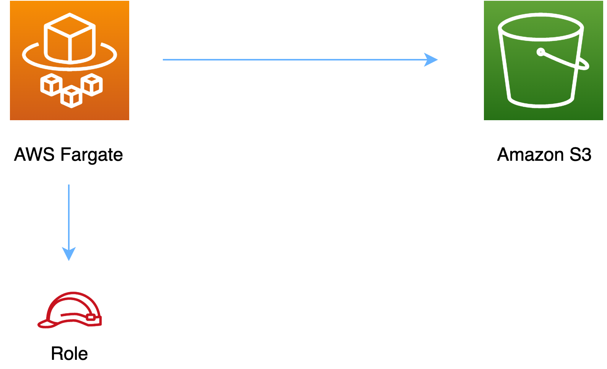

//!!NODE_ROOT <section>
//== aws-fargate-s3 module

[.topic]
= aws-fargate-s3
:info_doctype: section
:info_title: aws-fargate-s3

image:https://img.shields.io/badge/cfn--resources-stable-success.svg?style=for-the-badge[Stability:Stable]

____
All classes are under active development and subject to non-backward
compatible changes or removal in any future version. These are not
subject to the https://semver.org/[Semantic Versioning] model. This
means that while you may use them, you may need to update your source
code when upgrading to a newer version of this package.
____

[width="100%",cols="<50%,<50%",options="header",]
|===
|*Reference Documentation*:
|https://docs.aws.amazon.com/solutions/latest/constructs/
|===

[width="100%",cols="<46%,54%",options="header",]
|===
|*Language* |*Package*
|image:https://docs.aws.amazon.com/cdk/api/latest/img/python32.png[Python
Logo] Python |`aws_solutions_constructs.aws_fargate_s3`

|image:https://docs.aws.amazon.com/cdk/api/latest/img/typescript32.png[Typescript
Logo] Typescript |`@aws-solutions-constructs/aws-fargate-s3`

|image:https://docs.aws.amazon.com/cdk/api/latest/img/java32.png[Java
Logo] Java |`software.amazon.awsconstructs.services.fargates3`
|===

== Overview

This AWS Solutions Construct implements an AWS Fargate service that can
write/read to an Amazon S3 Bucket

Here is a minimal deployable pattern definition:

====
[role="tablist"]
Typescript::
+
[source,typescript]
----
import { Construct } from 'constructs';
import { Stack, StackProps } from 'aws-cdk-lib';
import { FargateToS3, FargateToS3Props } from '@aws-solutions-constructs/aws-fargate-s3';

const constructProps: FargateToS3Props = {
  publicApi: true,
  ecrRepositoryArn: "arn:aws:ecr:us-east-1:123456789012:repository/your-ecr-repo",
};

new FargateToS3(this, 'test-construct', constructProps);
----

Python::
+
[source,python]
----
from aws_solutions_constructs.aws_fargate_s3 import FargateToS3, FargateToS3Props
from aws_cdk import (
    Stack
)
from constructs import Construct

FargateToS3(self, 'test_construct',
            public_api=True,
            ecr_repository_arn="arn:aws:ecr:us-east-1:123456789012:repository/your-ecr-repo")
----

Java::
+
[source,java]
----
import software.constructs.Construct;

import software.amazon.awscdk.Stack;
import software.amazon.awscdk.StackProps;
import software.amazon.awsconstructs.services.fargates3.*;

new FargateToS3(this, "test_construct", new FargateToS3Props.Builder()
        .publicApi(true)
        .ecrRepositoryArn("arn:aws:ecr:us-east-1:123456789012:repository/your-ecr-repo")
        .build());
----
====

== Pattern Construct Props

[width="100%",cols="<30%,<35%,35%",options="header",]
|===
|*Name* |*Type* |*Description*
|publicApi |boolean |Whether the construct is deploying a private or
public API. This has implications for the VPC.

|vpcProps?
|https://docs.aws.amazon.com/cdk/api/v2/docs/aws-cdk-lib.aws_ec2.VpcProps.html[ec2.VpcProps]
|Optional custom properties for a VPC the construct will create. This
VPC will be used by any Private Hosted Zone the construct creates
(that’s why loadBalancerProps and privateHostedZoneProps can’t include a
VPC). Providing both this and existingVpc is an error.

|existingVpc?
|https://docs.aws.amazon.com/cdk/api/v2/docs/aws-cdk-lib.aws_ec2.IVpc.html[ec2.IVpc]
|An existing VPC in which to deploy the construct. Providing both this
and vpcProps is an error. If the client provides an existing load
balancer and/or existing Private Hosted Zone, those constructs must
exist in this VPC.

|clusterProps?
|https://docs.aws.amazon.com/cdk/api/v2/docs/aws-cdk-lib.aws_ecs.ClusterProps.html[ecs.ClusterProps]
|Optional properties to create a new ECS cluster. To provide an existing
cluster, use the cluster attribute of fargateServiceProps.

|ecrRepositoryArn? |string |The arn of an ECR Repository containing the
image to use to generate the containers. Either this or the image
property of containerDefinitionProps must be provided. format:
arn:aws:ecr:_region_:_account number_:repository/_Repository Name_

|ecrImageVersion? |string |The version of the image to use from the
repository. Defaults to '`Latest`'

|containerDefinitionProps?
|https://docs.aws.amazon.com/cdk/api/v2/docs/aws-cdk-lib.aws_ecs.ContainerDefinitionProps.html[ecs.ContainerDefinitionProps
{vbar} any] |Optional props to define the container created for the
Fargate Service (defaults found in fargate-defaults.ts)

|fargateTaskDefinitionProps?
|https://docs.aws.amazon.com/cdk/api/v2/docs/aws-cdk-lib.aws_ecs.FargateTaskDefinitionProps.html[ecs.FargateTaskDefinitionProps
{vbar} any] |Optional props to define the Fargate Task Definition for
this construct (defaults found in fargate-defaults.ts)

|fargateServiceProps?
|https://docs.aws.amazon.com/cdk/api/v2/docs/aws-cdk-lib.aws_ecs.FargateServiceProps.html[ecs.FargateServiceProps
{vbar} any] |Optional values to override default Fargate Task definition
properties (fargate-defaults.ts). The construct will default to
launching the service is the most isolated subnets available
(precedence: Isolated, Private and Public). Override those and other
defaults here.

|existingFargateServiceObject?
|https://docs.aws.amazon.com/cdk/api/v2/docs/aws-cdk-lib.aws_ecs.FargateService.html[ecs.FargateService]
|A Fargate Service already instantiated (probably by another Solutions
Construct). If this is specified, then no props defining a new service
can be provided, including: ecrImageVersion, containerDefinitionProps,
fargateTaskDefinitionProps, ecrRepositoryArn, fargateServiceProps,
clusterProps

|existingContainerDefinitionObject?
|https://docs.aws.amazon.com/cdk/api/v2/docs/aws-cdk-lib.aws_ecs.ContainerDefinition.html[ecs.ContainerDefinition]
|A container definition already instantiated as part of a Fargate
service. This must be the container in the existingFargateServiceObject

|existingBucketInterface?
|https://docs.aws.amazon.com/cdk/api/v2/docs/aws-cdk-lib.aws_s3.IBucket.html[`s3.IBucket`]
|Existing S3 Bucket interface. Providing this property and `bucketProps`
results in an error.

|bucketProps?
|https://docs.aws.amazon.com/cdk/api/v2/docs/aws-cdk-lib.aws_s3.BucketProps.html[`s3.BucketProps`]
|Optional user provided props to override the default props for the S3
Bucket.

|loggingBucketProps?
|https://docs.aws.amazon.com/cdk/api/v2/docs/aws-cdk-lib.aws_s3.BucketProps.html[`s3.BucketProps`]
|Optional user provided props to override the default props for the S3
Logging Bucket.

|logS3AccessLogs? |boolean |Whether to turn on Access Logging for the S3
bucket. Creates an S3 bucket with associated storage costs for the logs.
Enabling Access Logging is a best practice. default - true

|bucketPermissions? |`string[]` |Optional bucket permissions to
grant to the Fargate service. One or more of the following may be
specified: `Delete`, `Read`, and `Write`. Default is ["`Read`",
"`Write`"] which includes
`[s3:GetObject*, s3:GetBucket*, s3:List*, s3:DeleteObject*, s3:PutObject*, s3:Abort*]`.

|bucketArnEnvironmentVariableName? |string |Optional Name for the
container environment variable set to the bucket ARN. Default:
S3_BUCKET_ARN

|bucketEnvironmentVariableName? |string |Optional Optional Name for the
container environment variable set to the bucket name. Default:
S3_BUCKET_NAME
|===

== Pattern Properties

[width="100%",cols="<30%,<35%,35%",options="header",]
|===
|*Name* |*Type* |*Description*
|vpc
|https://docs.aws.amazon.com/cdk/api/v2/docs/aws-cdk-lib.aws_ec2.IVpc.html[ec2.IVpc]
|The VPC used by the construct (whether created by the construct or
provided by the client)

|service
|https://docs.aws.amazon.com/cdk/api/v2/docs/aws-cdk-lib.aws_ecs.FargateService.html[ecs.FargateService]
|The AWS Fargate service used by this construct (whether created by this
construct or passed to this construct at initialization)

|container
|https://docs.aws.amazon.com/cdk/api/v2/docs/aws-cdk-lib.aws_ecs.ContainerDefinition.html[ecs.ContainerDefinition]
|The container associated with the AWS Fargate service in the service
property.

|s3Bucket?
|https://docs.aws.amazon.com/cdk/api/v2/docs/aws-cdk-lib.aws_s3.IBucket.html[s3.IBucket]
|Returns an instance of s3.Bucket created by the construct

|s3BucketInterface
|https://docs.aws.amazon.com/cdk/api/v2/docs/aws-cdk-lib.aws_s3.IBucket.html[`s3.IBucket`]
|Returns an instance of s3.IBucket created by the construct

|s3LoggingBucket?
|https://docs.aws.amazon.com/cdk/api/v2/docs/aws-cdk-lib.aws_s3.Bucket.html[s3.Bucket]
|Returns an instance of s3.Bucket created by the construct
|===

== Default settings

Out of the box implementation of the Construct without any override will
set the following defaults:

=== AWS Fargate Service

* Sets up an AWS Fargate service
** Uses the existing service if provided
** Creates a new service if none provided.
*** Service will run in isolated subnets if available, then private
subnets if available and finally public subnets
** Adds environment variables to the container with the ARN and Name of
the S3 Bucket
** Add permissions to the container IAM role allowing it to publish to
the S3 Bucket

=== Amazon S3 Bucket

* Sets up an Amazon S3 Bucket
** Uses an existing bucket if one is provided, otherwise creates a new
one
* Adds an Interface Endpoint to the VPC for S3 (the service by default
runs in Isolated or Private subnets)

== Architecture

== Github

Go to the https://github.com/awslabs/aws-solutions-constructs/tree/main/source/patterns/%40aws-solutions-constructs/aws-fargate-s3[Github repo] for this pattern to view the code, read/create issues and pull requests and more.

'''''

