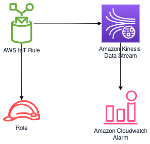

//!!NODE_ROOT <section>
//== aws-iot-kinesisstreams module

[.topic]
= aws-iot-kinesisstreams
:info_doctype: section
:info_title: aws-iot-kinesisstreams

image::https://img.shields.io/badge/stability-Experimental-important.svg?style=for-the-badge[Stability:Experimental]

____
All classes are under active development and subject to non-backward
compatible changes or removal in any future version. These are not
subject to the https://semver.org/[Semantic Versioning] model. This
means that while you may use them, you may need to update your source
code when upgrading to a newer version of this package.
____

[width="100%",cols="<50%,<50%",options="header",]
|===
|*Reference Documentation*:
|https://docs.aws.amazon.com/solutions/latest/constructs/
|===

[width="100%",cols="<46%,54%",options="header",]
|===
|*Language* |*Package*
|image:https://docs.aws.amazon.com/cdk/api/latest/img/python32.png[Python
Logo] Python
|`aws_solutions_constructs.aws_iot_kinesisstreams`

|image:https://docs.aws.amazon.com/cdk/api/latest/img/typescript32.png[Typescript
Logo] Typescript |`@aws-solutions-constructs/aws-iot-kinesisstreams`

|image:https://docs.aws.amazon.com/cdk/api/latest/img/java32.png[Java
Logo] Java |`software.amazon.awsconstructs.services.iotkinesisstreams`
|===

== Overview

This AWS Solutions Construct implements an AWS IoT MQTT topic rule to
send data to an Amazon Kinesis Data Stream.

Here is a minimal deployable pattern definition:

====
[role="tablist"]
Typescript::
+
[source,typescript]
----
import { Construct } from 'constructs';
import { Stack, StackProps } from 'aws-cdk-lib';
import { IotToKinesisStreamsProps, IotToKinesisStreams } from '@aws-solutions-constructs/aws-iot-kinesisstreams';

const constructProps: IotToKinesisStreamsProps = {
  iotTopicRuleProps: {
    topicRulePayload: {
      ruleDisabled: false,
      description: "Sends data to kinesis data stream",
      sql: "SELECT * FROM 'solutions/construct'",
      actions: []
    }
  }
};

new IotToKinesisStreams(this, 'test-iot-kinesisstreams', constructProps);
----

Python::
+
[source,python]
----
from aws_solutions_constructs.aws_iot_kinesisstreams import IotToKinesisStreamsProps, IotToKinesisStreams
from aws_cdk import (
    aws_iot as iot,
    Stack
)
from constructs import Construct

IotToKinesisStreams(self, 'test-iot-kinesisstreams',
                    iot_topic_rule_props=iot.CfnTopicRuleProps(
                        topic_rule_payload=iot.CfnTopicRule.TopicRulePayloadProperty(
                            rule_disabled=False,
                            description="Sends data to kinesis data stream",
                            sql="SELECT * FROM 'solutions/construct'",
                            actions=[]
                        )
                    ))
----

Java::
+
[source,java]
----
import software.constructs.Construct;
import java.util.List;

import software.amazon.awscdk.Stack;
import software.amazon.awscdk.StackProps;
import software.amazon.awscdk.services.iot.*;
import software.amazon.awscdk.services.iot.CfnTopicRule.TopicRulePayloadProperty;
import software.amazon.awsconstructs.services.iotkinesisstreams.*;

new IotToKinesisStreams(this, "test-iot-kinesisstreams", new IotToKinesisStreamsProps.Builder()
        .iotTopicRuleProps(new CfnTopicRuleProps.Builder()
                .topicRulePayload(new TopicRulePayloadProperty.Builder()
                        .ruleDisabled(false)
                        .description("Sends data to kinesis data stream")
                        .sql("SELECT * FROM 'solutions/construct'")
                        .actions(List.of())
                        .build())
                .build())
        .build());
----
====

== Pattern Construct Props

[width="100%",cols="<30%,<35%,35%",options="header",]
|===
|*Name* |*Type* |*Description*
|iotTopicRuleProps
|https://docs.aws.amazon.com/cdk/api/v2/docs/aws-cdk-lib.aws_iot.CfnTopicRuleProps.html[`iot.CfnTopicRuleProps`]
|User provided CfnTopicRuleProps to override the defaults

|existingStreamObj?
|https://docs.aws.amazon.com/cdk/api/v2/docs/aws-cdk-lib.aws_kinesis.Stream.html[`kinesis.Stream`]
|Existing instance of Kinesis Stream, providing both this and
`kinesisStreamProps` will cause an error.

|kinesisStreamProps?
|https://docs.aws.amazon.com/cdk/api/v2/docs/aws-cdk-lib.aws_kinesis.StreamProps.html[`kinesis.StreamProps`]
|Optional user-provided props to override the default props for the
Kinesis data stream, providing both this and `existingStreamObj` will
cause an error

|createCloudWatchAlarms |`boolean` |Whether to create recommended
CloudWatch alarms for Kinesis Data Stream. Default value is set to
`true`
|===

== Pattern Properties

[width="100%",cols="<30%,<35%,35%",options="header",]
|===
|*Name* |*Type* |*Description*
|iotTopicRule
|https://docs.aws.amazon.com/cdk/api/v2/docs/aws-cdk-lib.aws_iot.CfnTopicRule.html[`iot.CfnTopicRule`]
|Returns an instance of iot.CfnTopicRule created by the construct

|iotActionsRole
|https://docs.aws.amazon.com/cdk/api/v2/docs/aws-cdk-lib.aws_iam.Role.html[`iam.Role`]
|Returns an instance of the iam.Role created by the construct for IoT
Rule

|kinesisStream
|https://docs.aws.amazon.com/cdk/api/v2/docs/aws-cdk-lib.aws_kinesis.Stream.html[`kinesis.Stream`]
|Returns an instance of the Kinesis stream created by the construct.

|cloudwatchAlarms?
|https://docs.aws.amazon.com/cdk/api/v2/docs/aws-cdk-lib.aws_cloudwatch.Alarm.html[`cloudwatch.Alarm[]`]
|Returns an array of recommended CloudWatch Alarms created by the
construct for Kinesis Data stream
|===

== Default settings

Out of the box implementation of the Construct without any override will
set the following defaults:

=== Amazon IoT Rule

* Configure least privilege access IAM role for Amazon IoT Rule

=== Amazon Kinesis Data Stream

* Configure recommended CloudWatch Alarms for Amazon Kinesis Data Stream
* Configure least privilege access IAM role for Amazon Kinesis Data
Stream

== Architecture

== Github

Go to the https://github.com/awslabs/aws-solutions-constructs/tree/main/source/patterns/%40aws-solutions-constructs/aws-iot-kinesisstreams[Github repo] for this pattern to view the code, read/create issues and pull requests and more.

'''''

