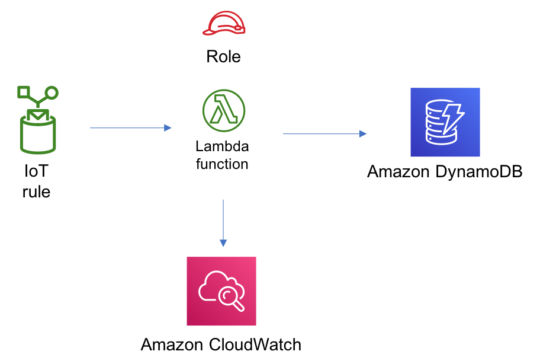

//!!NODE_ROOT <section>
//== aws-iot-lambda-dynamodb module

[.topic]
= aws-iot-lambda-dynamodb
:info_doctype: section
:info_title: aws-iot-lambda-dynamodb

image::https://img.shields.io/badge/stability-Experimental-important.svg?style=for-the-badge[Stability:Experimental]

____
All classes are under active development and subject to non-backward
compatible changes or removal in any future version. These are not
subject to the https://semver.org/[Semantic Versioning] model. This
means that while you may use them, you may need to update your source
code when upgrading to a newer version of this package.
____

[width="100%",cols="<50%,<50%",options="header",]
|===
|*Reference Documentation*:
|https://docs.aws.amazon.com/solutions/latest/constructs/
|===

[width="100%",cols="<46%,54%",options="header",]
|===
|*Language* |*Package*
|image:https://docs.aws.amazon.com/cdk/api/latest/img/python32.png[Python
Logo] Python
|`aws_solutions_constructs.aws_iot_lambda_dynamodb`

|image:https://docs.aws.amazon.com/cdk/api/latest/img/typescript32.png[Typescript
Logo] Typescript |`@aws-solutions-constructs/aws-iot-lambda-dynamodb`

|image:https://docs.aws.amazon.com/cdk/api/latest/img/java32.png[Java
Logo] Java |`software.amazon.awsconstructs.services.iotlambdadynamodb`
|===

== Overview

This AWS Solutions Construct implements an AWS IoT topic rule, an AWS
Lambda function and Amazon DynamoDB table with the least privileged
permissions.

Here is a minimal deployable pattern definition:

====
[role="tablist"]
Typescript::
+
[source,typescript]
----
import { Construct } from 'constructs';
import { Stack, StackProps } from 'aws-cdk-lib';
import { IotToLambdaToDynamoDBProps, IotToLambdaToDynamoDB } from '@aws-solutions-constructs/aws-iot-lambda-dynamodb';
import * as lambda from 'aws-cdk-lib/aws-lambda';

const constructProps: IotToLambdaToDynamoDBProps = {
  lambdaFunctionProps: {
      code: lambda.Code.fromAsset(`lambda`),
      runtime: lambda.Runtime.NODEJS_20_X,
      handler: 'index.handler'
  },
  iotTopicRuleProps: {
      topicRulePayload: {
          ruleDisabled: false,
          description: "Processing of DTC messages from the AWS Connected Vehicle Solution.",
          sql: "SELECT * FROM 'connectedcar/dtc/#'",
          actions: []
      }
  }
};

new IotToLambdaToDynamoDB(this, 'test-iot-lambda-dynamodb-stack', constructProps);
----

Python::
+
[source,python]
----
from aws_solutions_constructs.aws_iot_lambda_dynamodb import IotToLambdaToDynamoDB
from aws_cdk import (
    aws_iot as iot,
    aws_lambda as _lambda,
    Stack
)
from constructs import Construct

IotToLambdaToDynamoDB(self, 'test-iot-lambda-dynamodb-stack',
            lambda_function_props=_lambda.FunctionProps(
                code=_lambda.Code.from_asset('lambda'),
                runtime=_lambda.Runtime.PYTHON_3_11,
                handler='index.handler'
            ),
            iot_topic_rule_props=iot.CfnTopicRuleProps(
                topic_rule_payload=iot.CfnTopicRule.TopicRulePayloadProperty(
                    rule_disabled=False,
                    description="Processing of DTC messages from the AWS Connected Vehicle Solution.",
                    sql="SELECT * FROM 'connectedcar/dtc/#'",
                    actions=[]
                )
            ))
----

Java::
+
[source,java]
----
import software.constructs.Construct;
import java.util.List;

import software.amazon.awscdk.Stack;
import software.amazon.awscdk.StackProps;
import software.amazon.awscdk.services.lambda.*;
import software.amazon.awscdk.services.lambda.Runtime;
import software.amazon.awscdk.services.iot.*;
import software.amazon.awscdk.services.iot.CfnTopicRule.TopicRulePayloadProperty;
import software.amazon.awsconstructs.services.iotlambdadynamodb.*;

new IotToLambdaToDynamoDB(this, "test-iot-lambda-dynamodb-stack", new IotToLambdaToDynamoDBProps.Builder()
        .lambdaFunctionProps(new FunctionProps.Builder()
                .runtime(Runtime.NODEJS_20_X)
                .code(Code.fromAsset("lambda"))
                .handler("index.handler")
                .build())
        .iotTopicRuleProps(new CfnTopicRuleProps.Builder()
                .topicRulePayload(new TopicRulePayloadProperty.Builder()
                        .ruleDisabled(false)
                        .description("Processing of DTC messages from the AWS Connected Vehicle Solution.")
                        .sql("SELECT * FROM 'connectedcar/dtc/#'")
                        .actions(List.of())
                        .build())
                .build())
        .build());
----
====

== Pattern Construct Props

[width="100%",cols="<30%,<35%,35%",options="header",]
|===
|*Name* |*Type* |*Description*
|existingLambdaObj?
|https://docs.aws.amazon.com/cdk/api/v2/docs/aws-cdk-lib.aws_lambda.Function.html[`lambda.Function`]
|Existing instance of Lambda Function object, providing both this and
`lambdaFunctionProps` will cause an error.

|lambdaFunctionProps?
|https://docs.aws.amazon.com/cdk/api/v2/docs/aws-cdk-lib.aws_lambda.FunctionProps.html[`lambda.FunctionProps`]
|User provided props to override the default props for the Lambda
function.

|iotTopicRuleProps
|https://docs.aws.amazon.com/cdk/api/v2/docs/aws-cdk-lib.aws_iot.CfnTopicRuleProps.html[`iot.CfnTopicRuleProps`]
|User provided props to override the default props

|dynamoTableProps?
|https://docs.aws.amazon.com/cdk/api/v2/docs/aws-cdk-lib.aws_dynamodb.TableProps.html[`dynamodb.TableProps`]
|Optional user provided props to override the default props for DynamoDB
Table

StablePermissions? |`string` |Optional table permissions to grant to the
Lambda function. One of the following may be specified: `All`, `Read`,
`ReadWrite`, `Write`.

|existingTableObj?
|https://docs.aws.amazon.com/cdk/api/v2/docs/aws-cdk-lib.aws_dynamodb.Table.html[`dynamodb.Table`]
|Existing instance of DynamoDB table object, providing both this and
`dynamoTableProps` will cause an error.

StableEnvironmentVariableName? |`string` |Optional Name for the Lambda
function environment variable set to the name of the DynamoDB table.
Default: DDB_TABLE_NAME

|existingVpc?
|https://docs.aws.amazon.com/cdk/api/v2/docs/aws-cdk-lib.aws_ec2.IVpc.html[`ec2.IVpc`]
|An optional, existing VPC into which this pattern should be deployed.
When deployed in a VPC, the Lambda function will use ENIs in the VPC to
access network resources and a Gateway Endpoint will be created in the
VPC for Amazon DynamoDB. If an existing VPC is provided, the `deployVpc`
property cannot be `true`. This uses `ec2.IVpc` to allow clients to
supply VPCs that exist outside the stack using the
https://docs.aws.amazon.com/cdk/api/v2/docs/aws-cdk-lib.aws_ec2.Vpc.html#static-fromwbrlookupscope-id-options[`ec2.Vpc.fromLookup()`]
method.

|vpcProps?
|https://docs.aws.amazon.com/cdk/api/v2/docs/aws-cdk-lib.aws_ec2.VpcProps.html[`ec2.VpcProps`]
|Optional user-provided properties to override the default properties
for the new VPC. `enableDnsHostnames`, `enableDnsSupport`, `natGateways`
and `subnetConfiguration` are set by the pattern, so any values for
those properties supplied here will be overridden. If `deployVpc` is not
`true` then this property will be ignored.

|deployVpc? |`boolean` |Whether to create a new VPC based on `vpcProps`
into which to deploy this pattern. Setting this to true will deploy the
minimal, most private VPC to run the pattern:
|===

== Pattern Properties

[width="100%",cols="<30%,<35%,35%",options="header",]
|===
|*Name* |*Type* |*Description*
|iotTopicRule
|https://docs.aws.amazon.com/cdk/api/v2/docs/aws-cdk-lib.aws_iot.CfnTopicRule.html[`iot.CfnTopicRule`]
|Returns an instance of iot.CfnTopicRule created by the construct

|lambdaFunction
|https://docs.aws.amazon.com/cdk/api/v2/docs/aws-cdk-lib.aws_lambda.Function.html[`lambda.Function`]
|Returns an instance of lambda.Function created by the construct

|dynamoTable
|https://docs.aws.amazon.com/cdk/api/v2/docs/aws-cdk-lib.aws_dynamodb.Table.html[`dynamodb.Table`]
|Returns an instance of dynamodb.Table created by the construct

|vpc?
|https://docs.aws.amazon.com/cdk/api/v2/docs/aws-cdk-lib.aws_ec2.IVpc.html[`ec2.IVpc`]
|Returns an interface on the VPC used by the pattern (if any). This may
be a VPC created by the pattern or the VPC supplied to the pattern
constructor.
|===

== Default settings

Out of the box implementation of the Construct without any override will
set the following defaults:

=== Amazon IoT Rule

* Configure least privilege access IAM role for Amazon IoT

=== AWS Lambda Function

* Configure limited privilege access IAM role for Lambda function
* Enable reusing connections with Keep-Alive for NodeJs Lambda function
* Enable X-Ray Tracing
* Set Environment Variables
** AWS_NODEJS_CONNECTION_REUSE_ENABLED (for Node 10.x
and higher functions)

=== Amazon DynamoDB Table

* Set the billing mode for DynamoDB Table to On-Demand (Pay per request)
* Enable server-side encryption for DynamoDB Table using AWS managed KMS
Key
* Creates a partition key called '`id`' for DynamoDB Table
* Retain the Table when deleting the CloudFormation stack
* Enable continuous backups and point-in-time recovery

== Architecture

image::images/GitHub-Mark-32px.png[The github logo.,scaledwidth=100%]

'''''

© Copyright Amazon.com, Inc. or its affiliates. All Rights Reserved.
