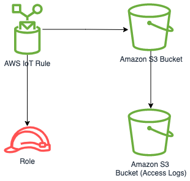

//!!NODE_ROOT <section>
//== aws-iot-s3 module

[.topic]
= aws-iot-s3
:info_doctype: section
:info_title: aws-iot-s3

image::https://img.shields.io/badge/stability-Experimental-important.svg?style=for-the-badge[Stability:Experimental]

____
All classes are under active development and subject to non-backward
compatible changes or removal in any future version. These are not
subject to the https://semver.org/[Semantic Versioning] model. This
means that while you may use them, you may need to update your source
code when upgrading to a newer version of this package.
____

[width="100%",cols="<50%,<50%",options="header",]
|===
|*Reference Documentation*:
|https://docs.aws.amazon.com/solutions/latest/constructs/
|===

[width="100%",cols="<46%,54%",options="header",]
|===
|*Language* |*Package*
|image:https://docs.aws.amazon.com/cdk/api/latest/img/python32.png[Python
Logo] Python |`aws_solutions_constructs.aws_iot_s3`

|image:https://docs.aws.amazon.com/cdk/api/latest/img/typescript32.png[Typescript
Logo] Typescript |`@aws-solutions-constructs/aws-iot-s3`

|image:https://docs.aws.amazon.com/cdk/api/latest/img/java32.png[Java
Logo] Java |`software.amazon.awsconstructs.services.iots3`
|===

== Overview

This AWS Solutions Construct implements an AWS IoT MQTT topic rule and
an Amazon S3 Bucket pattern.

Here is a minimal deployable pattern definition:

====
[role="tablist"]
Typescript::
+
[source,typescript]
----
import { Construct } from 'constructs';
import { Stack, StackProps } from 'aws-cdk-lib';
import { IotToS3Props, IotToS3 } from '@aws-solutions-constructs/aws-iot-s3';

const constructProps: IotToS3Props = {
  iotTopicRuleProps: {
    topicRulePayload: {
      ruleDisabled: false,
      description: "Testing the IotToS3 Pattern",
      sql: "SELECT * FROM 'solutions/constructs'",
      actions: []
    }
  }
};

new IotToS3(this, 'test-iot-s3-integration', constructProps);
----

Python::
+
[source,python]
----
from aws_solutions_constructs.aws_iot_s3 import IotToS3Props, IotToS3
from aws_cdk import (
    aws_iot as iot,
    Stack
)
from constructs import Construct

IotToS3(self, 'test_iot_s3',
        iot_topic_rule_props=iot.CfnTopicRuleProps(
            topic_rule_payload=iot.CfnTopicRule.TopicRulePayloadProperty(
                rule_disabled=False,
                description="Testing the IotToS3 Pattern",
                sql="SELECT * FROM 'solutions/constructs'",
                actions=[]
            )
        ))
----

Java::
+
[source,java]
----
import software.constructs.Construct;
import java.util.List;

import software.amazon.awscdk.Stack;
import software.amazon.awscdk.StackProps;
import software.amazon.awscdk.services.iot.*;
import software.amazon.awscdk.services.iot.CfnTopicRule.TopicRulePayloadProperty;
import software.amazon.awsconstructs.services.iots3.*;

new IotToS3(this, "test_iot_s3", new IotToS3Props.Builder()
        .iotTopicRuleProps(new CfnTopicRuleProps.Builder()
                .topicRulePayload(new TopicRulePayloadProperty.Builder()
                        .ruleDisabled(false)
                        .description("Testing the IotToS3 Pattern")
                        .sql("SELECT * FROM 'solutions/constructs'")
                        .actions(List.of())
                        .build())
                .build())
        .build());
----
====

== Pattern Construct Props

[width="100%",cols="<30%,<35%,35%",options="header",]
|===
|*Name* |*Type* |*Description*
|existingBucketInterface?
|https://docs.aws.amazon.com/cdk/api/v2/docs/aws-cdk-lib.aws_s3.IBucket.html[`s3.IBucket`]
|Existing S3 Bucket interface. Providing this property and `bucketProps`
results in an error.

|bucketProps?
|https://docs.aws.amazon.com/cdk/api/v2/docs/aws-cdk-lib.aws_s3.BucketProps.html[`s3.BucketProps`]
|Optional user provided props to override the default props for the S3
Bucket. Providing this and `existingBucketObj` reults in an error.

|loggingBucketProps?
|https://docs.aws.amazon.com/cdk/api/v2/docs/aws-cdk-lib.aws_s3.BucketProps.html[`s3.BucketProps`]
|Optional user provided props to override the default props for the S3
Logging Bucket.

|iotTopicRuleProps?
|https://docs.aws.amazon.com/cdk/api/v2/docs/aws-cdk-lib.aws_iot.CfnTopicRuleProps.html[`iot.CfnTopicRuleProps`]
|User provided CfnTopicRuleProps to override the defaults.

|s3Key |`string` |User provided s3Key to override the default
(`${topic()}/${timestamp()}`) object key. Used to store messages
matched by the IoT Rule.

|logS3AccessLogs? |`boolean` |Whether to turn on Access Logging for the
S3 bucket. Creates an S3 bucket with associated storage costs for the
logs. Enabling Access Logging is a best practice. default - true
|===

== Pattern Properties

[width="100%",cols="<30%,<35%,35%",options="header",]
|===
|*Name* |*Type* |*Description*
|s3Bucket?
|https://docs.aws.amazon.com/cdk/api/v2/docs/aws-cdk-lib.aws_s3.Bucket.html[`s3.Bucket`]
|Returns an instance of the S3 bucket created by the pattern. If an
existingBucketInterface is provided in IotToS3Props, then this value
will be undefined

|s3BucketInterface?
|https://docs.aws.amazon.com/cdk/api/v2/docs/aws-cdk-lib.aws_s3.IBucket.html[`s3.IBucket`]
|Returns S3 Bucket interface created or used by the pattern. If an
existingBucketInterface is provided in IotToS3Props, then only this
value will be set and s3Bucket will be undefined. If the construct
creates the bucket, then both properties will be set.

|s3LoggingBucket?
|https://docs.aws.amazon.com/cdk/api/v2/docs/aws-cdk-lib.aws_s3.Bucket.html[`s3.Bucket`]
|Returns an instance of `s3.Bucket` created by the construct as the
logging bucket for the primary bucket.

|iotActionsRole
|https://docs.aws.amazon.com/cdk/api/v2/docs/aws-cdk-lib.aws_iam.Role.html[`iam.Role`]
|Returns an instance of `iam.Role` created by the construct, which
allows IoT to publish messages to the S3 bucket.

|iotTopicRule
|https://docs.aws.amazon.com/cdk/api/v2/docs/aws-cdk-lib.aws_iot.CfnTopicRule.html[`iot.CfnTopicRule`]
|Returns an instance of `iot.CfnTopicRule` created by the construct
|===

== Default settings

Out of the box implementation of the Construct without any override will
set the following defaults:

==== Amazon IoT Rule

* Configure an IoT Rule to send messages to the S3 Bucket

==== Amazon IAM Role

* Configure least privilege access IAM role for Amazon IoT to be able to
publish messages to the S3 Bucket

==== Amazon S3 Bucket

* Configure Access logging for S3 Bucket
* Enable server-side encryption for S3 Bucket using AWS managed KMS Key
* Enforce encryption of data in transit
* Turn on the versioning for S3 Bucket
* Don’t allow public access for S3 Bucket
* Retain the S3 Bucket when deleting the CloudFormation stack
* Applies Lifecycle rule to move noncurrent object versions to Glacier
storage after 90 days

== Architecture

image::images/GitHub-Mark-32px.png[The github logo.,scaledwidth=100%]

'''''

© Copyright Amazon.com, Inc. or its affiliates. All Rights Reserved.
