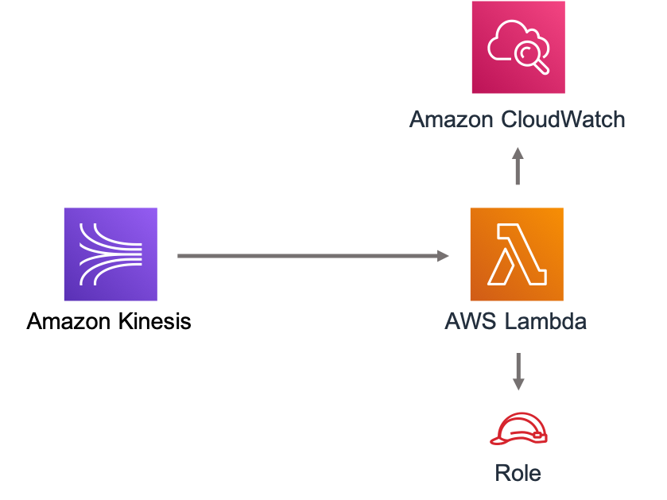

//!!NODE_ROOT <section>
//== aws-kinesisstreams-lambda module

[.topic]
= aws-kinesisstreams-lambda
:info_doctype: section
:info_title: aws-kinesisstreams-lambda

image:https://img.shields.io/badge/cfn--resources-stable-success.svg?style=for-the-badge[Stability:Stable]

[width="100%",cols="<50%,<50%",options="header",]
|===
|*Reference Documentation*:
|https://docs.aws.amazon.com/solutions/latest/constructs/
|===

[width="100%",cols="<46%,54%",options="header",]
|===
|*Language* |*Package*
|image:https://docs.aws.amazon.com/images/solutions/latest/constructs/images/python32.png[Python
Logo] Python
|`aws_solutions_constructs.aws-kinesis-streams-lambda`

|image:https://docs.aws.amazon.com/images/solutions/latest/constructs/images/typescript32.png[Typescript
Logo] Typescript |`@aws-solutions-constructs/aws-kinesisstreams-lambda`

|image:https://docs.aws.amazon.com/images/solutions/latest/constructs/images/java32.png[Java
Logo] Java
|`software.amazon.awsconstructs.services.kinesisstreamslambda`
|===

== Overview

This AWS Solutions Construct deploys a Kinesis Stream and Lambda
function with the appropriate resources/properties for interaction and
security.

Here is a minimal deployable pattern definition:

====
[role="tablist"]
Typescript::
+
[source,typescript]
----
import { Construct } from 'constructs';
import { Stack, StackProps } from 'aws-cdk-lib';
import { KinesisStreamsToLambda } from '@aws-solutions-constructs/aws-kinesisstreams-lambda';
import * as lambda from 'aws-cdk-lib/aws-lambda';

new KinesisStreamsToLambda(this, 'KinesisToLambdaPattern', {
  kinesisEventSourceProps: {
    startingPosition: lambda.StartingPosition.TRIM_HORIZON,
    batchSize: 1
  },
  lambdaFunctionProps: {
    runtime: lambda.Runtime.NODEJS_22_X,
    handler: 'index.handler',
    code: lambda.Code.fromAsset(`lambda`)
  }
});
----

Python::
+
[source,python]
----
from aws_solutions_constructs.aws_kinesis_streams_lambda import KinesisStreamsToLambda
from aws_cdk import (
    aws_lambda as _lambda,
    aws_lambda_event_sources as sources,
    aws_kinesis as kinesis,
    Stack
)
from constructs import Construct

KinesisStreamsToLambda(self, 'KinesisToLambdaPattern',
                        kinesis_event_source_props=sources.KinesisEventSourceProps(
                            starting_position=_lambda.StartingPosition.TRIM_HORIZON,
                            batch_size=1
                        ),
                        lambda_function_props=_lambda.FunctionProps(
                            runtime=_lambda.Runtime.PYTHON_3_11,
                            handler='index.handler',
                            code=_lambda.Code.from_asset(
                                'lambda')
                        )
                        )
----

Java::
+
[source,java]
----
import software.constructs.Construct;

import software.amazon.awscdk.Stack;
import software.amazon.awscdk.StackProps;
import software.amazon.awscdk.services.lambda.*;
import software.amazon.awscdk.services.lambda.eventsources.*;
import software.amazon.awscdk.services.lambda.Runtime;
import software.amazon.awsconstructs.services.kinesisstreamslambda.*;

new KinesisStreamsToLambda(this, "KinesisToLambdaPattern", new KinesisStreamsToLambdaProps.Builder()
        .kinesisEventSourceProps(new KinesisEventSourceProps.Builder()
                .startingPosition(StartingPosition.TRIM_HORIZON)
                .batchSize(1)
                .build())
        .lambdaFunctionProps(new FunctionProps.Builder()
                .runtime(Runtime.NODEJS_22_X)
                .code(Code.fromAsset("lambda"))
                .handler("index.handler")
                .build())
        .build());
----
====

== Pattern Construct Props

[width="100%",cols="<30%,<35%,35%",options="header",]
|===
|*Name* |*Type* |*Description*
|existingLambdaObj?
|https://docs.aws.amazon.com/cdk/api/v2/docs/aws-cdk-lib.aws_lambda.Function.html[`lambda.Function`]
|Optional - instance of an existing Lambda Function object, providing both this and
`lambdaFunctionProps` will cause an error.

|lambdaFunctionProps?
|https://docs.aws.amazon.com/cdk/api/v2/docs/aws-cdk-lib.aws_lambda.FunctionProps.html[`lambda.FunctionProps`]
|Optional - user provided props to override the default props for the Lambda function. Providing both this and `existingLambdaObj` causes an error.

|kinesisStreamProps?
|https://docs.aws.amazon.com/cdk/api/v2/docs/aws-cdk-lib.aws_kinesis.StreamProps.html[`kinesis.StreamProps`]
|Optional user-provided props to override the default props for the
Kinesis stream.

|existingStreamObj?
|https://docs.aws.amazon.com/cdk/api/v2/docs/aws-cdk-lib.aws_kinesis.Stream.html[`kinesis.Stream`]
|Existing instance of Kinesis Stream, providing both this and
`kinesisStreamProps` will cause an error.

|kinesisEventSourceProps?
|https://docs.aws.amazon.com/cdk/api/v2/docs/aws-cdk-lib.aws_lambda_event_sources.KinesisEventSourceProps.html[`aws-lambda-event-sources.KinesisEventSourceProps`]
|Optional user-provided props to override the default props for the
Lambda event source mapping.

|createCloudWatchAlarms |`boolean` |Whether to create recommended
CloudWatch alarms
|===

== Pattern Properties

[width="100%",cols="<30%,<35%,35%",options="header",]
|===
|*Name* |*Type* |*Description*
|kinesisStream
|https://docs.aws.amazon.com/cdk/api/v2/docs/aws-cdk-lib.aws_kinesis.Stream.html[`kinesis.Stream`]
|Returns an instance of the Kinesis stream created by the pattern.

|lambdaFunction
|https://docs.aws.amazon.com/cdk/api/v2/docs/aws-cdk-lib.aws_lambda.Function.html[`lambda.Function`]
|Returns an instance of the Lambda function created by the pattern.

|kinesisStreamRole
|https://docs.aws.amazon.com/cdk/api/v2/docs/aws-cdk-lib.aws_iam.Role.html[`iam.Role`]
|Returns an instance of the iam.Role created by the construct for
Kinesis stream.

|cloudwatchAlarms?
|https://docs.aws.amazon.com/cdk/api/v2/docs/aws-cdk-lib.aws_cloudwatch.Alarm.html[`cloudwatch.Alarm[\]`]
|Returns a list of cloudwatch.Alarm created by the construct
|===

== Default settings

Out of the box implementation of the Construct without any override will
set the following defaults:

=== Amazon Kinesis Stream

* Configure least privilege access IAM role for Kinesis Stream
* Enable server-side encryption for Kinesis Stream using AWS Managed KMS
Key
* Deploy best practices CloudWatch Alarms for the Kinesis Stream

=== AWS Lambda Function

* Configure limited privilege access IAM role for Lambda function
* Enable reusing connections with Keep-Alive for NodeJs Lambda function
* Enable X-Ray Tracing
* Enable Failure-Handling features like enable bisect on function Error,
set defaults for Maximum Record Age (24 hours) & Maximum Retry Attempts
(500) and deploy SQS dead-letter queue as destination on failure
* Set Environment Variables
** AWS_NODEJS_CONNECTION_REUSE_ENABLED (for Node 10.x
and higher functions)

== Architecture

== Github

Go to the https://github.com/awslabs/aws-solutions-constructs/tree/main/source/patterns/%40aws-solutions-constructs/aws-kinesisstreams-lambda[Github repo] for this pattern to view the code, read/create issues and pull requests and more.

'''''

