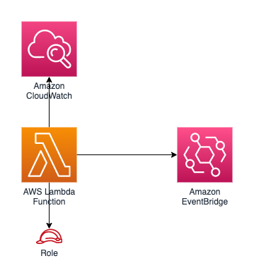

//!!NODE_ROOT <section>
//== aws-lambda-eventbridge module

[.topic]
= aws-lambda-eventbridge
:info_doctype: section
:info_title: aws-lambda-eventbridge

image:https://img.shields.io/badge/cfn--resources-stable-success.svg?style=for-the-badge[Stability:Stable]

[width="100%",cols="<50%,<50%",options="header",]
|===
|*Reference Documentation*:
|https://docs.aws.amazon.com/solutions/latest/constructs/
|===

[width="100%",cols="<46%,54%",options="header",]
|===
|*Language* |*Package*
|image:https://docs.aws.amazon.com/images/solutions/latest/constructs/images/python32.png[Python
Logo] Python
|`aws_solutions_constructs.aws_lambda_eventbridge`

|image:https://docs.aws.amazon.com/images/solutions/latest/constructs/images/typescript32.png[Typescript
Logo] Typescript |`@aws-solutions-constructs/aws-lambda-eventbridge`

|image:https://docs.aws.amazon.com/images/solutions/latest/constructs/images/java32.png[Java
Logo] Java |`software.amazon.awsconstructs.services.lambdaeventbridge`
|===

== Overview

This AWS Solutions Construct implements an AWS Lambda function connected
to an Amazon EventBridge.

Here is a minimal deployable pattern definition:

====
[role="tablist"]
Typescript::
+
[source,typescript]
----
import { Construct } from 'constructs';
import { Stack, StackProps, Aws } from 'aws-cdk-lib';
import { LambdaToEventbridge, LambdaToEventbridgeProps } from "@aws-solutions-constructs/aws-lambda-eventbridge";
import * as lambda from 'aws-cdk-lib/aws-lambda';

new LambdaToEventbridge(this, 'LambdaToEventbridgePattern', {
  lambdaFunctionProps: {
    runtime: lambda.Runtime.NODEJS_22_X,
    handler: 'index.handler',
    code: lambda.Code.fromAsset(`lambda`)
  }
});
----

Python::
+
[source,python]
----
from aws_solutions_constructs.aws_lambda_eventbridge import LambdaToEventbridge
from aws_cdk import (
    aws_lambda as _lambda,
    Stack
)
from constructs import Construct

LambdaToEventbridge(self, 'LambdaToEventbridgePattern',
                    lambda_function_props=_lambda.FunctionProps(
                        code=_lambda.Code.from_asset('lambda'),
                        runtime=_lambda.Runtime.PYTHON_3_11,
                        handler='index.handler'
                    )
                    )
----

Java::
+
[source,java]
----
import software.constructs.Construct;

import software.amazon.awscdk.Stack;
import software.amazon.awscdk.StackProps;
import software.amazon.awscdk.services.lambda.*;
import software.amazon.awscdk.services.lambda.Runtime;
import software.amazon.awsconstructs.services.lambdaeventbridge.*;

new LambdaToEventbridge(this, "LambdaToEventbridgePattern", new LambdaToEventbridgeProps.Builder()
        .lambdaFunctionProps(new FunctionProps.Builder()
                .runtime(Runtime.NODEJS_22_X)
                .code(Code.fromAsset("lambda"))
                .handler("index.handler")
                .build())
        .build());
----
====

== Pattern Construct Props

[width="100%",cols="<30%,<35%,35%",options="header",]
|===
|*Name* |*Type* |*Description*
|existingLambdaObj?
|https://docs.aws.amazon.com/cdk/api/v2/docs/aws-cdk-lib.aws_lambda.Function.html[`lambda.Function`]
|Optional - instance of an existing Lambda Function object, providing both this and `lambdaFunctionProps` will cause an error.

|lambdaFunctionProps?
|https://docs.aws.amazon.com/cdk/api/v2/docs/aws-cdk-lib.aws_lambda.FunctionProps.html[`lambda.FunctionProps`]
|Optional - user provided props to override the default props for the Lambda function. Providing both this and `existingLambdaObj` causes an error.

|existingEventBusInterface?
|https://docs.aws.amazon.com/cdk/api/v2/docs/aws-cdk-lib.aws_events.IEventBus.html[`events.IEventBus`]
|Optional - user provided custom EventBus for this construct to use. Providing both this and `eventBusProps` 
causes an error.

|eventBusProps?
|https://docs.aws.amazon.com/cdk/api/v2/docs/aws-cdk-lib.aws_events.EventBusProps.html[`events.EventBusProps`]
|Optional - user provided properties to override the default properties when creating a custom EventBus. Setting
this value to `{}` will create a custom EventBus using all default properties. If neither this nor
`existingEventBusInterface` is provided the construct will use the default EventBus. Providing both this and
`existingEventBusInterface` causes an error.

|existingVpc?
|https://docs.aws.amazon.com/cdk/api/v2/docs/aws-cdk-lib.aws_ec2.IVpc.html[`ec2.IVpc`]
|An optional, existing VPC into which this pattern should be deployed.
When deployed in a VPC, the Lambda function will use ENIs in the VPC to
access network resources and an Interface Endpoint will be created in
the VPC for Amazon EventBridge. If an existing VPC is provided, the
`deployVpc` property cannot be `true`. This uses `ec2.IVpc` to allow
clients to supply VPCs that exist outside the stack using the
https://docs.aws.amazon.com/cdk/api/v2/docs/aws-cdk-lib.aws_ec2.Vpc.html#static-fromwbrlookupscope-id-options[`ec2.Vpc.fromLookup()`]
method.

|vpcProps?
|https://docs.aws.amazon.com/cdk/api/v2/docs/aws-cdk-lib.aws_ec2.VpcProps.html[`ec2.VpcProps`]
|Optional user-provided properties to override the default properties
for the new VPC. `enableDnsHostnames`, `enableDnsSupport`, `natGateways`
and `subnetConfiguration` are set by the pattern, so any values for
those properties supplied here will be overridden. If `deployVpc` is not
`true` then this property will be ignored.

|deployVpc? |`boolean` |Whether to create a new VPC based on `vpcProps`
into which to deploy this pattern. Setting this to true will deploy the
minimal, most private VPC to run the pattern:

|eventBusEnvironmentVariableName? |`string` |Optional Name for the
Lambda function environment variable set to the name of the Event bus.
Default: EVENTBUS_NAME
|===

== Pattern Properties

[width="100%",cols="<30%,<35%,35%",options="header",]
|===
|*Name* |*Type* |*Description*
|lambdaFunction
|https://docs.aws.amazon.com/cdk/api/v2/docs/aws-cdk-lib.aws_lambda.Function.html[`lambda.Function`]
|Returns an instance of the Lambda function created by the pattern.

|eventBus?
|https://docs.aws.amazon.com/cdk/api/v2/docs/aws-cdk-lib.aws_events.IEventBus.html[`events.IEventBus`]
|Returns the instance of events.IEventBus used by the construct

|vpc?
|https://docs.aws.amazon.com/cdk/api/v2/docs/aws-cdk-lib.aws_ec2.IVpc.html[`ec2.IVpc`]
|Returns an interface on the VPC used by the pattern (if any). This may
be a VPC created by the pattern or the VPC supplied to the pattern
constructor.
|===

== Default settings

Out of the box implementation of the Construct without any override will
set the following defaults:

=== AWS Lambda Function

* Configure limited privilege access IAM role for Lambda function.
* Enable reusing connections with Keep-Alive for NodeJs Lambda function.
* Allow the function to put events to EventBus (custom EventBus can be
used by specifying `existingEventBusInterface` or `eventBusProps`
property).
* Enable X-Ray Tracing
* Set Environment Variables
** EVENTBUS_NAME
** AWS_NODEJS_CONNECTION_REUSE_ENABLED (for Node 10.x
and higher functions)

== Architecture

== Example Lambda Function Implementation

While Solutions Constructs does not publish code for the Lambda function to call EventBridge, here is a EventBridge example for PutEventsCommand: https://github.com/awsdocs/aws-doc-sdk-examples/blob/main/javascriptv3/example_code/eventbridge/actions/put-events.js['example']. (this example is in JavaScript, but examples in other languages can also be found at this site)

== Github

Go to the https://github.com/awslabs/aws-solutions-constructs/tree/main/source/patterns/%40aws-solutions-constructs/aws-lambda-eventbridge[Github repo] for this pattern to view the code, read/create issues and pull requests and more.

'''''

