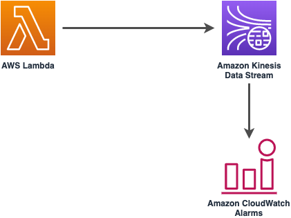

//!!NODE_ROOT <section>
//== aws-lambda-kinesisstreams module

[.topic]
= aws-lambda-kinesisstreams
:info_doctype: section
:info_title: aws-lambda-kinesisstreams

image:https://img.shields.io/badge/cfn--resources-stable-success.svg?style=for-the-badge[Stability:Stable]

[width="100%",cols="<50%,<50%",options="header",]
|===
|*Reference Documentation*:
|https://docs.aws.amazon.com/solutions/latest/constructs/
|===

[width="100%",cols="<46%,54%",options="header",]
|===
|*Language* |*Package*
|image:https://docs.aws.amazon.com/images/solutions/latest/constructs/images/python32.png[Python
Logo] Python
|`aws_solutions_constructs.aws_lambda_kinesis_stream`

|image:https://docs.aws.amazon.com/images/solutions/latest/constructs/images/typescript32.png[Typescript
Logo] Typescript |`@aws-solutions-constructs/aws-lambda-kinesisstreams`

|image:https://docs.aws.amazon.com/images/solutions/latest/constructs/images/java32.png[Java
Logo] Java
|`software.amazon.awsconstructs.services.lambdakinesisstreams`
|===

== Overview

This AWS Solutions Construct deploys an AWS Lambda Function that can put
records on an Amazon Kinesis Data Stream.

Here is a minimal deployable pattern definition:

====
[role="tablist"]
Typescript::
+
[source,typescript]
----
import { Construct } from 'constructs';
import { Stack, StackProps } from 'aws-cdk-lib';
import { LambdaToKinesisStreamsProps } from '@aws-solutions-constructs/aws-lambda-kinesisstreams';
import * as lambda from 'aws-cdk-lib/aws-lambda';

new LambdaToKinesisStreams(this, 'LambdaToKinesisStreams', {
  lambdaFunctionProps: {
    runtime: lambda.Runtime.NODEJS_22_X,
    handler: 'index.handler',
    code: lambda.Code.fromAsset(`lambda`)
  }
});
----

Python::
+
[source,python]
----
from aws_solutions_constructs.aws_lambda_kinesis_stream import LambdaToKinesisStreams
from aws_cdk import (
    aws_lambda as _lambda,
    aws_kinesis as kinesis,
    Stack
)
from constructs import Construct

LambdaToKinesisStreams(self, 'LambdaToKinesisStreams',
                        lambda_function_props=_lambda.FunctionProps(
                          runtime=_lambda.Runtime.PYTHON_3_14,
                          handler='index.handler',
                          code=_lambda.Code.from_asset('lambda')
                        )
                      )
----

Java::
+
[source,java]
----
import software.constructs.Construct;

import software.amazon.awscdk.Stack;
import software.amazon.awscdk.StackProps;
import software.amazon.awscdk.services.lambda.*;
import software.amazon.awscdk.services.lambda.eventsources.*;
import software.amazon.awscdk.services.lambda.Runtime;
import software.amazon.awsconstructs.services.lambdakinesisstreams.*;

new LambdaToKinesisStreams(this, "LambdaToKinesisStreams", new LambdaToKinesisStreamsProps.Builder()
        .lambdaFunctionProps(new FunctionProps.Builder()
                .runtime(Runtime.NODEJS_22_X)
                .code(Code.fromAsset("lambda"))
                .handler("index.handler")
                .build())
        .build());
----
====

== Pattern Construct Props

[width="100%",cols="<30%,<35%,35%",options="header",]
|===
|*Name* |*Type* |*Description*
|existingLambdaObj?
|https://docs.aws.amazon.com/cdk/api/v2/docs/aws-cdk-lib.aws_lambda.Function.html[`lambda.Function`]
|Optional - instance of an existing Lambda Function object, providing both this and
`lambdaFunctionProps` will cause an error.

|lambdaFunctionProps?
|https://docs.aws.amazon.com/cdk/api/v2/docs/aws-cdk-lib.aws_lambda.FunctionProps.html[`lambda.FunctionProps`]
|Optional - user provided props to override the default props for the Lambda function. Providing both this and `existingLambdaObj` causes an error.

|existingStreamObj?
|https://docs.aws.amazon.com/cdk/api/v2/docs/aws-cdk-lib.aws_kinesis.Stream.html[`kinesis.Stream`]
|Existing instance of a Kinesis Data Stream, providing both this and
`kinesisStreamProps` will cause an error.

|kinesisStreamProps?
|https://docs.aws.amazon.com/cdk/api/v2/docs/aws-cdk-lib.aws_kinesis.StreamProps.html[`kinesis.StreamProps`]
|Optional user-provided props to override the default props for the
Kinesis Data Stream.

|createCloudWatchAlarms |`boolean` |Whether to create recommended
CloudWatch Alarms (defaults to true).

|existingVpc?
|https://docs.aws.amazon.com/cdk/api/v2/docs/aws-cdk-lib.aws_ec2.IVpc.html[`ec2.IVpc`]
|An optional, existing VPC into which this pattern should be deployed.
When deployed in a VPC, the Lambda function will use ENIs in the VPC to
access network resources and an Interface Endpoint will be created in
the VPC for Amazon Kinesis Streams. If an existing VPC is provided, the
`deployVpc` property cannot be `true`. This uses `ec2.IVpc` to allow
clients to supply VPCs that exist outside the stack using the
https://docs.aws.amazon.com/cdk/api/v2/docs/aws-cdk-lib.aws_ec2.Vpc.html#static-fromwbrlookupscope-id-options[`ec2.Vpc.fromLookup()`]
method.

|vpcProps?
|https://docs.aws.amazon.com/cdk/api/v2/docs/aws-cdk-lib.aws_ec2.VpcProps.html[`ec2.VpcProps`]
|Optional user-provided properties to override the default properties
for the new VPC. `enableDnsHostnames`, `enableDnsSupport`, `natGateways`
and `subnetConfiguration` are set by the pattern, so any values for
those properties supplied here will be overridden. If `deployVpc` is not
`true` then this property will be ignored.

|deployVpc? |`boolean` |Whether to create a new VPC based on `vpcProps`
into which to deploy this pattern. Setting this to true will deploy the
minimal, most private VPC to run the pattern:

|streamEnvironmentVariableName? |`string` |Optional Name to override the
Lambda Function default environment variable name that holds the Kinesis
Data Stream name value. Default: KINESIS_DATASTREAM_NAME
|===

== Pattern Properties

[width="100%",cols="<30%,<35%,35%",options="header",]
|===
|*Name* |*Type* |*Description*
|lambdaFunction
|https://docs.aws.amazon.com/cdk/api/v2/docs/aws-cdk-lib.aws_lambda.Function.html[`lambda.Function`]
|Returns an instance of the Lambda Function.

|kinesisStream
|https://docs.aws.amazon.com/cdk/api/v2/docs/aws-cdk-lib.aws_kinesis.Stream.html[`kinesis.Stream`]
|Returns an instance of the Kinesis Data Stream.

|cloudwatchAlarms?
|https://docs.aws.amazon.com/cdk/api/v2/docs/aws-cdk-lib.aws_cloudwatch.Alarm.html[`cloudwatch.Alarm[\]`]
|Returns the CloudWatch Alarms created to monitor the Kinesis Data
Stream.

|vpc?
|https://docs.aws.amazon.com/cdk/api/v2/docs/aws-cdk-lib.aws_ec2.IVpc.html[`ec2.IVpc`]
|Returns an interface to the VPC used by the pattern (if any). This may
be a VPC created by the pattern or the VPC supplied to the pattern
constructor.
|===

== Default settings

Out of the box implementation of the Construct without any overrides
will set the following defaults:

=== AWS Lambda Function

* Minimally-permissive IAM role for the Lambda Function to put records
on the Kinesis Data Stream
* Enable X-Ray Tracing
* Sets an Environment Variable named KINESIS_DATASTREAM_NAME
that holds the Kinesis Data Stream Name, which is a required property
Kinesis Data Streams SDK when making calls to it

=== Amazon Kinesis Stream

* Enable server-side encryption for the Kinesis Data Stream using AWS
Managed CMK
* Deploy best practices CloudWatch Alarms for the Kinesis Data Stream

== Architecture

== Example Lambda Function Implementation

While Solutions Constructs does not publish code for the Lambda function to call Kinesis, here is an example of calling Kinesis PutRecords: https://github.com/awsdocs/aws-doc-sdk-examples/blob/main/javascriptv3/example_code/transcribe/src/transcribe_create_job.js['example']. (this example is in JavaScript, but examples in other languages can also be found at this site)

== Github

Go to the https://github.com/awslabs/aws-solutions-constructs/tree/main/source/patterns/%40aws-solutions-constructs/aws-lambda-kinesisstreams[Github repo] for this pattern to view the code, read/create issues and pull requests and more.

'''''

