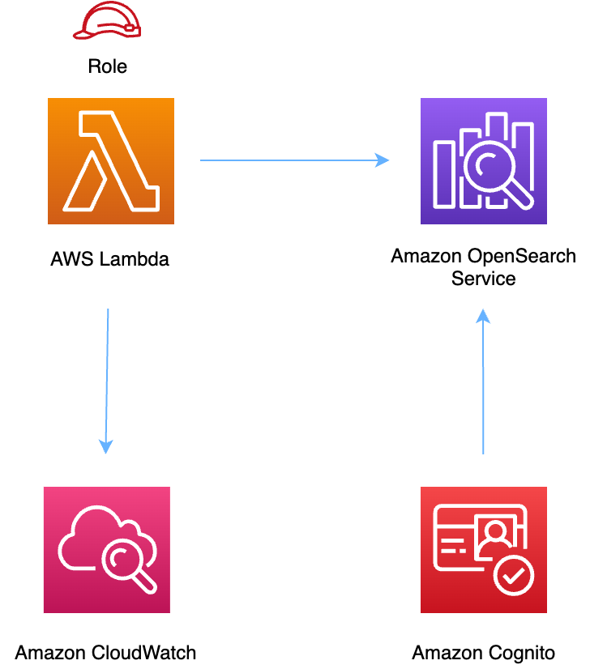

//!!NODE_ROOT <section>
//== aws-lambda-opensearch module

[.topic]
= aws-lambda-opensearch
:info_doctype: section
:info_title: aws-lambda-opensearch

image::https://img.shields.io/badge/stability-Experimental-important.svg?style=for-the-badge[Stability:Experimental]

____
All classes are under active development and subject to non-backward
compatible changes or removal in any future version. These are not
subject to the https://semver.org/[Semantic Versioning] model. This
means that while you may use them, you may need to update your source
code when upgrading to a newer version of this package.
____

[width="100%",cols="<50%,<50%",options="header",]
|===
|*Reference Documentation*:
|https://docs.aws.amazon.com/solutions/latest/constructs/
|===

[width="100%",cols="<46%,54%",options="header",]
|===
|*Language* |*Package*
|image:https://docs.aws.amazon.com/cdk/api/latest/img/python32.png[Python
Logo] Python
|`aws_solutions_constructs.aws_lambda_opensearch`

|image:https://docs.aws.amazon.com/cdk/api/latest/img/typescript32.png[Typescript
Logo] Typescript |`@aws-solutions-constructs/aws-lambda-opensearch`

|image:https://docs.aws.amazon.com/cdk/api/latest/img/java32.png[Java
Logo] Java |`software.amazon.awsconstructs.services.lambdaopensearch`
|===

== Overview

This AWS Solutions Construct implements an AWS Lambda function and
Amazon OpenSearch Service with the least privileged permissions.

Here is a minimal deployable pattern definition:

====
[role="tablist"]
Typescript::
+
[source,typescript]
----
import { Construct } from 'constructs';
import { Stack, StackProps, Aws } from 'aws-cdk-lib';
import { LambdaToOpenSearch } from '@aws-solutions-constructs/aws-lambda-opensearch';
import * as lambda from "aws-cdk-lib/aws-lambda";

const lambdaProps: lambda.FunctionProps = {
  code: lambda.Code.fromAsset(`lambda`),
  runtime: lambda.Runtime.NODEJS_20_X,
  handler: 'index.handler'
};

new LambdaToOpenSearch(this, 'sample', {
  lambdaFunctionProps: lambdaProps,
  openSearchDomainName: 'testdomain',
  // NOTE: Ensure the Cognito domain name is globally unique
  cognitoDomainName: 'globallyuniquedomain' + Aws.ACCOUNT_ID
});
----

Python::
+
[source,python]
----
from aws_solutions_constructs.aws_lambda_opensearch import LambdaToOpenSearch
from aws_cdk import (
    aws_lambda as _lambda,
    Aws,
    Stack
)
from constructs import Construct

lambda_props = _lambda.FunctionProps(
    code=_lambda.Code.from_asset('lambda'),
    runtime=_lambda.Runtime.PYTHON_3_11,
    handler='index.handler'
)

LambdaToOpenSearch(self, 'sample',
                            lambda_function_props=lambda_props,
                            open_search_domain_name='testdomain',
                            # NOTE: Ensure the Cognito domain name is globally unique
                            cognito_domain_name='globallyuniquedomain' + Aws.ACCOUNT_ID
                            )
----

Java::
+
[source,java]
----
import software.constructs.Construct;

import software.amazon.awscdk.Stack;
import software.amazon.awscdk.StackProps;
import software.amazon.awscdk.Aws;
import software.amazon.awscdk.services.lambda.*;
import software.amazon.awscdk.services.lambda.Runtime;
import software.amazon.awsconstructs.services.lambdaopensearch.*;

new LambdaToOpenSearch(this, "sample",
        new LambdaToOpenSearchProps.Builder()
                .lambdaFunctionProps(new FunctionProps.Builder()
                        .runtime(Runtime.NODEJS_20_X)
                        .code(Code.fromAsset("lambda"))
                        .handler("index.handler")
                        .build())
                .openSearchDomainName("testdomain")
                // NOTE: Ensure the Cognito domain name is globally unique
                .cognitoDomainName("globallyuniquedomain" + Aws.ACCOUNT_ID)
                .build());
----
====

== Pattern Construct Props

[width="100%",cols="<30%,<35%,35%",options="header",]
|===
|*Name* |*Type* |*Description*
|existingLambdaObj?
|https://docs.aws.amazon.com/cdk/api/v2/docs/aws-cdk-lib.aws_lambda.Function.html[`lambda.Function`]
|Existing instance of Lambda Function object, providing both this and
`lambdaFunctionProps` will cause an error.

|lambdaFunctionProps?
|https://docs.aws.amazon.com/cdk/api/v2/docs/aws-cdk-lib.aws_lambda.FunctionProps.html[`lambda.FunctionProps`]
|User provided props to override the default props for the Lambda
function.

|openSearchDomainProps?
|https://docs.aws.amazon.com/cdk/api/v2/docs/aws-cdk-lib.aws_opensearchservice.CfnDomainProps.html[`opensearchservice.CfnDomainProps`]
|Optional user provided props to override the default props for the
OpenSearch Service.

|openSearchDomainName |`string` |Domain name for the OpenSearch Service.

|cognitoDomainName? |`string` |Optional Amazon Cognito domain name. If
omitted the Amazon Cognito domain will default to the OpenSearch Service
domain name.

|createCloudWatchAlarms? |`boolean` |Whether to create the recommended
CloudWatch alarms.

|domainEndpointEnvironmentVariableName? |`string` |Optional name for the
OpenSearch domain endpoint environment variable set for the Lambda
function. Default is `DOMAIN_ENDPOINT`.

|existingVpc?
|https://docs.aws.amazon.com/cdk/api/v2/docs/aws-cdk-lib.aws_ec2.IVpc.html[`ec2.IVpc`]
|An optional, existing VPC into which this pattern should be deployed.
When deployed in a VPC, the Lambda function will use ENIs in the VPC to
access network resources. If an existing VPC is provided, the
`deployVpc` property cannot be `true`. This uses `ec2.IVpc` to allow
clients to supply VPCs that exist outside the stack using the
https://docs.aws.amazon.com/cdk/api/v2/docs/aws-cdk-lib.aws_ec2.Vpc.html#static-fromwbrlookupscope-id-options[`ec2.Vpc.fromLookup()`]
method.

|vpcProps?
|https://docs.aws.amazon.com/cdk/api/v2/docs/aws-cdk-lib.aws_ec2.VpcProps.html[`ec2.VpcProps`]
|Optional user provided properties to override the default properties
for the new VPC. `enableDnsHostnames`, `enableDnsSupport`, `natGateways`
and `subnetConfiguration` are set by the pattern, so any values for
those properties supplied here will be overridden. If `deployVpc` is not
`true` then this property will be ignored.

|deployVpc? |`boolean` |Whether to create a new VPC based on `vpcProps`
into which to deploy this pattern. Setting this to true will deploy the
minimal, most private VPC to run the pattern:
|===

== Pattern Properties

[width="100%",cols="<30%,<35%,35%",options="header",]
|===
|*Name* |*Type* |*Description*
|lambdaFunction
|https://docs.aws.amazon.com/cdk/api/v2/docs/aws-cdk-lib.aws_lambda.Function.html[`lambda.Function`]
|Returns an instance of `lambda.Function` created by the construct

|userPool
|https://docs.aws.amazon.com/cdk/api/v2/docs/aws-cdk-lib.aws_cognito.UserPool.html[`cognito.UserPool`]
|Returns an instance of `cognito.UserPool` created by the construct

|userPoolClient
|https://docs.aws.amazon.com/cdk/api/v2/docs/aws-cdk-lib.aws_cognito.UserPoolClient.html[`cognito.UserPoolClient`]
|Returns an instance of `cognito.UserPoolClient` created by the
construct

|identityPool
|https://docs.aws.amazon.com/cdk/api/v2/docs/aws-cdk-lib.aws_cognito.CfnIdentityPool.html[`cognito.CfnIdentityPool`]
|Returns an instance of `cognito.CfnIdentityPool` created by the
construct

|openSearchDomain
|https://docs.aws.amazon.com/cdk/api/v2/docs/aws-cdk-lib.aws_opensearchservice.CfnDomain.html[`opensearchservice.CfnDomain`]
|Returns an instance of `opensearch.CfnDomain` created by the construct

|openSearchRole
|https://docs.aws.amazon.com/cdk/api/v2/docs/aws-cdk-lib.aws_iam.Role.html[`iam.Role`]
|Returns an instance of `iam.Role` created by the construct for
`opensearch.CfnDomain`

|cloudWatchAlarms?
|https://docs.aws.amazon.com/cdk/api/v2/docs/aws-cdk-lib.aws_cloudwatch.Alarm.html[`cloudwatch.Alarm[\]`]
|Returns a list of `cloudwatch.Alarm` created by the construct

|vpc?
|https://docs.aws.amazon.com/cdk/api/v2/docs/aws-cdk-lib.aws_ec2.IVpc.html[`ec2.IVpc`]
|Returns an interface on the VPC used by the pattern (if any). This may
be a VPC created by the pattern or the VPC supplied to the pattern
constructor.
|===

== Lambda Function

This pattern requires a lambda function that can post data into the
OpenSearch. A sample function is provided
https://github.com/awslabs/aws-solutions-constructs/blob/master/source/patterns/%40aws-solutions-constructs/aws-lambda-opensearch/test/lambda/index.js[here].

== Default settings

Out of the box implementation of the Construct without any overrides
will set the following defaults:

=== AWS Lambda Function

* Configure limited privilege access IAM role for Lambda function
* Enable reusing connections with Keep-Alive for Node.js Lambda function
* Enable X-Ray Tracing
* Set Environment Variables
** (default) DOMAIN_ENDPOINT
** AWS_NODEJS_CONNECTION_REUSE_ENABLED

=== Amazon Cognito

* Set password policy for User Pools
* Enforce the advanced security mode for User Pools

=== Amazon OpenSearch Service

* Deploy best practices CloudWatch Alarms for the OpenSearch Service
domain
* Secure the OpenSearch Service dashboard access with Cognito User Pools
* Enable server-side encryption for OpenSearch Service domain using AWS
managed KMS Key
* Enable node-to-node encryption for the OpenSearch Service domain
* Configure the cluster for the OpenSearch Service domain

== Architecture

== Github

Go to the https://github.com/awslabs/aws-solutions-constructs/tree/main/source/patterns/%40aws-solutions-constructs/aws-lambda-opensearch[Github repo] for this pattern to view the code, read/create issues and pull requests and more.

'''''

