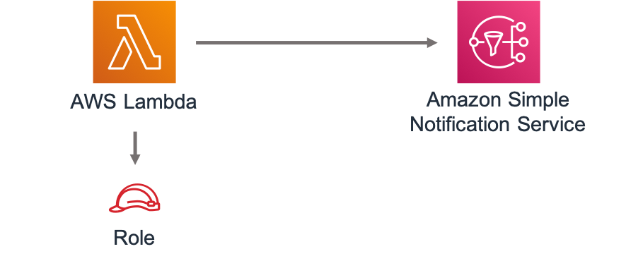

//!!NODE_ROOT <section>
//== aws-lambda-sns module

[.topic]
= aws-lambda-sns
:info_doctype: section
:info_title: aws-lambda-sns

image::https://img.shields.io/badge/cfn--resources-stable-success.svg?style=for-the-badge[Stability:Stable]

[width="100%",cols="<50%,<50%",options="header",]
|===
|*Reference Documentation*:
|https://docs.aws.amazon.com/solutions/latest/constructs/
|===

[width="100%",cols="<46%,54%",options="header",]
|===
|*Language* |*Package*
|image:https://docs.aws.amazon.com/cdk/api/latest/img/python32.png[Python
Logo] Python |`aws_solutions_constructs.aws_lambda_sns`

|image:https://docs.aws.amazon.com/cdk/api/latest/img/typescript32.png[Typescript
Logo] Typescript |`@aws-solutions-constructs/aws-lambda-sns`

|image:https://docs.aws.amazon.com/cdk/api/latest/img/java32.png[Java
Logo] Java |`software.amazon.awsconstructs.services.lambdasns`
|===

== Overview

This AWS Solutions Construct implements an AWS Lambda function connected
to an Amazon SNS topic.

Here is a minimal deployable pattern definition:

====
[role="tablist"]
Typescript::
+
[source,typescript]
----
import { Construct } from 'constructs';
import { Stack, StackProps } from 'aws-cdk-lib';
import { LambdaToSns, LambdaToSnsProps } from "@aws-solutions-constructs/aws-lambda-sns";
import * as lambda from 'aws-cdk-lib/aws-lambda';

new LambdaToSns(this, 'test-lambda-sns', {
  lambdaFunctionProps: {
    runtime: lambda.Runtime.NODEJS_20_X,
    handler: 'index.handler',
    code: lambda.Code.fromAsset(`lambda`)
  }
});
----

Python::
+
[source,python]
----
from aws_solutions_constructs.aws_lambda_sns import LambdaToSns
from aws_cdk import (
    aws_lambda as _lambda,
    Stack
)
from constructs import Construct

LambdaToSns(
    self, 'test-lambda-sns-stack',
    lambda_function_props=_lambda.FunctionProps(
        code=_lambda.Code.from_asset('lambda'),
        runtime=_lambda.Runtime.PYTHON_3_11,
        handler='index.handler'
    )
)
----

Java::
+
[source,java]
----
import software.constructs.Construct;

import software.amazon.awscdk.Stack;
import software.amazon.awscdk.StackProps;
import software.amazon.awscdk.services.lambda.*;
import software.amazon.awscdk.services.lambda.Runtime;
import software.amazon.awsconstructs.services.lambdasns.*;

new LambdaToSns(this, "test-lambda-sns-stack", new LambdaToSnsProps.Builder()
        .lambdaFunctionProps(new FunctionProps.Builder()
                .runtime(Runtime.NODEJS_20_X)
                .code(Code.fromAsset("lambda"))
                .handler("index.handler")
                .build())
        .build());
----
====

== Pattern Construct Props

[width="100%",cols="<30%,<35%,35%",options="header",]
|===
|*Name* |*Type* |*Description*
|existingLambdaObj?
|https://docs.aws.amazon.com/cdk/api/v2/docs/aws-cdk-lib.aws_lambda.Function.html[`lambda.Function`]
|Existing instance of Lambda Function object, providing both this and
`lambdaFunctionProps` will cause an error.

|lambdaFunctionProps?
|https://docs.aws.amazon.com/cdk/api/v2/docs/aws-cdk-lib.aws_lambda.FunctionProps.html[`lambda.FunctionProps`]
|User provided props to override the default props for the Lambda
function.

|existingTopicObj?
|https://docs.aws.amazon.com/cdk/api/v2/docs/aws-cdk-lib.aws_lambda.Function.html[`sns.Topic`]
|Existing instance of SNS Topic object, providing both this and
`topicProps` will cause an error.

|topicProps?
|https://docs.aws.amazon.com/cdk/api/v2/docs/aws-cdk-lib.aws_sns.TopicProps.html[`sns.TopicProps`]
|Optional user provided properties to override the default properties
for the SNS topic.

|existingVpc?
|https://docs.aws.amazon.com/cdk/api/v2/docs/aws-cdk-lib.aws_ec2.IVpc.html[`ec2.IVpc`]
|An optional, existing VPC into which this pattern should be deployed.
When deployed in a VPC, the Lambda function will use ENIs in the VPC to
access network resources and an Interface Endpoint will be created in
the VPC for Amazon SNS. If an existing VPC is provided, the `deployVpc`
property cannot be `true`. This uses `ec2.IVpc` to allow clients to
supply VPCs that exist outside the stack using the
https://docs.aws.amazon.com/cdk/api/v2/docs/aws-cdk-lib.aws_ec2.Vpc.html#static-fromwbrlookupscope-id-options[`ec2.Vpc.fromLookup()`]
method.

|vpcProps?
|https://docs.aws.amazon.com/cdk/api/v2/docs/aws-cdk-lib.aws_ec2.VpcProps.html[`ec2.VpcProps`]
|Optional user-provided properties to override the default properties
for the new VPC. `enableDnsHostnames`, `enableDnsSupport`, `natGateways`
and `subnetConfiguration` are set by the pattern, so any values for
those properties supplied here will be overridden. If `deployVpc` is not
`true` then this property will be ignored.

|deployVpc? |`boolean` |Whether to create a new VPC based on `vpcProps`
into which to deploy this pattern. Setting this to true will deploy the
minimal, most private VPC to run the pattern:

|topicArnEnvironmentVariableName? |`string` |Optional Name for the
Lambda function environment variable set to the arn of the topic.
Default: SNS_TOPIC_ARN

|topicNameEnvironmentVariableName? |`string` |Optional Name for the
Lambda function environment variable set to the name of the topic.
Default: SNS_TOPIC_NAME

|enableEncryptionWithCustomerManagedKey? |`boolean` |If no key is
provided, this flag determines whether the SNS Topic is encrypted with a
new CMK or an AWS managed key. This flag is ignored if any of the
following are defined: topicProps.masterKey, encryptionKey or
encryptionKeyProps.

|encryptionKey?
|https://docs.aws.amazon.com/cdk/api/v2/docs/aws-cdk-lib.aws_kms.Key.html[`kms.Key`]
|An optional, imported encryption key to encrypt the SNS Topic with.

|encryptionKeyProps?
|https://docs.aws.amazon.com/cdk/api/v2/docs/aws-cdk-lib.aws_kms.Key.html#construct-props[`kms.KeyProps`]
|Optional user provided properties to override the default properties
for the KMS encryption key used to encrypt the SNS Topic with.
|===

== Pattern Properties

[width="100%",cols="<30%,<35%,35%",options="header",]
|===
|*Name* |*Type* |*Description*
|lambdaFunction
|https://docs.aws.amazon.com/cdk/api/v2/docs/aws-cdk-lib.aws_lambda.Function.html[`lambda.Function`]
|Returns an instance of the Lambda function created by the pattern.

|snsTopic
|https://docs.aws.amazon.com/cdk/api/v2/docs/aws-cdk-lib.aws_sns.Topic.html[`sns.Topic`]
|Returns an instance of the SNS topic created by the pattern.

|vpc?
|https://docs.aws.amazon.com/cdk/api/v2/docs/aws-cdk-lib.aws_ec2.IVpc.html[`ec2.IVpc`]
|Returns an interface on the VPC used by the pattern (if any). This may
be a VPC created by the pattern or the VPC supplied to the pattern
constructor.
|===

== Default settings

Out of the box implementation of the Construct without any override will
set the following defaults:

==== AWS Lambda Function

* Configure limited privilege access IAM role for Lambda function to
access the Firehose Delivery Stream
* Enable reusing connections with Keep-Alive for NodeJs Lambda function
* Enable X-Ray Tracing
* Set Environment Variables
** (default) SNS_TOPIC_NAME
** (default) SNS_TOPIC_ARN
** AWS_NODEJS_CONNECTION_REUSE_ENABLED (for Node 10.x
and higher functions)

==== Amazon SNS Topic

* Configure least privilege access permissions for SNS Topic
* Enable server-side encryption forSNS Topic using AWS managed KMS Key
* Enforce encryption of data in transit

== Architecture

[[github,topic.title]]
== GitHub

[cols=1,1, options=header]
|===
| 
To view the code for this pattern, create/view issues and pull requests, and more:

|

image::images/GitHub-Mark-32px.png[The github logo.,scaledwidth=100%]

|https://github.com/awslabs/aws-solutions-constructs/tree/master/source/patterns/%40aws-solutions-constructs/aws-aws-lambda-sns[-solutions-constructsaws-lambda-sns]
|===

'''''

© Copyright Amazon.com, Inc. or its affiliates. All Rights Reserved.
