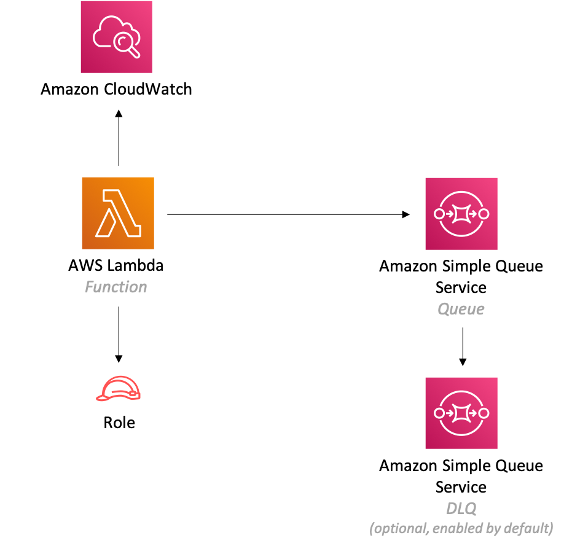

//!!NODE_ROOT <section>
//== aws-lambda-sqs module

[.topic]
= aws-lambda-sqs
:info_doctype: section
:info_title: aws-lambda-sqs

image:https://img.shields.io/badge/cfn--resources-stable-success.svg?style=for-the-badge[Stability:Stable]

[width="100%",cols="<50%,<50%",options="header",]
|===
|*Reference Documentation*:
|https://docs.aws.amazon.com/solutions/latest/constructs/
|===

[width="100%",cols="<46%,54%",options="header",]
|===
|*Language* |*Package*
|image:https://docs.aws.amazon.com/images/solutions/latest/constructs/images/python32.png[Python
Logo] Python |`aws_solutions_constructs.aws_lambda_sqs`

|image:https://docs.aws.amazon.com/images/solutions/latest/constructs/images/typescript32.png[Typescript
Logo] Typescript |`@aws-solutions-constructs/aws-lambda-sqs`

|image:https://docs.aws.amazon.com/images/solutions/latest/constructs/images/java32.png[Java
Logo] Java |`software.amazon.awsconstructs.services.lambdasqs`
|===

== Overview

This AWS Solutions Construct implements an AWS Lambda function connected
to an Amazon SQS queue.

Here is a minimal deployable pattern definition:

====
[role="tablist"]
Typescript::
+
[source,typescript]
----
import { Construct } from 'constructs';
import { Stack, StackProps } from 'aws-cdk-lib';
import { LambdaToSqs, LambdaToSqsProps } from "@aws-solutions-constructs/aws-lambda-sqs";
import * as lambda from 'aws-cdk-lib/aws-lambda';

new LambdaToSqs(this, 'LambdaToSqsPattern', {
  lambdaFunctionProps: {
    runtime: lambda.Runtime.NODEJS_22_X,
    handler: 'index.handler',
    code: lambda.Code.fromAsset(`lambda`)
  }
});
----

Python::
+
[source,python]
----
from aws_solutions_constructs.aws_lambda_sqs import LambdaToSqs
from aws_cdk import (
    aws_lambda as _lambda,
    Stack
)
from constructs import Construct

LambdaToSqs(
    self, 'test-lambda-sqs-stack',
    lambda_function_props=_lambda.FunctionProps(
        code=_lambda.Code.from_asset('lambda'),
        runtime=_lambda.Runtime.PYTHON_3_14,
        handler='index.handler'
    )
)
----

Java::
+
[source,java]
----
import software.constructs.Construct;

import software.amazon.awscdk.Stack;
import software.amazon.awscdk.StackProps;
import software.amazon.awscdk.services.lambda.*;
import software.amazon.awscdk.services.lambda.Runtime;
import software.amazon.awsconstructs.services.lambdasqs.*;

new LambdaToSqs(this, "test-lambda-sqs-stack", new LambdaToSqsProps.Builder()
        .lambdaFunctionProps(new FunctionProps.Builder()
                .runtime(Runtime.NODEJS_22_X)
                .code(Code.fromAsset("lambda"))
                .handler("index.handler")
                .build())
        .build());
----
====

== Pattern Construct Props

[width="100%",cols="<30%,<35%,35%",options="header",]
|===
|*Name* |*Type* |*Description*
|existingLambdaObj?
|https://docs.aws.amazon.com/cdk/api/v2/docs/aws-cdk-lib.aws_lambda.Function.html[`lambda.Function`]
|Optional - instance of an existing Lambda Function object, providing both this and `lambdaFunctionProps` will cause an error.

|lambdaFunctionProps?
|https://docs.aws.amazon.com/cdk/api/v2/docs/aws-cdk-lib.aws_lambda.FunctionProps.html[`lambda.FunctionProps`]
|Optional - user provided props to override the default props for the Lambda function. Providing both this and `existingLambdaObj` causes an error.

|existingQueueObj?
|https://docs.aws.amazon.com/cdk/api/v2/docs/aws-cdk-lib.aws_sqs.Queue.html[`sqs.Queue`]
|An optional, existing SQS queue to be used instead of the default
queue. Providing both this and `queueProps` will cause an error.

|queueProps?
|https://docs.aws.amazon.com/cdk/api/v2/docs/aws-cdk-lib.aws_sqs.QueueProps.html[`sqs.QueueProps`]
|Optional - user provided properties to override the default properties for the SQS queue. Providing both this and `existingQueueObj` will cause an error.

|enableQueuePurging? |`boolean` |Whether to grant additional permissions
to the Lambda function enabling it to purge the SQS queue. Defaults to
`false`.

|deployDeadLetterQueue? |`boolean` |Whether to create a secondary queue
to be used as a dead letter queue. Defaults to `true`.

|deadLetterQueueProps?
|https://docs.aws.amazon.com/cdk/api/v2/docs/aws-cdk-lib.aws_sqs.QueueProps.html[`sqs.QueueProps`]
|Optional user-provided props to override the default props for the dead
letter queue. Only used if the `deployDeadLetterQueue` property is set
to true.

|maxReceiveCount? |`number` |The number of times a message can be
unsuccessfully dequeued before being moved to the dead letter queue.
Defaults to `15`.

|existingVpc?
|https://docs.aws.amazon.com/cdk/api/v2/docs/aws-cdk-lib.aws_ec2.IVpc.html[`ec2.IVpc`]
|An optional, existing VPC into which this pattern should be deployed.
When deployed in a VPC, the Lambda function will use ENIs in the VPC to
access network resources and an Interface Endpoint will be created in
the VPC for Amazon SQS. If an existing VPC is provided, the `deployVpc`
property cannot be `true`. This uses `ec2.IVpc` to allow clients to
supply VPCs that exist outside the stack using the
https://docs.aws.amazon.com/cdk/api/v2/docs/aws-cdk-lib.aws_ec2.Vpc.html#static-fromwbrlookupscope-id-options[`ec2.Vpc.fromLookup()`]
method.

|vpcProps?
|https://docs.aws.amazon.com/cdk/api/v2/docs/aws-cdk-lib.aws_ec2.VpcProps.html[`ec2.VpcProps`]
|Optional user-provided properties to override the default properties
for the new VPC. `enableDnsHostnames`, `enableDnsSupport`, `natGateways`
and `subnetConfiguration` are set by the pattern, so any values for
those properties supplied here will be overridden. If `deployVpc` is not
`true` then this property will be ignored.

|deployVpc? |`boolean` |Whether to create a new VPC based on `vpcProps`
into which to deploy this pattern. Setting this to true will deploy the
minimal, most private VPC to run the pattern:

|queueEnvironmentVariableName? |`string` |Optional Name for the Lambda
function environment variable set to the URL of the queue. Default:
SQS_QUEUE_URL

|enableEncryptionWithCustomerManagedKey? |`boolean` |If no key is
provided, this flag determines whether the queue is encrypted with a new
CMK or an AWS managed key. This flag is ignored if any of the following
are defined: queueProps.encryptionMasterKey, encryptionKey or
encryptionKeyProps.

|encryptionKey?
|https://docs.aws.amazon.com/cdk/api/v2/docs/aws-cdk-lib.aws_kms.Key.html[`kms.Key`]
|An optional, imported encryption key to encrypt the SQS Queue with.

|encryptionKeyProps?
|https://docs.aws.amazon.com/cdk/api/v2/docs/aws-cdk-lib.aws_kms.Key.html#construct-props[`kms.KeyProps`]
|Optional user provided properties to override the default properties
for the KMS encryption key used to encrypt the SQS queue with.
|===

== Pattern Properties

[width="100%",cols="<30%,<35%,35%",options="header",]
|===
|*Name* |*Type* |*Description*
|lambdaFunction
|https://docs.aws.amazon.com/cdk/api/v2/docs/aws-cdk-lib.aws_lambda.Function.html[`lambda.Function`]
|Returns an instance of the Lambda function created by the pattern.

|sqsQueue
|https://docs.aws.amazon.com/cdk/api/v2/docs/aws-cdk-lib.aws_sqs.Queue.html[`sqs.Queue`]
|Returns an instance of the SQS queue created by the pattern.

|deadLetterQueue?
|https://docs.aws.amazon.com/cdk/api/v2/docs/aws-cdk-lib.aws_sqs.Queue.html[`sqs.Queue`]
|Returns an instance of the dead letter queue created by the pattern, if
one is deployed.

|vpc?
|https://docs.aws.amazon.com/cdk/api/v2/docs/aws-cdk-lib.aws_ec2.IVpc.html[`ec2.IVpc`]
|Returns an interface on the VPC used by the pattern (if any). This may
be a VPC created by the pattern or the VPC supplied to the pattern
constructor.
|===

== Default settings

Out of the box implementation of the Construct without any override will
set the following defaults:

=== AWS Lambda Function

* Configure limited privilege access IAM role for Lambda function.
* Enable reusing connections with Keep-Alive for NodeJs Lambda function.
* Allow the function to send messages only to the queue (purging can be
enabled using the `enableQueuePurge` property).
* Enable X-Ray Tracing
* Set Environment Variables
** SQS_QUEUE_URL
** AWS_NODEJS_CONNECTION_REUSE_ENABLED (for Node 10.x
and higher functions)

=== Amazon SQS Queue

* Deploy SQS dead-letter queue for the source SQS Queue.
* Enable server-side encryption for source SQS Queue using AWS Managed
KMS Key.
* Enforce encryption of data in transit

== Architecture

== Example Lambda Function Implementation

While Solutions Constructs does not publish code for the Lambda function interact with SQS, here many examples: https://github.com/awsdocs/aws-doc-sdk-examples/tree/main/javascriptv3/example_code/sqs/actions['examples']. (these examples are in JavaScript, but examples in other languages can also be found at this site)

== Github

Go to the https://github.com/awslabs/aws-solutions-constructs/tree/main/source/patterns/%40aws-solutions-constructs/aws-lambda-sqs[Github repo] for this pattern to view the code, read/create issues and pull requests and more.

'''''

