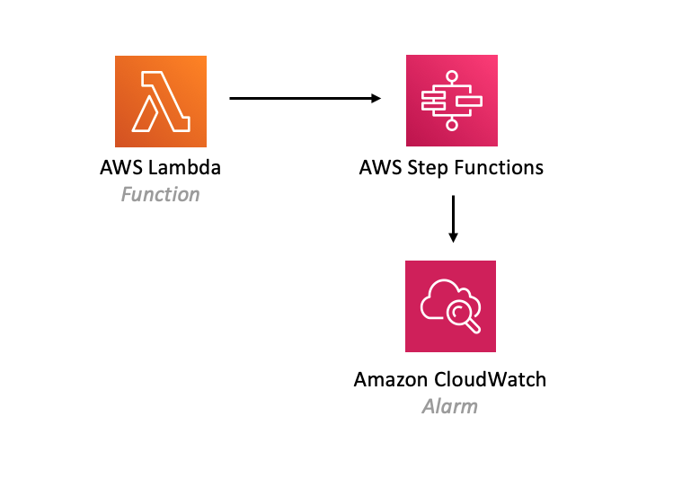

//!!NODE_ROOT <section>
//== aws-lambda-stepfunctions module

[.topic]
= aws-lambda-stepfunctions
:info_doctype: section
:info_title: aws-lambda-stepfunctions

image:https://img.shields.io/badge/cfn--resources-stable-success.svg?style=for-the-badge[Stability:Stable]

[width="100%",cols="<50%,<50%",options="header",]
|===
|*Reference Documentation*:
|https://docs.aws.amazon.com/solutions/latest/constructs/
|===

[width="100%",cols="<46%,54%",options="header",]
|===
|*Language* |*Package*
|image:https://docs.aws.amazon.com/images/solutions/latest/constructs/images/python32.png[Python
Logo] Python
|`aws_solutions_constructs.aws_lambda_stepfunctions`

|image:https://docs.aws.amazon.com/images/solutions/latest/constructs/images/typescript32.png[Typescript
Logo] Typescript |`@aws-solutions-constructs/aws-lambda-stepfunctions`

|image:https://docs.aws.amazon.com/images/solutions/latest/constructs/images/java32.png[Java
Logo] Java |`software.amazon.awsconstructs.services.lambdastepfunctions`
|===

== Overview

This AWS Solutions Construct implements an AWS Lambda function connected
to an AWS Step Functions.

Here is a minimal deployable pattern definition:

====
[role="tablist"]
Typescript::
+
[source,typescript]
----
import { Construct } from 'constructs';
import { Stack, StackProps } from 'aws-cdk-lib';
import { LambdaToStepfunctions } from '@aws-solutions-constructs/aws-lambda-stepfunctions';
import * as stepfunctions from 'aws-cdk-lib/aws-stepfunctions';
import * as lambda from 'aws-cdk-lib/aws-lambda';

const startState = new stepfunctions.Pass(this, 'StartState');

new LambdaToStepfunctions(this, 'LambdaToStepfunctionsPattern', {
  lambdaFunctionProps: {
    runtime: lambda.Runtime.NODEJS_22_X,
    handler: 'index.handler',
    code: lambda.Code.fromAsset(`lambda`)
  },
  stateMachineProps: {
    definition: startState
  }
});
----

Python::
+
[source,python]
----
from aws_solutions_constructs.aws_lambda_stepfunctions import LambdaToStepfunctions
from aws_cdk import (
    aws_lambda as _lambda,
    aws_stepfunctions as stepfunctions,
    Stack
)
from constructs import Construct

start_state = stepfunctions.Pass(self, 'start_state')

LambdaToStepfunctions(
    self, 'test-lambda-stepfunctions-stack',
    lambda_function_props=_lambda.FunctionProps(
        code=_lambda.Code.from_asset('lambda'),
        runtime=_lambda.Runtime.PYTHON_3_14,
        handler='index.handler'
    ),
    state_machine_props=stepfunctions.StateMachineProps(
        definition=start_state)
)
----

Java::
+
[source,java]
----
import software.constructs.Construct;

import software.amazon.awscdk.Stack;
import software.amazon.awscdk.StackProps;
import software.amazon.awscdk.services.lambda.*;
import software.amazon.awscdk.services.lambda.Runtime;
import software.amazon.awscdk.services.stepfunctions.*;
import software.amazon.awsconstructs.services.lambdastepfunctions.*;

final Pass startState = new Pass(this, "StartState");

new LambdaToStepfunctions(this, "test-lambda-stepfunctions-stack",
        new LambdaToStepfunctionsProps.Builder()
                .lambdaFunctionProps(new FunctionProps.Builder()
                        .runtime(Runtime.NODEJS_22_X)
                        .code(Code.fromAsset("lambda"))
                        .handler("index.handler")
                        .build())
                .stateMachineProps(new StateMachineProps.Builder()
                        .definition(startState)
                        .build())
                .build());
----
====

== Pattern Construct Props

[width="100%",cols="<30%,<35%,35%",options="header",]
|===
|*Name* |*Type* |*Description*
|existingLambdaObj?
|https://docs.aws.amazon.com/cdk/api/v2/docs/aws-cdk-lib.aws_lambda.Function.html[`lambda.Function`]
|Optional - instance of an existing Lambda Function object, providing both this and
`lambdaFunctionProps` will cause an error.

|lambdaFunctionProps?
|https://docs.aws.amazon.com/cdk/api/v2/docs/aws-cdk-lib.aws_lambda.FunctionProps.html[`lambda.FunctionProps`]
|Optional - user provided props to override the default props for the Lambda function. Providing both this and `existingLambdaObj` causes an error.

|stateMachineProps
|https://docs.aws.amazon.com/cdk/api/v2/docs/aws-cdk-lib.aws_stepfunctions.StateMachineProps.html[`sfn.StateMachineProps`]
|User provided props for the sfn.StateMachine. This or existingStateMachine is required. If you provide
a value for logs.destination, it must be an ILogGroup even though the prop type is ILogGroupRef. The CDK
change to ILogGroupRef in v2.235.0 is incompatible with our interface without introducing breaking changes,
so we still require an ILogGroup (as this implements ILogGroupRef, you can just assign it to logs.destination)

|createCloudWatchAlarms |`boolean` |Whether to create recommended
CloudWatch alarms

|logGroupProps?
|https://docs.aws.amazon.com/cdk/api/v2/docs/aws-cdk-lib.aws_logs.LogGroupProps.html[`logs.LogGroupProps`]
|User provided props to override the default props for for the
CloudWatchLogs LogGroup.

|stateMachineEnvironmentVariableName? |`string` |Optional Name for the
Lambda function environment variable set to the ARN of the state
machine. Default: STATE_MACHINE_ARN

|existingVpc?
|https://docs.aws.amazon.com/cdk/api/v2/docs/aws-cdk-lib.aws_ec2.IVpc.html[`ec2.IVpc`]
|An optional, existing VPC into which this pattern should be deployed.
When deployed in a VPC, the Lambda function will use ENIs in the VPC to
access network resources and an Interface Endpoint will be created in
the VPC for Amazon Step Functions. If an existing VPC is provided, the
`deployVpc` property cannot be `true`. This uses `ec2.IVpc` to allow
clients to supply VPCs that exist outside the stack using the
https://docs.aws.amazon.com/cdk/api/v2/docs/aws-cdk-lib.aws_ec2.Vpc.html#static-fromwbrlookupscope-id-options[`ec2.Vpc.fromLookup()`]
method.

|vpcProps?
|https://docs.aws.amazon.com/cdk/api/v2/docs/aws-cdk-lib.aws_ec2.VpcProps.html[`ec2.VpcProps`]
|Optional user-provided properties to override the default properties
for the new VPC. `enableDnsHostnames`, `enableDnsSupport`, `natGateways`
and `subnetConfiguration` are set by the pattern, so any values for
those properties supplied here will be overridden. If `deployVpc` is not
`true` then this property will be ignored.

|deployVpc? |`boolean` |Whether to create a new VPC based on `vpcProps`
into which to deploy this pattern. Setting this to true will deploy the
minimal, most private VPC to run the pattern:
|===

== Pattern Properties

[width="100%",cols="<30%,<35%,35%",options="header",]
|===
|*Name* |*Type* |*Description*
|lambdaFunction
|https://docs.aws.amazon.com/cdk/api/v2/docs/aws-cdk-lib.aws_lambda.Function.html[`lambda.Function`]
|Returns an instance of the Lambda function created by the pattern.

|stateMachine
|https://docs.aws.amazon.com/cdk/api/v2/docs/aws-cdk-lib.aws_stepfunctions.StateMachine.html[`sfn.StateMachine`]
|Returns an instance of StateMachine created by the construct.

|stateMachineLogGroup
|https://docs.aws.amazon.com/cdk/api/v2/docs/aws-cdk-lib.aws_logs.ILogGroup.html[`logs.ILogGroup`]
|Returns an instance of the ILogGroup created by the construct for
StateMachine

|cloudwatchAlarms?
|https://docs.aws.amazon.com/cdk/api/v2/docs/aws-cdk-lib.aws_cloudwatch.Alarm.html[`cloudwatch.Alarm[\]`]
|Returns a list of alarms created by the construct.

|vpc?
|https://docs.aws.amazon.com/cdk/api/v2/docs/aws-cdk-lib.aws_ec2.IVpc.html[`ec2.IVpc`]
|Returns an interface on the VPC used by the pattern (if any). This may
be a VPC created by the pattern or the VPC supplied to the pattern
constructor.
|===

== Default settings

Out of the box implementation of the Construct without any override will
set the following defaults:

=== AWS Lambda Function

* Configure limited privilege access IAM role for Lambda function
* Enable reusing connections with Keep-Alive for NodeJs Lambda function
* Enable X-Ray Tracing
* Set Environment Variables
** (default) STATE_MACHINE_ARN
** AWS_NODEJS_CONNECTION_REUSE_ENABLED (for Node 10.x
and higher functions)

=== AWS Step Functions

* Enable CloudWatch logging for API Gateway
* Deploy best practices CloudWatch Alarms for the Step Functions

== Architecture

== Example Lambda Function Implementation

While Solutions Constructs does not publish code for the Lambda function to work with Step Functions, here are several examples: https://github.com/awsdocs/aws-doc-sdk-examples/tree/main/python/example_code/stepfunctions[examples]. (these examples are in Python, but examples in other languages can also be found at this site)

== Github

Go to the https://github.com/awslabs/aws-solutions-constructs/tree/main/source/patterns/%40aws-solutions-constructs/aws-lambda-stepfunctions[Github repo] for this pattern to view the code, read/create issues and pull requests and more.

'''''

