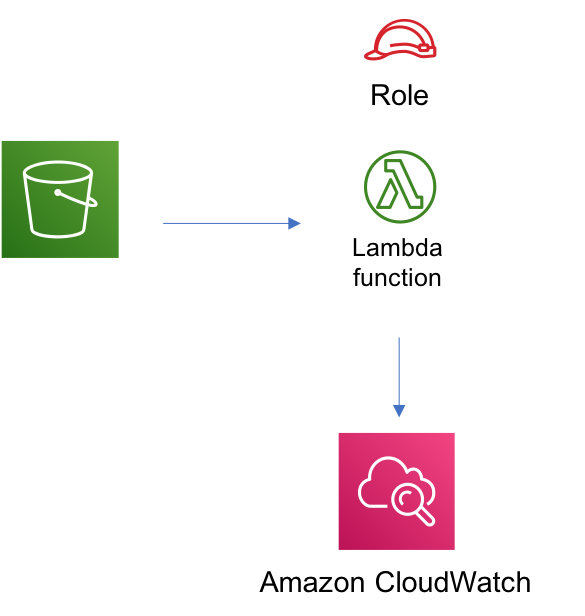

//!!NODE_ROOT <section>
//== aws-s3-lambda module

[.topic]
= aws-s3-lambda
:info_doctype: section
:info_title: aws-s3-lambda

image::https://img.shields.io/badge/cfn--resources-stable-success.svg?style=for-the-badge[Stability:Stable]

[width="100%",cols="<50%,<50%",options="header",]
|===
|*Reference Documentation*:
|https://docs.aws.amazon.com/solutions/latest/constructs/
|===

[width="100%",cols="<46%,54%",options="header",]
|===
|*Language* |*Package*
|image:https://docs.aws.amazon.com/cdk/api/latest/img/python32.png[Python
Logo] Python |`aws_solutions_constructs.aws_s3_lambda`

|image:https://docs.aws.amazon.com/cdk/api/latest/img/typescript32.png[Typescript
Logo] Typescript |`@aws-solutions-constructs/aws-s3-lambda`

|image:https://docs.aws.amazon.com/cdk/api/latest/img/java32.png[Java
Logo] Java |`software.amazon.awsconstructs.services.s3lambda`
|===

== Overview

This AWS Solutions Construct implements an Amazon S3 bucket connected to
an AWS Lambda function.

Here is a minimal deployable pattern definition:

====
[role="tablist"]
Typescript::
+
[source,typescript]
----
import { Construct } from 'constructs';
import { Stack, StackProps } from 'aws-cdk-lib';
import * as lambda from "aws-cdk-lib/aws-lambda";
import { S3ToLambdaProps, S3ToLambda } from '@aws-solutions-constructs/aws-s3-lambda';

new S3ToLambda(this, 'test-s3-lambda', {
  lambdaFunctionProps: {
    code: lambda.Code.fromAsset(`lambda`),
    runtime: lambda.Runtime.NODEJS_20_X,
    handler: 'index.handler'
  },
});
----

Python::
+
[source,python]
----
from aws_solutions_constructs.aws_s3_lambda import S3ToLambda
from aws_cdk import (
    aws_lambda as _lambda,
    Stack
)
from constructs import Construct

S3ToLambda(self, 'test_s3_lambda',
           lambda_function_props=_lambda.FunctionProps(
               code=_lambda.Code.from_asset('lambda'),
               runtime=_lambda.Runtime.PYTHON_3_11,
               handler='index.handler'
           )
           )
----

Java::
+
[source,java]
----
import software.constructs.Construct;

import software.amazon.awscdk.Stack;
import software.amazon.awscdk.StackProps;
import software.amazon.awscdk.services.lambda.*;
import software.amazon.awscdk.services.lambda.Runtime;
import software.amazon.awsconstructs.services.s3lambda.*;

new S3ToLambda(this, "test-s3-lambda'", new S3ToLambdaProps.Builder()
        .lambdaFunctionProps(new FunctionProps.Builder()
                .runtime(Runtime.NODEJS_20_X)
                .code(Code.fromAsset("lambda"))
                .handler("index.handler")
                .build())
        .build());
----
====

== Pattern Construct Props

[width="100%",cols="<30%,<35%,35%",options="header",]
|===
|*Name* |*Type* |*Description*
|existingLambdaObj?
|https://docs.aws.amazon.com/cdk/api/v2/docs/aws-cdk-lib.aws_lambda.Function.html[`lambda.Function`]
|Existing instance of Lambda Function object, providing both this and
`lambdaFunctionProps` will cause an error.

|lambdaFunctionProps?
|https://docs.aws.amazon.com/cdk/api/v2/docs/aws-cdk-lib.aws_lambda.FunctionProps.html[`lambda.FunctionProps`]
|Optional user provided props to override the default props for the
Lambda function.

|existingBucketObj?
|https://docs.aws.amazon.com/cdk/api/v2/docs/aws-cdk-lib.aws_s3.Bucket.html[`s3.Bucket`]
|Existing instance of S3 Bucket object. If this is provided, then also
providing bucketProps is an error.

|bucketProps?
|https://docs.aws.amazon.com/cdk/api/v2/docs/aws-cdk-lib.aws_s3.BucketProps.html[`s3.BucketProps`]
|Optional user provided props to override the default props for the S3
Bucket.

|s3EventSourceProps?
|https://docs.aws.amazon.com/cdk/api/v2/docs/aws-cdk-lib.aws_lambda_event_sources.S3EventSourceProps.html[`S3EventSourceProps`]
|Optional user provided props to override the default props for
S3EventSourceProps

|loggingBucketProps?
|https://docs.aws.amazon.com/cdk/api/v2/docs/aws-cdk-lib.aws_s3.BucketProps.html[`s3.BucketProps`]
|Optional user provided props to override the default props for the S3
Logging Bucket.

|logS3AccessLogs? |boolean |Whether to turn on Access Logging for the S3
bucket. Creates an S3 bucket with associated storage costs for the logs.
Enabling Access Logging is a best practice. default - true
|===

== Pattern Properties

[width="100%",cols="<30%,<35%,35%",options="header",]
|===
|*Name* |*Type* |*Description*
|lambdaFunction
|https://docs.aws.amazon.com/cdk/api/v2/docs/aws-cdk-lib.aws_lambda.Function.html[`lambda.Function`]
|Returns an instance of the lambda.Function created by the construct

|s3Bucket?
|https://docs.aws.amazon.com/cdk/api/v2/docs/aws-cdk-lib.aws_s3.Bucket.html[`s3.Bucket`]
|Returns an instance of the s3.Bucket created by the construct

|s3LoggingBucket?
|https://docs.aws.amazon.com/cdk/api/v2/docs/aws-cdk-lib.aws_s3.Bucket.html[`s3.Bucket`]
|Returns an instance of s3.Bucket created by the construct as the
logging bucket for the primary bucket.

|s3BucketInterface
|https://docs.aws.amazon.com/cdk/api/v2/docs/aws-cdk-lib.aws_s3.IBucket.html[`s3.IBucket`]
|Returns an instance of s3.IBucket created by the construct
|===

== Default settings

Out of the box implementation of the Construct without any override will
set the following defaults:

=== Amazon S3 Bucket

* Configure Access logging for S3 Bucket
* Enable server-side encryption for S3 Bucket using AWS managed KMS Key
* Enforce encryption of data in transit
* Turn on the versioning for S3 Bucket
* Don’t allow public access for S3 Bucket
* Retain the S3 Bucket when deleting the CloudFormation stack
* Applies Lifecycle rule to move noncurrent object versions to Glacier
storage after 90 days

=== AWS Lambda Function

* Configure limited privilege access IAM role for Lambda function
* Enable reusing connections with Keep-Alive for NodeJs Lambda function
* Enable X-Ray Tracing
* Set Environment Variables
** AWS_NODEJS_CONNECTION_REUSE_ENABLED (for Node 10.x
and higher functions)

== Architecture

image::images/GitHub-Mark-32px.png[The github logo.,scaledwidth=100%]

'''''

© Copyright Amazon.com, Inc. or its affiliates. All Rights Reserved.
