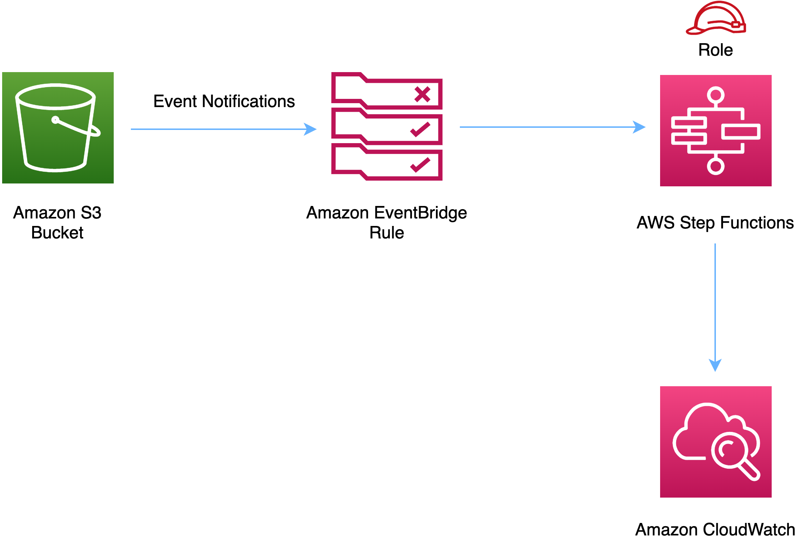

//!!NODE_ROOT <section>
//== aws-s3-stepfunctions module

[.topic]
= aws-s3-stepfunctions
:info_doctype: section
:info_title: aws-s3-stepfunctions

image:https://img.shields.io/badge/cfn--resources-stable-success.svg?style=for-the-badge[Stability:Stable]

[width="100%",cols="<50%,<50%",options="header",]
|===
|*Reference Documentation*:
|https://docs.aws.amazon.com/solutions/latest/constructs/
|===

[width="100%",cols="<46%,54%",options="header",]
|===
|*Language* |*Package*
|image:https://docs.aws.amazon.com/cdk/api/latest/img/python32.png[Python
Logo] Python
|`aws_solutions_constructs.aws_s3_stepfunctions`

|image:https://docs.aws.amazon.com/cdk/api/latest/img/typescript32.png[Typescript
Logo] Typescript |`@aws-solutions-constructs/aws-s3-stepfunctions`

|image:https://docs.aws.amazon.com/cdk/api/latest/img/java32.png[Java
Logo] Java |`software.amazon.awsconstructs.services.s3stepfunctions`
|===

== Overview

This AWS Solutions Construct implements an Amazon S3 bucket connected to
an AWS Step Functions.

_Note - This constructs sends S3 Event Notification to EventBridge, then
triggers AWS Step Functions State Machine executions from EventBridge._

_An alternative architecture can be built that triggers a Lambda
function from S3 Event notifications using aws-s3-lambda and
aws-lambda-stepfunctions. Channelling the S3 events through Lambda is
less flexible than EventBridge, but is more cost effective and has lower
latency._

Here is a minimal deployable pattern definition:

====
[role="tablist"]
Typescript::
+
[source,typescript]
----
import { Construct } from 'constructs';
import { Stack, StackProps } from 'aws-cdk-lib';
import { S3ToStepfunctions, S3ToStepfunctionsProps } from '@aws-solutions-constructs/aws-s3-stepfunctions';
import * as stepfunctions from 'aws-cdk-lib/aws-stepfunctions';

const startState = new stepfunctions.Pass(this, 'StartState');

new S3ToStepfunctions(this, 'test-s3-stepfunctions-stack', {
    stateMachineProps: {
      definition: startState
    }
});
----

Python::
+
[source,python]
----
from aws_solutions_constructs.aws_s3_stepfunctions import S3ToStepfunctions
from aws_cdk import (
    aws_stepfunctions as stepfunctions,
    Stack
)
from constructs import Construct

start_state = stepfunctions.Pass(self, 'start_state')

S3ToStepfunctions(
    self, 'test_s3_stepfunctions_stack',
    state_machine_props=stepfunctions.StateMachineProps(
        definition=start_state)
)
----

Java::
+
[source,java]
----
import software.constructs.Construct;

import software.amazon.awscdk.Stack;
import software.amazon.awscdk.StackProps;
import software.amazon.awscdk.services.stepfunctions.*;
import software.amazon.awsconstructs.services.s3stepfunctions.*;

final Pass startState = new Pass(this, "StartState");

new S3ToStepfunctions(this, "test_s3_stepfunctions_stack",
        new S3ToStepfunctionsProps.Builder()
                .stateMachineProps(new StateMachineProps.Builder()
                        .definition(startState)
                        .build())
                .build());
----
====

== Pattern Construct Props

[width="100%",cols="<30%,<35%,35%",options="header",]
|===
|*Name* |*Type* |*Description*
|existingBucketObj?
|https://docs.aws.amazon.com/cdk/api/v2/docs/aws-cdk-lib.aws_s3.IBucket.html[`s3.IBucket`]
|Existing instance of S3 Bucket object. If this is provided, then also
providing bucketProps is an error. *The existing bucket must have
https://docs.aws.amazon.com/AmazonS3/latest/userguide/enable-event-notifications-eventbridge.html[EventBridge
enabled] for this to work.*

|bucketProps?
|https://docs.aws.amazon.com/cdk/api/v2/docs/aws-cdk-lib.aws_s3.BucketProps.html[`s3.BucketProps`]
|Optional user provided props to override the default props for the S3
Bucket.

|stateMachineProps
|https://docs.aws.amazon.com/cdk/api/v2/docs/aws-cdk-lib.aws_stepfunctions.StateMachineProps.html[`sfn.StateMachineProps`]
|User provided props to override the default props for sfn.StateMachine.

|eventRuleProps?
|https://docs.aws.amazon.com/cdk/api/v2/docs/aws-cdk-lib.aws_events.RuleProps.html[`events.RuleProps`]
|Optional user provided eventRuleProps to override the defaults.

|deployCloudTrail? |`boolean` |Whether to deploy a Trail in AWS
CloudTrail to log API events in Amazon S3. Defaults to `true`. *This is
now deprecated and ignored because the construct no longer needs
CloudTrail since it uses S3 Event Notifications*.

|createCloudWatchAlarms |`boolean` |Whether to create recommended
CloudWatch alarms.

|logGroupProps?
|https://docs.aws.amazon.com/cdk/api/v2/docs/aws-cdk-lib.aws_logs.LogGroupProps.html[`logs.LogGroupProps`]
|Optional user provided props to override the default props for for the
CloudWatchLogs LogGroup.

|loggingBucketProps?
|https://docs.aws.amazon.com/cdk/api/v2/docs/aws-cdk-lib.aws_s3.BucketProps.html[`s3.BucketProps`]
|Optional user provided props to override the default props for the S3
Logging Bucket.

|logS3AccessLogs? |boolean |Whether to turn on Access Logging for the S3
bucket. Creates an S3 bucket with associated storage costs for the logs.
Enabling Access Logging is a best practice. default - true
|===

== Pattern Properties

[width="100%",cols="<30%,<35%,35%",options="header",]
|===
|*Name* |*Type* |*Description*
|stateMachine
|https://docs.aws.amazon.com/cdk/api/v2/docs/aws-cdk-lib.aws_stepfunctions.StateMachine.html[`sfn.StateMachine`]
|Returns an instance of sfn.StateMachine created by the construct.

|stateMachineLogGroup
|https://docs.aws.amazon.com/cdk/api/v2/docs/aws-cdk-lib.aws_logs.ILogGroup.html[`logs.ILogGroup`]
|Returns an instance of the ILogGroup created by the construct for
StateMachine.

|cloudwatchAlarms?
|https://docs.aws.amazon.com/cdk/api/v2/docs/aws-cdk-lib.aws_cloudwatch.Alarm.html[`cloudwatch.Alarm[\]`]
|Returns a list of cloudwatch.Alarm created by the construct.

|s3Bucket?
|https://docs.aws.amazon.com/cdk/api/v2/docs/aws-cdk-lib.aws_s3.Bucket.html[`s3.Bucket`]
|Returns an instance of the s3.Bucket created by the construct.

|s3LoggingBucket?
|https://docs.aws.amazon.com/cdk/api/v2/docs/aws-cdk-lib.aws_s3.Bucket.html[`s3.Bucket`]
|Returns an instance of s3.Bucket created by the construct as the
logging bucket for the primary bucket.

|s3BucketInterface
|https://docs.aws.amazon.com/cdk/api/v2/docs/aws-cdk-lib.aws_s3.IBucket.html[`s3.IBucket`]
|Returns an instance of s3.IBucket created by the construct.
|===

_Note - with the release of Enable EventBridge for Amazon S3, AWS
CloudTrail is no longer required to implement this construct. Because of
this, the following properties have been removed:_ - cloudtrail -
cloudtrailBucket - cloudtrailLoggingBucket

== Default settings

Out of the box implementation of the Construct without any override will
set the following defaults:

=== Amazon S3 Bucket

* Enable EventBridge to send events from the S3 Bucket
* Configure Access logging for S3 Bucket
* Enable server-side encryption for S3 Bucket using AWS managed KMS Key
* Enforce encryption of data in transit
* Turn on the versioning for S3 Bucket
* Don’t allow public access for S3 Bucket
* Retain the S3 Bucket when deleting the CloudFormation stack
* Applies Lifecycle Rule to move noncurrent object versions to Glacier
storage after 90 days

=== AWS S3 Event Notification

* Enable S3 to send events to EventBridge when an object is created.

=== Amazon CloudWatch Events Rule

* Grant least privilege permissions to CloudWatch Events to trigger the
Lambda Function

=== AWS Step Functions

* Enable CloudWatch logging for API Gateway
* Deploy best practices CloudWatch Alarms for the Step Functions

== Architecture

== Github

Go to the https://github.com/awslabs/aws-solutions-constructs/tree/main/source/patterns/%40aws-solutions-constructs/aws-s3-stepfunctions[Github repo] for this pattern to view the code, read/create issues and pull requests and more.

'''''

