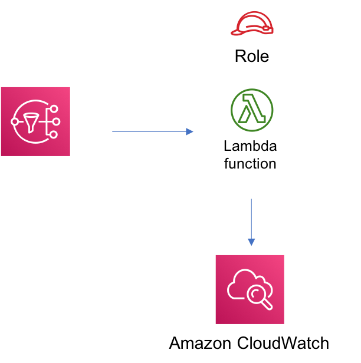

//!!NODE_ROOT <section>
//== aws-sns-lambda module

[.topic]
= aws-sns-lambda
:info_doctype: section
:info_title: aws-sns-lambda

image:https://img.shields.io/badge/cfn--resources-stable-success.svg?style=for-the-badge[Stability:Stable]

[width="100%",cols="<50%,<50%",options="header",]
|===
|*Reference Documentation*:
|https://docs.aws.amazon.com/solutions/latest/constructs/
|===

[width="100%",cols="<46%,54%",options="header",]
|===
|*Language* |*Package*
|image:https://docs.aws.amazon.com/images/solutions/latest/constructs/images/python32.png[Python
Logo] Python |`aws_solutions_constructs.aws_sns_lambda`

|image:https://docs.aws.amazon.com/images/solutions/latest/constructs/images/typescript32.png[Typescript
Logo] Typescript |`@aws-solutions-constructs/aws-sns-lambda`

|image:https://docs.aws.amazon.com/images/solutions/latest/constructs/images/java32.png[Java
Logo] Java |`software.amazon.awsconstructs.services.snslambda`
|===

== Overview

This AWS Solutions Construct implements an Amazon SNS connected to an
AWS Lambda function.

Here is a minimal deployable pattern definition:

====
[role="tablist"]
Typescript::
+
[source,typescript]
----
import { Construct } from 'constructs';
import { Stack, StackProps } from 'aws-cdk-lib';
import { SnsToLambda, SnsToLambdaProps } from "@aws-solutions-constructs/aws-sns-lambda";
import * as lambda from 'aws-cdk-lib/aws-lambda';

new SnsToLambda(this, 'test-sns-lambda', {
  lambdaFunctionProps: {
    runtime: lambda.Runtime.NODEJS_22_X,
    handler: 'index.handler',
    code: lambda.Code.fromAsset(`lambda`)
  }
});
----

Python::
+
[source,python]
----
from aws_solutions_constructs.aws_sns_lambda import SnsToLambda
from aws_cdk import (
    aws_lambda as _lambda,
    Stack
)
from constructs import Construct

SnsToLambda(self, 'test_sns_lambda',
            lambda_function_props=_lambda.FunctionProps(
                code=_lambda.Code.from_asset('lambda'),
                runtime=_lambda.Runtime.PYTHON_3_11,
                handler='index.handler'
            )
            )
----

Java::
+
[source,java]
----
import software.constructs.Construct;

import software.amazon.awscdk.Stack;
import software.amazon.awscdk.StackProps;
import software.amazon.awscdk.services.lambda.*;
import software.amazon.awscdk.services.lambda.Runtime;
import software.amazon.awsconstructs.services.snslambda.*;

new SnsToLambda(this, "test-lambda-sqs-stack", new SnsToLambdaProps.Builder()
        .lambdaFunctionProps(new FunctionProps.Builder()
                .runtime(Runtime.NODEJS_22_X)
                .code(Code.fromAsset("lambda"))
                .handler("index.handler")
                .build())
        .build());
----
====

== Pattern Construct Props

[width="100%",cols="<30%,<35%,35%",options="header",]
|===
|*Name* |*Type* |*Description*
|existingLambdaObj?
|https://docs.aws.amazon.com/cdk/api/v2/docs/aws-cdk-lib.aws_lambda.Function.html[`lambda.Function`]
|Optional - instance of an existing Lambda Function object, providing both this and
`lambdaFunctionProps` will cause an error.

|lambdaFunctionProps?
|https://docs.aws.amazon.com/cdk/api/v2/docs/aws-cdk-lib.aws_lambda.FunctionProps.html[`lambda.FunctionProps`]
|Optional - user provided props to override the default props for the Lambda function. Providing both this and `existingLambdaObj` is an error.

|existingTopicObj?
|https://docs.aws.amazon.com/cdk/api/v2/docs/aws-cdk-lib.aws_lambda.Function.html[`sns.Topic`]
|Optional - existing instance of SNS topic object, providing both this and `topicProps` will cause an error.

|topicProps?
|https://docs.aws.amazon.com/cdk/api/v2/docs/aws-cdk-lib.aws_sns.TopicProps.html[`sns.TopicProps`]
|Optional - user provided properties to override the default properties for the SNS topic. Providing both this and `existingTopicObj` is an error.

|enableEncryptionWithCustomerManagedKey? |`boolean` |If no key is
provided, this flag determines whether the SNS Topic is encrypted with a
new CMK or an AWS managed key. This flag is ignored if any of the
following are defined: topicProps.masterKey, encryptionKey or
encryptionKeyProps.

|encryptionKey?
|https://docs.aws.amazon.com/cdk/api/v2/docs/aws-cdk-lib.aws_kms.Key.html[`kms.Key`]
|An optional, imported encryption key to encrypt the SNS Topic with.

|encryptionKeyProps?
|https://docs.aws.amazon.com/cdk/api/v2/docs/aws-cdk-lib.aws_kms.Key.html#construct-props[`kms.KeyProps`]
|Optional user provided properties to override the default properties
for the KMS encryption key used to encrypt the SNS Topic with.
|===

== Pattern Properties

[width="100%",cols="<30%,<35%,35%",options="header",]
|===
|*Name* |*Type* |*Description*
|lambdaFunction
|https://docs.aws.amazon.com/cdk/api/v2/docs/aws-cdk-lib.aws_lambda.Function.html[`lambda.Function`]
|Returns an instance of the Lambda function created by the pattern.

|snsTopic
|https://docs.aws.amazon.com/cdk/api/v2/docs/aws-cdk-lib.aws_sns.Topic.html[`sns.Topic`]
|Returns an instance of the SNS topic created by the pattern.
|===

== Default settings

Out of the box implementation of the Construct without any override will
set the following defaults:

=== Amazon SNS Topic

* Configure least privilege access permissions for SNS Topic
* Enable server-side encryption for SNS Topic using AWS managed KMS Key
* Enforce encryption of data in transit

=== AWS Lambda Function

* Configure limited privilege access IAM role for Lambda function
* Enable reusing connections with Keep-Alive for NodeJs Lambda function
* Enable X-Ray Tracing
* Set Environment Variables
** AWS_NODEJS_CONNECTION_REUSE_ENABLED (for Node 10.x
and higher functions)

== Architecture

== Github

Go to the https://github.com/awslabs/aws-solutions-constructs/tree/main/source/patterns/%40aws-solutions-constructs/aws-sns-lambda[Github repo] for this pattern to view the code, read/create issues and pull requests and more.

'''''

