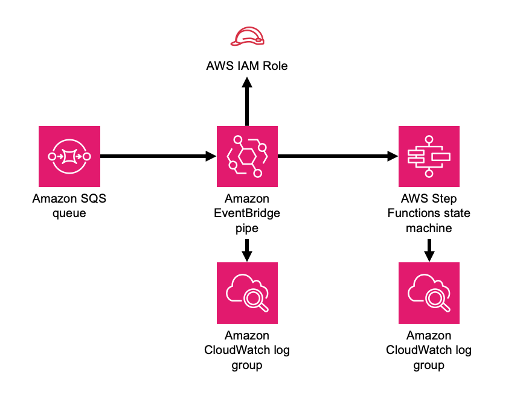

//!!NODE_ROOT <section>
//== aws-sqs-pipes-stepfunctions module

[.topic]
= aws-sqs-pipes-stepfunctions
:info_doctype: section
:info_title: aws-sqs-pipes-stepfunctions

image::https://img.shields.io/badge/stability-Experimental-important.svg?style=for-the-badge[Stability:Experimental]

[width="100%",cols="<50%,<50%",options="header",]
|===
|*Reference Documentation*:
|https://docs.aws.amazon.com/solutions/latest/constructs/
|===

[width="100%",cols="<46%,54%",options="header",]
|===
|*Language* |*Package*
|image:https://docs.aws.amazon.com/cdk/api/latest/img/python32.png[Python
Logo] Python
|`aws_solutions_constructs.aws_sqs_pipes_stepfunctions`

|image:https://docs.aws.amazon.com/cdk/api/latest/img/typescript32.png[Typescript
Logo] Typescript
|`@aws-solutions-constructs/aws-sqs-pipes-stepfunctions`

|image:https://docs.aws.amazon.com/cdk/api/latest/img/java32.png[Java
Logo] Java
|`software.amazon.awsconstructs.services.sqspipesstepfunctions`
|===

== Overview

This AWS Solutions Construct implements an AWS SQS queue whose messages
are passed to an AWS Step Functions state machine by an Amazon
Eventbridge pipe.

Here is a minimal deployable pattern definition:

====
[role="tablist"]
Typescript::
+
[source,typescript]
----
import { Construct } from 'constructs';
import { Stack, StackProps } from 'aws-cdk-lib';
import * as sfn from 'aws-cdk-lib/aws-stepfunctions';
import { SqsToPipesToStepfunctions, SqsToPipesToStepfunctionsProps } from "@aws-solutions-constructs/aws-sqs-pipes-stepfunctions";

    const startState = new sfn.Pass(this, 'StartState');
    
    new SqsToPipesToStepfunctions(this, 'SqsToPipesToStepfunctionsPattern', {
      stateMachineProps: {
        definitionBody: sfn.DefinitionBody.fromChainable(sfn.Chain.start(new sfn.Pass(this, 'Pass'))),
      }
    });
----

Python::
+
[source,python]
----
from constructs import Construct
from aws_cdk import (
    aws_stepfunctions as _sfn,
    Stack
)
from aws_solutions_constructs import (
    aws_sqs_pipes_stepfunctions as sqs_pipes_stepfunctions
)

sqs_pipes_stepfunctions.SqsToPipesToStepfunctions(
    self, 'SqsToPipesToStepfunctions',
    state_machine_props=_sfn.StateMachineProps(
        definition_body=_sfn.DefinitionBody.from_chainable(_sfn.Chain.start(_sfn.Pass(self, "pass")))
    )
)
----

Java::
+
[source,java]
----
package com.myorg;

import software.constructs.Construct;
import software.amazon.awscdk.Stack;
import software.amazon.awscdk.StackProps;

import software.amazon.awscdk.services.stepfunctions.*;
import software.amazon.awsconstructs.services.sqspipesstepfunctions.SqsToPipesToStepfunctions;
import software.amazon.awsconstructs.services.sqspipesstepfunctions.SqsToPipesToStepfunctionsProps;

new SqsToPipesToStepfunctions(this, "SqsToLambdaToStepfunctionsPattern",
    SqsToPipesToStepfunctionsProps.builder()
        .stateMachineProps(StateMachineProps.builder()
            .definitionBody(DefinitionBody.fromChainable(Chain.start(new Pass(scope, "Pass"))))
            .build())
        .build());
----
====

== Pattern Construct Props

[width="100%",cols="<30%,<35%,35%",options="header",]
|===
|*Name* |*Type* |*Description*
|existingQueueObj?
|https://docs.aws.amazon.com/cdk/api/v2/docs/aws-cdk-lib.aws_sqs.Queue.html[`sqs.Queue`]
|An optional, existing SQS queue to be used instead of the default
queue. Providing both this and `queueProps` will cause an error.

|queueProps?
|https://docs.aws.amazon.com/cdk/api/v2/docs/aws-cdk-lib.aws_sqs.QueueProps.html[`sqs.QueueProps`]
|Optional user provided properties to override the default properties
for the SQS queue.

|encryptQueueWithCmk |`boolean` |Whether to encrypt the Queue with a
customer managed KMS key (CMK). This is the default behavior, and this
property defaults to true - if it is explicitly set to false then the
Queue is encrypted with an Amazon managed KMS key. For a completely
unencrypted Queue (not recommended), create the Queue separately from
the construct and pass it in using the existingQueueObject. Since SNS
subscriptions do not currently support SQS queues with AWS managed
encryption keys, setting this to false will always result in an error
from the underlying CDK - we have still included this property for
consistency with topics and to be ready if the services one day support
this functionality.

|queueEncryptionKeyProps?
|https://docs.aws.amazon.com/cdk/api/v2/docs/aws-cdk-lib.aws_kms.Key.html#construct-props[`kms.KeyProps`]
|An optional subset of key properties to override the default properties
used by constructs (`enableKeyRotation: true`). These properties will be
used in constructing the CMK used to encrypt the SQS queue.

|existingQueueEncryptionKey?
|https://docs.aws.amazon.com/cdk/api/v2/docs/aws-cdk-lib.aws_kms.Key.html[`kms.Key`]
|An optional CMK that will be used by the construct to encrypt the new
SQS queue.

|deployDeadLetterQueue? |`boolean` |Whether to create a secondary queue
to be used as a dead letter queue. Defaults to true.

|deadLetterQueueProps?
|https://docs.aws.amazon.com/cdk/api/v2/docs/aws-cdk-lib.aws_sqs.QueueProps.html[`sqs.QueueProps`]
|Optional user-provided props to override the default props for the dead
letter SQS queue.

|maxReceiveCount? |`number` |The number of times a message can be
unsuccessfully dequeued before being moved to the dead letter queue.
Defaults to 15.

|stateMachineProps
|https://docs.aws.amazon.com/cdk/api/v2/docs/aws-cdk-lib.aws_stepfunctions.StateMachineProps.html[`sfn.StateMachineProps`]
|User provided props for the sfn.StateMachine.

|createCloudWatchAlarms? |`boolean` |Whether to create recommended
CloudWatch alarms

|logGroupProps?
|https://docs.aws.amazon.com/cdk/api/v2/docs/aws-cdk-lib.aws_logs.LogGroupProps.html[logs.logGroupProps]
|Optional user provided props to override the default props for for the
CloudWatchLogs LogGroup for the state machine.

|pipeProps?
|https://docs.aws.amazon.com/cdk/api/v2/docs/aws-cdk-lib.aws_pipes.CfnPipeProps.html[pipes.CfnPipeProps]
|Optional customer provided settings for the EventBridge pipe. source,
target, roleArn and enrichment settings are set by the construct and
cannot be overriden here. The construct will generate default
sourceParameters, targetParameters and logConfiguration (found
link:link[here]) that can be overriden by populating those values in
these props. If the client wants to implement enrichment or a filter,
this is where that information can be provided. Any other props can be
freely overridden. If a client wants to set values such as batchSize,
that can be done here in the sourceParameters property.

|enrichmentFunction?
|https://docs.aws.amazon.com/cdk/api/v2/docs/aws-cdk-lib.aws_lambda.Function.html[lambda.Function]
|Optional - Lambda function that the construct will configure to be
called to enrich the message between source and target. The construct
will configure the pipe IAM role to allow invoking the function (but
will not affect the IArole assigned to the function). Specifying both
this and enrichmentStateMachine is an error. Default - undefined

|enrichmentStateMachine?
|https://docs.aws.amazon.com/cdk/api/v2/docs/aws-cdk-lib.aws_stepfunctions.StateMachine.html[sfn.StateMachine]
|Optional - Step Functions state machine that the construct will
configure to be called to enrich the message between source and target.
The construct will configure the pipe IAM role to allow executing the
state machine (but will not affect the IAM role assigned to the state
machine). Specifying both this and enrichmentStateMachine is an error.
Default - undefined

|logLevel? |PipesLogLevel |Threshold for what messages the new pipe
sends to the log, PipesLogLevel.OFF, PipesLogLevel.ERROR,
PipesLogLevel.INFO, PipesLogLevel.TRACE. The default is INFO. Setting
the level to OFF will prevent any log group from being created.
Providing pipeProps.logConfiguration will controls all aspects of
logging and any construct provided log configuration is disabled. If
pipeProps.logConfiguration is provided then specifying this or
pipeLogProps is an error.

|pipeLogProps? |link:[logs.LogGroupProps] |Default behavior is for the
this construct to create a new CloudWatch Logs log group for the pipe.
These props are used to override defaults set by AWS or this construct.
If there are concerns about the cost of log storage, this is where a
client can specify a shorter retention duration (in days)
|===

== Pattern Properties

[width="100%",cols="<30%,<35%,35%",options="header",]
|===
|*Name* |*Type* |*Description*
|stateMachine
|https://docs.aws.amazon.com/cdk/api/v2/docs/aws-cdk-lib.aws_stepfunctions.StateMachine.html[`sfn.StateMachine`]
|Returns an instance of StateMachine created by the construct.

|stateMachineLogGroup
|https://docs.aws.amazon.com/cdk/api/v2/docs/aws-cdk-lib.aws_logs.ILogGroup.html[`logs.ILogGroup`]
|Returns an instance of the ILogGroup created by the construct for
StateMachine

|cloudwatchAlarms?
|https://docs.aws.amazon.com/cdk/api/v2/docs/aws-cdk-lib.aws_cloudwatch.Alarm.html[`cloudwatch.Alarm++[]++`]
|Returns a list of alarms created by the construct.

|sqsQueue
|https://docs.aws.amazon.com/cdk/api/v2/docs/aws-cdk-lib.aws_sqs.Queue.html[`sqs.Queue`]
|Returns an instance of the SQS queue created by the pattern.

|deadLetterQueue?
|https://docs.aws.amazon.com/cdk/api/v2/docs/aws-cdk-lib.aws_sqs.Queue.html[`sqs.Queue`]
|Returns an instance of the dead letter queue created by the pattern, if
one is deployed.

|encryptionKey?
|https://docs.aws.amazon.com/cdk/api/v2/docs/aws-cdk-lib.aws_kms.IKey.html[kms.IKey]
|Returns an instance of kms.Key used for the SQS queue if key is
customer managed.

|pipe
|https://docs.aws.amazon.com/cdk/api/v2/docs/aws-cdk-lib.aws_pipes.CfnPipe.html[pipes.CfnPipe]
|The L1 pipe construct created by this Solutions Construct.

|pipeRole
|https://docs.aws.amazon.com/cdk/api/v2/docs/aws-cdk-lib.aws_iam.Role.html[iam.Role]
|The role created that allows the pipe to access both the source and the
target.
|===

== Default settings

Out of the box implementation of the Construct without any override will
set the following defaults:

==== Amazon SQS Queue

* Deploy SQS dead-letter queue for the source SQS Queue.
* Enable server-side encryption for source SQS Queue using AWS Managed
KMS Key.
* Enforce encryption of data in transit

==== AWS Step Functions State Machine

* Deploy Step Functions standard state machine
* Create CloudWatch log group with /vendedlogs/ prefix in name
* Deploy best practices CloudWatch Alarms for the Step Functions

==== AWS EventBridge Pipe

* Pipe configured with an SQS queue source and state machine target
* A least privilege IAM role assigned to the pipe to access the queue
and state machine
* CloudWatch logs set up at the '`INFO`' level
* Encrypted with an AWS managed KMS key

== Architecture

[[github,topic.title]]
== GitHub

[cols=1,1, options=header]
|===
| 
To view the code for this pattern, create/view issues and pull requests, and more:

|

image::images/GitHub-Mark-32px.png[The github logo.,scaledwidth=100%]

|https://github.com/awslabs/aws-solutions-constructs/tree/master/source/patterns/%40aws-solutions-constructs/aws-aws-sqs-pipes-stepfunctions[-solutions-constructsaws-sqs-pipes-stepfunctions]
|===

'''''

© Copyright Amazon.com, Inc. or its affiliates. All Rights Reserved.
