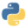

//!!NODE_ROOT <chapter>
:https---docs-aws-amazon-com-cdk-latest-guide-getting-started-html-getting-started-install: https://docs.aws.amazon.com/cdk/latest/guide/getting_started.html#getting_started_install
:https---docs-aws-amazon-com-cdk-latest-guide-getting-started-html: https://docs.aws.amazon.com/cdk/latest/guide/getting_started.html
[.topic]
[[getting-started-with-aws-solutions-constructs,getting-started-with-aws-solutions-constructs.title]]
= Getting Started with AWS Solutions Constructs
:doctype: book
:sectnums:
:toc: left
:icons: font
:experimental:
:idprefix:
:idseparator: -
:sourcedir: .
:info_doctype: chapter
:info_title: Getting Started with AWS Solutions Constructs
:info_titleabbrev: Getting Started
:info_abstract: This topic describes how to install and configure AWS Cloud Development Kit (AWS CDK), AWS Solutions Constructs, and create \
        your first AWS CDK app using AWS Solutions Constructs patterns.

[abstract]
--
This topic describes how to install and configure AWS Cloud Development Kit (AWS CDK), AWS Solutions Constructs, and create your first AWS CDK app using AWS Solutions Constructs patterns. 
--

This topic describes how to install and configure AWS Cloud Development Kit (AWS CDK), AWS Solutions Constructs, and create your first AWS CDK app using AWS Solutions Constructs patterns.  

[TIP]
====

Want to dig deeper? Try the https://cdkworkshop.com/[CDK Workshop] for a more in-depth tour of a real-world project. 

====

[TIP]
====

For more information about getting started with the AWS Cloud Development Kit (AWS CDK), refer to the  {https---docs-aws-amazon-com-cdk-latest-guide-getting-started-html}[AWS CDK Developer Guide]. 

====

[[prerequisites,prerequisites.title]]
== Prerequisites

AWS Solutions Constructs is built upon the AWS CDK, so you need to install Node.js (>= 10.3.0), even those working in languages other than TypeScript or JavaScript. This is because the  https://github.com/aws/aws-cdk[AWS CDK] and AWS Solutions Constructs are developed in TypeScript and run on Node.js. The bindings for other supported languages use this backend and toolset. 

You must provide your credentials and an AWS Region to use the AWS CDK CLI, as described in Specifying Your Credentials and Region. 

Other prerequisites depend on your development language, as follows. 

[cols="1,1", options="header"]
|===
| 
              Language
            
| 
              Prerequisites
            

|Python  
| Python >= 3.6 

|TypeScript  
| TypeScript >= 2.7 

|Java
|Java >= 1.8
|===

[[installing-the-aws-cdk,installing-the-aws-cdk.title]]
== Installing the AWS CDK

To install and configure the AWS CDK, please refer to the AWS CDK Developer Guide -  {https---docs-aws-amazon-com-cdk-latest-guide-getting-started-html-getting-started-install}[Installing the AWS CDK]. 

[[working-with-the-aws-solutions-constructs-library,working-with-the-aws-solutions-constructs-library.title]]
== Working with AWS Solutions Constructs

The typical workflow for creating a new app when working with AWS Solutions Constructs follows the same approach as the AWS CDK.  

. Create the app directory. 
. Initialize the app. 
. Add the AWS Solutions Constructs pattern dependencies. 
. Add additional code to the app. 
. Compile the app, if necessary. 
. Deploy the resources defined in the app. 
. Test the app. 

If there are any issues, loop through modify, compile (if necessary), deploy, and test again.  

include::walkthrough-part1.adoc[leveloffset=+1]

include::walkthrough-part2.adoc[leveloffset=+1]

include::sample-use-cases.adoc[leveloffset=+1]
