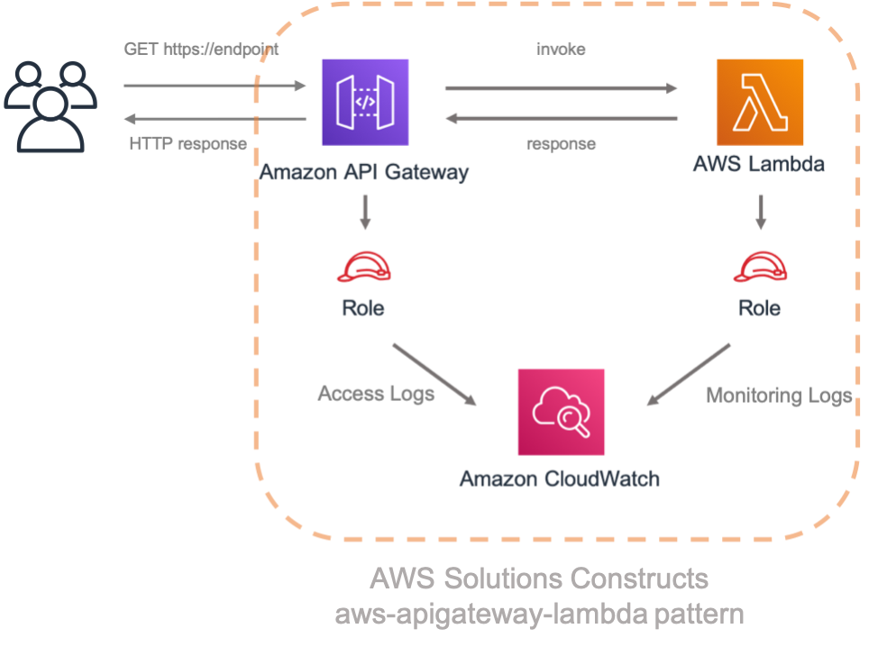

//!!NODE_ROOT <section>
:https---docs-aws-amazon-com-cdk-v2-guide-getting-started-html: https://docs.aws.amazon.com/cdk/v2/guide/getting_started.html

[.topic]
[[walkthrough-part-1-v2,walkthrough-part-1-v2.title]]
= Walkthrough - Part 1
:info_doctype: section
:info_title: Walkthrough - Part 1

This tutorial walks you through how to create and deploy a simple "Hello Constructs" AWS CDK app that uses a pattern from AWS Solutions Constructs, from initializing the project to deploying the resulting AWS CloudFormation template. The Hello Constructs app will create the following simple solution:

[[hello-konstruk,hello-konstruk.title]]
== Hello Constructs

Let`'s get started building our first AWS CDK App using AWS Solutions Constructs.

[NOTE]
====

This is a sample modification of `Hello CDK!` from the https://cdkworkshop.com/[CDK Workshop] . If this is your first time using the AWS CDK, we recommend starting with this workshop for a hands-on walkthrough and how to leverage the CDK in building a real-world project. 

====

[[creating-the-app-directory-and-initializing-the-aws-cdk,creating-the-app-directory-and-initializing-the-aws-cdk.title]]
== Creating the App Directory and Initializing the AWS CDK

If you have not installed the AWS CDK yet, do so following the instructions  {https---docs-aws-amazon-com-cdk-v2-guide-getting-started-html}[here]. Confirm you are using version 2.0 or higher of the AWS CDK by running this command.

[source]
----

cdk --version
----

Create a directory for your CDK app, and then create a AWS CDK app in that directory.

====
[role="tablist"]
Typescript::
+
[source,typescript]
----

mkdir hello-constructs
cd hello-constructs
cdk init --language typescript
----

Python::
+
[source,python]
----

mkdir hello-constructs
cd hello-constructs
cdk init --language python
----

Java::
+
[source,java]
----

mkdir hello-constructs
cd hello-constructs
cdk init --language java
----
====

[TIP]
====

Now's a good time to open the project in your favorite IDE and explore. To learn more about the project structure, select the appropriate link:

* https://cdkworkshop.com/20-typescript/20-create-project/300-structure.html[TypeScript]
* https://cdkworkshop.com/30-python/20-create-project/300-structure.html[Python]
* https://cdkworkshop.com/50-java/20-create-project/300-structure.html[Java]

====

[[update-project-base-dependencies-to-use-aws-cdk,update-project-base-dependencies-to-use-aws-cdk.title]]
== Install project base dependencies

Install the projects base dependencies.  

====
[role="tablist"]
Typescript::
+
[source,typescript]
----

npm install
----

Python::
+
[source,python]
----

source .venv/bin/activate
pip install -r requirements.txt
----

Java::
+
[source,java]
----

mvn install
----
====

Build and run the app and confirm that it creates an empty stack.  

====
[role="tablist"]
Typescript::
+
[source,typescript]
----

npm run build
cdk synth
----

Python::
+
[source,python]
----

cdk synth
----

Java::
+
[source,java]
----

mvn package
cdk synth
----
====

You should see a stack like the following, where  `CDK-VERSION` is the version of the CDK. (Your output may differ slightly from what`'s shown here – the metadata and parameters are omitted from this listing.) 

====
[role="tablist"]
Typescript::
+
[source,python]
----

Resources:
  CDKMetadata:
    Type: AWS::CDK::Metadata
    Properties:
          Modules: aws-cdk=CDK-VERSION,@aws-cdk/core=VERSION_NUMBER,@aws-cdk/cx-api=VERSION_NUMBER,jsii-runtime=node.js/VERSION_NUMBER
----

Python::
+
[source,python]
----

Resources:
  CDKMetadata:
    Type: AWS::CDK::Metadata
    Properties:
          Modules: aws-cdk=CDK-VERSION,@aws-cdk/core=VERSION_NUMBER,@aws-cdk/cx-api=VERSION_NUMBER,jsii-runtime=Python/VERSION_NUMBER
----

Java::
* 
[source,python]
----

Resources:
  CDKMetadata:
    Type: AWS::CDK::Metadata
    Properties:
          Modules: aws-cdk=CDK-VERSION,@aws-cdk/core=VERSION_NUMBER,@aws-cdk/cx-api=VERSION_NUMBER,jsii-runtime=Java/VERSION_NUMBER
----
====

[[lambda-handler-code,lambda-handler-code.title]]
== Lambda handler code

We`'ll start with the AWS Lambda handler code.

Create a directory [path]``lambda`` in the root of your project tree.  

====
[role="tablist"]
Typescript::
* Add a file called [path]``lambda/hello.js`` with the following contents:  
+
[source,typescript]
----

exports.handler = async function(event) {
  console.log("request:", JSON.stringify(event, null, 2));
  return {
    statusCode: 200,
    headers: { "Content-Type": "text/plain" },
    body: `Hello, AWS Solutions Constructs! You've hit ${event.path}\n`
  };
};
----

Python::
* Add a file called [path]``lambda/hello.py`` with the following contents:  
+
[source,python]
----

import json

def handler(event, context):
    print('request: {}'.format(json.dumps(event)))
    return {
        'statusCode': 200,
        'headers': {
            'Content-Type': 'text/plain'
        },
        'body': 'Hello, AWS Solutions Constructs! You have hit {}\n'.format(event['path'])
    }
----

Java::
* Add a file called [path]``lambda/hello.js`` with the following contents:  
+
[source,typescript]
----

exports.handler = async function(event) {
  console.log("request:", JSON.stringify(event, null, 2));
  return {
    statusCode: 200,
    headers: { "Content-Type": "text/plain" },
    body: `Hello, AWS Solutions Constructs! You've hit ${event.path}\n`
  };
};
----
====

This is a simple Lambda function which returns the text "Hello, Constructs! You`'ve hit [url path]". The function`'s output also includes the HTTP status code and HTTP headers. These are used by API Gateway to formulate the HTTP response to the user. It`'s in this function where you would insert logic for your application.

For more information on writing Lambda functions in your language of choice, refer to the https://docs.aws.amazon.com/lambda/latest/dg/welcome.html[AWS Lambda documentation] . 

[[install-the-aws-cdk-and-aws-solutions-constructs-library-dependencies,install-the-aws-cdk-and-aws-solutions-constructs-library-dependencies.title]]
== Install the AWS Solutions Constructs dependencies

The AWS Solutions Constructs is shipped with an extensive library of constructs. The library is divided into modules, one for each well-architected pattern. For example, if you want to define an Amazon API Gateway Rest API that invokes an AWS Lambda function, we will need to use the  [path]``aws-apigateway-lambda`` pattern library.  

The AWS Lambda and Amazon API Gateway modules are installed with the AWS CDK.

Install the AWS Solutions Constructs [path]``aws-apigateway-lambda`` module and all its dependencies into our project:  

====
[role="tablist"]
Typescript::
+
[source,python]
----

npm install -s @aws-solutions-constructs/aws-apigateway-lambda
----

Python::
+
[source,python]
----

pip install aws_solutions_constructs.aws_apigateway_lambda
----

Java::
* Edit the [path]``pom.xml`` file with the following information:
+
NOTE: 2.5.0 was the latest version of AWS Solutions Constructs at this writing. To find the latest version of AWS Solutions Constructs (and any other dependencies), use the command `mvn versions:display-dependency-updates` and update the pom.xml file. 
+

[source,xml]
----

<properties>
  <solutionconstructs.version>2.5.0</solutionconstructs.version>
</properties>

<dependency>
    <groupId>software.amazon.awsconstructs</groupId>
    <artifactId>apigatewaylambda</artifactId>
    <version>${solutionconstructs.version}</version>
</dependency>
----
+

Run the command:
+
[source,java]
----

mvn install
----
====

[[add-an-aws-api-gatewayaws-lambda-pattern-to-your-stack,add-an-aws-api-gatewayaws-lambda-pattern-to-your-stack.title]]
== Add an Amazon API Gateway/AWS Lambda pattern to your stack

Now, let`'s define the AWS Solutions Constructs pattern for implementing an Amazon API Gateway with an AWS Lambda proxy.

====
[role="tablist"]
TypeScript::
* Replace the code in [path]``lib/hello-constructs-stack.ts`` with the following:  
+
[source,typescript]
----

import { Construct } from 'constructs';
import { Stack, StackProps } from 'aws-cdk-lib';
import * as lambda from 'aws-cdk-lib/aws-lambda';
import * as api from 'aws-cdk-lib/aws-apigateway';
import { ApiGatewayToLambda, ApiGatewayToLambdaProps } from '@aws-solutions-constructs/aws-apigateway-lambda';

export class HelloConstructsStack extends Stack {
  constructor(scope: Construct, id: string, props?: StackProps) {
    super(scope, id, props);

    // The code that defines your stack goes here
    const api_lambda_props: ApiGatewayToLambdaProps = {
      lambdaFunctionProps: {
        code: lambda.Code.fromAsset('lambda'),
        runtime: lambda.Runtime.NODEJS_22_X,
        handler: 'hello.handler'
      },
      apiGatewayProps: {
        defaultMethodOptions: {
          authorizationType: api.AuthorizationType.NONE
        }
      }
    };

    new ApiGatewayToLambda(this, 'ApiGatewayToLambda', api_lambda_props);
  }
}
----

Python::
* Replace the code in [path]``hello_constructs/hello_constructs_stack.py`` with the following:  
+
[source,python]
----

from constructs import Construct
from aws_cdk import (
    aws_lambda as _lambda,
    aws_apigateway as apigw,
    App,
    Stack
)

from aws_solutions_constructs import (
    aws_apigateway_lambda as apigw_lambda
)

class HelloConstructsStack(Stack):

    def __init__(self, scope: Construct, id: str, **kwargs) -> None:
        super().__init__(scope, id, **kwargs)

        # The code that defines your stack goes here

        apigw_lambda.ApiGatewayToLambda(
            self, 'ApiGatewayToLambda',
            lambda_function_props=_lambda.FunctionProps(
                runtime=_lambda.Runtime.PYTHON_3_11,
                code=_lambda.Code.from_asset('lambda'),
                handler='hello.handler',
            ),
            api_gateway_props=apigw.RestApiProps(
                default_method_options=apigw.MethodOptions(
                    authorization_type=apigw.AuthorizationType.NONE
                )
            )
        )
----

Java::
* Replace the code in [path]``HelloConstructsStack.java`` with the following:
+
[source,java]
----

package com.myorg;

import software.constructs.Construct;
import software.amazon.awscdk.Stack;
import software.amazon.awscdk.StackProps;

import software.amazon.awscdk.services.lambda.*;
import software.amazon.awscdk.services.lambda.Runtime;
import software.amazon.awscdk.services.apigateway.*;
import software.amazon.awsconstructs.services.apigatewaylambda.ApiGatewayToLambda;
import software.amazon.awsconstructs.services.apigatewaylambda.ApiGatewayToLambdaProps;

public class HelloConstructsStack extends Stack {
    public HelloConstructsStack(final Construct scope, final String id) {
        this(scope, id, null);
    }

    public HelloConstructsStack(final Construct scope, final String id, final StackProps props) {
        super(scope, id, props);

        new ApiGatewayToLambda(this, "ApiGatewayToLambdaPattern", new ApiGatewayToLambdaProps.Builder()
                .lambdaFunctionProps(new FunctionProps.Builder()
                        .runtime(Runtime.NODEJS_22_X) // execution environment
                        .code(Code.fromAsset("lambda")) // code loaded from the "lambda" directory
                        .handler("hello.handler") // file is "hello", function is "handler"
                        .build())
                .apiGatewayProps(new RestApiProps.Builder()
                        .defaultMethodOptions(new MethodOptions.Builder()
                                .authorizationType(AuthorizationType.NONE)
                                .build())
                        .build())
                .build());
    }
}
----
====

That`'s it. This is all you need to do in order to define an API Gateway which proxies all requests to an AWS Lambda function. Let's compare our new stack to the original one:  

===
[role="tablist"]
Typescript::
+
[source,typescript]
----

npm run build
cdk diff
----

Python::
+
[source,python]
----

cdk diff
----

Java::
+
[source,java]
----

mvn package
cdk diff
----
===

The output should look like this:  

----
Stack HelloConstructsStack
IAM Statement Changes
┌───┬────────────────┬────────┬────────────────┬────────────────┬───────────────────┐
│   │ Resource       │ Effect │ Action         │ Principal      │ Condition         │
├───┼────────────────┼────────┼────────────────┼────────────────┼───────────────────┤
│ + │ ${ApiGatewayTo │ Allow  │ lambda:InvokeF │ Service:apigat │ "ArnLike": {      │
│   │ LambdaPattern/ │        │ unction        │ eway.amazonaws │   "AWS:SourceArn" │
│   │ LambdaFunction │        │                │ .com           │ : "arn:${AWS::Par │
│   │ .Arn}          │        │                │                │ tition}:execute-a │
│   │                │        │                │                │ pi:${AWS::Region} │
│   │                │        │                │                │ :${AWS::AccountId │
│   │                │        │                │                │ }:${ApiGatewayToL │
│   │                │        │                │                │ ambdaPatternLambd │
│   │                │        │                │                │ aRestApiC0598E46} │
│   │                │        │                │                │ /${ApiGatewayToLa │
│   │                │        │                │                │ mbdaPattern/Lambd │
│   │                │        │                │                │ aRestApi/Deployme │
│   │                │        │                │                │ ntStage.prod}/*/* │
│   │                │        │                │                │ "                 │
│   │                │        │                │                │ }                 │
│ + │ ${ApiGatewayTo │ Allow  │ lambda:InvokeF │ Service:apigat │ "ArnLike": {      │
│   │ LambdaPattern/ │        │ unction        │ eway.amazonaws │   "AWS:SourceArn" │
│   │ LambdaFunction │        │                │ .com           │ : "arn:${AWS::Par │
│   │ .Arn}          │        │                │                │ tition}:execute-a │
│   │                │        │                │                │ pi:${AWS::Region} │
│   │                │        │                │                │ :${AWS::AccountId │
│   │                │        │                │                │ }:${ApiGatewayToL │
│   │                │        │                │                │ ambdaPatternLambd │
│   │                │        │                │                │ aRestApiC0598E46} │
│   │                │        │                │                │ /test-invoke-stag │
│   │                │        │                │                │ e/*/*"            │
│   │                │        │                │                │ }                 │
│ + │ ${ApiGatewayTo │ Allow  │ lambda:InvokeF │ Service:apigat │ "ArnLike": {      │
│   │ LambdaPattern/ │        │ unction        │ eway.amazonaws │   "AWS:SourceArn" │
│   │ LambdaFunction │        │                │ .com           │ : "arn:${AWS::Par │
│   │ .Arn}          │        │                │                │ tition}:execute-a │
│   │                │        │                │                │ pi:${AWS::Region} │
│   │                │        │                │                │ :${AWS::AccountId │
│   │                │        │                │                │ }:${ApiGatewayToL │
│   │                │        │                │                │ ambdaPatternLambd │
│   │                │        │                │                │ aRestApiC0598E46} │
│   │                │        │                │                │ /${ApiGatewayToLa │
│   │                │        │                │                │ mbdaPattern/Lambd │
│   │                │        │                │                │ aRestApi/Deployme │
│   │                │        │                │                │ ntStage.prod}/*/" │
│   │                │        │                │                │ }                 │
│ + │ ${ApiGatewayTo │ Allow  │ lambda:InvokeF │ Service:apigat │ "ArnLike": {      │
│   │ LambdaPattern/ │        │ unction        │ eway.amazonaws │   "AWS:SourceArn" │
│   │ LambdaFunction │        │                │ .com           │ : "arn:${AWS::Par │
│   │ .Arn}          │        │                │                │ tition}:execute-a │
│   │                │        │                │                │ pi:${AWS::Region} │
│   │                │        │                │                │ :${AWS::AccountId │
│   │                │        │                │                │ }:${ApiGatewayToL │
│   │                │        │                │                │ ambdaPatternLambd │
│   │                │        │                │                │ aRestApiC0598E46} │
│   │                │        │                │                │ /test-invoke-stag │
│   │                │        │                │                │ e/*/"             │
│   │                │        │                │                │ }                 │
├───┼────────────────┼────────┼────────────────┼────────────────┼───────────────────┤
│ + │ ${ApiGatewayTo │ Allow  │ sts:AssumeRole │ Service:lambda │                   │
│   │ LambdaPattern/ │        │                │ .amazonaws.com │                   │
│   │ LambdaFunction │        │                │                │                   │
│   │ ServiceRole.Ar │        │                │                │                   │
│   │ n}             │        │                │                │                   │
├───┼────────────────┼────────┼────────────────┼────────────────┼───────────────────┤
│ + │ ${ApiGatewayTo │ Allow  │ sts:AssumeRole │ Service:apigat │                   │
│   │ LambdaPattern/ │        │                │ eway.amazonaws │                   │
│   │ LambdaRestApiC │        │                │ .com           │                   │
│   │ loudWatchRole. │        │                │                │                   │
│   │ Arn}           │        │                │                │                   │
├───┼────────────────┼────────┼────────────────┼────────────────┼───────────────────┤
│ + │ *              │ Allow  │ xray:PutTeleme │ AWS:${ApiGatew │                   │
│   │                │        │ tryRecords     │ ayToLambdaPatt │                   │
│   │                │        │ xray:PutTraceS │ ern/LambdaFunc │                   │
│   │                │        │ egments        │ tionServiceRol │                   │
│   │                │        │                │ e}             │                   │
├───┼────────────────┼────────┼────────────────┼────────────────┼───────────────────┤
│ + │ arn:${AWS::Par │ Allow  │ logs:CreateLog │ AWS:${ApiGatew │                   │
│   │ tition}:logs:$ │        │ Group          │ ayToLambdaPatt │                   │
│   │ {AWS::Region}: │        │ logs:CreateLog │ ern/LambdaRest │                   │
│   │ ${AWS::Account │        │ Stream         │ ApiCloudWatchR │                   │
│   │ Id}:*          │        │ logs:DescribeL │ ole}           │                   │
│   │                │        │ ogGroups       │                │                   │
│   │                │        │ logs:DescribeL │                │                   │
│   │                │        │ ogStreams      │                │                   │
│   │                │        │ logs:FilterLog │                │                   │
│   │                │        │ Events         │                │                   │
│   │                │        │ logs:GetLogEve │                │                   │
│   │                │        │ nts            │                │                   │
│   │                │        │ logs:PutLogEve │                │                   │
│   │                │        │ nts            │                │                   │
├───┼────────────────┼────────┼────────────────┼────────────────┼───────────────────┤
│ + │ arn:${AWS::Par │ Allow  │ logs:CreateLog │ AWS:${ApiGatew │                   │
│   │ tition}:logs:$ │        │ Group          │ ayToLambdaPatt │                   │
│   │ {AWS::Region}: │        │ logs:CreateLog │ ern/LambdaFunc │                   │
│   │ ${AWS::Account │        │ Stream         │ tionServiceRol │                   │
│   │ Id}:log-group: │        │ logs:PutLogEve │ e}             │                   │
│   │ /aws/lambda/*  │        │ nts            │                │                   │
└───┴────────────────┴────────┴────────────────┴────────────────┴───────────────────┘
(NOTE: There may be security-related changes not in this list. See https://github.com/aws/aws-cdk/issues/1299)

Parameters
[+] Parameter BootstrapVersion BootstrapVersion: {"Type":"AWS::SSM::Parameter::Value<String>","Default":"/cdk-bootstrap/hnb659fds/version","Description":"Version of the CDK Bootstrap resources in this environment, automatically retrieved from SSM Parameter Store. [cdk:skip]"}

Conditions
[+] Condition CDKMetadata/Condition CDKMetadataAvailable: {"Fn::Or":[{"Fn::Or":[{"Fn::Equals":[{"Ref":"AWS::Region"},"af-south-1"]},{"Fn::Equals":[{"Ref":"AWS::Region"},"ap-east-1"]},{"Fn::Equals":[{"Ref":"AWS::Region"},"ap-northeast-1"]},{"Fn::Equals":[{"Ref":"AWS::Region"},"ap-northeast-2"]},{"Fn::Equals":[{"Ref":"AWS::Region"},"ap-south-1"]},{"Fn::Equals":[{"Ref":"AWS::Region"},"ap-southeast-1"]},{"Fn::Equals":[{"Ref":"AWS::Region"},"ap-southeast-2"]},{"Fn::Equals":[{"Ref":"AWS::Region"},"ca-central-1"]},{"Fn::Equals":[{"Ref":"AWS::Region"},"cn-north-1"]},{"Fn::Equals":[{"Ref":"AWS::Region"},"cn-northwest-1"]}]},{"Fn::Or":[{"Fn::Equals":[{"Ref":"AWS::Region"},"eu-central-1"]},{"Fn::Equals":[{"Ref":"AWS::Region"},"eu-north-1"]},{"Fn::Equals":[{"Ref":"AWS::Region"},"eu-south-1"]},{"Fn::Equals":[{"Ref":"AWS::Region"},"eu-west-1"]},{"Fn::Equals":[{"Ref":"AWS::Region"},"eu-west-2"]},{"Fn::Equals":[{"Ref":"AWS::Region"},"eu-west-3"]},{"Fn::Equals":[{"Ref":"AWS::Region"},"me-south-1"]},{"Fn::Equals":[{"Ref":"AWS::Region"},"sa-east-1"]},{"Fn::Equals":[{"Ref":"AWS::Region"},"us-east-1"]},{"Fn::Equals":[{"Ref":"AWS::Region"},"us-east-2"]}]},{"Fn::Or":[{"Fn::Equals":[{"Ref":"AWS::Region"},"us-west-1"]},{"Fn::Equals":[{"Ref":"AWS::Region"},"us-west-2"]}]}]}

Resources
[+] AWS::IAM::Role ApiGatewayToLambdaPattern/LambdaFunctionServiceRole ApiGatewayToLambdaPatternLambdaFunctionServiceRole0C123D8D 
[+] AWS::IAM::Policy ApiGatewayToLambdaPattern/LambdaFunctionServiceRole/DefaultPolicy ApiGatewayToLambdaPatternLambdaFunctionServiceRoleDefaultPolicy253751F2 
[+] AWS::Lambda::Function ApiGatewayToLambdaPattern//LambdaFunction ApiGatewayToLambdaPatternLambdaFunction5DC51B7E 
[+] AWS::Logs::LogGroup ApiGatewayToLambdaPattern/ApiAccessLogGroup ApiGatewayToLambdaPatternApiAccessLogGroup9383E9FC 
[+] AWS::ApiGateway::RestApi ApiGatewayToLambdaPattern/LambdaRestApi ApiGatewayToLambdaPatternLambdaRestApiC0598E46 
[+] AWS::ApiGateway::Deployment ApiGatewayToLambdaPattern/LambdaRestApi/Deployment ApiGatewayToLambdaPatternLambdaRestApiDeployment4109DB93346ab5d96a64d161f4cf4f020d3cdf94 
[+] AWS::ApiGateway::Stage ApiGatewayToLambdaPattern/LambdaRestApi/DeploymentStage.prod ApiGatewayToLambdaPatternLambdaRestApiDeploymentStageprodFDEB8074 
[+] AWS::ApiGateway::Resource ApiGatewayToLambdaPattern/LambdaRestApi/Default/{proxy+} ApiGatewayToLambdaPatternLambdaRestApiproxyF368A2D5 
[+] AWS::Lambda::Permission ApiGatewayToLambdaPattern/LambdaRestApi/Default/{proxy+}/ANY/ApiPermission.HelloConstructsStackApiGatewayToLambdaPatternLambdaRestApi553584F5.ANY..{proxy+} ApiGatewayToLambdaPatternLambdaRestApiproxyANYApiPermissionHelloConstructsStackApiGatewayToLambdaPatternLambdaRestApi553584F5ANYproxy1D514583 
[+] AWS::Lambda::Permission ApiGatewayToLambdaPattern/LambdaRestApi/Default/{proxy+}/ANY/ApiPermission.Test.HelloConstructsStackApiGatewayToLambdaPatternLambdaRestApi553584F5.ANY..{proxy+} ApiGatewayToLambdaPatternLambdaRestApiproxyANYApiPermissionTestHelloConstructsStackApiGatewayToLambdaPatternLambdaRestApi553584F5ANYproxyA134B3D7 
[+] AWS::ApiGateway::Method ApiGatewayToLambdaPattern/LambdaRestApi/Default/{proxy+}/ANY ApiGatewayToLambdaPatternLambdaRestApiproxyANY321FD2C2 
[+] AWS::Lambda::Permission ApiGatewayToLambdaPattern/LambdaRestApi/Default/ANY/ApiPermission.HelloConstructsStackApiGatewayToLambdaPatternLambdaRestApi553584F5.ANY.. ApiGatewayToLambdaPatternLambdaRestApiANYApiPermissionHelloConstructsStackApiGatewayToLambdaPatternLambdaRestApi553584F5ANY5ABB21A5 
[+] AWS::Lambda::Permission ApiGatewayToLambdaPattern/LambdaRestApi/Default/ANY/ApiPermission.Test.HelloConstructsStackApiGatewayToLambdaPatternLambdaRestApi553584F5.ANY.. ApiGatewayToLambdaPatternLambdaRestApiANYApiPermissionTestHelloConstructsStackApiGatewayToLambdaPatternLambdaRestApi553584F5ANY7AB6A51B 
[+] AWS::ApiGateway::Method ApiGatewayToLambdaPattern/LambdaRestApi/Default/ANY ApiGatewayToLambdaPatternLambdaRestApiANY07ADEFED 
[+] AWS::ApiGateway::UsagePlan ApiGatewayToLambdaPattern/LambdaRestApi/UsagePlan ApiGatewayToLambdaPatternLambdaRestApiUsagePlan837CF24C 
[+] AWS::IAM::Role ApiGatewayToLambdaPattern/LambdaRestApiCloudWatchRole ApiGatewayToLambdaPatternLambdaRestApiCloudWatchRole3977FB08 
[+] AWS::ApiGateway::Account ApiGatewayToLambdaPattern/LambdaRestApiAccount ApiGatewayToLambdaPatternLambdaRestApiAccountA31D1168 

Outputs
[+] Output ApiGatewayToLambdaPattern/LambdaRestApi/Endpoint ApiGatewayToLambdaPatternLambdaRestApiEndpoint9A7AA3AD: {"Value":{"Fn::Join":["",["https://",{"Ref":"ApiGatewayToLambdaPatternLambdaRestApiC0598E46"},".execute-api.",{"Ref":"AWS::Region"},".",{"Ref":"AWS::URLSuffix"},"/",{"Ref":"ApiGatewayToLambdaPatternLambdaRestApiDeploymentStageprodFDEB8074"},"/"]]}}

Other Changes
[+] Unknown Rules: {"CheckBootstrapVersion":{"Assertions":[{"Assert":{"Fn::Not":[{"Fn::Contains":[["1","2","3","4","5"],{"Ref":"BootstrapVersion"}]}]},"AssertDescription":"CDK bootstrap stack version 6 required. Please run 'cdk bootstrap' with a recent version of the CDK CLI."}]}}
----

This simple example with one well-architected pattern from the AWS Solutions Constructs added 17 new resources to your stack.  

[[cdk-deploy,cdk-deploy.title]]
== cdk deploy

[TIP]
====

Before you can deploy your first AWS CDK app containing a Lambda function, you must bootstrap your AWS environment. This creates a staging bucket that the AWS CDK uses to deploy stacks containing assets. If this is the first time you are using the AWS CDK to deploy assets, you will need to run the  `cdk bootstrap` command to deploy the CDK toolkit stack into your AWS environment. 

====

Okay, ready to deploy?  

[source]
----

cdk deploy
----

[[stack-outputs,stack-outputs.title]]
== Stack outputs

When deployment is complete, you`'ll notice this line:  

----
Outputs:
  HelloConstructsStack.RestApiEndpoint0551178A = https://`xxxxxxxxxx`.execute-api.us-east-1.amazonaws.com/prod/
----

This is a stack output that`'s automatically added by the AWS Solutions Constructs pattern and includes the URL of the API Gateway endpoint.

[[testing-your-app,testing-your-app.title]]
== Testing your app

Let`'s try to hit this endpoint with  `curl` . Copy the URL and execute (your prefix and Region will likely be different). 

[source,bash]
----

curl https://
   xxxxxxxxxx
    .execute-api.us-east-1.amazonaws.com/prod/
----

Output should look like this:  

----
Hello, AWS Solutions Constructs! You've hit /
----

If this is the output you received, your app works!  