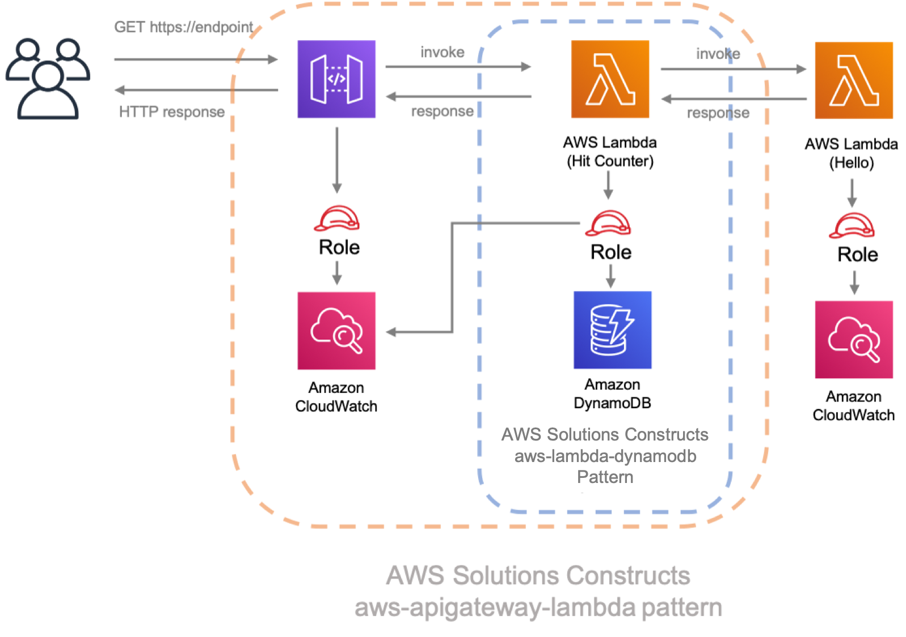
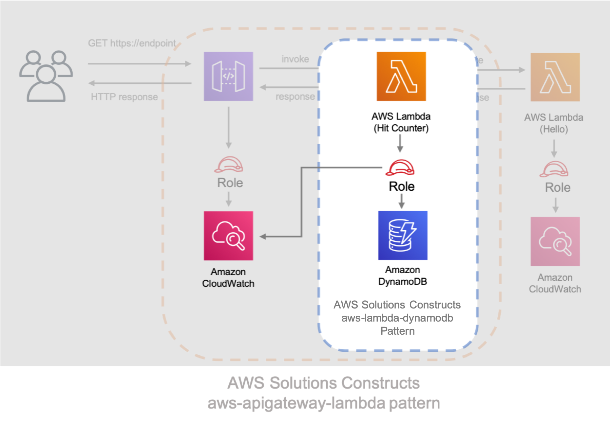
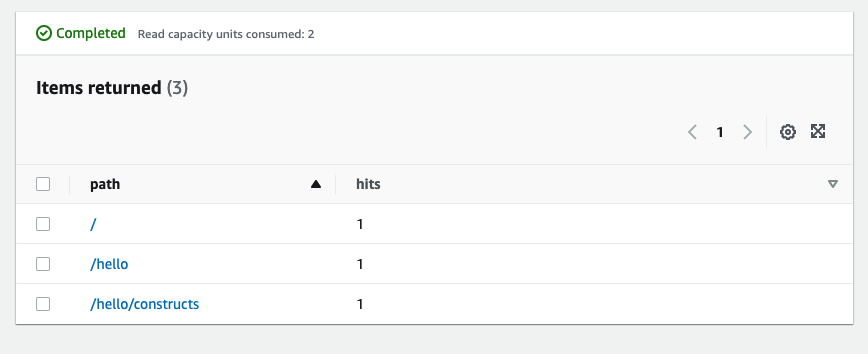

//!!NODE_ROOT <section>

[.topic]
[[walkthrough-part-2-v2,walkthrough-part-2-v2.title]]
= Walkthrough - Part 2
:info_doctype: section
:info_title: Walkthrough - Part 2
:info_titleabbrev: Walkthrough - Part 2
:info_abstract: This tutorial walks you through how to modify the "Hello Constructs" app \
        created in .

[abstract]
--
This tutorial walks you through how to modify the "Hello Constructs" app created in .
--

This tutorial walks you through how to modify the "Hello Constructs" app created in  xref:walkthrough-part-1-v2[part 1,linkend=walkthrough-part-1-v2] . Our modification will add a site hit counter using the AWS Lambda to DynamoDB pattern from AWS Solutions Constructs. Modifying the Hello Constructs app will result in the following solution: 

[[hit-counter-lambda-code,hit-counter-lambda-code.title]]
== Hit Counter Lambda code

Let's get started by writing the code for the Hit Counter AWS Lambda function. This function will:  

* increment a counter related to the API path in a Amazon DynamoDB table, 
* invoke the downstream Hello AWS Lambda function, 
* and return the response to end user. 

====
[role="tablist"]
Typescript::
* Add a file called `lambda/hitcounter.js` with the following contents: 
+
[source,typescript]
----

const { DynamoDB, Lambda } = require('aws-sdk');

exports.handler = async function(event) {
  console.log("request:", JSON.stringify(event, undefined, 2));

  // create AWS SDK clients
  const dynamo = new DynamoDB();
  const lambda = new Lambda();

  // update dynamo entry for "path" with hits++
  await dynamo.updateItem({
    TableName: process.env.DDB_TABLE_NAME,
    Key: { path: { S: event.path } },
    UpdateExpression: 'ADD hits :incr',
    ExpressionAttributeValues: { ':incr': { N: '1' } }
  }).promise();

  // call downstream function and capture response
  const resp = await lambda.invoke({
    FunctionName: process.env.DOWNSTREAM_FUNCTION_NAME,
    Payload: JSON.stringify(event)
  }).promise();

  console.log('downstream response:', JSON.stringify(resp, undefined, 2));

  // return response back to upstream caller
  return JSON.parse(resp.Payload);
};
----

Python::
* Add a file called `lambda/hitcounter.py` with the following contents: 
+
[source,python]
----

import json
import os
import boto3

ddb = boto3.resource('dynamodb')
table = ddb.Table(os.environ['DDB_TABLE_NAME'])
_lambda = boto3.client('lambda')

def handler(event, context):
    print('request: {}'.format(json.dumps(event)))
    table.update_item(
        Key={'path': event['path']},
        UpdateExpression='ADD hits :incr',
        ExpressionAttributeValues={':incr': 1}
    )

    resp = _lambda.invoke(
        FunctionName=os.environ['DOWNSTREAM_FUNCTION_NAME'],
        Payload=json.dumps(event),
    )

    body = resp['Payload'].read()

    print('downstream response: {}'.format(body))
    return json.loads(body)
----

Java::
* Add a file called `lambda/hitcounter.js` with the following contents:
+
[source,typescript]
----

const { DynamoDB, Lambda } = require('aws-sdk');

exports.handler = async function(event) {
  console.log("request:", JSON.stringify(event, undefined, 2));

  // create AWS SDK clients
  const dynamo = new DynamoDB();
  const lambda = new Lambda();

  // update dynamo entry for "path" with hits++
  await dynamo.updateItem({
    TableName: process.env.DDB_TABLE_NAME,
    Key: { path: { S: event.path } },
    UpdateExpression: 'ADD hits :incr',
    ExpressionAttributeValues: { ':incr': { N: '1' } }
  }).promise();

  // call downstream function and capture response
  const resp = await lambda.invoke({
    FunctionName: process.env.DOWNSTREAM_FUNCTION_NAME,
    Payload: JSON.stringify(event)
  }).promise();

  console.log('downstream response:', JSON.stringify(resp, undefined, 2));

  // return response back to upstream caller
  return JSON.parse(resp.Payload);
};
----
====

[[install-the-new-dependency,install-the-new-dependency.title]]
=== Install the new dependency

As usual, we first need to install the dependency we need for our solution update. Install the AWS Solutions Constructs  `aws-lambda-dynamodb` module and all its dependency into our project: 

====
[role="tablist"]
Typescript::
+
[source,typescript]
----

npm install -s @aws-solutions-constructs/aws-lambda-dynamodb
----

Python::
+
[source,python]
----

pip install aws_solutions_constructs.aws_lambda_dynamodb
----

Java::
* Edit the [path]``pom.xml`` file with the following information:
+
[source,xml]
----

<dependency>
    <groupId>software.amazon.awsconstructs</groupId>
    <artifactId>lambdadynamodb</artifactId>
    <version>${solutionconstructs.version}</version>
</dependency>
----
+

Run the command:
+
[source,java]
----

mvn install
----
====

[[w6aab7c17b9b3,define-the-resources.title]]
=== Define the resources

Now, let's update our stack code to accomodate our new architecture.  

First, we are going to import our new dependency and move the "Hello" function outside of the `aws-apigateway-lambda` pattern we created in part 1. 

====
[role="tablist"]
TypeScript::
* Replace the code in `lib/hello-constructs-stack.ts` with the following: 
+
[source,typescript]
----

import { Construct } from 'constructs';
import { Stack, StackProps } from 'aws-cdk-lib';
import * as lambda from 'aws-cdk-lib/aws-lambda';
import * as api from 'aws-cdk-lib/aws-apigateway';
import * as dynamodb from 'aws-cdk-lib/aws-dynamodb';
import { ApiGatewayToLambda, ApiGatewayToLambdaProps } from '@aws-solutions-constructs/aws-apigateway-lambda';
import { LambdaToDynamoDB, LambdaToDynamoDBProps } from '@aws-solutions-constructs/aws-lambda-dynamodb';

export class HelloConstructsStack extends Stack {
  constructor(scope: Construct, id: string, props?: StackProps) {
    super(scope, id, props);

    // The code that defines your stack goes here

    const helloFunc = new lambda.Function(this, 'HelloHandler', {
      runtime: lambda.Runtime.NODEJS_22_X,
      code: lambda.Code.fromAsset('lambda'),
      handler: 'hello.handler'
    });

    const api_lambda_props: ApiGatewayToLambdaProps = {
      lambdaFunctionProps: {
        code: lambda.Code.fromAsset('lambda'),
        runtime: lambda.Runtime.NODEJS_22_X,
        handler: 'hello.handler'
      },
      apiGatewayProps: {
        defaultMethodOptions: {
          authorizationType: api.AuthorizationType.NONE
        }
      }
    };

    new ApiGatewayToLambda(this, 'ApiGatewayToLambda', api_lambda_props);
  }
}
----

Python::
* Replace the code in `hello_constructs/hello_constructs_stack.py` with the following: 
+
[source,python]
----

from constructs import Construct
from aws_cdk import (
    aws_lambda as _lambda,
    aws_apigateway as apigw,
    aws_dynamodb as ddb,
    App,
    Stack
)
from aws_solutions_constructs import (
    aws_apigateway_lambda as apigw_lambda,
    aws_lambda_dynamodb as lambda_ddb
)

class HelloConstructsStack(Stack):

    def __init__(self, scope: Construct, id: str, **kwargs) -> None:
        super().__init__(scope, id, **kwargs)

        # The code that defines your stack goes here

        self._handler = _lambda.Function(
          self, 'HelloHandler',
          runtime=_lambda.Runtime.PYTHON_3_11,
          handler='hello.handler',
          code=_lambda.Code.from_asset('lambda'),
        )

        apigw_lambda.ApiGatewayToLambda(
            self, 'ApiGatewayToLambda',
            lambda_function_props=_lambda.FunctionProps(
                runtime=_lambda.Runtime.PYTHON_3_11,
                code=_lambda.Code.from_asset('lambda'),
                handler='hello.handler',
            ),
            api_gateway_props=apigw.RestApiProps(
                default_method_options=apigw.MethodOptions(
                    authorization_type=apigw.AuthorizationType.NONE
                )
            )
        )
----

Java::
* Replace the code in [path]``HelloConstructsStack.java`` with the following:
+
[source,java]
----

package com.myorg;

import software.constructs.Construct;
import software.amazon.awscdk.Stack;
import software.amazon.awscdk.StackProps;

import software.amazon.awscdk.services.lambda.*;
import software.amazon.awscdk.services.lambda.Runtime;
import software.amazon.awscdk.services.apigateway.*;
import software.amazon.awsconstructs.services.apigatewaylambda.ApiGatewayToLambda;
import software.amazon.awsconstructs.services.apigatewaylambda.ApiGatewayToLambdaProps;

public class HelloConstructsStack extends Stack {
    public HelloConstructsStack(final Construct scope, final String id) {
        this(scope, id, null);
    }

    public HelloConstructsStack(final Construct scope, final String id, final StackProps props) {
        super(scope, id, props);

        final Function hello = Function.Builder.create(this, "HelloHandler")
                .runtime(Runtime.NODEJS_22_X) // execution environment
                .code(Code.fromAsset("lambda")) // code loaded from the "lambda" directory
                .handler("hello.handler") // file is "hello", function is "handler"
                .build();

        new ApiGatewayToLambda(this, "ApiGatewayToLambdaPattern", new ApiGatewayToLambdaProps.Builder()
                .lambdaFunctionProps(new FunctionProps.Builder()
                        .runtime(Runtime.NODEJS_22_X) // execution environment
                        .code(Code.fromAsset("lambda")) // code loaded from the "lambda" directory
                        .handler("hello.handler") // file is "hello", function is "handler"
                        .build())
                .apiGatewayProps(new RestApiProps.Builder()
                        .defaultMethodOptions(new MethodOptions.Builder()
                                .authorizationType(AuthorizationType.NONE)
                                .build())
                        .build())
                .build());
    }
}
----
====

Next, we are going to add the  `aws-lambda-dynamodb` pattern to build out the hit counter service for our updated architecture. 

The next update below defines the properties for the  `aws-lambda-dynamodb` pattern by defining the AWS Lambda function with the Hit Counter handler. Additionally, the Amazon DynamoDB table is defined with a name of `SolutionsConstructsHits` and a partition key of `path` . 

====
[role="tablist"]
TypeScript::
* Edit the file `lib/hello-constructs-stack.ts` with the following: 
+
[source,typescript]
----

import { Construct } from 'constructs';
import { Stack, StackProps, RemovalPolicy } from 'aws-cdk-lib';
import * as lambda from 'aws-cdk-lib/aws-lambda';
import * as api from 'aws-cdk-lib/aws-apigateway';
import * as dynamodb from 'aws-cdk-lib/aws-dynamodb';
import { ApiGatewayToLambda, ApiGatewayToLambdaProps } from '@aws-solutions-constructs/aws-apigateway-lambda';
import { LambdaToDynamoDB, LambdaToDynamoDBProps } from '@aws-solutions-constructs/aws-lambda-dynamodb';

export class HelloConstructsStack extends Stack {
  constructor(scope: Construct, id: string, props?: StackProps) {
    super(scope, id, props);

    // The code that defines your stack goes here

    const helloFunc = new lambda.Function(this, 'HelloHandler', {
      runtime: lambda.Runtime.NODEJS_22_X,
      code: lambda.Code.fromAsset('lambda'),
      handler: 'hello.handler'
    });

    // hit counter, aws-lambda-dynamodb pattern
    const lambda_ddb_props: LambdaToDynamoDBProps = {
      lambdaFunctionProps: {
          code: lambda.Code.fromAsset(`lambda`),
          runtime: lambda.Runtime.NODEJS_22_X,
          handler: 'hitcounter.handler',
          environment: {
              DOWNSTREAM_FUNCTION_NAME: helloFunc.functionName
          }
      },
      dynamoTableProps: {
          tableName: 'SolutionsConstructsHits',
          partitionKey: { name: 'path', type: dynamodb.AttributeType.STRING },
          removalPolicy: RemovalPolicy.DESTROY
      }
    };

    const hitcounter = new LambdaToDynamoDB(this, 'LambdaToDynamoDB', lambda_ddb_props);

    const api_lambda_props: ApiGatewayToLambdaProps = {
      lambdaFunctionProps: {
        code: lambda.Code.fromAsset('lambda'),
        runtime: lambda.Runtime.NODEJS_22_X,
        handler: 'hello.handler'
      },
      apiGatewayProps: {
        defaultMethodOptions: {
          authorizationType: api.AuthorizationType.NONE
        }
      }
    };

    new ApiGatewayToLambda(this, 'ApiGatewayToLambda', api_lambda_props);
  }
}
----

Python::
* Edit the file `hello_constructs/hello_constructs_stack.py` with the following: 
+
[source,python]
----

from constructs import Construct
from aws_cdk import (
    aws_lambda as _lambda,
    aws_apigateway as apigw,
    aws_dynamodb as ddb,
    App,
    Stack,
    RemovalPolicy
)
from aws_solutions_constructs import (
    aws_apigateway_lambda as apigw_lambda,
    aws_lambda_dynamodb as lambda_ddb
)

class HelloConstructsStack(Stack):

    def __init__(self, scope: Construct, id: str, **kwargs) -> None:
        super().__init__(scope, id, **kwargs)

        # The code that defines your stack goes here

        self.hello_func = _lambda.Function(
            self, 'HelloHandler',
            runtime=_lambda.Runtime.PYTHON_3_11,
            handler='hello.handler',
            code=_lambda.Code.from_asset('lambda'),
        )

        #  hit counter, aws-lambda-dynamodb pattern
        self.hit_counter = lambda_ddb.LambdaToDynamoDB(
            self, 'LambdaToDynamoDB',
            lambda_function_props=_lambda.FunctionProps(
                runtime=_lambda.Runtime.PYTHON_3_11,
                code=_lambda.Code.from_asset('lambda'),
                handler='hitcounter.handler',
                environment={
                    'DOWNSTREAM_FUNCTION_NAME': self.hello_func.function_name
                }
            ),
            dynamo_table_props=ddb.TableProps(
                table_name='SolutionsConstructsHits',
                partition_key={
                    'name': 'path',
                    'type': ddb.AttributeType.STRING
                },
                removal_policy=RemovalPolicy.DESTROY
            )
        )

        apigw_lambda.ApiGatewayToLambda(
            self, 'ApiGatewayToLambda',
            lambda_function_props=_lambda.FunctionProps(
                runtime=_lambda.Runtime.PYTHON_3_11,
                code=_lambda.Code.from_asset('lambda'),
                handler='hello.handler',
            ),
            api_gateway_props=apigw.RestApiProps(
                default_method_options=apigw.MethodOptions(
                    authorization_type=apigw.AuthorizationType.NONE
                )
            )
        )
----

Java::
* Edit the file [path]``HelloConstructsStack.java`` with the following:
+
[source,java]
----

package com.myorg;

import java.util.Map;
import java.util.HashMap;

import software.constructs.Construct;
import software.amazon.awscdk.RemovalPolicy;
import software.amazon.awscdk.Stack;
import software.amazon.awscdk.StackProps;

import software.amazon.awscdk.services.lambda.*;
import software.amazon.awscdk.services.lambda.Runtime;
import software.amazon.awscdk.services.apigateway.*;
import software.amazon.awscdk.services.dynamodb.*;
import software.amazon.awsconstructs.services.apigatewaylambda.ApiGatewayToLambda;
import software.amazon.awsconstructs.services.apigatewaylambda.ApiGatewayToLambdaProps;
import software.amazon.awsconstructs.services.lambdadynamodb.*;

public class HelloConstructsStack extends Stack {
    public HelloConstructsStack(final Construct scope, final String id) {
        this(scope, id, null);
    }

    public HelloConstructsStack(final Construct scope, final String id, final StackProps props) {
        super(scope, id, props);

        final Function helloFunc = Function.Builder.create(this, "HelloHandler")
                .runtime(Runtime.NODEJS_22_X) // execution environment
                .code(Code.fromAsset("lambda")) // code loaded from the "lambda" directory
                .handler("hello.handler") // file is "hello", function is "handler"
                .build();

        final Map<String, String> lambdaEnvironment = new HashMap<>();
        lambdaEnvironment.put("DOWNSTREAM_FUNCTION_NAME", helloFunc.getFunctionName());

        final LambdaToDynamoDB hitcounter = new LambdaToDynamoDB(this, "LambdaToDynamoDBPattern",
                new LambdaToDynamoDBProps.Builder()
                        .lambdaFunctionProps(new FunctionProps.Builder()
                                .runtime(Runtime.NODEJS_22_X) // execution environment
                                .code(Code.fromAsset("lambda")) // code loaded from the "lambda" directory
                                .handler("hitcounter.handler") // file is "hello", function is "handler"
                                .environment(lambdaEnvironment)
                                .build())
                        .dynamoTableProps(new TableProps.Builder()
                                .tableName("SolutionsConstructsHits")
                                .partitionKey(new Attribute.Builder()
                                        .name("path")
                                        .type(AttributeType.STRING)
                                        .build())
                                .removalPolicy(RemovalPolicy.DESTROY)
                                .build())
                        .build());

        new ApiGatewayToLambda(this, "ApiGatewayToLambdaPattern", new ApiGatewayToLambdaProps.Builder()
                .lambdaFunctionProps(new FunctionProps.Builder()
                        .runtime(Runtime.NODEJS_22_X) // execution environment
                        .code(Code.fromAsset("lambda")) // code loaded from the "lambda" directory
                        .handler("hello.handler") // file is "hello", function is "handler"
                        .build())
                .apiGatewayProps(new RestApiProps.Builder()
                        .defaultMethodOptions(new MethodOptions.Builder()
                                .authorizationType(AuthorizationType.NONE)
                                .build())
                        .build())
                .build());
    }
}
----
====

Next, we need to grant the Hit Counter function created from the  `aws-lambda-dynamodb` pattern added above permission to invoke our Hello function. 

====
[role="tablist"]
TypeScript::
* Edit the file `lib/hello-constructs-stack.ts` with the following: 
+
[source,typescript]
----

import { Construct } from 'constructs';
import { Stack, StackProps, RemovalPolicy } from 'aws-cdk-lib';
import * as lambda from 'aws-cdk-lib/aws-lambda';
import * as api from 'aws-cdk-lib/aws-apigateway';
import * as dynamodb from 'aws-cdk-lib/aws-dynamodb';
import { ApiGatewayToLambda, ApiGatewayToLambdaProps } from '@aws-solutions-constructs/aws-apigateway-lambda';
import { LambdaToDynamoDB, LambdaToDynamoDBProps } from '@aws-solutions-constructs/aws-lambda-dynamodb';

  export class HelloConstructsStack extends Stack {
    constructor(scope: Construct, id: string, props?: StackProps) {
      super(scope, id, props);

      // The code that defines your stack goes here

      // hello function responding to http requests
      const helloFunc = new lambda.Function(this, 'HelloHandler', {
        runtime: lambda.Runtime.NODEJS_22_X,
        code: lambda.Code.fromAsset('lambda'),
        handler: 'hello.handler'
      });

      // hit counter, aws-lambda-dynamodb pattern
      const lambda_ddb_props: LambdaToDynamoDBProps = {
        lambdaFunctionProps: {
            code: lambda.Code.fromAsset(`lambda`),
            runtime: lambda.Runtime.NODEJS_22_X,
            handler: 'hitcounter.handler',
            environment: {
                DOWNSTREAM_FUNCTION_NAME: helloFunc.functionName
            }
        },
        dynamoTableProps: {
            tableName: 'SolutionsConstructsHits',
            partitionKey: { name: 'path', type: dynamodb.AttributeType.STRING },
            removalPolicy: RemovalPolicy.DESTROY
        }
      };

      const hitcounter = new LambdaToDynamoDB(this, 'LambdaToDynamoDB', lambda_ddb_props);

      // grant the hitcounter lambda role invoke permissions to the hello function
      helloFunc.grantInvoke(hitcounter.lambdaFunction);

      const api_lambda_props: ApiGatewayToLambdaProps = {
        lambdaFunctionProps: {
          code: lambda.Code.fromAsset('lambda'),
          runtime: lambda.Runtime.NODEJS_22_X,
          handler: 'hello.handler'
        },
        apiGatewayProps: {
          defaultMethodOptions: {
            authorizationType: api.AuthorizationType.NONE
          }
        }
      };

      new ApiGatewayToLambda(this, 'ApiGatewayToLambda', api_lambda_props);
    }
  }
----

Python::
* Edit the file `hello_constructs/hello_constructs_stack.py` with the following: 
+
[source,python]
----

from constructs import Construct
from aws_cdk import (
    aws_lambda as _lambda,
    aws_apigateway as apigw,
    aws_dynamodb as ddb,
    App,
    Stack,
    RemovalPolicy
)

from aws_solutions_constructs import (
    aws_apigateway_lambda as apigw_lambda,
    aws_lambda_dynamodb as lambda_ddb
)

class HelloConstructsStack(Stack):

    def __init__(self, scope: Construct, id: str, **kwargs) -> None:
        super().__init__(scope, id, **kwargs)

        # The code that defines your stack goes here

        self.hello_func = _lambda.Function(
          self, 'HelloHandler',
          runtime=_lambda.Runtime.PYTHON_3_11,
          handler='hello.handler',
          code=_lambda.Code.from_asset('lambda'),
        )

        #  hit counter, aws-lambda-dynamodb pattern
        self.hit_counter = lambda_ddb.LambdaToDynamoDB(
            self, 'LambdaToDynamoDB',
            lambda_function_props=_lambda.FunctionProps(
                runtime=_lambda.Runtime.PYTHON_3_11,
                code=_lambda.Code.from_asset('lambda'),
                handler='hitcounter.handler',
                environment={
                    'DOWNSTREAM_FUNCTION_NAME': self.hello_func.function_name
                }
            ),
            dynamo_table_props=ddb.TableProps(
                table_name='SolutionsConstructsHits',
                partition_key={
                    'name': 'path',
                    'type': ddb.AttributeType.STRING
                },
                removal_policy=RemovalPolicy.DESTROY
            )
        )

        # grant the hitcounter lambda role invoke permissions to the hello function
        self.hello_func.grant_invoke(self.hit_counter.lambda_function)

        apigw_lambda.ApiGatewayToLambda(
            self, 'ApiGatewayToLambda',
            lambda_function_props=_lambda.FunctionProps(
                runtime=_lambda.Runtime.PYTHON_3_11,
                code=_lambda.Code.from_asset('lambda'),
                handler='hello.handler',
            ),
            api_gateway_props=apigw.RestApiProps(
                default_method_options=apigw.MethodOptions(
                    authorization_type=apigw.AuthorizationType.NONE
                )
            )
        )
----

Java::
* Edit the file [path]``src/../HelloConstructsStack.java`` with the following:
+
[source,java]
----

package com.myorg;

import java.util.Map;
import java.util.HashMap;

import software.constructs.Construct;
import software.amazon.awscdk.RemovalPolicy;
import software.amazon.awscdk.Stack;
import software.amazon.awscdk.StackProps;

import software.amazon.awscdk.services.lambda.*;
import software.amazon.awscdk.services.lambda.Runtime;
import software.amazon.awscdk.services.apigateway.*;
import software.amazon.awscdk.services.dynamodb.*;
import software.amazon.awsconstructs.services.apigatewaylambda.ApiGatewayToLambda;
import software.amazon.awsconstructs.services.apigatewaylambda.ApiGatewayToLambdaProps;
import software.amazon.awsconstructs.services.lambdadynamodb.*;

public class HelloConstructsStack extends Stack {
    public HelloConstructsStack(final Construct scope, final String id) {
        this(scope, id, null);
    }

    public HelloConstructsStack(final Construct scope, final String id, final StackProps props) {
        super(scope, id, props);

        final Function helloFunc = Function.Builder.create(this, "HelloHandler")
                .runtime(Runtime.NODEJS_22_X) // execution environment
                .code(Code.fromAsset("lambda")) // code loaded from the "lambda" directory
                .handler("hello.handler") // file is "hello", function is "handler"
                .build();

        final Map<String, String> lambdaEnvironment = new HashMap<>();
        lambdaEnvironment.put("DOWNSTREAM_FUNCTION_NAME", helloFunc.getFunctionName());

        final LambdaToDynamoDB hitcounter = new LambdaToDynamoDB(this, "LambdaToDynamoDBPattern",
                new LambdaToDynamoDBProps.Builder()
                        .lambdaFunctionProps(new FunctionProps.Builder()
                                .runtime(Runtime.NODEJS_22_X) // execution environment
                                .code(Code.fromAsset("lambda")) // code loaded from the "lambda" directory
                                .handler("hitcounter.handler") // file is "hello", function is "handler"
                                .environment(lambdaEnvironment)
                                .build())
                        .dynamoTableProps(new TableProps.Builder()
                                .tableName("SolutionsConstructsHits")
                                .partitionKey(new Attribute.Builder()
                                        .name("path")
                                        .type(AttributeType.STRING)
                                        .build())
                                .removalPolicy(RemovalPolicy.DESTROY)
                                .build())
                        .build());

        // grant the hitcounter lambda role invoke permissions to the hello function
        helloFunc.grantInvoke(hitcounter.getLambdaFunction());

        new ApiGatewayToLambda(this, "ApiGatewayToLambdaPattern", new ApiGatewayToLambdaProps.Builder()
                .lambdaFunctionProps(new FunctionProps.Builder()
                        .runtime(Runtime.NODEJS_22_X) // execution environment
                        .code(Code.fromAsset("lambda")) // code loaded from the "lambda" directory
                        .handler("hello.handler") // file is "hello", function is "handler"
                        .build())
                .apiGatewayProps(new RestApiProps.Builder()
                        .defaultMethodOptions(new MethodOptions.Builder()
                                .authorizationType(AuthorizationType.NONE)
                                .build())
                        .build())
                .build());
    }
}
----
====

Finally, we need to update our original  `aws-apigateway-lambda` pattern to utilize our new Hit Counter function that was provisioned with the `aws-lambda-dynamodb` pattern above. 

====
[role="tablist"]
TypeScript::
* Edit the file `lib/hello-constructs-stack.ts` with the following: 
+
[source,typescript]
----

import { Construct } from 'constructs';
import { Stack, StackProps, RemovalPolicy } from 'aws-cdk-lib';
import * as lambda from 'aws-cdk-lib/aws-lambda';
import * as api from 'aws-cdk-lib/aws-apigateway';
import * as dynamodb from 'aws-cdk-lib/aws-dynamodb';
import { ApiGatewayToLambda, ApiGatewayToLambdaProps } from '@aws-solutions-constructs/aws-apigateway-lambda';
import { LambdaToDynamoDB, LambdaToDynamoDBProps } from '@aws-solutions-constructs/aws-lambda-dynamodb';

export class HelloConstructsStack extends Stack {
  constructor(scope: Construct, id: string, props?: StackProps) {
    super(scope, id, props);

    // The code that defines your stack goes here

    // hello function responding to http requests
    const helloFunc = new lambda.Function(this, 'HelloHandler', {
      runtime: lambda.Runtime.NODEJS_22_X,
      code: lambda.Code.fromAsset('lambda'),
      handler: 'hello.handler'
    });

    // hit counter, aws-lambda-dynamodb pattern
    const lambda_ddb_props: LambdaToDynamoDBProps = {
      lambdaFunctionProps: {
        code: lambda.Code.fromAsset(`lambda`),
        runtime: lambda.Runtime.NODEJS_22_X,
        handler: 'hitcounter.handler',
        environment: {
          DOWNSTREAM_FUNCTION_NAME: helloFunc.functionName
        }
      },
      dynamoTableProps: {
        tableName: 'SolutionsConstructsHits',
        partitionKey: { name: 'path', type: dynamodb.AttributeType.STRING },
        removalPolicy: RemovalPolicy.DESTROY
      }
    };

    const hitcounter = new LambdaToDynamoDB(this, 'LambdaToDynamoDB', lambda_ddb_props);

    // grant the hitcounter lambda role invoke permissions to the hello function
    helloFunc.grantInvoke(hitcounter.lambdaFunction);

    const api_lambda_props: ApiGatewayToLambdaProps = {
      existingLambdaObj: hitcounter.lambdaFunction,
      apiGatewayProps: {
        defaultMethodOptions: {
          authorizationType: api.AuthorizationType.NONE
        }
      }
    };

    new ApiGatewayToLambda(this, 'ApiGatewayToLambda', api_lambda_props);
  }
}
----

Python::
* Edit the file `hello_constructs/hello_constructs_stack.py` with the following: 
+
[source,python]
----

from constructs import Construct
from aws_cdk import (
    aws_lambda as _lambda,
    aws_apigateway as apigw,
    aws_dynamodb as ddb,
    App,
    Stack,
    RemovalPolicy
)

from aws_solutions_constructs import (
    aws_apigateway_lambda as apigw_lambda,
    aws_lambda_dynamodb as lambda_ddb
)

class HelloConstructsStack(Stack):

    def __init__(self, scope: Construct, id: str, **kwargs) -> None:
        super().__init__(scope, id, **kwargs)

        # The code that defines your stack goes here

        self.hello_func = _lambda.Function(
          self, 'HelloHandler',
          runtime=_lambda.Runtime.PYTHON_3_11,
          handler='hello.handler',
          code=_lambda.Code.from_asset('lambda'),
        )

        #  hit counter, aws-lambda-dynamodb pattern
        self.hit_counter = lambda_ddb.LambdaToDynamoDB(
            self, 'LambdaToDynamoDB',
            lambda_function_props=_lambda.FunctionProps(
                runtime=_lambda.Runtime.PYTHON_3_11,
                code=_lambda.Code.from_asset('lambda'),
                handler='hitcounter.handler',
                environment={
                    'DOWNSTREAM_FUNCTION_NAME': self.hello_func.function_name
                }
            ),
            dynamo_table_props=ddb.TableProps(
                table_name='SolutionsConstructsHits',
                partition_key={
                    'name': 'path',
                    'type': ddb.AttributeType.STRING
                },
                removal_policy=RemovalPolicy.DESTROY
            )
        )

        # grant the hitcounter lambda role invoke permissions to the hello function
        self.hello_func.grant_invoke(self.hit_counter.lambda_function)

        apigw_lambda.ApiGatewayToLambda(
            self, 'ApiGatewayToLambda',
            existing_lambda_obj=self.hit_counter.lambda_function,
            api_gateway_props=apigw.RestApiProps(
                default_method_options=apigw.MethodOptions(
                    authorization_type=apigw.AuthorizationType.NONE
                )
            )
        )
----

Java::
* Edit the file [path]``src/../HelloConstructsStack.java`` with the following:
+
[source,java]
----

package com.myorg;

import java.util.Map;
import java.util.HashMap;

import software.constructs.Construct;
import software.amazon.awscdk.RemovalPolicy;
import software.amazon.awscdk.Stack;
import software.amazon.awscdk.StackProps;

import software.amazon.awscdk.services.lambda.*;
import software.amazon.awscdk.services.lambda.Runtime;
import software.amazon.awscdk.services.apigateway.*;
import software.amazon.awscdk.services.dynamodb.*;
import software.amazon.awsconstructs.services.apigatewaylambda.ApiGatewayToLambda;
import software.amazon.awsconstructs.services.apigatewaylambda.ApiGatewayToLambdaProps;
import software.amazon.awsconstructs.services.lambdadynamodb.*;

public class HelloConstructsStack extends Stack {
    public HelloConstructsStack(final Construct scope, final String id) {
        this(scope, id, null);
    }

    public HelloConstructsStack(final Construct scope, final String id, final StackProps props) {
        super(scope, id, props);

        final Function helloFunc = Function.Builder.create(this, "HelloHandler")
                .runtime(Runtime.NODEJS_22_X) // execution environment
                .code(Code.fromAsset("lambda")) // code loaded from the "lambda" directory
                .handler("hello.handler") // file is "hello", function is "handler"
                .build();

        final Map<String, String> lambdaEnvironment = new HashMap<>();
        lambdaEnvironment.put("DOWNSTREAM_FUNCTION_NAME", helloFunc.getFunctionName());

        final LambdaToDynamoDB hitcounter = new LambdaToDynamoDB(this, "LambdaToDynamoDBPattern",
                new LambdaToDynamoDBProps.Builder()
                        .lambdaFunctionProps(new FunctionProps.Builder()
                                .runtime(Runtime.NODEJS_22_X) // execution environment
                                .code(Code.fromAsset("lambda")) // code loaded from the "lambda" directory
                                .handler("hitcounter.handler") // file is "hitcounter", function is "handler"
                                .environment(lambdaEnvironment)
                                .build())
                        .dynamoTableProps(new TableProps.Builder()
                                .tableName("SolutionsConstructsHits")
                                .partitionKey(new Attribute.Builder()
                                        .name("path")
                                        .type(AttributeType.STRING)
                                        .build())
                                .removalPolicy(RemovalPolicy.DESTROY)
                                .build())
                        .build());

        // grant the hitcounter lambda role invoke permissions to the hello function
        helloFunc.grantInvoke(hitcounter.getLambdaFunction());

        final ApiGatewayToLambda apigwLambda = new ApiGatewayToLambda(this, "ApiGatewayToLambdaPattern",
                new ApiGatewayToLambdaProps.Builder()
                        .apiGatewayProps(new RestApiProps.Builder()
                                .defaultMethodOptions(MethodOptions.builder()
                                        .authorizationType(AuthorizationType.NONE)
                                        .build())
                                .build())
                        .existingLambdaObj(hitcounter.getLambdaFunction())
                        .build());
    }
}
----
====

[[review-the-changes,review-the-changes.title]]
== Review the changes

Let`'s build our project and review the changes to our resources that will happen when we deploy this:  

====
[role="tablist"]
Typescript::
+
[source,typescript]
----

npm run build
cdk diff
----

Python::
+
[source,python]
----

cdk diff
----

Java::
+
[source,java]
----

mvn package
cdk diff
----
====

Our output should look like this:  

----
IAM Statement Changes
┌───┬────────────┬────────┬────────────┬────────────┬──────────────┐
│   │ Resource   │ Effect │ Action     │ Principal  │ Condition    │
├───┼────────────┼────────┼────────────┼────────────┼──────────────┤
│ - │ ${ApiGatew │ Allow  │ lambda:Inv │ Service:ap │ "ArnLike": { │
│   │ ayToLambda │        │ okeFunctio │ igateway.a │   "AWS:Sourc │
│   │ PatternLam │        │ n          │ mazonaws.c │ eArn": "arn: │
│   │ bdaFunctio │        │            │ om         │ ${AWS::Parti │
│   │ n5DC51B7E. │        │            │            │ tion}:execut │
│   │ Arn}       │        │            │            │ e-api:${AWS: │
│   │            │        │            │            │ :Region}:${A │
│   │            │        │            │            │ WS::AccountI │
│   │            │        │            │            │ d}:${ApiGate │
│   │            │        │            │            │ wayToLambdaP │
│   │            │        │            │            │ atternLambda │
│   │            │        │            │            │ RestApiC0598 │
│   │            │        │            │            │ E46}/${ApiGa │
│   │            │        │            │            │ tewayToLambd │
│   │            │        │            │            │ aPattern/Lam │
│   │            │        │            │            │ bdaRestApi/D │
│   │            │        │            │            │ eploymentSta │
│   │            │        │            │            │ ge.prod}/*/* │
│   │            │        │            │            │ "            │
│   │            │        │            │            │ }            │
│ - │ ${ApiGatew │ Allow  │ lambda:Inv │ Service:ap │ "ArnLike": { │
│   │ ayToLambda │        │ okeFunctio │ igateway.a │   "AWS:Sourc │
│   │ PatternLam │        │ n          │ mazonaws.c │ eArn": "arn: │
│   │ bdaFunctio │        │            │ om         │ ${AWS::Parti │
│   │ n5DC51B7E. │        │            │            │ tion}:execut │
│   │ Arn}       │        │            │            │ e-api:${AWS: │
│   │            │        │            │            │ :Region}:${A │
│   │            │        │            │            │ WS::AccountI │
│   │            │        │            │            │ d}:${ApiGate │
│   │            │        │            │            │ wayToLambdaP │
│   │            │        │            │            │ atternLambda │
│   │            │        │            │            │ RestApiC0598 │
│   │            │        │            │            │ E46}/test-in │
│   │            │        │            │            │ voke-stage/* │
│   │            │        │            │            │ /*"          │
│   │            │        │            │            │ }            │
│ - │ ${ApiGatew │ Allow  │ lambda:Inv │ Service:ap │ "ArnLike": { │
│   │ ayToLambda │        │ okeFunctio │ igateway.a │   "AWS:Sourc │
│   │ PatternLam │        │ n          │ mazonaws.c │ eArn": "arn: │
│   │ bdaFunctio │        │            │ om         │ ${AWS::Parti │
│   │ n5DC51B7E. │        │            │            │ tion}:execut │
│   │ Arn}       │        │            │            │ e-api:${AWS: │
│   │            │        │            │            │ :Region}:${A │
│   │            │        │            │            │ WS::AccountI │
│   │            │        │            │            │ d}:${ApiGate │
│   │            │        │            │            │ wayToLambdaP │
│   │            │        │            │            │ atternLambda │
│   │            │        │            │            │ RestApiC0598 │
│   │            │        │            │            │ E46}/${ApiGa │
│   │            │        │            │            │ tewayToLambd │
│   │            │        │            │            │ aPattern/Lam │
│   │            │        │            │            │ bdaRestApi/D │
│   │            │        │            │            │ eploymentSta │
│   │            │        │            │            │ ge.prod}/*/" │
│   │            │        │            │            │ }            │
│ - │ ${ApiGatew │ Allow  │ lambda:Inv │ Service:ap │ "ArnLike": { │
│   │ ayToLambda │        │ okeFunctio │ igateway.a │   "AWS:Sourc │
│   │ PatternLam │        │ n          │ mazonaws.c │ eArn": "arn: │
│   │ bdaFunctio │        │            │ om         │ ${AWS::Parti │
│   │ n5DC51B7E. │        │            │            │ tion}:execut │
│   │ Arn}       │        │            │            │ e-api:${AWS: │
│   │            │        │            │            │ :Region}:${A │
│   │            │        │            │            │ WS::AccountI │
│   │            │        │            │            │ d}:${ApiGate │
│   │            │        │            │            │ wayToLambdaP │
│   │            │        │            │            │ atternLambda │
│   │            │        │            │            │ RestApiC0598 │
│   │            │        │            │            │ E46}/test-in │
│   │            │        │            │            │ voke-stage/* │
│   │            │        │            │            │ /"           │
│   │            │        │            │            │ }            │
├───┼────────────┼────────┼────────────┼────────────┼──────────────┤
│ - │ *          │ Allow  │ xray:PutTe │ AWS:${ApiG │              │
│   │            │        │ lemetryRec │ atewayToLa │              │
│   │            │        │ ords       │ mbdaPatter │              │
│   │            │        │ xray:PutTr │ nLambdaFun │              │
│   │            │        │ aceSegment │ ctionServi │              │
│   │            │        │ s          │ ceRole0C12 │              │
│   │            │        │            │ 3D8D}      │              │
├───┼────────────┼────────┼────────────┼────────────┼──────────────┤
│ + │ ${HelloHan │ Allow  │ lambda:Inv │ AWS:${Lamb │              │
│   │ dler.Arn}  │        │ okeFunctio │ daToDynamo │              │
│   │ ${HelloHan │        │ n          │ DBPattern/ │              │
│   │ dler.Arn}: │        │            │ LambdaFunc │              │
│   │ *          │        │            │ tionServic │              │
│   │            │        │            │ eRole}     │              │
├───┼────────────┼────────┼────────────┼────────────┼──────────────┤
│ + │ ${HelloHan │ Allow  │ sts:Assume │ Service:la │              │
│   │ dler/Servi │        │ Role       │ mbda.amazo │              │
│   │ ceRole.Arn │        │            │ naws.com   │              │
│   │ }          │        │            │            │              │
├───┼────────────┼────────┼────────────┼────────────┼──────────────┤
│ + │ ${LambdaTo │ Allow  │ dynamodb:B │ AWS:${Lamb │              │
│   │ DynamoDBPa │        │ atchGetIte │ daToDynamo │              │
│   │ ttern/Dyna │        │ m          │ DBPattern/ │              │
│   │ moTable.Ar │        │ dynamodb:B │ LambdaFunc │              │
│   │ n}         │        │ atchWriteI │ tionServic │              │
│   │            │        │ tem        │ eRole}     │              │
│   │            │        │ dynamodb:C │            │              │
│   │            │        │ onditionCh │            │              │
│   │            │        │ eckItem    │            │              │
│   │            │        │ dynamodb:D │            │              │
│   │            │        │ eleteItem  │            │              │
│   │            │        │ dynamodb:D │            │              │
│   │            │        │ escribeTab │            │              │
│   │            │        │ le         │            │              │
│   │            │        │ dynamodb:G │            │              │
│   │            │        │ etItem     │            │              │
│   │            │        │ dynamodb:G │            │              │
│   │            │        │ etRecords  │            │              │
│   │            │        │ dynamodb:G │            │              │
│   │            │        │ etShardIte │            │              │
│   │            │        │ rator      │            │              │
│   │            │        │ dynamodb:P │            │              │
│   │            │        │ utItem     │            │              │
│   │            │        │ dynamodb:Q │            │              │
│   │            │        │ uery       │            │              │
│   │            │        │ dynamodb:S │            │              │
│   │            │        │ can        │            │              │
│   │            │        │ dynamodb:U │            │              │
│   │            │        │ pdateItem  │            │              │
├───┼────────────┼────────┼────────────┼────────────┼──────────────┤
│ + │ ${LambdaTo │ Allow  │ lambda:Inv │ Service:ap │ "ArnLike": { │
│   │ DynamoDBPa │        │ okeFunctio │ igateway.a │   "AWS:Sourc │
│   │ ttern/Lamb │        │ n          │ mazonaws.c │ eArn": "arn: │
│   │ daFunction │        │            │ om         │ ${AWS::Parti │
│   │ .Arn}      │        │            │            │ tion}:execut │
│   │            │        │            │            │ e-api:${AWS: │
│   │            │        │            │            │ :Region}:${A │
│   │            │        │            │            │ WS::AccountI │
│   │            │        │            │            │ d}:${ApiGate │
│   │            │        │            │            │ wayToLambdaP │
│   │            │        │            │            │ atternLambda │
│   │            │        │            │            │ RestApiC0598 │
│   │            │        │            │            │ E46}/${ApiGa │
│   │            │        │            │            │ tewayToLambd │
│   │            │        │            │            │ aPattern/Lam │
│   │            │        │            │            │ bdaRestApi/D │
│   │            │        │            │            │ eploymentSta │
│   │            │        │            │            │ ge.prod}/*/* │
│   │            │        │            │            │ "            │
│   │            │        │            │            │ }            │
│ + │ ${LambdaTo │ Allow  │ lambda:Inv │ Service:ap │ "ArnLike": { │
│   │ DynamoDBPa │        │ okeFunctio │ igateway.a │   "AWS:Sourc │
│   │ ttern/Lamb │        │ n          │ mazonaws.c │ eArn": "arn: │
│   │ daFunction │        │            │ om         │ ${AWS::Parti │
│   │ .Arn}      │        │            │            │ tion}:execut │
│   │            │        │            │            │ e-api:${AWS: │
│   │            │        │            │            │ :Region}:${A │
│   │            │        │            │            │ WS::AccountI │
│   │            │        │            │            │ d}:${ApiGate │
│   │            │        │            │            │ wayToLambdaP │
│   │            │        │            │            │ atternLambda │
│   │            │        │            │            │ RestApiC0598 │
│   │            │        │            │            │ E46}/test-in │
│   │            │        │            │            │ voke-stage/* │
│   │            │        │            │            │ /*"          │
│   │            │        │            │            │ }            │
│ + │ ${LambdaTo │ Allow  │ lambda:Inv │ Service:ap │ "ArnLike": { │
│   │ DynamoDBPa │        │ okeFunctio │ igateway.a │   "AWS:Sourc │
│   │ ttern/Lamb │        │ n          │ mazonaws.c │ eArn": "arn: │
│   │ daFunction │        │            │ om         │ ${AWS::Parti │
│   │ .Arn}      │        │            │            │ tion}:execut │
│   │            │        │            │            │ e-api:${AWS: │
│   │            │        │            │            │ :Region}:${A │
│   │            │        │            │            │ WS::AccountI │
│   │            │        │            │            │ d}:${ApiGate │
│   │            │        │            │            │ wayToLambdaP │
│   │            │        │            │            │ atternLambda │
│   │            │        │            │            │ RestApiC0598 │
│   │            │        │            │            │ E46}/${ApiGa │
│   │            │        │            │            │ tewayToLambd │
│   │            │        │            │            │ aPattern/Lam │
│   │            │        │            │            │ bdaRestApi/D │
│   │            │        │            │            │ eploymentSta │
│   │            │        │            │            │ ge.prod}/*/" │
│   │            │        │            │            │ }            │
│ + │ ${LambdaTo │ Allow  │ lambda:Inv │ Service:ap │ "ArnLike": { │
│   │ DynamoDBPa │        │ okeFunctio │ igateway.a │   "AWS:Sourc │
│   │ ttern/Lamb │        │ n          │ mazonaws.c │ eArn": "arn: │
│   │ daFunction │        │            │ om         │ ${AWS::Parti │
│   │ .Arn}      │        │            │            │ tion}:execut │
│   │            │        │            │            │ e-api:${AWS: │
│   │            │        │            │            │ :Region}:${A │
│   │            │        │            │            │ WS::AccountI │
│   │            │        │            │            │ d}:${ApiGate │
│   │            │        │            │            │ wayToLambdaP │
│   │            │        │            │            │ atternLambda │
│   │            │        │            │            │ RestApiC0598 │
│   │            │        │            │            │ E46}/test-in │
│   │            │        │            │            │ voke-stage/* │
│   │            │        │            │            │ /"           │
│   │            │        │            │            │ }            │
├───┼────────────┼────────┼────────────┼────────────┼──────────────┤
│ + │ ${LambdaTo │ Allow  │ sts:Assume │ Service:la │              │
│   │ DynamoDBPa │        │ Role       │ mbda.amazo │              │
│   │ ttern/Lamb │        │            │ naws.com   │              │
│   │ daFunction │        │            │            │              │
│   │ ServiceRol │        │            │            │              │
│   │ e.Arn}     │        │            │            │              │
├───┼────────────┼────────┼────────────┼────────────┼──────────────┤
│ + │ *          │ Allow  │ xray:PutTe │ AWS:${Lamb │              │
│   │            │        │ lemetryRec │ daToDynamo │              │
│   │            │        │ ords       │ DBPattern/ │              │
│   │            │        │ xray:PutTr │ LambdaFunc │              │
│   │            │        │ aceSegment │ tionServic │              │
│   │            │        │ s          │ eRole}     │              │
├───┼────────────┼────────┼────────────┼────────────┼──────────────┤
│ + │ arn:${AWS: │ Allow  │ logs:Creat │ AWS:${Lamb │              │
│   │ :Partition │        │ eLogGroup  │ daToDynamo │              │
│   │ }:logs:${A │        │ logs:Creat │ DBPattern/ │              │
│   │ WS::Region │        │ eLogStream │ LambdaFunc │              │
│   │ }:${AWS::A │        │ logs:PutLo │ tionServic │              │
│   │ ccountId}: │        │ gEvents    │ eRole}     │              │
│   │ log-group: │        │            │            │              │
│   │ /aws/lambd │        │            │            │              │
│   │ a/*        │        │            │            │              │
└───┴────────────┴────────┴────────────┴────────────┴──────────────┘
IAM Policy Changes
┌───┬──────────────────────────────┬───────────────────────────────┐
│   │ Resource                     │ Managed Policy ARN            │
├───┼──────────────────────────────┼───────────────────────────────┤
│ + │ ${HelloHandler/ServiceRole}  │ arn:${AWS::Partition}:iam::aw │
│   │                              │ s:policy/service-role/AWSLamb │
│   │                              │ daBasicExecutionRole          │
└───┴──────────────────────────────┴───────────────────────────────┘
(NOTE: There may be security-related changes not in this list. See https://github.com/aws/aws-cdk/issues/1299)

Resources
[-] AWS::IAM::Role ApiGatewayToLambdaPatternLambdaFunctionServiceRole0C123D8D destroy
[-] AWS::IAM::Policy ApiGatewayToLambdaPatternLambdaFunctionServiceRoleDefaultPolicy253751F2 destroy
[-] AWS::Lambda::Function ApiGatewayToLambdaPatternLambdaFunction5DC51B7E destroy
[-] AWS::ApiGateway::Deployment ApiGatewayToLambdaPatternLambdaRestApiDeployment4109DB93346ab5d96a64d161f4cf4f020d3cdf94 destroy
[+] AWS::IAM::Role HelloHandler/ServiceRole HelloHandlerServiceRole11EF7C63 
[+] AWS::Lambda::Function HelloHandler HelloHandler2E4FBA4D 
[+] AWS::IAM::Role LambdaToDynamoDBPattern/LambdaFunctionServiceRole LambdaToDynamoDBPatternLambdaFunctionServiceRoleAAE562DF 
[+] AWS::IAM::Policy LambdaToDynamoDBPattern/LambdaFunctionServiceRole/DefaultPolicy LambdaToDynamoDBPatternLambdaFunctionServiceRoleDefaultPolicy13FCEF5D 
[+] AWS::Lambda::Function LambdaToDynamoDBPattern/LambdaFunction LambdaToDynamoDBPatternLambdaFunctionCEB12909 
[+] AWS::DynamoDB::Table LambdaToDynamoDBPattern/DynamoTable LambdaToDynamoDBPatternDynamoTable4B679F88 
[+] AWS::ApiGateway::Deployment ApiGatewayToLambdaPattern/LambdaRestApi/Deployment ApiGatewayToLambdaPatternLambdaRestApiDeployment4109DB93cb22f0825c29c1c2a437398f022ebdb0 
[~] AWS::ApiGateway::Stage ApiGatewayToLambdaPattern/LambdaRestApi/DeploymentStage.prod ApiGatewayToLambdaPatternLambdaRestApiDeploymentStageprodFDEB8074 
 └─ [~] DeploymentId
     └─ [~] .Ref:
         ├─ [-] ApiGatewayToLambdaPatternLambdaRestApiDeployment4109DB93346ab5d96a64d161f4cf4f020d3cdf94
         └─ [+] ApiGatewayToLambdaPatternLambdaRestApiDeployment4109DB93cb22f0825c29c1c2a437398f022ebdb0
[~] AWS::Lambda::Permission ApiGatewayToLambdaPattern/LambdaRestApi/Default/{proxy+}/ANY/ApiPermission.HelloConstructsStackApiGatewayToLambdaPatternLambdaRestApi553584F5.ANY..{proxy+} ApiGatewayToLambdaPatternLambdaRestApiproxyANYApiPermissionHelloConstructsStackApiGatewayToLambdaPatternLambdaRestApi553584F5ANYproxy1D514583 replace
 └─ [~] FunctionName (requires replacement)
     └─ [~] .Fn::GetAtt:
         └─ @@ -1,4 +1,4 @@
            [ ] [
            [-]   "ApiGatewayToLambdaPatternLambdaFunction5DC51B7E",
            [+]   "LambdaToDynamoDBPatternLambdaFunctionCEB12909",
            [ ]   "Arn"
            [ ] ]
[~] AWS::Lambda::Permission ApiGatewayToLambdaPattern/LambdaRestApi/Default/{proxy+}/ANY/ApiPermission.Test.HelloConstructsStackApiGatewayToLambdaPatternLambdaRestApi553584F5.ANY..{proxy+} ApiGatewayToLambdaPatternLambdaRestApiproxyANYApiPermissionTestHelloConstructsStackApiGatewayToLambdaPatternLambdaRestApi553584F5ANYproxyA134B3D7 replace
 └─ [~] FunctionName (requires replacement)
     └─ [~] .Fn::GetAtt:
         └─ @@ -1,4 +1,4 @@
            [ ] [
            [-]   "ApiGatewayToLambdaPatternLambdaFunction5DC51B7E",
            [+]   "LambdaToDynamoDBPatternLambdaFunctionCEB12909",
            [ ]   "Arn"
            [ ] ]
[~] AWS::ApiGateway::Method ApiGatewayToLambdaPattern/LambdaRestApi/Default/{proxy+}/ANY ApiGatewayToLambdaPatternLambdaRestApiproxyANY321FD2C2 
 └─ [~] Integration
     └─ [~] .Uri:
         └─ [~] .Fn::Join:
             └─ @@ -12,7 +12,7 @@
                [ ] ":lambda:path/2015-03-31/functions/",
                [ ] {
                [ ]   "Fn::GetAtt": [
                [-]     "ApiGatewayToLambdaPatternLambdaFunction5DC51B7E",
                [+]     "LambdaToDynamoDBPatternLambdaFunctionCEB12909",
                [ ]     "Arn"
                [ ]   ]
                [ ] },
[~] AWS::Lambda::Permission ApiGatewayToLambdaPattern/LambdaRestApi/Default/ANY/ApiPermission.HelloConstructsStackApiGatewayToLambdaPatternLambdaRestApi553584F5.ANY.. ApiGatewayToLambdaPatternLambdaRestApiANYApiPermissionHelloConstructsStackApiGatewayToLambdaPatternLambdaRestApi553584F5ANY5ABB21A5 replace
 └─ [~] FunctionName (requires replacement)
     └─ [~] .Fn::GetAtt:
         └─ @@ -1,4 +1,4 @@
            [ ] [
            [-]   "ApiGatewayToLambdaPatternLambdaFunction5DC51B7E",
            [+]   "LambdaToDynamoDBPatternLambdaFunctionCEB12909",
            [ ]   "Arn"
            [ ] ]
[~] AWS::Lambda::Permission ApiGatewayToLambdaPattern/LambdaRestApi/Default/ANY/ApiPermission.Test.HelloConstructsStackApiGatewayToLambdaPatternLambdaRestApi553584F5.ANY.. ApiGatewayToLambdaPatternLambdaRestApiANYApiPermissionTestHelloConstructsStackApiGatewayToLambdaPatternLambdaRestApi553584F5ANY7AB6A51B replace
 └─ [~] FunctionName (requires replacement)
     └─ [~] .Fn::GetAtt:
         └─ @@ -1,4 +1,4 @@
            [ ] [
            [-]   "ApiGatewayToLambdaPatternLambdaFunction5DC51B7E",
            [+]   "LambdaToDynamoDBPatternLambdaFunctionCEB12909",
            [ ]   "Arn"
            [ ] ]
[~] AWS::ApiGateway::Method ApiGatewayToLambdaPattern/LambdaRestApi/Default/ANY ApiGatewayToLambdaPatternLambdaRestApiANY07ADEFED 
 └─ [~] Integration
     └─ [~] .Uri:
         └─ [~] .Fn::Join:
             └─ @@ -12,7 +12,7 @@
                [ ] ":lambda:path/2015-03-31/functions/",
                [ ] {
                [ ]   "Fn::GetAtt": [
                [-]     "ApiGatewayToLambdaPatternLambdaFunction5DC51B7E",
                [+]     "LambdaToDynamoDBPatternLambdaFunctionCEB12909",
                [ ]     "Arn"
                [ ]   ]
                [ ] },
----

[[cdk-deploy-1,cdk-deploy-1.title]]
== cdk deploy

Okay, ready to deploy?  

[source]
----

cdk deploy
----

[[stack-outputs-1,stack-outputs-1.title]]
== Stack outputs

When deployment is complete, you`'ll notice this line:  

----
Outputs:
  HelloConstructsStack.RestApiEndpoint0551178A = https://`xxxxxxxxxx`.execute-api.us-east-1.amazonaws.com/prod/
----

[[testing-your-app-1,testing-your-app-1.title]]
== Testing your app

Let`'s try to hit this endpoint with curl. Copy the URL and execute (your prefix and region will likely be different).  

[source,bash]
----

curl https://
  xxxxxxxxxx
  .execute-api.us-east-1.amazonaws.com/prod/
----

Output should look like this:  

----
Hello, AWS Solutions Constructs! You've hit /
----

Now, let's review the  `SolutionsConstructsHits` Amazon DynamoDB table. 

. Go to the DynamoDB console. 
. Make sure you are in the Region where you created the table.
. Select *Tables* in the navigation pane and select the  *SolutionsConstructsHits* table.  
. Open the table and select "`Items`" or "`Explore table items`" (depending upon which version of the Dyamodb console you are using). 
. You should see how many hits you got for each path (the data below reflects running the curl command 3 times with 3 different resources at the end of the URL).
+

. Try hitting a new path and refresh the Items view. You should see a new item with a `hits` count of one. 

If this is the output you received, your app works!  

[[clean-up,clean-up.title]]
== Clean up

To avoid unexpected charges to your account, make sure you clean up your CDK stack.  

You can either delete the stack through the AWS CloudFormation console or use cdk destroy: 

[source,python]
----

cdk destroy
----

You'll be asked:  

[source,python]
----

Are you sure you want to delete: HelloConstructsStack (y/n)?
----

Hit "`y`" and you`'ll see your stack being destroyed.  