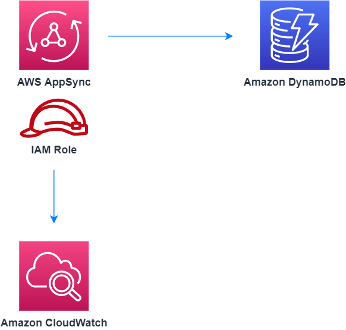

# aws-appsync-dynamodb module
<!--BEGIN STABILITY BANNER-->

---


> All classes are under active development and subject to non-backward compatible changes or removal in any
> future version. These are not subject to the [Semantic Versioning](https://semver.org/) model.
> This means that while you may use them, you may need to update your source code when upgrading to a newer version of this package.

---
<!--END STABILITY BANNER-->

| **Reference Documentation**:| <span style="font-weight: normal">https://docs.aws.amazon.com/solutions/latest/constructs/</span>|
|:-------------|:-------------|
<div style="height:8px"></div>


| **Language**     | **Package**        |
|:-------------|-----------------|
| Python|`aws_solutions_constructs.aws_appsync_dynamodb`|
| Typescript|`@aws-solutions-constructs/aws-appsync-dynamodb`|
| Java|`software.amazon.awsconstructs.services.appsyncdynamodb`|

## Overview
This AWS Solutions Construct implements an AWS AppSync GraphQL API connected to Amazon DynamoDB table.

Here is a minimal deployable pattern definition in:

Typescript
``` typescript
import { Construct } from 'constructs';
import { Stack, StackProps } from 'aws-cdk-lib';
import { AppSyncToDynamoDBProps, AppSyncToDynamoDB } from "@aws-solutions-constructs/aws-appsync-dynamodb";

new AppSyncToDynamoDB(this, 'test-appsync-dynamodb-default', {});
```

Python
``` python
from aws_solutions_constructs.aws_appsync_dynamodb import AppSyncToDynamoDB
from aws_cdk import Stack
from constructs import Construct

AppSyncToDynamoDB(self, 'test-appsync-dynamodb-default')
```

Java
``` java
import software.constructs.Construct;

import software.amazon.awscdk.Stack;
import software.amazon.awscdk.StackProps;
import software.amazon.awsconstructs.services.appsyncdynamodb.*;

new AppSyncToDynamoDB(this, "test-appsync-dynamodb-default", new AppSyncToDynamoDBProps.Builder()
        .build());
```

## Pattern Construct Props

| **Name**     | **Type**        | **Description** |
|:-------------|:----------------|-----------------|
|dynamoTableProps?|[`dynamodb.TableProps`](https://docs.aws.amazon.com/cdk/api/latest/docs/@aws-cdk_aws-dynamodb.TableProps.html)|Optional user provided props to override the default props for DynamoDB Table.|
|existingTableObj?|[`dynamodb.Table`](https://docs.aws.amazon.com/cdk/api/latest/docs/@aws-cdk_aws-dynamodb.Table.html)|Existing instance of DynamoDB table object, providing both this and `dynamoTableProps` will cause an error.|
|appSyncProps?|[`api.GraphqlApiProps `](https://docs.aws.amazon.com/cdk/api/latest/docs/@aws-cdk_aws-appsync-alpha.GraphqlApiProps.html)|Optional user-provided props to override the default props for AppSync.|
|allowCreateOperation?|`boolean`|Whether to deploy API Gateway Method for Create operation on DynamoDB table.|
|createRequestTemplate?|`string`|Optional AppSync resolver mapping template for Create method, required if `allowCreateOperation` set to true.|
|allowReadOperation?|`boolean`|Whether to deploy API Gateway Method for Read operation on DynamoDB table.|
|readRequestTemplate?|`string`|Optional AppSync resolver mapping template for Read method, it will use the default template if `allowReadOperation` is true and `readRequestTemplate` is not provided. The default template only supports a partition key and not partition + sort keys.|
|allowUpdateOperation?|`boolean`|Whether to deploy API Gateway Method for Update operation on DynamoDB table.|
|updateRequestTemplate?|`string`|Optional AppSync resolver mapping template for Update method, required if `allowUpdateOperation` set to true.|
|allowDeleteOperation?|`boolean`|Whether to deploy API Gateway Method for Delete operation on DynamoDB table.|
|deleteRequestTemplate?|`string`|Optional AppSync resolver mapping template for Delete method, it will use the default template if `allowDeleteOperation` is true and `deleteRequestTemplate` is not provided. The default template only supports a partition key and not partition + sort keys.|
|logGroupProps?|[`logs.LogGroupProps`](https://docs.aws.amazon.com/cdk/api/latest/docs/@aws-cdk_aws-logs.LogGroupProps.html)|User provided props to override the default props for for the CloudWatchLogs LogGroup.|

## Pattern Properties

| **Name**     | **Type**        | **Description** |
|:-------------|:----------------|-----------------|
|appSync|[`api.GraphqlApi `](https://docs.aws.amazon.com/cdk/api/latest/docs/@aws-cdk_aws-appsync-alpha.GraphqlApi.html)|Returns an instance of the api.GraphqlApi created by the construct.|
|appSyncRole|[`iam.Role`](https://docs.aws.amazon.com/cdk/api/latest/docs/@aws-cdk_aws-iam.Role.html)|Returns an instance of the iam.Role created by the construct for AppSync.|
|dynamoTable|[`dynamodb.Table`](https://docs.aws.amazon.com/cdk/api/latest/docs/@aws-cdk_aws-dynamodb.Table.html)|Returns an instance of dynamodb.Table created by the construct.|
|appSyncCloudWatchRole?|[`iam.Role`](https://docs.aws.amazon.com/cdk/api/latest/docs/@aws-cdk_aws-iam.Role.html)|Returns an instance of the iam.Role created by the construct for AppSync for CloudWatch access.|
|appSyncLogGroup|[`logs.LogGroup`](https://docs.aws.amazon.com/cdk/api/latest/docs/@aws-cdk_aws-logs.LogGroup.html)|Returns an instance of the LogGroup created by the construct for AppSync access logging to CloudWatch.|

## Default settings

Out of the box implementation of the Construct without any override will set the following defaults:

### AWS AppSync
* Deploy an AppSync API
* Enable CloudWatch logging for AppSync
* Configure least privilege access IAM role for AppSync
* Set the default authorizationType for all API methods to API Key
* Enable X-Ray Tracing

### Amazon DynamoDB Table
* Set the billing mode for DynamoDB Table to On-Demand (Pay per request)
* Enable server-side encryption for DynamoDB Table using AWS managed KMS Key
* Creates a partition key called 'id' for DynamoDB Table
* Retain the Table when deleting the CloudFormation stack
* Enable continuous backups and point-in-time recovery

## Architecture


***
&copy; Copyright 2022 Amazon.com, Inc. or its affiliates. All Rights Reserved.
