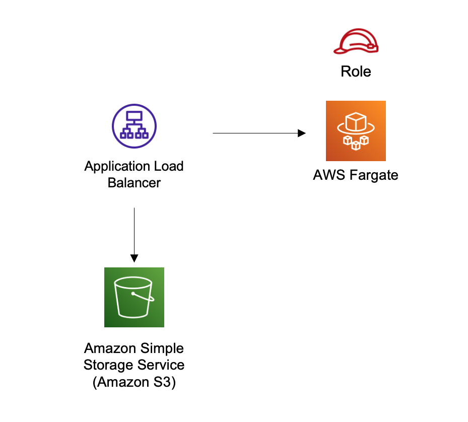

//!!NODE_ROOT <section>
//== aws-alb-fargate module

[.topic]
= aws-alb-fargate
:info_doctype: section
:info_title: aws-alb-fargate

image:https://img.shields.io/badge/cfn--resources-stable-success.svg?style=for-the-badge[Stability:Stable]

[width="100%",cols="<50%,<50%",options="header",]
|===
|*Reference Documentation*:
|https://docs.aws.amazon.com/solutions/latest/constructs/
|===

[width="100%",cols="<46%,54%",options="header",]
|===
|*Language* |*Package*
|image:https://docs.aws.amazon.com/cdk/api/latest/img/python32.png[Python
Logo] Python |`aws_solutions_constructs.aws_alb_fargate`

|image:https://docs.aws.amazon.com/cdk/api/latest/img/typescript32.png[Typescript
Logo] Typescript |`@aws-solutions-constructs/aws-alb-fargate`

|image:https://docs.aws.amazon.com/cdk/api/latest/img/java32.png[Java
Logo] Java |`software.amazon.awsconstructs.services.albfargate`
|===

== Overview

This AWS Solutions Construct implements an an Application Load Balancer
to an AWS Fargate service

Here is a minimal deployable pattern definition:

====
[role="tablist"]
Typescript::
+
[source,typescript]
----
import { Construct } from 'constructs';
import { Stack, StackProps } from 'aws-cdk-lib';
import { AlbToFargate, AlbToFargateProps } from '@aws-solutions-constructs/aws-alb-fargate';
import * as acm from 'aws-cdk-lib/aws-certificatemanager';

const certificate = acm.Certificate.fromCertificateArn(
    this,
    'existing-cert',
    "arn:aws:acm:us-east-1:123456789012:certificate/11112222-3333-1234-1234-123456789012"
);

const constructProps: AlbToFargateProps = {
    ecrRepositoryArn: "arn:aws:ecr:us-east-1:123456789012:repository/your-ecr-repo",
    ecrImageVersion: "latest",
    listenerProps: {
        certificates: [certificate]
    },
    publicApi: true
};

// Note - all alb constructs turn on ELB logging by default, so require that an environment including account
// and region be provided when creating the stack
//
// new MyStack(app, 'id', {env: {account: '123456789012', region: 'us-east-1' }});
new AlbToFargate(this, 'new-construct', constructProps);
----

Python::
+
[source,python]
----
from aws_solutions_constructs.aws_alb_fargate import AlbToFargate, AlbToFargateProps
from aws_cdk import (
    aws_certificatemanager as acm,
    aws_elasticloadbalancingv2 as alb,
    Stack
)
from constructs import Construct

# Obtain a pre-existing certificate from your account
certificate = acm.Certificate.from_certificate_arn(
      self,
      'existing-cert',
      "arn:aws:acm:us-east-1:123456789012:certificate/11112222-3333-1234-1234-123456789012"
    )

# Note - all alb constructs turn on ELB logging by default, so require that an environment including account
# and region be provided when creating the stack
#
# MyStack(app, 'id', env=cdk.Environment(account='123456789012', region='us-east-1'))
AlbToFargate(self, 'new-construct',
                ecr_repository_arn="arn:aws:ecr:us-east-1:123456789012:repository/your-ecr-repo",
                ecr_image_version="latest",
                listener_props=alb.BaseApplicationListenerProps(
                    certificates=[certificate],
                ),
                public_api=True)
----

Java::
+
[source,java]
----
import software.constructs.Construct;
import java.util.List;

import software.amazon.awscdk.Stack;
import software.amazon.awscdk.StackProps;
import software.amazon.awscdk.services.elasticloadbalancingv2.*;
import software.amazon.awsconstructs.services.albfargate.*;

// The code that defines your stack goes here
// Obtain a pre-existing certificate from your account
ListenerCertificate listenerCertificate = ListenerCertificate
        .fromArn("arn:aws:acm:us-east-1:123456789012:certificate/11112222-3333-1234-1234-123456789012");

// Note - all alb constructs turn on ELB logging by default, so require that an environment including account
// and region be provided when creating the stack
//
// new MyStack(app, "id", StackProps.builder()
//         .env(Environment.builder()
//                 .account("123456789012")
//                 .region("us-east-1")
//                 .build());
new AlbToFargate(this, "AlbToFargatePattern", new AlbToFargateProps.Builder()
        .ecrRepositoryArn("arn:aws:ecr:us-east-1:123456789012:repository/your-ecr-repo")
        .ecrImageVersion("latest")
        .listenerProps(new BaseApplicationListenerProps.Builder()
                .certificates(List.of(listenerCertificate))
                .build())
        .publicApi(true)
        .build());
----
====

== Pattern Construct Props

[width="100%",cols="<30%,<35%,35%",options="header",]
|===
|*Name* |*Type* |*Description*
|publicApi |boolean |Whether the construct is deploying a private or
public API. This has implications for the VPC and ALB.

|loadBalancerProps?
|https://docs.aws.amazon.com/cdk/api/v2/docs/aws-cdk-lib.aws_elasticloadbalancingv2.ApplicationLoadBalancerProps.html[elasticloadbalancingv2.ApplicationLoadBalancerProps]
|Optional custom properties for a new loadBalancer. Providing both this
and existingLoadBalancer is an error. This cannot specify a VPC, it will
use the VPC in existingVpc or the VPC created by the construct.

|existingLoadBalancerObj?
|https://docs.aws.amazon.com/cdk/api/v2/docs/aws-cdk-lib.aws_elasticloadbalancingv2.ApplicationLoadBalancer.html[elasticloadbalancingv2.ApplicationLoadBalancer]
|existing Application Load Balancer to incorporate into the
construct architecture. Providing both this and loadBalancerProps is an
error. The VPC containing this loadBalancer must match the VPC provided
in existingVpc.

|listenerProps?
|https://docs.aws.amazon.com/cdk/api/v2/docs/aws-cdk-lib.aws_elasticloadbalancingv2.ApplicationListenerProps.html[ApplicationListenerProps]
|Props to define the listener. Must be provided when adding the listener
to an ALB (eg - when creating the alb), may not be provided when adding
a second target to an already established listener. When provided, must
include either a certificate or protocol: HTTP

|targetGroupProps?
|https://docs.aws.amazon.com/cdk/api/v2/docs/aws-cdk-lib.aws_elasticloadbalancingv2.ApplicationTargetGroupProps.html[ApplicationTargetGroupProps]
|Optional custom properties for a new target group. If your application
requires end to end encryption, then you should set the protocol
attribute to
https://docs.aws.amazon.com/cdk/api/v2/docs/aws-cdk-lib.aws_elasticloadbalancingv2.ApplicationProtocol.html[elb.ApplicationProtocol.HTTPS]
and use a container that can accept HTTPS traffic.

|ruleProps?
|https://docs.aws.amazon.com/cdk/api/v2/docs/aws-cdk-lib.aws_elasticloadbalancingv2.AddRuleProps.html[AddRuleProps]
|Rules for directing traffic to the target being created. Must not be
specified for the first listener added to an ALB, and must be specified
for the second target added to a listener. Add a second target by
instantiating this construct a second time and providing the existingAlb
from the first instantiation.

|vpcProps?
|https://docs.aws.amazon.com/cdk/api/v2/docs/aws-cdk-lib.aws_ec2.VpcProps.html[ec2.VpcProps]
|Optional custom properties for a VPC the construct will create. This
VPC will be used by the new ALB and any Private Hosted Zone the
construct creates (that’s why loadBalancerProps and
privateHostedZoneProps can’t include a VPC). Providing both this and
existingVpc is an error.

|existingVpc?
|https://docs.aws.amazon.com/cdk/api/v2/docs/aws-cdk-lib.aws_ec2.IVpc.html[ec2.IVpc]
|An existing VPC in which to deploy the construct. Providing both this
and vpcProps is an error. If the client provides an existing load
balancer and/or existing Private Hosted Zone, those constructs must
exist in this VPC.

|logAlbAccessLogs? |boolean |Whether to turn on Access Logs for the
Application Load Balancer. Uses an S3 bucket with associated storage
costs.Enabling Access Logging is a best practice. default - true

|albLoggingBucketProps?
|https://docs.aws.amazon.com/cdk/api/v2/docs/aws-cdk-lib.aws_s3.BucketProps.html[s3.BucketProps]
|Optional properties to customize the bucket used to store the ALB
Access Logs. Supplying this and setting logAccessLogs to false is an
error. @default - none

|clusterProps?
|https://docs.aws.amazon.com/cdk/api/v2/docs/aws-cdk-lib.aws_ecs.ClusterProps.html[ecs.ClusterProps]
|Optional properties to create a new ECS cluster. To provide an existing
cluster, use the cluster attribute of fargateServiceProps.

|ecrRepositoryArn? |string |The arn of an ECR Repository containing the
image to use to generate the containers. Either this or the image
property of containerDefinitionProps must be provided. format:
arn:aws:ecr:_region_:_account number_:repository/_Repository Name_

|ecrImageVersion? |string |The version of the image to use from the
repository. Defaults to '`Latest`'

|containerDefinitionProps?
|https://docs.aws.amazon.com/cdk/api/v2/docs/aws-cdk-lib.aws_ecs.ContainerDefinitionProps.html[ecs.ContainerDefinitionProps
{vbar} any] |Optional props to define the container created for the
Fargate Service (defaults found in fargate-defaults.ts)

|fargateTaskDefinitionProps?
|https://docs.aws.amazon.com/cdk/api/v2/docs/aws-cdk-lib.aws_ecs.FargateTaskDefinitionProps.html[ecs.FargateTaskDefinitionProps
{vbar} any] |Optional props to define the Fargate Task Definition for
this construct (defaults found in fargate-defaults.ts)

|fargateServiceProps?
|https://docs.aws.amazon.com/cdk/api/v2/docs/aws-cdk-lib.aws_ecs.FargateServiceProps.html[ecs.FargateServiceProps
{vbar} any] |Optional properties to override default values for the
Fargate service. Service will set up in the Public or Isolated subnets
of the VPC by default, override that (e.g. - choose Private subnets) by
setting vpcSubnets on this object.

|existingFargateServiceObject?
|https://docs.aws.amazon.com/cdk/api/v2/docs/aws-cdk-lib.aws_ecs.FargateService.html[ecs.FargateService]
|A Fargate Service already instantiated (probably by another Solutions
Construct). If this is specified, then no props defining a new service
can be provided, including: existingImageObject, ecrImageVersion,
containerDefinitionProps, fargateTaskDefinitionProps, ecrRepositoryArn,
fargateServiceProps, clusterProps, existingClusterInterface

|existingContainerDefinitionObject?
|https://docs.aws.amazon.com/cdk/api/v2/docs/aws-cdk-lib.aws_ecs.ContainerDefinition.html[ecs.ContainerDefinition]
|A container definition already instantiated as part of a Fargate
service. This must be the container in the existingFargateServiceObject
|===

== Pattern Properties

[width="100%",cols="<30%,<35%,35%",options="header",]
|===
|*Name* |*Type* |*Description*
|vpc
|https://docs.aws.amazon.com/cdk/api/v2/docs/aws-cdk-lib.aws_ec2.IVpc.html[ec2.IVpc]
|The VPC used by the construct (whether created by the construct or
providedb by the client)

|loadBalancer
|https://docs.aws.amazon.com/cdk/api/v2/docs/aws-cdk-lib.aws_elasticloadbalancingv2.ApplicationLoadBalancer.html[elasticloadbalancingv2.ApplicationLoadBalancer]
|The Load Balancer used by the construct (whether created by the
construct or provided by the client)

|listener
|https://docs.aws.amazon.com/cdk/api/v2/docs/aws-cdk-lib.aws_elasticloadbalancingv2.ApplicationListener.html[elb.ApplicationListener]
|The listener used by this pattern.

|service
|https://docs.aws.amazon.com/cdk/api/v2/docs/aws-cdk-lib.aws_ecs.FargateService.html[ecs.FargateService]
|The AWS Fargate service used by this construct (whether created by this
construct or passed to this construct at initialization)

|container
|https://docs.aws.amazon.com/cdk/api/v2/docs/aws-cdk-lib.aws_ecs.ContainerDefinition.html[ecs.ContainerDefinition]
|The container associated with the AWS Fargate service in the service
property.
|===

== Default settings

Out of the box implementation of the Construct without any override will
set the following defaults:

=== Application Load Balancer

* Creates or configures an Application Load Balancer with:
** Required listeners
** New target group with routing rules if appropriate

=== AWS Fargate Service

* Sets up an AWS Fargate service as a target of the Application Load
Balancer
** Uses the existing service if provided
** Creates a new service if none provided.
*** Service will run in isolated subnets if available, then private
subnets if available and finally public subnets

== Architecture

// github block

'''''

© Copyright Amazon.com, Inc. or its affiliates. All Rights Reserved.
