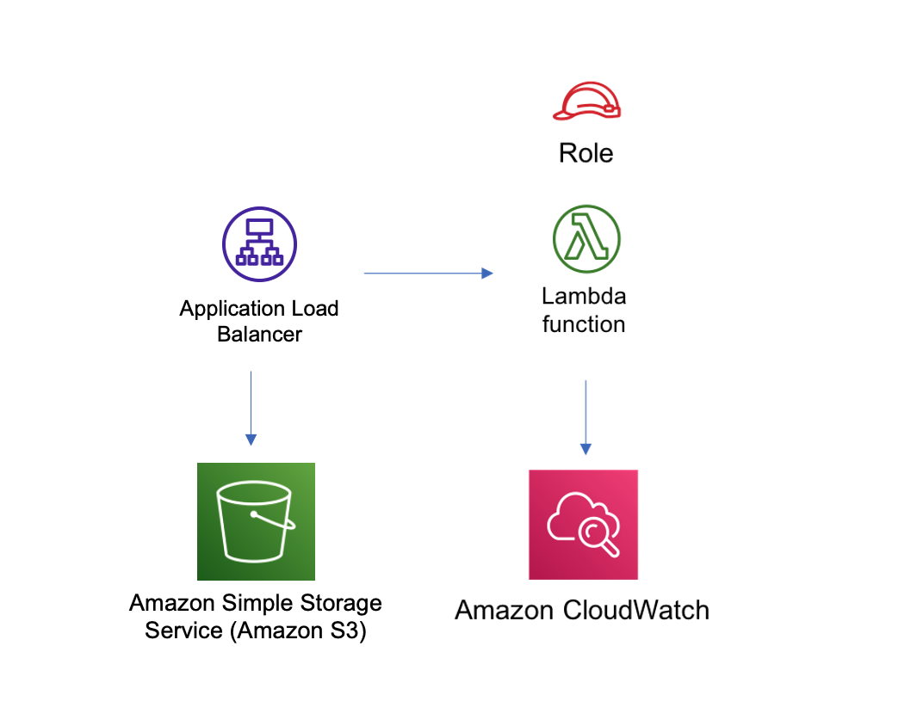

# aws-alb-fargate module
<!--BEGIN STABILITY BANNER-->

---


> All classes are under active development and subject to non-backward compatible changes or removal in any
> future version. These are not subject to the [Semantic Versioning](https://semver.org/) model.
> This means that while you may use them, you may need to update your source code when upgrading to a newer version of this package.

---
<!--END STABILITY BANNER-->

| **Reference Documentation**:| <span style="font-weight: normal">https://docs.aws.amazon.com/solutions/latest/constructs/</span>|
|:-------------|:-------------|
<div style="height:8px"></div>

| **Language**     | **Package**        |
|:-------------|-----------------|
| Python|`aws_solutions_constructs.aws_alb_fargate`|
| Typescript|`@aws-solutions-constructs/aws-alb-fargate`|
| Java|`software.amazon.awsconstructs.services.albfargate`|

This AWS Solutions Construct implements an an Application Load Balancer to an AWS Fargate service

Here is a minimal deployable pattern definition in Typescript:

``` typescript
  // Obtain a pre-existing certificate from your account
  const certificate = acm.Certificate.fromCertificateArn(
        scope,
        'existing-cert',
        "arn:aws:acm:us-east-1:123456789012:certificate/11112222-3333-1234-1234-123456789012"
      );

  const props: AlbToLambdaProps = {
    ecrRepositoryArn: "arn:aws:ecr:us-east-1:123456789012:repository/your-ecr-repo",
    ecrImageVersion: "latest",
    listenerProps: {
      certificates: [ certificate ]
    },
    publicApi: true
  };

  new AlbToFargate(stack, 'new-construct', props);
```

## Initializer

``` text
new AlbToFargate(scope: Construct, id: string, props: AlbToFargateProps);
```

_Parameters_

* scope [`Construct`](https://docs.aws.amazon.com/cdk/api/latest/docs/@aws-cdk_core.Construct.html)
* id `string`
* props [`AlbToFargateProps`](#pattern-construct-props)

## Pattern Construct Props

| **Name**     | **Type**        | **Description** |
|:-------------|:----------------|-----------------|
| publicApi | boolean | Whether the construct is deploying a private or public API. This has implications for the VPC and ALB. |
| loadBalancerProps? | [elasticloadbalancingv2.ApplicationLoadBalancerProps](https://docs.aws.amazon.com/cdk/api/latest/docs/@aws-cdk_aws-elasticloadbalancingv2.ApplicationLoadBalancerProps.html) | Optional custom properties for a new loadBalancer. Providing both this and existingLoadBalancer is an error. This cannot specify a VPC, it will use the VPC in existingVpc or the VPC created by the construct. |
| existingLoadBalancerObj? | [elasticloadbalancingv2.ApplicationLoadBalancer](https://docs.aws.amazon.com/cdk/api/latest/docs/@aws-cdk_aws-elasticloadbalancingv2.ApplicationLoadBalancer.html) | [existing Application Load Balancer to incorporate into the construct architecture. Providing both this and loadBalancerProps is an error. The VPC containing this loadBalancer must match the VPC provided in existingVpc.|
| listenerProps? | [ApplicationListenerProps](https://docs.aws.amazon.com/cdk/api/latest/docs/@aws-cdk_aws-elasticloadbalancingv2.ApplicationListenerProps.html) | Props to define the listener. Must be provided when adding the listener to an ALB (eg - when creating the alb), may not be provided when adding a second target to an already established listener. When provided, must include either a certificate or protocol: HTTP |
| targetGroupProps? | [ApplicationTargetGroupProps](https://docs.aws.amazon.com/cdk/api/latest/docs/@aws-cdk_aws-elasticloadbalancingv2.ApplicationTargetGroupProps.html) | Optional custom properties for a new target group. |
| ruleProps? | [AddRuleProps](https://docs.aws.amazon.com/cdk/api/latest/docs/@aws-cdk_aws-elasticloadbalancingv2.AddRuleProps.html) | Rules for directing traffic to the target being created. Must not be specified for the first listener added to an ALB, and must be specified for the second target added to a listener. Add a second target by instantiating this construct a second time and providing the existingAlb from the first instantiation. |
| vpcProps? | [ec2.VpcProps](https://docs.aws.amazon.com/cdk/api/latest/docs/@aws-cdk_aws-ec2.VpcProps.html) | Optional custom properties for a VPC the construct will create. This VPC will be used by the new ALB and any Private Hosted Zone the construct creates (that's why loadBalancerProps and privateHostedZoneProps can't include a VPC). Providing both this and existingVpc is an error. |
| existingVpc? | [ec2.IVpc](https://docs.aws.amazon.com/cdk/api/latest/docs/@aws-cdk_aws-ec2.IVpc.html) | An existing VPC in which to deploy the construct. Providing both this and vpcProps is an error. If the client provides an existing load balancer and/or existing Private Hosted Zone, those constructs must exist in this VPC. |
| logAlbAccessLogs? | boolean| Whether to turn on Access Logs for the Application Load Balancer. Uses an S3 bucket with associated storage costs.Enabling Access Logging is a best practice. default - true |
| albLoggingBucketProps? | [s3.BucketProps](https://docs.aws.amazon.com/cdk/api/latest/docs/@aws-cdk_aws-s3.BucketProps.html) | Optional properties to customize the bucket used to store the ALB Access Logs. Supplying this and setting logAccessLogs to false is an error. @default - none |
| clusterProps | [ecs.ClusterProps]() | Optional properties to create a new ECS cluster. To provide an existing cluster, use the cluster attribute of fargateServiceProps. |
| ecrRepositoryArn | string]() | The arn of an ECR Repository containing the image to use to generate the containers. Either this or the image property of containerDefinitionProps must be provided. format: arn:aws:ecr:*region*:*account number*:repository/*Repository Name* |
| ecrImageVersion | string]() | The version of the image to use from the repository. Defaults to 'Latest' |
| containerDefinitionProps | [ecs.ContainerDefinitionProps /| any]() | Optional props to define the container created for the Fargate Service (defaults found in fargate-defaults.ts) |
| fargateTaskDefinitionProps | [ecs.FargateTaskDefinitionProps /| any]() | Optional props to define the Fargate Task Definition for this construct  (defaults found in fargate-defaults.ts) |
| fargateServiceProps | [ecs.FargateServiceProps /| any]() | Optional properties to override default values for the Fargate service. Service will set up in the Public or Isolated subnets of the VPC by default, override that (e.g. - choose Private subnets) by setting vpcSubnets on this object. |
| existingFargateServiceObject | [ecs.FargateService]() | A Fargate Service already instantiated (probably by another Solutions Construct). If this is specified, then no props defining a new service can be provided, including: existingImageObject, ecrImageVersion, containerDefintionProps, fargateTaskDefinitionProps, ecrRepositoryArn, fargateServiceProps, clusterProps, existingClusterInterface |
| existingContainerDefinitionObject | [ecs.ContainerDefinition]() | A container definition already instantiated as part of a Fargate service. This much be the container in the existingFargateServiceObject |

## Pattern Properties

| **Name**     | **Type**        | **Description** |
|:-------------|:----------------|-----------------|
| vpc | [ec2.IVpc](https://docs.aws.amazon.com/cdk/api/latest/docs/@aws-cdk_aws-ec2.IVpc.html) | The VPC used by the construct (whether created by the construct or providedb by the client) |
| loadBalancer | [elasticloadbalancingv2.ApplicationLoadBalancer](https://docs.aws.amazon.com/cdk/api/latest/docs/@aws-cdk_aws-elasticloadbalancingv2.ApplicationLoadBalancer.html) | The Load Balancer used by the construct (whether created by the construct or provided by the client) |
| listener | [elb.ApplicationListener](https://docs.aws.amazon.com/cdk/api/latest/docs/@aws-cdk_aws-elasticloadbalancingv2.ApplicationListener.html) | The listener used by this pattern. |
| service | [ecs.FargateService](https://docs.aws.amazon.com/cdk/api/v1/docs/@aws-cdk_aws-ecs.FargateService.html) | The AWS Fargate service used by this construct (whether created by this construct or passed to this construct at initialization) |
| container | [ecs.ContainerDefinition](https://docs.aws.amazon.com/cdk/api/v1/docs/@aws-cdk_aws-ecs.ContainerDefinition.html) | The container associated with the AWS Fargate service in the service property. |

## Default settings

Out of the box implementation of the Construct without any override will set the following defaults:

### Application Load Balancer
* Creates or configures an Application Load Balancer with:
  * Required listeners
  * New target group with routing rules if appropriate

### AWS Fargate Service
* Sets up an AWS Fargate service as a target of the Application Load Balancer
  * Uses the existing service if provided
  * Creates a new service if none provided.
    * Service will run in isolated subnets if available, then private subnets if available and finally public subnets

## Architecture


***
&copy; Copyright 2022 Amazon.com, Inc. or its affiliates. All Rights Reserved.
