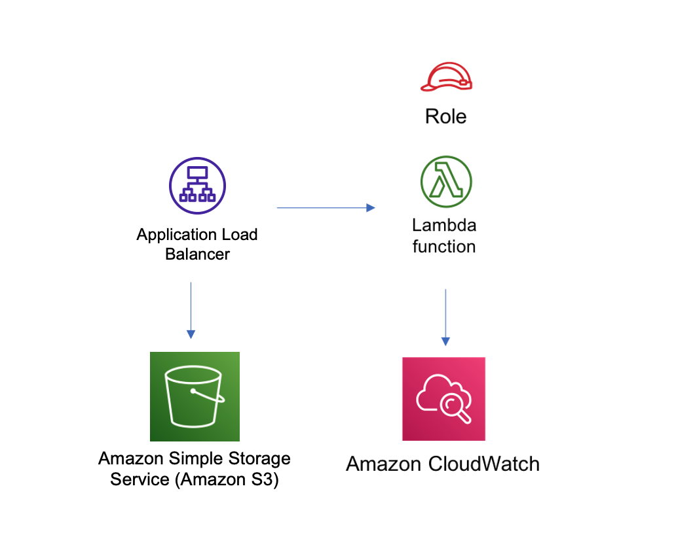

# aws-alb-lambda module
<!--BEGIN STABILITY BANNER-->

---


> All classes are under active development and subject to non-backward compatible changes or removal in any
> future version. These are not subject to the [Semantic Versioning](https://semver.org/) model.
> This means that while you may use them, you may need to update your source code when upgrading to a newer version of this package.

---
<!--END STABILITY BANNER-->

| **Reference Documentation**:| <span style="font-weight: normal">https://docs.aws.amazon.com/solutions/latest/constructs/</span>|
|:-------------|:-------------|
<div style="height:8px"></div>

| **Language**     | **Package**        |
|:-------------|-----------------|
| Python|`aws_solutions_constructs.aws_alb_lambda`|
| Typescript|`@aws-solutions-constructs/aws-alb-lambda`|
| Java|`software.amazon.awsconstructs.services.alblambda`|

This AWS Solutions Construct implements an an Application Load Balancer to an AWS Lambda function

Here is a minimal deployable pattern definition:

Typescript
``` typescript
import { AlbToLambda, AlbToLambdaProps } from '@aws-solutions-constructs/aws-alb-lambda';
import * as acm from 'aws-cdk-lib/aws-certificatemager';
import * as lambda from 'aws-cdk-lib/aws-lambda';

// Obtain a pre-existing certificate from your account
const certificate = acm.Certificate.fromCertificateArn(
    this,
    'existing-cert',
    "arn:aws:acm:us-east-1:123456789012:certificate/11112222-3333-1234-1234-123456789012"
);
const props: AlbToLambdaProps = {
    lambdaFunctionProps: {
        code: lambda.Code.fromAsset(`${__dirname}/lambda`),
        runtime: lambda.Runtime.NODEJS_14_X,
        handler: 'index.handler'
    },
    listenerProps: {
        certificates: [certificate]
    },
    publicApi: true
};
new AlbToLambda(this, 'new-construct', props);
```

Python
``` python
from aws_solutions_constructs.aws_alb_lambda import AlbToLambda, AlbToLambdaProps
from aws_cdk import (
    aws_certificatemanager as acm,
    aws_lambda as _lambda,
    aws_elasticloadbalancingv2 as alb
)

# Obtain a pre-existing certificate from your account
certificate = acm.Certificate.from_certificate_arn(
  self,
  'existing-cert',
  "arn:aws:acm:us-east-1:123456789012:certificate/11112222-3333-1234-1234-123456789012"
)

props = AlbToLambdaProps(
  lambda_function_props=_lambda.FunctionProps(
    runtime=_lambda.Runtime.PYTHON_3_7,
    code=_lambda.Code.asset('lambda'),
    handler='hitcounter.handler',
  ),
  listener_props=alb.ApplicationListenerProps(
    certificates=[ certificate ]
  ),
  publicApi=True
)

AlbToLambda(self, 'new-construct', props)
```

## Pattern Construct Props

| **Name**     | **Type**        | **Description** |
|:-------------|:----------------|-----------------|
| loadBalancerProps? | [elasticloadbalancingv2.ApplicationLoadBalancerProps](https://docs.aws.amazon.com/cdk/api/latest/docs/@aws-cdk_aws-elasticloadbalancingv2.ApplicationLoadBalancerProps.html) | Optional custom properties for a new loadBalancer. Providing both this and existingLoadBalancer is an error. This cannot specify a VPC, it will use the VPC in existingVpc or the VPC created by the construct. |
| existingLoadBalancerObj? | [elasticloadbalancingv2.ApplicationLoadBalancer](https://docs.aws.amazon.com/cdk/api/latest/docs/@aws-cdk_aws-elasticloadbalancingv2.ApplicationLoadBalancer.html) | Existing Application Load Balancer to incorporate into the construct architecture. Providing both this and loadBalancerProps is an error. The VPC containing this loadBalancer must match the VPC provided in existingVpc. |
| listenerProps? | [ApplicationListenerProps](https://docs.aws.amazon.com/cdk/api/latest/docs/@aws-cdk_aws-elasticloadbalancingv2.ApplicationListenerProps.html) | Props to define the listener. Must be provided when adding the listener to an ALB (eg - when creating the alb), may not be provided when adding a second target to an already established listener. When provided, must include either a certificate or protocol: HTTP |
| targetProps? | [ApplicationTargetGroupProps](https://docs.aws.amazon.com/cdk/api/latest/docs/@aws-cdk_aws-elasticloadbalancingv2.ApplicationTargetGroupProps.html) | Optional custom properties for a new target group. While this is a standard attribute of props for ALB constructs, there are few pertinent properties for a Lambda target. |
| ruleProps? | [AddRuleProps](https://docs.aws.amazon.com/cdk/api/latest/docs/@aws-cdk_aws-elasticloadbalancingv2.AddRuleProps.html) | Rules for directing traffic to the target being created. May not be specified for the first listener added to an ALB, and must be specified for the second target added to a listener. Add a second target by instantiating this construct a second time and providing the existingAlb from the first instantiation. |
| vpcProps? | [ec2.VpcProps](https://docs.aws.amazon.com/cdk/api/latest/docs/@aws-cdk_aws-ec2.VpcProps.html) | Optional custom properties for a VPC the construct will create. This VPC will be used by the new ALB and any Private Hosted Zone the construct creates (that's why loadBalancerProps and privateHostedZoneProps can't include a VPC). Providing both this and existingVpc is an error. |
|existingLambdaObj?|[`lambda.Function`](https://docs.aws.amazon.com/cdk/api/latest/docs/@aws-cdk_aws-lambda.Function.html)|Existing instance of Lambda Function object, providing both this and `lambdaFunctionProps` will cause an error.|
|lambdaFunctionProps?|[`lambda.FunctionProps`](https://docs.aws.amazon.com/cdk/api/latest/docs/@aws-cdk_aws-lambda.FunctionProps.html)|Optional user provided props to override the default props for the Lambda function.|
| existingVpc? | [ec2.IVpc](https://docs.aws.amazon.com/cdk/api/latest/docs/@aws-cdk_aws-ec2.IVpc.html) | An existing VPC in which to deploy the construct. Providing both this and vpcProps is an error. If the client provides an existing load balancer and/or existing Private Hosted Zone, those constructs must exist in this VPC. |
| logAlbAccessLogs? | boolean| Whether to turn on Access Logs for the Application Load Balancer. Uses an S3 bucket with associated storage costs.Enabling Access Logging is a best practice. default - true |
| albLoggingBucketProps? | [s3.BucketProps](https://docs.aws.amazon.com/cdk/api/latest/docs/@aws-cdk_aws-s3.BucketProps.html) | Optional properties to customize the bucket used to store the ALB Access Logs. Supplying this and setting logAccessLogs to false is an error. @default - none |
| publicApi | boolean | Whether the construct is deploying a private or public API. This has implications for the VPC and ALB. |

## Pattern Properties

| **Name**     | **Type**        | **Description** |
|:-------------|:----------------|-----------------|
| vpc | [ec2.IVpc](https://docs.aws.amazon.com/cdk/api/latest/docs/@aws-cdk_aws-ec2.IVpc.html) | The VPC used by the construct (whether created by the construct or providedb by the client) |
| loadBalancer | [elasticloadbalancingv2.ApplicationLoadBalancer](https://docs.aws.amazon.com/cdk/api/latest/docs/@aws-cdk_aws-elasticloadbalancingv2.ApplicationLoadBalancer.html) | The Load Balancer used by the construct (whether created by the construct or provided by the client) |
|lambdaFunction|[`lambda.Function`](https://docs.aws.amazon.com/cdk/api/latest/docs/@aws-cdk_aws-lambda.Function.html)|Returns an instance of the Lambda function used in the pattern.|
| listener | [`elb.ApplicationListener`](https://docs.aws.amazon.com/cdk/api/latest/docs/@aws-cdk_aws-elasticloadbalancingv2.ApplicationListener.html) | The listener used by this pattern. |

## Default settings

Out of the box implementation of the Construct without any override will set the following defaults:

### Application Load Balancer
* Creates or configures an Application Load Balancer with:
  * Required listeners
  * New target group with routing rules if appropriate

### AWS Lambda Function
* Configure limited privilege access IAM role for Lambda function
* Enable reusing connections with Keep-Alive for NodeJs Lambda function
* Enable X-Ray Tracing
* Set Environment Variables
  * AWS_NODEJS_CONNECTION_REUSE_ENABLED (for Node 10.x and higher functions)

## Architecture


***
&copy; Copyright 2021 Amazon.com, Inc. or its affiliates. All Rights Reserved.
