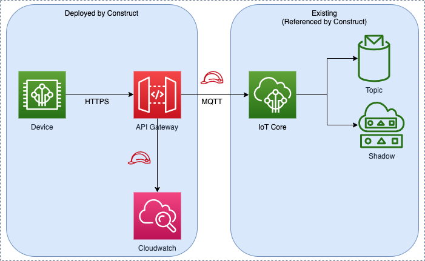

# aws-apigateway-iot module
<!--BEGIN STABILITY BANNER-->

---


> All classes are under active development and subject to non-backward compatible changes or removal in any
> future version. These are not subject to the [Semantic Versioning](https://semver.org/) model.
> This means that while you may use them, you may need to update your source code when upgrading to a newer version of this package.

---
<!--END STABILITY BANNER-->

| **Reference Documentation**:| <span style="font-weight: normal">https://docs.aws.amazon.com/solutions/latest/constructs/</span>|
|:-------------|:-------------|
<div style="height:8px"></div>

| **Language**     | **Package**        |
|:-------------|-----------------|
| Python|`aws_solutions_constructs.aws_apigateway_iot`|
| Typescript|`@aws-solutions-constructs/aws-apigateway-iot`|
| Java|`software.amazon.awsconstructs.services.apigatewayiot`|

## Overview

This AWS Solutions Construct implements an Amazon API Gateway REST API connected to AWS IoT pattern.

This construct creates a scalable HTTPS proxy between API Gateway and AWS IoT. This comes in handy when wanting to allow legacy devices that do not support the MQTT or MQTT/Websocket protocol to interact with the AWS IoT platform.

This implementation enables write-only messages to be published on given MQTT topics, and also supports shadow updates of HTTPS devices to allowed things in the device registry. It does not involve Lambda functions for proxying messages, and instead relies on direct API Gateway to AWS IoT integration which supports both JSON messages as well as binary messages.

Here is a minimal deployable pattern definition:

Typescript
``` typescript
import { ApiGatewayToIot } from '@aws-solutions-constructs/aws-apigateway-iot';

new ApiGatewayToIot(this, 'ApiGatewayToIotPattern', {
    iotEndpoint: 'a1234567890123-ats'
});
```

Python
``` python
from aws_solutions_constructs.aws_apigateway_iot import ApiGatewayToIot
from aws_cdk import Stack
from constructs import Construct

ApiGatewayToIot(self, 'ApiGatewayToIotPattern',
    iot_endpoint='a1234567890123-ats'
)
```
Java
``` java
import software.amazon.awsconstructs.services.apigatewayiot.*;

new ApiGatewayToIot(this, "ApiGatewayToIotPattern", new ApiGatewayToIotProps.Builder()
                .iotEndpoint("a1234567890123-ats")
                .build());
```
## Pattern Construct Props

| **Name**     | **Type**        | **Description** |
|:-------------|:----------------|-----------------|
|iotEndpoint|`string`|The AWS IoT endpoint subdomain to integrate the API Gateway with (e.g a1234567890123-ats).|
|apiGatewayCreateApiKey?|`boolean`|If set to `true`, an API Key is created and associated to a UsagePlan. User should specify `x-api-key` header while accessing RestApi. Default value set to `false`|
|apiGatewayExecutionRole?|[`iam.Role`](https://docs.aws.amazon.com/cdk/api/latest/docs/@aws-cdk_aws-iam.Role.html)|IAM Role used by the API Gateway to access AWS IoT. If not specified, a default role is created with wildcard ('*') access to all topics and things.|
|apiGatewayProps?|[`api.restApiProps`](https://docs.aws.amazon.com/cdk/api/latest/docs/@aws-cdk_aws-apigateway.RestApiProps.html)|Optional user-provided props to override the default props for the API Gateway.|
|logGroupProps?|[`logs.LogGroupProps`](https://docs.aws.amazon.com/cdk/api/latest/docs/@aws-cdk_aws-logs.LogGroupProps.html)|User provided props to override the default props for for the CloudWatchLogs LogGroup.|

## Pattern Properties

| **Name**     | **Type**        | **Description** |
|:-------------|:----------------|-----------------|
|apiGateway|[`api.RestApi`](https://docs.aws.amazon.com/cdk/api/latest/docs/@aws-cdk_aws-apigateway.RestApi.html)|Returns an instance of the API Gateway REST API created by the pattern.|
|apiGatewayRole|[`iam.Role`](https://docs.aws.amazon.com/cdk/api/latest/docs/@aws-cdk_aws-iam.Role.html)|Returns an instance of the iam.Role created by the construct for API Gateway.|
|apiGatewayCloudWatchRole?|[`iam.Role`](https://docs.aws.amazon.com/cdk/api/latest/docs/@aws-cdk_aws-iam.Role.html)|Returns an instance of the iam.Role created by the construct for API Gateway for CloudWatch access.|
|apiGatewayLogGroup|[`logs.LogGroup`](https://docs.aws.amazon.com/cdk/api/latest/docs/@aws-cdk_aws-logs.LogGroup.html)|Returns an instance of the LogGroup created by the construct for API Gateway access logging to CloudWatch.|

## Default settings

Out of the box implementation of the Construct without any override will set the following defaults:

### Amazon API Gateway

* Deploy an edge-optimized API Endpoint
* Creates API Resources with `POST` Method to publish messages to IoT Topics
* Creates API Resources with `POST` Method to publish messages to ThingShadow & NamedShadows
* Enable CloudWatch logging for API Gateway
* Configure IAM role for API Gateway with access to all topics and things
* Set the default authorizationType for all API methods to IAM
* Enable X-Ray Tracing
* Creates a UsagePlan and associates to `prod` stage

Below is a description of the different resources and methods exposed by the API Gateway after deploying the Construct. See the [Examples](#examples) section for more information on how to easily test these endpoints using `curl`.

|Method         | Resource              | Query parameter(s) |  Return code(s)   |  Description|
|-------------- | --------------------- | ------------------ | ----------------- | -----------------|
|  **POST**     |  `/message/<topics>`  |      **qos**       |   `200/403/500`   | By calling this endpoint, you need to pass the topics on which you would like to publish (e.g `/message/device/foo`).|
|  **POST**     | `/shadow/<thingName>` |      **None**      |   `200/403/500`   | This route allows to update the shadow document of a thing, given its `thingName` using Unnamed (classic) shadow type. The body shall comply with the standard shadow stucture comprising a `state` node and associated `desired` and `reported` nodes. See the [Updating device shadows](#updating-device-shadows) section for an example.|
|  **POST**     | `/shadow/<thingName>/<shadowName>` |      **None**      |   `200/403/500`   | This route allows to update the named shadow document of a thing, given its `thingName` and the `shadowName` using the Named shadow type. The body shall comply with the standard shadow stucture comprising a `state` node and associated `desired` and `reported` nodes. See the [Updating named shadows](#updating-named-shadows) section for an example.|

## Architecture



## Examples

 The following examples only work with `API_KEY` authentication types, since IAM authorization requires a SIGv4 token to be specified as well, make sure the **apiGatewayCreateApiKey** property of your Construct props is set to **true** while deploying the stack, otherwise the below examples won't work.

### Publishing a message

You can use `curl` to publish a message on different MQTT topics using the HTTPS API. The below example will post a message on the `device/foo` topic.

```bash
curl -XPOST https://<stage-id>.execute-api.<region>.amazonaws.com/prod/message/device/foo -H "x-api-key: <api-key>" -H "Content-Type: application/json" -d '{"Hello": "World"}'
```

> Replace the `stage-id`, `region` and `api-key` parameters with your deployment values.

You can chain topic names in the URL and the API accepts up to 7 sub-topics that you can publish on. For instance, the below example publishes a message on the topic `device/foo/bar/abc/xyz`.

```bash
curl -XPOST https://<stage-id>.execute-api.<region>.amazonaws.com/prod/message/device/foo/bar/abc/xyz -H "x-api-key: <api-key>" -H "Content-Type: application/json" -d '{"Hello": "World"}'
```

### Updating device shadows

To update the shadow document associated with a given thing, you can issue a shadow state request using a thing name. See the following example on how to update a thing shadow.

```bash
curl -XPOST https://<stage-id>.execute-api.<region>.amazonaws.com/prod/shadow/device1 -H "x-api-key: <api-key>" -H "Content-Type: application/json" -d '{"state": {"desired": { "Hello": "World" }}}'
```

### Updating named shadows

To update the shadow document associated with a given thing's named shadow, you can issue a shadow state request using a thing name and shadow name. See the following example on how to update a named shadow.

```bash
curl -XPOST https://<stage-id>.execute-api.<region>.amazonaws.com/prod/shadow/device1/shadow1 -H "x-api-key: <api-key>" -H "Content-Type: application/json" -d '{"state": {"desired": { "Hello": "World" }}}'
```

### Sending binary payloads

It is possible to send a binary payload to the proxy API, down to the AWS IoT service. In the following example, we send the content of the `README.md` file associated with this module (treated as a binary data) to `device/foo` topic using the `application/octet-stream` content type.

```bash
curl -XPOST https://<stage-id>.execute-api.<region>.amazonaws.com/prod/message/device/foo/bar/baz/qux -H "x-api-key: <api-key>" -H "Content-Type: application/octet-stream" --data-binary @README.md
```

> Execute this command while in the directory of this project. You can then test sending other type of binary files from your file-system.


***
&copy; Copyright 2021 Amazon.com, Inc. or its affiliates. All Rights Reserved.
