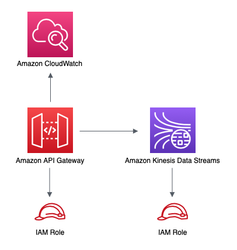

# aws-apigateway-kinesisstreams module
<!--BEGIN STABILITY BANNER-->

---


---
<!--END STABILITY BANNER-->

| **Reference Documentation**:| <span style="font-weight: normal">https://docs.aws.amazon.com/solutions/latest/constructs/</span>|
|:-------------|:-------------|
<div style="height:8px"></div>

| **Language**     | **Package**        |
|:-------------|-----------------|
| Python|`aws_solutions_constructs.aws_apigateway_kinesisstreams`|
| Typescript|`@aws-solutions-constructs/aws-apigateway-kinesisstreams`|
| Java|`software.amazon.awsconstructs.services.apigatewaykinesisstreams`|

## Overview

This AWS Solutions Construct implements an Amazon API Gateway connected to an Amazon Kinesis Data Stream pattern.

Here is a minimal deployable pattern definition:

Typescript
``` typescript
import { Construct } from 'constructs';
import { Stack, StackProps } from 'aws-cdk-lib';
import { ApiGatewayToKinesisStreams, ApiGatewayToKinesisStreamsProps } from '@aws-solutions-constructs/aws-apigateway-kinesisstreams';

new ApiGatewayToKinesisStreams(this, 'test-apigw-kinesis', {});
```

Python
``` python
from aws_solutions_constructs.aws_apigateway_kinesisstreams import ApiGatewayToKinesisStreams
from aws_cdk import Stack
from constructs import Construct

ApiGatewayToKinesisStreams(self, 'test-apigw-kinesis')
```

Java
``` java
import software.constructs.Construct;

import software.amazon.awscdk.Stack;
import software.amazon.awscdk.StackProps;
import software.amazon.awsconstructs.services.apigatewaykinesisstreams.*;

new ApiGatewayToKinesisStreams(this, "test-apigw-kinesis", new ApiGatewayToKinesisStreamsProps.Builder()
        .build());
```


## Pattern Construct Props

| **Name**     | **Type**        | **Description** |
|:-------------|:----------------|-----------------|
|apiGatewayProps?|[`api.RestApiProps`](https://docs.aws.amazon.com/cdk/api/v2/docs/aws-cdk-lib.aws_apigateway.RestApiProps.html)|Optional user-provided props to override the default props for the API Gateway.|
|putRecordRequestTemplate?|`string`|API Gateway request template for the PutRecord action. If not provided, a default one will be used.|
|additionalPutRecordRequestTemplates?|`{ [contentType: string]: string; }`|Optional PutRecord Request Templates for content-types other than `application/json`. Use the `putRecordRequestTemplate` property to set the request template for the `application/json` content-type.|
|putRecordRequestModel?|[`api.ModelOptions`](https://docs.aws.amazon.com/cdk/api/v2/docs/aws-cdk-lib.aws_apigateway.ModelOptions.html)|API Gateway request model for the PutRecord action. If not provided, a default one will be created.|
|putRecordIntegrationResponses?|[`api.IntegrationResponses[]`](https://docs.aws.amazon.com/cdk/api/v2/docs/aws-cdk-lib.aws_apigateway.IntegrationResponse.html)|Optional, custom API Gateway Integration Response for the PutRecord action.|
|putRecordMethodResponses?|[`api.MethodResponses[]`](https://docs.aws.amazon.com/cdk/api/v2/docs/aws-cdk-lib.aws_apigateway.MethodResponse.html)| Optional, custom API Gateway Method Responses for the putRecord action. default: [{  statusCode: "200",  responseParameters: {    "method.response.header.Content-Type": true  }},{  statusCode: "500",  responseParameters: {    "method.response.header.Content-Type": true  } } ]|
|putRecordsRequestTemplate?|`string`|API Gateway request template for the PutRecords action. If not provided, a default one will be used.|
|additionalPutRecordsRequestTemplates?|`{ [contentType: string]: string; }`|Optional PutRecords Request Templates for content-types other than `application/json`. Use the `putRecordsRequestTemplate` property to set the request template for the `application/json` content-type.|
|putRecordsRequestModel?|[`api.ModelOptions`](https://docs.aws.amazon.com/cdk/api/v2/docs/aws-cdk-lib.aws_apigateway.ModelOptions.html)| API Gateway request model for the PutRecords action. If not provided, a default one will be created.|
|putRecordsIntegrationResponses?|[`api.IntegrationResponses[]`](https://docs.aws.amazon.com/cdk/api/v2/docs/aws-cdk-lib.aws_apigateway.IntegrationResponse.html)|Optional, custom API Gateway Integration Response for the PutRecords action.|
|putRecordsMethodResponses?|[`api.MethodResponses[]`](https://docs.aws.amazon.com/cdk/api/v2/docs/aws-cdk-lib.aws_apigateway.MethodResponse.html)| Optional, custom API Gateway Method Responses for the putRecords action. default: [{  statusCode: "200",  responseParameters: {    "method.response.header.Content-Type": true  }},{  statusCode: "500",  responseParameters: {    "method.response.header.Content-Type": true  } } ]|
|existingStreamObj?|[`kinesis.Stream`](https://docs.aws.amazon.com/cdk/api/v2/docs/aws-cdk-lib.aws_kinesis.Stream.html)|Existing instance of Kinesis Stream, providing both this and `kinesisStreamProps` will cause an error.|
|kinesisStreamProps?|[`kinesis.StreamProps`](https://docs.aws.amazon.com/cdk/api/v2/docs/aws-cdk-lib.aws_kinesis.StreamProps.html)|Optional user-provided props to override the default props for the Kinesis stream.|
|logGroupProps?|[`logs.LogGroupProps`](https://docs.aws.amazon.com/cdk/api/v2/docs/aws-cdk-lib.aws_logs.LogGroupProps.html)|User provided props to override the default props for for the CloudWatchLogs LogGroup.|
|createCloudWatchAlarms|`boolean`|Whether to create recommended CloudWatch alarms for Kinesis Data Stream. Default value is set to `true`|

## Pattern Properties

| **Name**     | **Type**        | **Description** |
|:-------------|:----------------|-----------------|
|apiGateway|[`api.RestApi`](https://docs.aws.amazon.com/cdk/api/v2/docs/aws-cdk-lib.aws_apigateway.RestApi.html)|Returns an instance of the API Gateway REST API created by the pattern.|
|apiGatewayRole|[`iam.Role`](https://docs.aws.amazon.com/cdk/api/v2/docs/aws-cdk-lib.aws_iam.Role.html)|Returns an instance of the iam.Role created by the construct for API Gateway.|
|apiGatewayCloudWatchRole?|[`iam.Role`](https://docs.aws.amazon.com/cdk/api/v2/docs/aws-cdk-lib.aws_iam.Role.html)|Returns an instance of the iam.Role created by the construct for API Gateway for CloudWatch access.|
|apiGatewayLogGroup|[`logs.LogGroup`](https://docs.aws.amazon.com/cdk/api/v2/docs/aws-cdk-lib.aws_logs.LogGroup.html)|Returns an instance of the LogGroup created by the construct for API Gateway access logging to CloudWatch.|
|kinesisStream|[`kinesis.Stream`](https://docs.aws.amazon.com/cdk/api/v2/docs/aws-cdk-lib.aws_kinesis.Stream.html)|Returns an instance of the Kinesis stream created or used by the pattern.|
|cloudwatchAlarms?|[`cloudwatch.Alarm[]`](https://docs.aws.amazon.com/cdk/api/v2/docs/aws-cdk-lib.aws_cloudwatch.Alarm.html)|Returns an array of recommended CloudWatch Alarms created by the construct for Kinesis Data stream|

## Sample API Usage

| **Method** | **Request Path** | **Request Body** | **Stream Action** | **Description** |
|:-------------|:----------------|-----------------|-----------------|-----------------|
|POST|`/record`| `{ "data": "Hello World!", "partitionKey": "pk001" }` |`kinesis:PutRecord`|Writes a single data record into the stream.|
|POST|`/records`| `{ "records": [{ "data": "abc", "partitionKey": "pk001" }, { "data": "xyz", "partitionKey": "pk001" }] }` |`kinesis:PutRecords`|Writes multiple data records into the stream in a single call.|

## Default settings
Out of the box implementation of the Construct without any override will set the following defaults:

### Amazon API Gateway
* Deploy an edge-optimized API endpoint
* Enable CloudWatch logging for API Gateway
* Configure least privilege access IAM role for API Gateway
* Set the default authorizationType for all API methods to IAM
* Enable X-Ray Tracing
* Validate request body before passing data to Kinesis

### Amazon Kinesis Data Stream
* Configure least privilege access IAM role for Kinesis Stream
* Enable server-side encryption for Kinesis Stream using AWS Managed KMS Key

## Architecture


***
&copy; Copyright Amazon.com, Inc. or its affiliates. All Rights Reserved.
