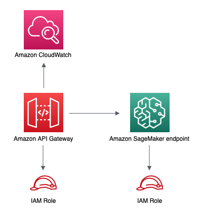

//!!NODE_ROOT <section>
//== aws-apigateway-sagemakerendpoint module

[.topic]
= aws-apigateway-sagemakerendpoint
:info_doctype: section
:info_title: aws-apigateway-sagemakerendpoint

image:https://img.shields.io/badge/stability-Experimental-important.svg?style=for-the-badge[Stability:Experimental]

____
All classes are under active development and subject to non-backward
compatible changes or removal in any future version. These are not
subject to the https://semver.org/[Semantic Versioning] model. This
means that while you may use them, you may need to update your source
code when upgrading to a newer version of this package.
____

[width="100%",cols="<50%,<50%",options="header",]
|===
|*Reference Documentation*:
|https://docs.aws.amazon.com/solutions/latest/constructs/
|===

[width="100%",cols="<46%,54%",options="header",]
|===
|*Language* |*Package*
|image:https://docs.aws.amazon.com/cdk/api/img/python32.png[Python
Logo] Python
|`aws_solutions_constructs.aws_apigateway_sagemakerendpoint`

|image:https://docs.aws.amazon.com/cdk/api/img/typescript32.png[Typescript
Logo] Typescript
|`@aws-solutions-constructs/aws-apigateway-sagemakerendpoint`

|image:https://docs.aws.amazon.com/cdk/api/img/java32.png[Java
Logo] Java
|`software.amazon.awsconstructs.services.apigatewaysagemakerendpoint`
|===

== Overview

This AWS Solutions Construct implements an Amazon API Gateway connected
to an Amazon SageMaker endpoint pattern.

Here is a minimal deployable pattern definition:

====
[role="tablist"]
Typescript::
+
[source,typescript]
----
import { Construct } from 'constructs';
import { Stack, StackProps } from 'aws-cdk-lib';
import { ApiGatewayToSageMakerEndpoint, ApiGatewayToSageMakerEndpointProps } from '@aws-solutions-constructs/aws-apigateway-sagemakerendpoint';

// Below is an example VTL (Velocity Template Language) mapping template for mapping the Api GET request to the Sagemaker POST request
const requestTemplate = `
{
    "instances": [
        # set( $user_id = $input.params("user_id") )
        # set( $items = $input.params("items") )
        # foreach( $item in $items.split(",") )
        # if( $foreach.hasNext ),#end
        {"in0": [$user_id], "in1": [$item]}
            $esc.newline
        # end
    ]
}`

// Replace 'my-endpoint' with your Sagemaker Inference Endpoint
new ApiGatewayToSageMakerEndpoint(this, 'test-apigw-sagemakerendpoint', {
  endpointName: 'my-endpoint',
  resourcePath: '{user_id}',
  requestMappingTemplate: requestTemplate
});
----

Python::
+
[source,python]
----
from aws_solutions_constructs.aws_apigateway_sagemakerendpoint import ApiGatewayToSageMakerEndpoint
from aws_cdk import Stack
from constructs import Construct

# Below is an example VTL (Velocity Template Language) mapping template for mapping the Api GET request to the Sagemaker POST request
request_template = """
{
    "instances": [
        # set( $user_id = $input.params("user_id") )
        # set( $items = $input.params("items") )
        # foreach( $item in $items.split(",") )
        # if( $foreach.hasNext ),#end
        {"in0": [$user_id], "in1": [$item]}
            $esc.newline
        # end
    ]
}"""

# Replace 'my-endpoint' with your Sagemaker Inference Endpoint
ApiGatewayToSageMakerEndpoint(self, 'test-apigw-sagemakerendpoint',
                                endpoint_name='my-endpoint',
                                resource_path='{user_id}',
                                request_mapping_template=request_template
                                )
----

Java::
+
[source,java]
----
import software.constructs.Construct;

import software.amazon.awscdk.Stack;
import software.amazon.awscdk.StackProps;
import software.amazon.awsconstructs.services.apigatewaysagemakerendpoint.*;

// Create an example VTL (Velocity Template Language) mapping template for mapping the Api GET request to the Sagemaker POST request
final String requestTemplate = "{"
        + "\"instances\": ["
        + "# set( $user_id = $input.params(\"user_id\") )"
        + "# set( $items = $input.params(\"items\") )"
        + "# foreach( $item in $items.split(\",\") )"
        + "# if( $foreach.hasNext ),#end"
        + "{\"in0\": [$user_id], \"in1\": [$item]}"
        + "    $esc.newline"
        + "# end"
        + "]"
        + "}";

// Replace ""my-endpoint"" with your Sagemaker Inference Endpoint
new ApiGatewayToSageMakerEndpoint(this, "ApiGatewayToSageMakerEndpointPattern",
        new ApiGatewayToSageMakerEndpointProps.Builder()
                .endpointName("my-endpoint")
                .resourcePath("{user_id}")
                .requestMappingTemplate(requestTemplate)
                .build());
----
====

== Pattern Construct Props

[width="100%",cols="<30%,<35%,35%",options="header",]
|===
|*Name* |*Type* |*Description*
|apiGatewayProps?
|https://docs.aws.amazon.com/cdk/api/v2/docs/aws-cdk-lib.aws_apigateway.RestApiProps.html[`api.RestApiProps`]
|Optional - user provided props to override the default props for the API Gateway.

|createUsagePlan? |boolean |Whether to create a Usage Plan attached to
the API. Must be true if
apiGatewayProps.defaultMethodOptions.apiKeyRequired is true. @default -
true (to match legacy behavior)

|apiGatewayExecutionRole?
|https://docs.aws.amazon.com/cdk/api/v2/docs/aws-cdk-lib.aws_iam.Role.html[`iam.Role`]
|IAM Role used by API Gateway to invoke the SageMaker endpoint. If not
specified, a default role is created with access to `endpointName`.

|endpointName |`string` |Name of the deployed SageMaker inference
endpoint.

|resourceName? |`string` |Optional resource name where the GET method
will be available.

|resourcePath |`string` |Resource path for the GET method. The variable
defined here can be referenced in `requestMappingTemplate`.

|requestMappingTemplate |`string` |Mapping template to convert GET
requests for the default `application/json` content-type received on the
REST API to POST requests expected by the SageMaker endpoint.

|additionalRequestTemplates
|`{ [contentType: string]: string;  }` |Optional Request
Templates for content-types other than `application/json`. Use the
`requestMappingTemplate` property to set the request template for the
`application/json` content-type.

|responseMappingTemplate? |`string` |Optional mapping template to
convert responses received from the SageMaker endpoint.

|logGroupProps?
|https://docs.aws.amazon.com/cdk/api/v2/docs/aws-cdk-lib.aws_logs.LogGroupProps.html[`logs.LogGroupProps`]
|User provided props to override the default props for for the
CloudWatchLogs LogGroup.
|===

== Pattern Properties

[width="100%",cols="<30%,<35%,35%",options="header",]
|===
|*Name* |*Type* |*Description*
|apiGateway
|https://docs.aws.amazon.com/cdk/api/v2/docs/aws-cdk-lib.aws_apigateway.RestApi.html[`api.RestApi`]
|Returns an instance of the API Gateway REST API created by the pattern.

|apiGatewayRole
|https://docs.aws.amazon.com/cdk/api/v2/docs/aws-cdk-lib.aws_iam.Role.html[`iam.Role`]
|Returns an instance of the iam.Role created by the construct for API
Gateway.

|apiGatewayCloudWatchRole?
|https://docs.aws.amazon.com/cdk/api/v2/docs/aws-cdk-lib.aws_iam.Role.html[`iam.Role`]
|Returns an instance of the iam.Role created by the construct for API
Gateway for CloudWatch access.

|apiGatewayLogGroup
|https://docs.aws.amazon.com/cdk/api/v2/docs/aws-cdk-lib.aws_logs.LogGroup.html[`logs.LogGroup`]
|Returns an instance of the LogGroup created by the construct for API
Gateway access logging to CloudWatch.
|===

== Sample API Usage

____
*Note*: Each SageMaker endpoint is unique, and the response from the API
will depend on the deployed model. The example given below assumes the
sample from
https://aws.amazon.com/blogs/machine-learning/creating-a-machine-learning-powered-rest-api-with-amazon-api-gateway-mapping-templates-and-amazon-sagemaker/[this
blog post]. For a reference on how that’d be implemented, please refer
to
link:test/integ.apigateway-sagemakerendpoint-overwrite.ts[integ.apigateway-sagemakerendpoint-overwrite.ts].
____

[width="99%",cols="<20%,<20%,20%,20%,20%",options="header",]
|===
|*Method* |*Request Path* |*Query String* |*SageMaker Action*
|*Description*
|GET |`/321` |`items=101,131,162` |`sagemaker:InvokeEndpoint` |Retrieves
the predictions for a specific user and items.
|===

== Default settings

Out of the box implementation of the Construct without any override will
set the following defaults:

=== Amazon API Gateway

* Deploy an edge-optimized API endpoint
* Enable CloudWatch logging for API Gateway
* Configure least privilege access IAM role for API Gateway
* Set the default authorizationType for all API methods to IAM
* Enable X-Ray Tracing
* Validate request parameters before passing data to SageMaker

== Architecture

// github block

'''''

© Copyright Amazon.com, Inc. or its affiliates. All Rights Reserved.
