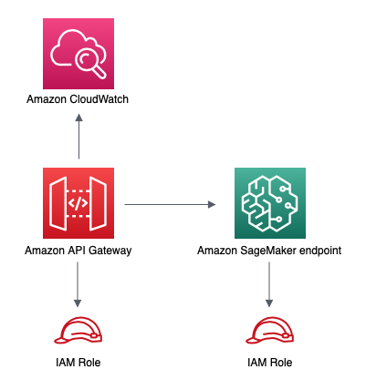

# aws-apigateway-sagemakerendpoint module
<!--BEGIN STABILITY BANNER-->

---


> All classes are under active development and subject to non-backward compatible changes or removal in any
> future version. These are not subject to the [Semantic Versioning](https://semver.org/) model.
> This means that while you may use them, you may need to update your source code when upgrading to a newer version of this package.

---
<!--END STABILITY BANNER-->

| **Reference Documentation**:| <span style="font-weight: normal">https://docs.aws.amazon.com/solutions/latest/constructs/</span>|
|:-------------|:-------------|
<div style="height:8px"></div>

| **Language**     | **Package**        |
|:-------------|-----------------|
| Python|`aws_solutions_constructs.aws_apigateway_sagemakerendpoint`|
| Typescript|`@aws-solutions-constructs/aws-apigateway-sagemakerendpoint`|
| Java|`software.amazon.awsconstructs.services.apigatewaysagemakerendpoint`|

## Overview

This AWS Solutions Construct implements an Amazon API Gateway connected to an Amazon SageMaker endpoint pattern.

Here is a minimal deployable pattern definition in Typescript:

``` javascript
import { ApiGatewayToSageMakerEndpoint, ApiGatewayToSageMakerEndpointProps } from '@aws-solutions-constructs/aws-apigateway-sagemakerendpoint';

// Below is an example VTL (Velocity Template Language) mapping template for mapping the Api GET request to the Sagemaker POST request
const requestTemplate =
`{
    "instances": [
#set( $user_id = $input.params("user_id") )
#set( $items = $input.params("items") )
#foreach( $item in $items.split(",") )
    {"in0": [$user_id], "in1": [$item]}#if( $foreach.hasNext ),#end
    $esc.newline
#end
    ]
}`;

// Replace 'my-endpoint' with your Sagemaker Inference Endpoint
new ApiGatewayToSageMakerEndpoint(this, 'test-apigw-sagemakerendpoint', {
    endpointName: 'my-endpoint',
    resourcePath: '{user_id}',
    requestMappingTemplate: requestTemplate
});
```

## Initializer

``` text
new ApiGatewayToSageMakerEndpoint(scope: Construct, id: string, props: ApiGatewayToSageMakerEndpointProps);
```

_Parameters_

* scope [`Construct`](https://docs.aws.amazon.com/cdk/api/latest/docs/@aws-cdk_core.Construct.html)
* id `string`
* props [`ApiGatewayToSageMakerEndpointProps`](#pattern-construct-props)

## Pattern Construct Props

| **Name**     | **Type**        | **Description** |
|:-------------|:----------------|-----------------|
|apiGatewayProps?|[`api.RestApiProps`](https://docs.aws.amazon.com/cdk/api/latest/docs/@aws-cdk_aws-apigateway.RestApiProps.html)|Optional user-provided props to override the default props for the API Gateway.|
|apiGatewayExecutionRole?|[`iam.Role`](https://docs.aws.amazon.com/cdk/api/latest/docs/@aws-cdk_aws-iam.Role.html)|IAM Role used by API Gateway to invoke the SageMaker endpoint. If not specified, a default role is created with access to `endpointName`.|
|endpointName|`string`|Name of the deployed SageMaker inference endpoint.|
|resourceName?|`string`|Optional resource name where the GET method will be available.|
|resourcePath|`string`|Resource path for the GET method. The variable defined here can be referenced in `requestMappingTemplate`.|
|requestMappingTemplate|`string`|Mapping template to convert GET requests received on the REST API to POST requests expected by the SageMaker endpoint.|
|responseMappingTemplate?|`string`|Optional mapping template to convert responses received from the SageMaker endpoint.|
|logGroupProps?|[`logs.LogGroupProps`](https://docs.aws.amazon.com/cdk/api/latest/docs/@aws-cdk_aws-logs.LogGroupProps.html)|User provided props to override the default props for for the CloudWatchLogs LogGroup.|

## Pattern Properties

| **Name**     | **Type**        | **Description** |
|:-------------|:----------------|-----------------|
|apiGateway|[`api.RestApi`](https://docs.aws.amazon.com/cdk/api/latest/docs/@aws-cdk_aws-apigateway.RestApi.html)|Returns an instance of the API Gateway REST API created by the pattern.|
|apiGatewayRole|[`iam.Role`](https://docs.aws.amazon.com/cdk/api/latest/docs/@aws-cdk_aws-iam.Role.html)|Returns an instance of the iam.Role created by the construct for API Gateway.|
|apiGatewayCloudWatchRole|[`iam.Role`](https://docs.aws.amazon.com/cdk/api/latest/docs/@aws-cdk_aws-iam.Role.html)|Returns an instance of the iam.Role created by the construct for API Gateway for CloudWatch access.|
|apiGatewayLogGroup|[`logs.LogGroup`](https://docs.aws.amazon.com/cdk/api/latest/docs/@aws-cdk_aws-logs.LogGroup.html)|Returns an instance of the LogGroup created by the construct for API Gateway access logging to CloudWatch.|

## Sample API Usage

> **Note**: Each SageMaker endpoint is unique, and the response from the API will depend on the deployed model. The example given below assumes the sample from [this blog post](https://aws.amazon.com/blogs/machine-learning/creating-a-machine-learning-powered-rest-api-with-amazon-api-gateway-mapping-templates-and-amazon-sagemaker/). For a reference on how that'd be implemented, please refer to [integ.apigateway-sagemakerendpoint-overwrite.ts](test/integ.apigateway-sagemakerendpoint-overwrite.ts).

| **Method** | **Request Path** | **Query String** | **SageMaker Action** | **Description** |
|:-------------|:----------------|-----------------|-----------------|-----------------|
|GET|`/321`| `items=101,131,162` |`sagemaker:InvokeEndpoint`|Retrieves the predictions for a specific user and items.|

## Default settings
Out of the box implementation of the Construct without any override will set the following defaults:

### Amazon API Gateway
* Deploy an edge-optimized API endpoint
* Enable CloudWatch logging for API Gateway
* Configure least privilege access IAM role for API Gateway
* Set the default authorizationType for all API methods to IAM
* Enable X-Ray Tracing
* Validate request parameters before passing data to SageMaker

## Architecture


***
&copy; Copyright 2020 Amazon.com, Inc. or its affiliates. All Rights Reserved.