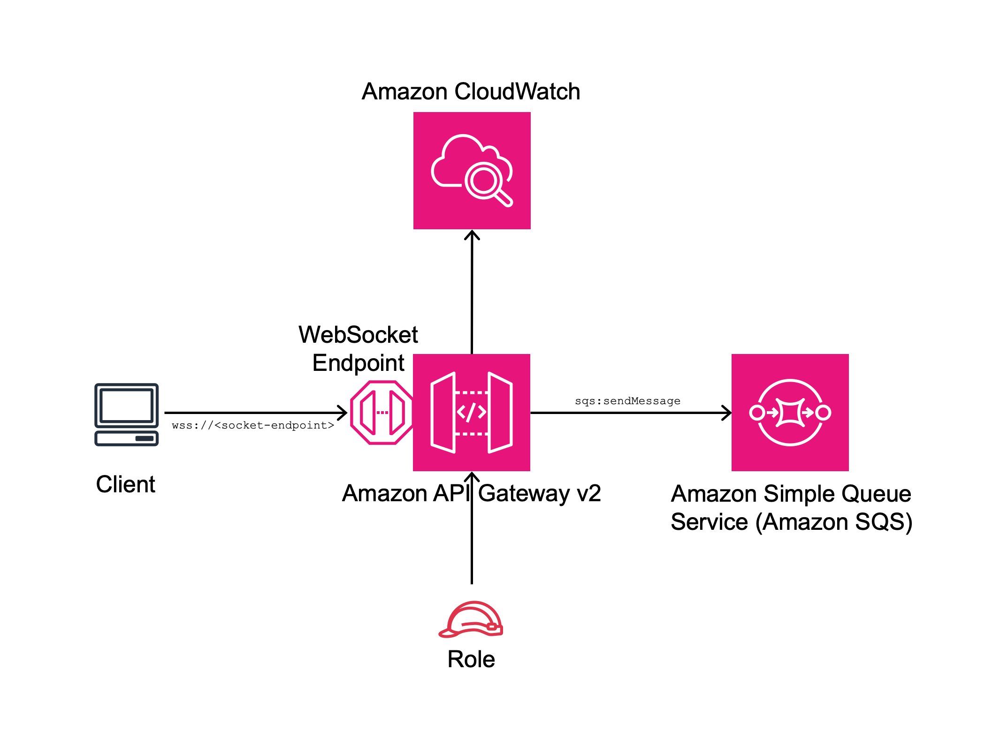

# aws-apigatewayv2websocket-sqs module
<!--BEGIN STABILITY BANNER-->

---


---
<!--END STABILITY BANNER-->

| **Reference Documentation**:| <span style="font-weight: normal">https://docs.aws.amazon.com/solutions/latest/constructs/</span>|
|:-------------|:-------------|
<div style="height:8px"></div>

| **Language**     | **Package**        |
|:-------------|-----------------|
| Python|`aws_solutions_constructs.aws_apigatewayv2websocket_sqs`|
| Typescript|`@aws-solutions-constructs/aws-apigatewayv2websocket-sqs`|
| Java|`software.amazon.awsconstructs.services.apigatewayv2websocketsqs`|

## Overview

This AWS Solutions Construct implements an Amazon API Gateway websocket connected to an Amazon SQS queue pattern.

Here is a minimal deployable pattern definition:

Typescript
``` typescript
import { Construct } from 'constructs';
import { Stack, StackProps } from 'aws-cdk-lib';
import { ApiGatewayV2WebSocketToSqs, ApiGatewayV2WebSocketToSqsProps } from "@aws-solutions-constructs/aws-apigatewayv2websocket-sqs";

new ApiGateApiGatewayV2WebSocketToSqswayToSqs(this, 'ApiGatewayV2WebSocketToSqsPattern', {});
```

Python
``` python
from aws_solutions_constructs.aws_apigateway_sqs import ApiGatewayV2WebSocketToSqs
from aws_cdk import Stack
from constructs import Construct

ApiGatewayV2WebSocketToSqs(self, 'ApiGatewayV2WebSocketToSqsPattern')
```

Java
``` java
import software.constructs.Construct;

import software.amazon.awscdk.Stack;
import software.amazon.awscdk.StackProps;
import software.amazon.awsconstructs.services.apigatewaysqs.*;

new ApiGatewayV2WebSocketToSqs(this, "ApiGatewayV2WebSocketToSqsPattern", new ApiGatewayV2WebSocketToSqsProps.Builder()
        .build());
```

## Pattern Construct Props

| **Name**     | **Type**        | **Description** |
|:-------------|:----------------|-----------------|
|existingWebSocketApi?|[`apigwv2.WebSocketApi`](https://docs.aws.amazon.com/cdk/api/v2/docs/aws-cdk-lib.aws_apigatewayv2.WebSocketApi.html)|Optional API Gateway WebSocket instance. Providing both existingWebSocketApi and webSocketApiProps will cause an error.|
|webSocketApiProps?|[`apigwv2.WebSocketApiProps`](https://docs.aws.amazon.com/cdk/api/v2/docs/aws-cdk-lib.aws_apigatewayv2.WebSocketApiProps.html)|Optional user-provided props to override the default props for the API Gateway. Providing both existingWebSocketApi and webSocketApiProps will cause an error.|
|queueProps?|[`sqs.QueueProps`](https://docs.aws.amazon.com/cdk/api/v2/docs/aws-cdk-lib.aws_sqs.QueueProps.html)|Optional user-provided props to override the default props for the queue. Providing both existingQueueObj and queueProps will cause an error.|
|existingQueueObj?|[`sqs.Queue`](https://docs.aws.amazon.com/cdk/api/v2/docs/aws-cdk-lib.aws_sqs.Queue.html)|Optional existing instance of SQS Queue. Providing both existingQueueObj and queueProps will cause an error.|
|deployDeadLetterQueue?|`boolean`|Whether to deploy a secondary queue to be used as a dead letter queue. Defaults to `true`.|
|deadLetterQueueProps?|[`sqs.QueueProps`](https://docs.aws.amazon.com/cdk/api/v2/docs/aws-cdk-lib.aws_sqs.QueueProps.html)|Optional properties to use for creating dead letter queue. Note that if you are creating a FIFO Queue, the dead letter queue should also be FIFO.|
|maxReceiveCount|`number`|The number of times a message can be unsuccessfully dequeued before being moved to the dead-letter queue.|
|createDefaultRoute?|`boolean`|Whether to create the default route (`$default`) on the WebSocket.|
|defaultRouteRequestTemplate?|`{ [contentType: string]: string }`|Optional API Gateway Request Template for the default route. This property will only be used if createDefaultRoute is `true`. If createDefaultRoute is `true` and this property is not provided, the construct will create the default route with the following VTL configuration `"Action=SendMessage&MessageGroupId=$input.path('$.MessageGroupId')&MessageDeduplicationId=$context.requestId&MessageAttribute.1.Name=connectionId&MessageAttribute.1.Value.StringValue=$context.connectionId&MessageAttribute.1.Value.DataType=String&MessageAttribute.2.Name=requestId&MessageAttribute.2.Value.StringValue=$context.requestId&MessageAttribute.2.Value.DataType=String&MessageBody=$util.urlEncode($input.json($util.escapeJavaScript('$').replaceAll(\"\\\\'\",\"'\")))"`

## Pattern Properties

| **Name**     | **Type**        | **Description** |
|:-------------|:----------------|-----------------|
|webSocketApi|[`apigwv2.WebSocketApi`](https://docs.aws.amazon.com/cdk/api/v2/docs/aws-cdk-lib.aws_apigatewayv2.WebSocketApi.html)|Returns an instance of the API Gateway WebSocket API created by the pattern.|
|apiGatewayRole|[`iam.Role`](https://docs.aws.amazon.com/cdk/api/v2/docs/aws-cdk-lib.aws_iam.Role.html)|Returns an instance of the iam.Role created by the construct for API Gateway.|
|webSocketStage|[`apigwv2.WebSocketStage`](https://docs.aws.amazon.com/cdk/api/v2/docs/aws-cdk-lib.aws_apigatewayv2.WebSocketStage.html)|Returns an instance of the WebSocketStage created by the construct.|
|apiGatewayLogGroup|[`logs.LogGroup`](https://docs.aws.amazon.com/cdk/api/v2/docs/aws-cdk-lib.aws_logs.LogGroup.html)|Returns an instance of the LogGroup created by the construct for API Gateway access logging to CloudWatch.|
|sqsQueue|[`sqs.Queue`](https://docs.aws.amazon.com/cdk/api/v2/docs/aws-cdk-lib.aws_sqs.Queue.html)|Returns an instance of the SQS queue created by the pattern.|
|deadLetterQueue?|[`sqs.DeadLetterQueue`](https://docs.aws.amazon.com/cdk/api/v2/docs/aws-cdk-lib.aws_sqs.DeadLetterQueue.html)|Returns an instance of the DeadLetterQueue created by the pattern.|

## Default settings

Out of the box implementation of the Construct without any override will set the following defaults:

### Amazon API Gateway
* Deploy a WebSocket endpoint
* Enable CloudWatch logging for API Gateway
* Configure least privilege access IAM role for API Gateway
* Enable X-Ray Tracing

### Amazon SQS Queue
* Deploy SQS dead-letter queue for the source SQS Queue
* Enable server-side encryption for source SQS Queue using AWS Managed KMS Key
* Enforce encryption of data in transit

## Architecture


***
&copy; Copyright Amazon.com, Inc. or its affiliates. All Rights Reserved.
