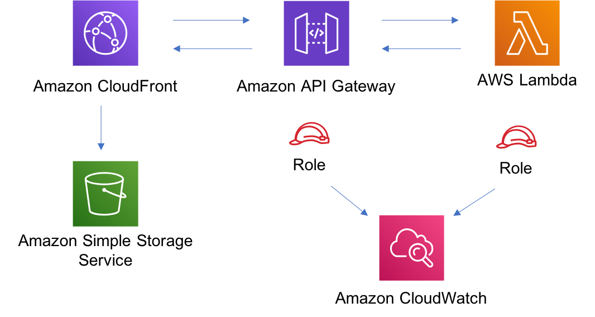

# aws-cloudfront-apigateway-lambda module
<!--BEGIN STABILITY BANNER-->

---


---
<!--END STABILITY BANNER-->

| **Reference Documentation**:| <span style="font-weight: normal">https://docs.aws.amazon.com/solutions/latest/constructs/</span>|
|:-------------|:-------------|
<div style="height:8px"></div>

| **Language**     | **Package**        |
|:-------------|-----------------|
| Python|`aws_solutions_constructs.aws_cloudfront_apigateway_lambda`|
| Typescript|`@aws-solutions-constructs/aws-cloudfront-apigateway-lambda`|
| Java|`software.amazon.awsconstructs.services.cloudfrontapigatewaylambda`|

## Overview
This AWS Solutions Construct implements an AWS CloudFront fronting an Amazon API Gateway Lambda backed REST API.

Here is a minimal deployable pattern definition:

Typescript
``` typescript
import { Construct } from 'constructs';
import { Stack, StackProps } from 'aws-cdk-lib';
import { CloudFrontToApiGatewayToLambda } from '@aws-solutions-constructs/aws-cloudfront-apigateway-lambda';
import * as lambda from 'aws-cdk-lib/aws-lambda';

new CloudFrontToApiGatewayToLambda(this, 'test-cloudfront-apigateway-lambda', {
  lambdaFunctionProps: {
    code: lambda.Code.fromAsset(`lambda`),
    runtime: lambda.Runtime.NODEJS_16_X,
    handler: 'index.handler'
  },
  apiGatewayProps: {
    defaultMethodOptions: {
      authorizationType: api.AuthorizationType.NONE
    }
  },
});
```

Python
``` python
from aws_solutions_constructs.aws_cloudfront_apigateway_lambda import CloudFrontToApiGatewayToLambda
from aws_cdk import (
  aws_lambda as _lambda,
  aws_apigateway as apigw,
  Stack
)
from constructs import Construct

        CloudFrontToApiGatewayToLambda(
            self, 'CloudFrontApiGatewayToLambda',
            lambda_function_props=_lambda.FunctionProps(
                runtime=_lambda.Runtime.PYTHON_3_7,
                code=_lambda.Code.from_asset('lambda'),
                handler='hello.handler',
            ),
            # NOTE - we use RestApiProps here because the actual type, LambdaRestApiProps requires
            # the handler function which does not yet exist. As RestApiProps is a subset of of LambdaRestApiProps
            # (although does not *extend* that interface) this works fine when the props object reaches the 
            # underlying TypeScript code that implements Constructs
            api_gateway_props=apigw.RestApiProps(
                default_method_options=apigw.MethodOptions(
                    authorization_type=apigw.AuthorizationType.NONE
                )
            )
        )
```

Java
``` java
import software.constructs.Construct;

import software.amazon.awscdk.Stack;
import software.amazon.awscdk.StackProps;
import software.amazon.awscdk.services.lambda.*;
import software.amazon.awscdk.services.lambda.Runtime;
import software.amazon.awsconstructs.services.cloudfrontapigatewaylambda.*;
import software.amazon.awsconstructs.services.cloudfrontapigatewaylambda.CloudFrontToApiGatewayToLambdaProps;

new CloudFrontToApiGatewayToLambda(this, "ApiGatewayToLambdaPattern", new CloudFrontToApiGatewayToLambdaProps.Builder()
        .lambdaFunctionProps(new FunctionProps.Builder()
                .runtime(Runtime.NODEJS_16_X) // execution environment
                .code(Code.fromAsset("lambda")) // code loaded from the `lambda` directory (under root, next to `src`)
                .handler("hello.handler") // file is `hello`, function is `handler`
                .build())
        // NOTE - we use RestApiProps here because the actual type, LambdaRestApiProps requires
        // the handler function which does not yet exist. As RestApiProps is a subset of of LambdaRestApiProps
        // (although does not *extend* that interface) this works fine when the props object reaches the 
        // underlying TypeScript code that implements Constructs
        .apiGatewayProps(new RestApiProps.Builder()
                .defaultMethodOptions(new MethodOptions.Builder()
                        .authorizationType(AuthorizationType.NONE)
                        .build())
                .build())
        .build());
```

## Pattern Construct Props

| **Name**     | **Type**        | **Description** |
|:-------------|:----------------|-----------------|
|existingLambdaObj?|[`lambda.Function`](https://docs.aws.amazon.com/cdk/api/v2/docs/aws-cdk-lib.aws_lambda.Function.html)|Existing instance of Lambda Function object, providing both this and `lambdaFunctionProps` will cause an error.|
|lambdaFunctionProps?|[`lambda.FunctionProps`](https://docs.aws.amazon.com/cdk/api/v2/docs/aws-cdk-lib.aws_lambda.FunctionProps.html)|Optional user provided props to override the default props for the Lambda function.|
|apiGatewayProps?|[`api.LambdaRestApiProps`](https://docs.aws.amazon.com/cdk/api/v2/docs/aws-cdk-lib.aws_apigateway.LambdaRestApiProps.html)|User provided props to override the default props for the API Gateway. As of release 2.48.0, clients must include this property with `defaultMethodOptions: { authorizationType: string }` specified. See Issue1043 in the github repo https://github.com/awslabs/aws-solutions-constructs/issues/1043 |
|cloudFrontDistributionProps?|[`cloudfront.DistributionProps`](https://docs.aws.amazon.com/cdk/api/v2/docs/aws-cdk-lib.aws_cloudfront.DistributionProps.html)|Optional user provided props to override the default props for CloudFront Distribution|
|insertHttpSecurityHeaders?|`boolean`|Optional user provided props to turn on/off the automatic injection of best practice HTTP security headers in all responses from CloudFront|
| responseHeadersPolicyProps?   | [`cloudfront.ResponseHeadersPolicyProps`](https://docs.aws.amazon.com/cdk/api/v2/docs/aws-cdk-lib.aws_cloudfront.ResponseHeadersPolicyProps.html) | Optional user provided configuration that cloudfront applies to all http responses.                                                         |
|logGroupProps?|[`logs.LogGroupProps`](https://docs.aws.amazon.com/cdk/api/v2/docs/aws-cdk-lib.aws_logs.LogGroupProps.html)|Optional user provided props to override the default props for for the CloudWatchLogs LogGroup.|
|cloudFrontLoggingBucketProps?|[`s3.BucketProps`](https://docs.aws.amazon.com/cdk/api/v2/docs/aws-cdk-lib.aws_s3.BucketProps.html)|Optional user provided props to override the default props for the CloudFront Logging Bucket.|

## Pattern Properties

| **Name**     | **Type**        | **Description** |
|:-------------|:----------------|-----------------|
|cloudFrontWebDistribution|[`cloudfront.Distribution`](https://docs.aws.amazon.com/cdk/api/v2/docs/aws-cdk-lib.aws_cloudfront.Distribution.html)|Returns an instance of cloudfront.Distribution created by the construct|
|cloudFrontFunction?|[`cloudfront.Function`](https://docs.aws.amazon.com/cdk/api/v2/docs/aws-cdk-lib.aws_cloudfront.Function.html)|Returns an instance of the Cloudfront function created by the pattern.|
|cloudFrontLoggingBucket|[`s3.Bucket`](https://docs.aws.amazon.com/cdk/api/latest/docs/aws-s3-readme.html)|Returns an instance of the logging bucket for CloudFront Distribution.|
|apiGateway|[`api.RestApi`](https://docs.aws.amazon.com/cdk/api/v2/docs/aws-cdk-lib.aws_apigateway.RestApi.html)|Returns an instance of the API Gateway REST API created by the pattern.|
|apiGatewayCloudWatchRole?|[`iam.Role`](https://docs.aws.amazon.com/cdk/api/v2/docs/aws-cdk-lib.aws_iam.Role.html)|Returns an instance of the iam.Role created by the construct for API Gateway for CloudWatch access.|
|apiGatewayLogGroup|[`logs.LogGroup`](https://docs.aws.amazon.com/cdk/api/v2/docs/aws-cdk-lib.aws_logs.LogGroup.html)|Returns an instance of the LogGroup created by the construct for API Gateway access logging to CloudWatch.|
|lambdaFunction|[`lambda.Function`](https://docs.aws.amazon.com/cdk/api/v2/docs/aws-cdk-lib.aws_lambda.Function.html)|Returns an instance of the Lambda function created by the pattern.|

## Default settings

Out of the box implementation of the Construct without any override will set the following defaults:

### Amazon CloudFront
* Configure Access logging for CloudFront Distribution
* Enable automatic injection of best practice HTTP security headers in all responses from CloudFront Distribution

### Amazon API Gateway
* Deploy a regional API endpoint
* Enable CloudWatch logging for API Gateway
* Configure least privilege access IAM role for API Gateway
* Set the default authorizationType for all API methods to NONE
* Enable X-Ray Tracing

### AWS Lambda Function
* Configure limited privilege access IAM role for Lambda function
* Enable reusing connections with Keep-Alive for NodeJs Lambda function
* Enable X-Ray Tracing
* Set Environment Variables
  * AWS_NODEJS_CONNECTION_REUSE_ENABLED (for Node 10.x and higher functions)

## Architecture


***
&copy; Copyright Amazon.com, Inc. or its affiliates. All Rights Reserved.
