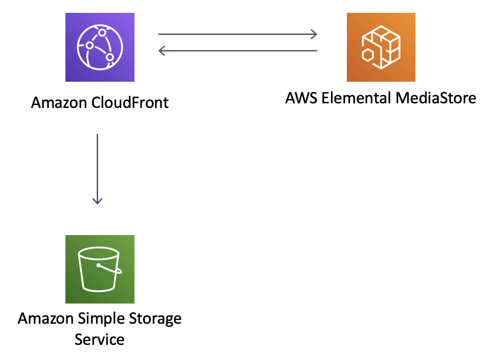

# aws-cloudfront-mediastore module
<!--BEGIN STABILITY BANNER-->

---


---
<!--END STABILITY BANNER-->

| **Reference Documentation**:| <span style="font-weight: normal">https://docs.aws.amazon.com/solutions/latest/constructs/</span>|
|:-------------|:-------------|
<div style="height:8px"></div>


| **Language**     | **Package**        |
|:-------------|-----------------|
| Python|`aws_solutions_constructs.aws_cloudfront_mediastore`|
| TypeScript|`@aws-solutions-constructs/aws-cloudfront-mediastore`|
| Java|`software.amazon.awsconstructs.services.cloudfrontmediastore`|

## Overview
This AWS Solutions Construct implements an Amazon CloudFront distribution to an AWS Elemental MediaStore container.

Here is a minimal deployable pattern definition:

Typescript
``` typescript
import { CloudFrontToMediaStore } from '@aws-solutions-constructs/aws-cloudfront-mediastore';

new CloudFrontToMediaStore(this, 'test-cloudfront-mediastore-default', {});
```

Python
``` python
from aws_solutions_constructs.aws_cloudfront_mediastore import CloudFrontToMediaStore

CloudFrontToMediaStore(self, 'test-cloudfront-mediastore-default')
```

Java
``` java
import software.amazon.awsconstructs.services.cloudfrontmediastore.*;

new CloudFrontToMediaStore(this, "test-cloudfront-mediastore-default", new CloudFrontToMediaStoreProps.Builder()
        .build());
```

## Pattern Construct Props

| **Name**     | **Type**        | **Description** |
|:-------------|:----------------|-----------------|
|existingMediaStoreContainerObj?|[`mediastore.CfnContainer`](https://docs.aws.amazon.com/cdk/api/latest/docs/@aws-cdk_aws-mediastore.CfnContainer.html)|Optional user provided MediaStore container to override the default MediaStore container.|
|mediaStoreContainerProps?|[`mediastore.CfnContainerProps`](https://docs.aws.amazon.com/cdk/api/latest/docs/@aws-cdk_aws-mediastore.CfnContainerProps.html)|Optional user provided props to override the default props for the MediaStore Container.|
|cloudFrontDistributionProps?|[`cloudfront.DistributionProps`](https://docs.aws.amazon.com/cdk/api/latest/docs/@aws-cdk_aws-cloudfront.DistributionProps.html)\|`any`|Optional user provided props to override the default props for the CloudFront Distribution.|
|insertHttpSecurityHeaders?|`boolean`|Optional user provided props to turn on/off the automatic injection of best practice HTTP security headers in all responses from CloudFront|
|cloudFrontLoggingBucketProps?|[`s3.BucketProps`](https://docs.aws.amazon.com/cdk/api/latest/docs/@aws-cdk_aws-s3.BucketProps.html)|Optional user provided props to override the default props for the CloudFront Logging Bucket.|

## Pattern Properties

| **Name**     | **Type**        | **Description** |
|:-------------|:----------------|-----------------|
|cloudFrontWebDistribution|[`cloudfront.CloudFrontWebDistribution`](https://docs.aws.amazon.com/cdk/api/latest/docs/@aws-cdk_aws-cloudfront.CloudFrontWebDistribution.html)|Returns an instance of cloudfront.CloudFrontWebDistribution created by the construct.|
|mediaStoreContainer|[`mediastore.CfnContainer`](https://docs.aws.amazon.com/cdk/api/latest/docs/@aws-cdk_aws-mediastore.CfnContainer.html)|Returns an instance of mediastore.CfnContainer.|
|cloudFrontLoggingBucket|[`s3.Bucket`](https://docs.aws.amazon.com/cdk/api/latest/docs/@aws-cdk_aws-s3.Bucket.html)|Returns an instance of s3.Bucket as the logging bucket for the CloudFront Web Distribution.|
|cloudFrontOriginRequestPolicy|[`cloudfront.OriginRequestPolicy`](https://docs.aws.amazon.com/cdk/api/latest/docs/@aws-cdk_aws-cloudfront.OriginRequestPolicy.html)|Returns an instance of cloudfront.OriginRequestPolicy created by the construct for the CloudFront Web Distribution.|
|cloudFrontOriginAccessIdentity?|[`cloudfront.OriginAccessIdentity`](https://docs.aws.amazon.com/cdk/api/latest/docs/@aws-cdk_aws-cloudfront.OriginAccessIdentity.html)|Returns an instance of cloudfront.OriginAccessIdentity created by the construct for the CloudFront Web Distribution origin custom headers and the MediaStore Container policy.|
|cloudFrontFunction?|[`cloudfront.Function`](https://docs.aws.amazon.com/cdk/api/latest/docs/@aws-cdk_aws-cloudfront.Function.html)|Returns an instance of the Cloudfront function created by the pattern.|

## Default settings

Out of the box implementation of the Construct without any override will set the following defaults:

### Amazon CloudFront
* Configure access logging for CloudFront Web Distribution
* Enable CloudFront Origin Request Policy for AWS Elemental MediaStore Container
* Set `User-Agent` custom header with CloudFront Origin Access Identity
* Enable automatic injection of best practice HTTP security headers in all responses from CloudFront WebDistribution

### AWS Elemental MediaStore
* Set the deletion policy to retain the resource
* Set the container name with the CloudFormation stack name
* Set the default [Container Cross-origin resource sharing (CORS) policy](https://docs.aws.amazon.com/mediastore/latest/ug/cors-policy.html)
* Set the default [Object Life Cycle policy](https://docs.aws.amazon.com/mediastore/latest/ug/policies-object-lifecycle.html)
* Set the default [Container Policy](https://docs.aws.amazon.com/mediastore/latest/ug/policies.html) to allow only `aws:UserAgent` with CloudFront Origin Access Identity
* Set the default [Metric Policy](https://docs.aws.amazon.com/mediastore/latest/ug/policies-metric.html)
* Enable the access logging

## Architecture


***
&copy; Copyright 2021 Amazon.com, Inc. or its affiliates. All Rights Reserved.
