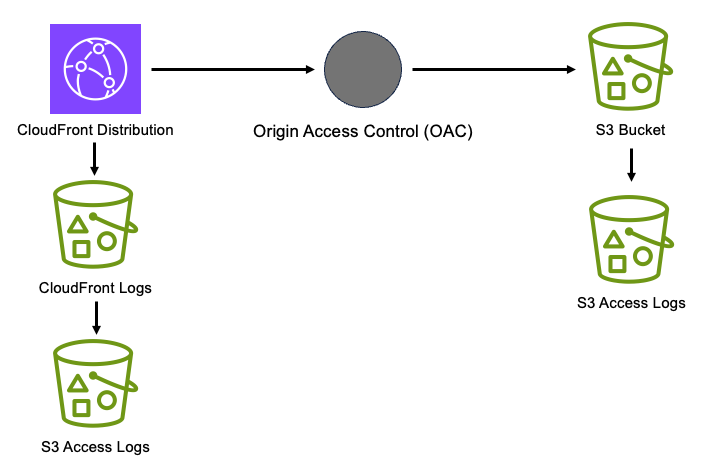

//!!NODE_ROOT <section>
//== aws-cloudfront-s3 module

[.topic]
= aws-cloudfront-s3
:info_doctype: section
:info_title: aws-cloudfront-s3

image:https://img.shields.io/badge/cfn--resources-stable-success.svg?style=for-the-badge[Stability:Stable]

[width="100%",cols="<50%,<50%",options="header",]
|===
|*Reference Documentation*:
|https://docs.aws.amazon.com/solutions/latest/constructs/
|===

[width="100%",cols="<46%,54%",options="header",]
|===
|*Language* |*Package*
|image:https://docs.aws.amazon.com/cdk/api/latest/img/python32.png[Python
Logo] Python
|`aws_solutions_constructs.aws_cloudfront_s3`

|image:https://docs.aws.amazon.com/cdk/api/latest/img/typescript32.png[Typescript
Logo] Typescript |`@aws-solutions-constructs/aws-cloudfront-s3`

|image:https://docs.aws.amazon.com/cdk/api/latest/img/java32.png[Java
Logo] Java |`software.amazon.awsconstructs.services.cloudfronts3`
|===

== Overview

This AWS Solutions Construct provisions an Amazon CloudFront
Distribution that serves objects from an AWS S3 Bucket via an Origin
Access Control (OAC).

Here is a minimal deployable pattern definition:

====
[role="tablist"]
Typescript::
+
[source,typescript]
----
import { Construct } from 'constructs';
import { Stack, StackProps } from 'aws-cdk-lib';
import { CloudFrontToS3 } from '@aws-solutions-constructs/aws-cloudfront-s3';

new CloudFrontToS3(this, 'test-cloudfront-s3', {});
----

Python::
+
[source,python]
----
from aws_solutions_constructs.aws_cloudfront_s3 import CloudFrontToS3
from aws_cdk import Stack
from constructs import Construct

CloudFrontToS3(self, 'test-cloudfront-s3')
----

Java::
+
[source,java]
----
import software.constructs.Construct;

import software.amazon.awscdk.Stack;
import software.amazon.awscdk.StackProps;
import software.amazon.awsconstructs.services.cloudfronts3.*;

new CloudFrontToS3(this, "test-cloudfront-s3", new CloudFrontToS3Props.Builder()
        .build());
----
====

== Pattern Construct Props

[width="100%",cols="<30%,<35%,35%",options="header",]
|===
|*Name* |*Type* |*Description*
|cloudFrontDistributionProps?
|https://docs.aws.amazon.com/cdk/api/v2/docs/aws-cdk-lib.aws_cloudfront.DistributionProps.html[`cloudfront.DistributionProps`]
|Optional user provided props to override the default props for
CloudFront Distribution

|insertHttpSecurityHeaders? |`boolean` |Optional user provided props to
turn on/off the automatic injection of best practice HTTP security
headers in all responses from CloudFront

|responseHeadersPolicyProps?
|https://docs.aws.amazon.com/cdk/api/v2/docs/aws-cdk-lib.aws_cloudfront.ResponseHeadersPolicyProps.html[`cloudfront.ResponseHeadersPolicyProps`]
|Optional user provided configuration that cloudfront applies to all
http responses.

|originPath? |`string` |Optional user provided props to provide
anhttps://docs.aws.amazon.com/cdk/api/v2/docs/aws-cdk-lib.aws_cloudfront_origins.S3OriginProps.html#originpath[originPath]
that CloudFront appends to the origin domain name when CloudFront
requests content from the origin. The string should start with a `/`,
for example: `/production`. Default value is `'/'`

|existingBucketObj?
|https://docs.aws.amazon.com/cdk/api/v2/docs/aws-cdk-lib.aws_s3.IBucket.html[`s3.IBucket`]
|Optional - existing instance of S3 Bucket. If this is
provided, then also providing bucketProps will cause an error.

|bucketProps?
|https://docs.aws.amazon.com/cdk/api/v2/docs/aws-cdk-lib.aws_s3.BucketProps.html[`s3.BucketProps`]
|Optional user provided props to override the default props for the S3 Content Bucket, providing both this and `existingBucketObj` will cause an error.
Note - to log S3 access for this bucket to an existing S3 bucket, put the existing log bucket in bucketProps: `serverAccessLogsBucket`

|logS3AccessLogs? |boolean |Whether to turn on Access Logging for the S3
bucket. Creates an S3 bucket with associated storage costs for the logs.
Enabling Access Logging is a best practice. default - true

|loggingBucketProps?
|https://docs.aws.amazon.com/cdk/api/v2/docs/aws-cdk-lib.aws_s3.BucketProps.html[`s3.BucketProps`]
|Optional user provided props to override the default props for the S3
Logging Bucket.

|cloudFrontLoggingBucketProps?
|https://docs.aws.amazon.com/cdk/api/v2/docs/aws-cdk-lib.aws_s3.BucketProps.html[`s3.BucketProps`]
|Optional user provided props to override the default props for the
CloudFront Logging Bucket. Note: to use an existing bucketto hold
CloudFront logs, pass the existing log bucket in

|logCloudFrontAccessLog |`boolean` |Optional - Whether to maintain
access logs for the CloudFront Logging bucket. Specifying false for this
while providing info about the log bucket will cause an error. Default =
true

|cloudFrontLoggingBucketAccessLogBucketProps
|https://docs.aws.amazon.com/cdk/api/v2/docs/aws-cdk-lib.aws_s3.BucketProps.html[`s3.BucketProps`]
|Optional user provided props to override the default props for the
CloudFront Log Bucket Access Log bucket. Providing both this and
`existingcloudFrontLoggingBucketAccessLogBucket` will cause an error. To
provide an existing bucket to accept these logs, pass the existing
bucket in `cloudFrontLoggingBucketProps::serverAccessLogBucket`
|===

== Pattern Properties

[width="100%",cols="<30%,<35%,35%",options="header",]
|===
|*Name* |*Type* |*Description*
|cloudFrontWebDistribution
|https://docs.aws.amazon.com/cdk/api/v2/docs/aws-cdk-lib.aws_cloudfront.Distribution.html[`cloudfront.Distribution`]
|Returns an instance of cloudfront.Distribution created by the
construct.

|cloudFrontFunction?
|https://docs.aws.amazon.com/cdk/api/v2/docs/aws-cdk-lib.aws_cloudfront.Function.html[`cloudfront.Function`]
|Returns an instance of the Cloudfront function created by the
construct.

|originAccessControl?
|https://docs.aws.amazon.com/cdk/api/v2/docs/aws-cdk-lib.cloudfront.CfnOriginAccessControl.html[`cloudfront.CfnOriginAccessControl`]
|Returns an instance of cloudfront.CfnOriginAccessControl created by the
construct.

|s3BucketInterface
|https://docs.aws.amazon.com/cdk/api/v2/docs/aws-cdk-lib.aws_s3.IBucket.html[`s3.IBucket`]
|Returns an instance of s3.IBucket created by the construct.

|s3Bucket?
|https://docs.aws.amazon.com/cdk/api/v2/docs/aws-cdk-lib.aws_s3.Bucket.html[`s3.Bucket`]
|Returns an instance of s3.Bucket created by the construct. IMPORTANT:
If `existingBucketObj` was provided in Pattern Construct Props, this
property will be `undefined`

|s3LoggingBucket?
|https://docs.aws.amazon.com/cdk/api/v2/docs/aws-cdk-lib.aws_s3.Bucket.html[`s3.Bucket`]
|Returns an instance of s3.Bucket created by the construct as the
logging bucket for the primary bucket.

|cloudFrontLoggingBucket?
|https://docs.aws.amazon.com/cdk/api/v2/docs/aws-cdk-lib.aws_s3.Bucket.html[`s3.Bucket`]
|The S3 bucket created by the construct to hold CloudFront logs. Only
populated if the construct creates the bucket (not if an existing bucket
is passed in via DistributionProps)

|cloudFrontLoggingBucketAccessLogBucket?
|https://docs.aws.amazon.com/cdk/api/v2/docs/aws-cdk-lib.aws_s3.Bucket.html[`s3.Bucket`]
|The S3 bucket containing the S3 access logs for the CloudFront log
bucket. Only populated if the construct creates the bucket (not if the
bucket is passed in via
`cloudFrontLoggingBucketProps::serverAccessLogBucket`
|===

== Default settings

Out of the box implementation of the Construct without any override will
set the following defaults:

=== Amazon CloudFront

* Configure Access logging for CloudFront Distribution
* Enable automatic injection of best practice HTTP security headers in
all responses from CloudFront Distribution
* CloudFront originPath set to `'/'`
* Create an Origin Access Control to access S3 bucket
* The construct will assign the origin created by the construct to any `DistributionProps.additionalBehaviors` provided that do not have an origin specified.

=== Amazon S3 Bucket

* Configure Access logging for S3 Bucket
* Enable server-side encryption for S3 Bucket using AWS managed KMS Key
* Enforce encryption of data in transit
* Turn on the versioning for S3 Bucket
* Don’t allow public access for S3 Bucket
* Retain the S3 Bucket when deleting the CloudFormation stack
* Applies Lifecycle rule to move noncurrent object versions to Glacier
storage after 90 days

== Architecture

// github block

'''''

© Copyright Amazon.com, Inc. or its affiliates. All Rights Reserved.
