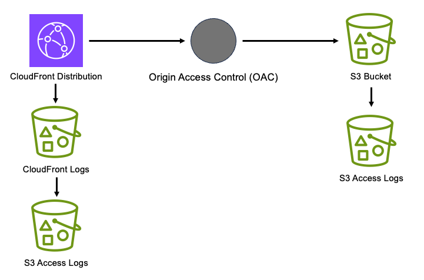

# aws-cloudfront-s3 module
<!--BEGIN STABILITY BANNER-->

---


---
<!--END STABILITY BANNER-->

| **Reference Documentation**:| <span style="font-weight: normal">https://docs.aws.amazon.com/solutions/latest/constructs/</span>|
|:-------------|:-------------|
<div style="height:8px"></div>

| **Language**     | **Package**        |
|:-------------|-----------------|
| Python|`aws_solutions_constructs.aws_cloudfront_s3`|
| Typescript|`@aws-solutions-constructs/aws-cloudfront-s3`|
| Java|`software.amazon.awsconstructs.services.cloudfronts3`|

## Overview
This AWS Solutions Construct provisions an Amazon CloudFront Distribution that serves objects from an AWS S3 Bucket via an Origin Access Control (OAC).

Here is a minimal deployable pattern definition:

Typescript
``` typescript
import { Construct } from 'constructs';
import { Stack, StackProps } from 'aws-cdk-lib';
import { CloudFrontToS3 } from '@aws-solutions-constructs/aws-cloudfront-s3';

new CloudFrontToS3(this, 'test-cloudfront-s3', {});
```

Python
``` python
from aws_solutions_constructs.aws_cloudfront_s3 import CloudFrontToS3
from aws_cdk import Stack
from constructs import Construct

CloudFrontToS3(self, 'test-cloudfront-s3')
```

Java
``` java
import software.constructs.Construct;

import software.amazon.awscdk.Stack;
import software.amazon.awscdk.StackProps;
import software.amazon.awsconstructs.services.cloudfronts3.*;

new CloudFrontToS3(this, "test-cloudfront-s3", new CloudFrontToS3Props.Builder()
        .build());
```

## Pattern Construct Props

| **Name**     | **Type**        | **Description** |
|:-------------|:----------------|-----------------|
|cloudFrontDistributionProps?|[`cloudfront.DistributionProps`](https://docs.aws.amazon.com/cdk/api/v2/docs/aws-cdk-lib.aws_cloudfront.DistributionProps.html)|Optional user provided props to override the default props for CloudFront Distribution|
|insertHttpSecurityHeaders?|`boolean`|Optional user provided props to turn on/off the automatic injection of best practice HTTP security headers in all responses from CloudFront|
|responseHeadersPolicyProps?   | [`cloudfront.ResponseHeadersPolicyProps`](https://docs.aws.amazon.com/cdk/api/v2/docs/aws-cdk-lib.aws_cloudfront.ResponseHeadersPolicyProps.html) | Optional user provided configuration that cloudfront applies to all http responses.|
|originPath?|`string`|Optional user provided props to provide an[originPath](https://docs.aws.amazon.com/cdk/api/v2/docs/aws-cdk-lib.aws_cloudfront_origins.S3OriginProps.html#originpath) that CloudFront appends to the origin domain name when CloudFront requests content from the origin. The string should start with a `/`, for example: `/production`. Default value is `'/'`|
|existingBucketObj?|[`s3.IBucket`](https://docs.aws.amazon.com/cdk/api/v2/docs/aws-cdk-lib.aws_s3.IBucket.html)|Existing instance of S3 content bucket object or interface. If this is provided, then also providing bucketProps will cause an error. |
|bucketProps?|[`s3.BucketProps`](https://docs.aws.amazon.com/cdk/api/v2/docs/aws-cdk-lib.aws_s3.BucketProps.html)|Optional user provided props to override the default props for the S3 content bucket. Note - to log S3 access for this bucket to an existing S3 bucket, put the existing log bucket in bucketProps: `serverAccessLogsBucket`|
|logS3AccessLogs?| boolean|Whether to turn on Access Logging for the S3 bucket. Creates an S3 bucket with associated storage costs for the logs. Enabling Access Logging is a best practice. default - true|
|loggingBucketProps?|[`s3.BucketProps`](https://docs.aws.amazon.com/cdk/api/v2/docs/aws-cdk-lib.aws_s3.BucketProps.html)|Optional user provided props to override the default props for the S3 Logging Bucket.|
|cloudFrontLoggingBucketProps?|[`s3.BucketProps`](https://docs.aws.amazon.com/cdk/api/v2/docs/aws-cdk-lib.aws_s3.BucketProps.html)|Optional user provided props to override the default props for the CloudFront Logging Bucket. Note: to use an existing bucketto  hold CloudFront logs, pass the existing log bucket in |
|logCloudFrontAccessLog|`boolean`|Optional - Whether to maintain access logs for the CloudFront Logging bucket. Specifying false for this while providing info about the log bucket will cause an error. Default = true |
|cloudFrontLoggingBucketAccessLogBucketProps|[`s3.BucketProps`](https://docs.aws.amazon.com/cdk/api/v2/docs/aws-cdk-lib.aws_s3.BucketProps.html)|Optional user provided props to override the default props for the CloudFront Log Bucket Access Log bucket. Providing both this and `existingcloudFrontLoggingBucketAccessLogBucket` will cause an error. To provide an existing bucket to accept these logs, pass the existing bucket in `cloudFrontLoggingBucketProps::serverAccessLogBucket`|

## Pattern Properties

| **Name**     | **Type**        | **Description** |
|:-------------|:----------------|-----------------|
|cloudFrontWebDistribution|[`cloudfront.Distribution`](https://docs.aws.amazon.com/cdk/api/v2/docs/aws-cdk-lib.aws_cloudfront.Distribution.html)|Returns an instance of cloudfront.Distribution created by the construct.|
|cloudFrontFunction?|[`cloudfront.Function`](https://docs.aws.amazon.com/cdk/api/v2/docs/aws-cdk-lib.aws_cloudfront.Function.html)|Returns an instance of the Cloudfront function created by the construct.|
|originAccessControl?|[`cloudfront.CfnOriginAccessControl`](https://docs.aws.amazon.com/cdk/api/v2/docs/aws-cdk-lib.cloudfront.CfnOriginAccessControl.html)|Returns an instance of cloudfront.CfnOriginAccessControl created by the construct.|
|s3BucketInterface|[`s3.IBucket`](https://docs.aws.amazon.com/cdk/api/v2/docs/aws-cdk-lib.aws_s3.IBucket.html)|Returns an instance of s3.IBucket created by the construct.|
|s3Bucket?|[`s3.Bucket`](https://docs.aws.amazon.com/cdk/api/v2/docs/aws-cdk-lib.aws_s3.Bucket.html)|Returns an instance of s3.Bucket created by the construct. IMPORTANT: If `existingBucketObj` was provided in Pattern Construct Props, this property will be `undefined`|
|s3LoggingBucket?|[`s3.Bucket`](https://docs.aws.amazon.com/cdk/api/v2/docs/aws-cdk-lib.aws_s3.Bucket.html)|Returns an instance of s3.Bucket created by the construct as the logging bucket for the primary bucket.|
|cloudFrontLoggingBucket?|[`s3.Bucket`](https://docs.aws.amazon.com/cdk/api/v2/docs/aws-cdk-lib.aws_s3.Bucket.html)|The S3 bucket created by the construct to hold CloudFront logs. Only populated if the construct creates the bucket (not if an existing bucket is passed in via DistributionProps)|
|cloudFrontLoggingBucketAccessLogBucket?|[`s3.Bucket`](https://docs.aws.amazon.com/cdk/api/v2/docs/aws-cdk-lib.aws_s3.Bucket.html)|The S3 bucket containing the S3 access logs for the CloudFront log bucket. Only populated if the construct creates the bucket (not if the bucket is passed in via `cloudFrontLoggingBucketProps::serverAccessLogBucket`|

## Default settings

Out of the box implementation of the Construct without any override will set the following defaults:

### Amazon CloudFront
* Configure Access logging for CloudFront Distribution
* Enable automatic injection of best practice HTTP security headers in all responses from CloudFront Distribution
* CloudFront originPath set to `'/'`

### Amazon S3 Bucket
* Configure Access logging for S3 Bucket
* Enable server-side encryption for S3 Bucket using AWS managed KMS Key
* Enforce encryption of data in transit
* Turn on the versioning for S3 Bucket
* Don't allow public access for S3 Bucket
* Retain the S3 Bucket when deleting the CloudFormation stack
* Applies Lifecycle rule to move noncurrent object versions to Glacier storage after 90 days

## Architecture


***
&copy; Copyright Amazon.com, Inc. or its affiliates. All Rights Reserved.
