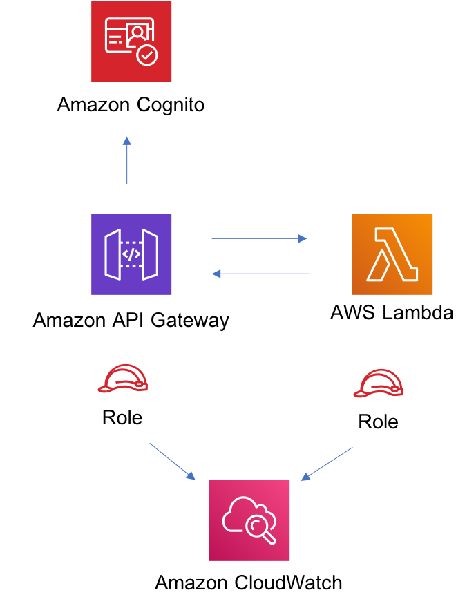

//!!NODE_ROOT <section>
//== aws-cognito-apigateway-lambda module

[.topic]
= aws-cognito-apigateway-lambda
:info_doctype: section
:info_title: aws-cognito-apigateway-lambda

image:https://img.shields.io/badge/cfn--resources-stable-success.svg?style=for-the-badge[Stability:Stable]

____
All classes are under active development and subject to non-backward
compatible changes or removal in any future version. These are not
subject to the https://semver.org/[Semantic Versioning] model. This
means that while you may use them, you may need to update your source
code when upgrading to a newer version of this package.
____

[width="100%",cols="<50%,<50%",options="header",]
|===
|*Reference Documentation*:
|https://docs.aws.amazon.com/solutions/latest/constructs/
|===

[width="100%",cols="<46%,54%",options="header",]
|===
|*Language* |*Package*
|image:https://docs.aws.amazon.com/cdk/api/latest/img/python32.png[Python
Logo] Python
|`aws_solutions_constructs.aws_cognito_apigateway_lambda`

|image:https://docs.aws.amazon.com/cdk/api/latest/img/typescript32.png[Typescript
Logo] Typescript
|`@aws-solutions-constructs/aws-cognito-apigateway-lambda`

|image:https://docs.aws.amazon.com/cdk/api/latest/img/java32.png[Java
Logo] Java
|`software.amazon.awsconstructs.services.cognitoapigatewaylambda`
|===

== Overview

This AWS Solutions Construct implements an Amazon Cognito securing an
Amazon API Gateway Lambda backed REST APIs pattern.

Here is a minimal deployable pattern definition:

====
[role="tablist"]
Typescript::
+
[source,typescript]
----
import { Construct } from 'constructs';
import { Stack, StackProps } from 'aws-cdk-lib';
import { CognitoToApiGatewayToLambda } from '@aws-solutions-constructs/aws-cognito-apigateway-lambda';
import * as lambda from 'aws-cdk-lib/aws-lambda';

new CognitoToApiGatewayToLambda(this, 'test-cognito-apigateway-lambda', {
  lambdaFunctionProps: {
    code: lambda.Code.fromAsset(`lambda`),
    runtime: lambda.Runtime.NODEJS_20_X,
    handler: 'index.handler'
  }
});
----

Python::
+
[source,python]
----
from aws_solutions_constructs.aws_cognito_apigateway_lambda import CognitoToApiGatewayToLambda
from aws_cdk import (
    aws_lambda as _lambda,
    Stack
)
from constructs import Construct

CognitoToApiGatewayToLambda(self, 'test-cognito-apigateway-lambda',
                            lambda_function_props=_lambda.FunctionProps(
                                code=_lambda.Code.from_asset('lambda'),
                                runtime=_lambda.Runtime.PYTHON_3_11,
                                handler='index.handler'
                            )
                            )
----

Java::
+
[source,java]
----
import software.constructs.Construct;

import software.amazon.awscdk.Stack;
import software.amazon.awscdk.StackProps;
import software.amazon.awscdk.services.lambda.*;
import software.amazon.awscdk.services.lambda.Runtime;
import software.amazon.awsconstructs.services.cognitoapigatewaylambda.*;

new CognitoToApiGatewayToLambda(this, "test-cognito-apigateway-lambda",
        new CognitoToApiGatewayToLambdaProps.Builder()
                .lambdaFunctionProps(new FunctionProps.Builder()
                        .runtime(Runtime.NODEJS_20_X)
                        .code(Code.fromAsset("lambda"))
                        .handler("index.handler")
                        .build())
                .build());
----
====

If you are defining resources and methods on your API (e.g. proxy =
false), then you must call addAuthorizers() after the API is fully
defined to ensure every method is protected. Here is an example:

====
[role="tablist"]
Typescript::
+
[source,typescript]
----
import { Construct } from 'constructs';
import { Stack, StackProps } from 'aws-cdk-lib';
import { CognitoToApiGatewayToLambda } from '@aws-solutions-constructs/aws-cognito-apigateway-lambda';
import * as lambda from 'aws-cdk-lib/aws-lambda';

const construct = new CognitoToApiGatewayToLambda(this, 'test-cognito-apigateway-lambda', {
    lambdaFunctionProps: {
        code: lambda.Code.fromAsset(`lambda`),
        runtime: lambda.Runtime.NODEJS_20_X,
        handler: 'index.handler'
    },
    apiGatewayProps: {
        proxy: false
    }
});

const resource = construct.apiGateway.root.addResource('foobar');
resource.addMethod('POST');

// Mandatory to call this method to Apply the Cognito Authorizers on all API methods
construct.addAuthorizers();
----

Python::
+
[source,python]
----
from aws_solutions_constructs.aws_cognito_apigateway_lambda import CognitoToApiGatewayToLambda
from aws_cdk import (
    aws_lambda as _lambda,
    aws_apigateway as api,
    Stack
)
from constructs import Construct
from typing import Any

# Overriding LambdaRestApiProps with type Any
gateway_props = dict[Any, Any]

construct = CognitoToApiGatewayToLambda(self, 'test-cognito-apigateway-lambda',
                                        lambda_function_props=_lambda.FunctionProps(
                                            code=_lambda.Code.from_asset(
                                                'lambda'),
                                            runtime=_lambda.Runtime.PYTHON_3_11,
                                            handler='index.handler'
                                        ),
                                        api_gateway_props=gateway_props(
                                            proxy=False
                                        )
                                        )

resource = construct.api_gateway.root.add_resource('foobar')
resource.add_method('POST')

# Mandatory to call this method to Apply the Cognito Authorizers on all API methods
construct.add_authorizers()
----

Java::
+
[source,java]
----
import software.constructs.Construct;

import java.util.HashMap;
import java.util.Map;
import java.util.Optional;

import software.amazon.awscdk.*;
import software.amazon.awscdk.services.lambda.*;
import software.amazon.awscdk.services.lambda.Runtime;
import software.amazon.awscdk.services.apigateway.IResource;
import software.amazon.awsconstructs.services.cognitoapigatewaylambda.*;

// Overriding LambdaRestApiProps with type Any
Map<String, Optional<?>> gatewayProps = new HashMap<String, Optional<?>>();
gatewayProps.put("proxy", Optional.of(false));

final CognitoToApiGatewayToLambda construct = new CognitoToApiGatewayToLambda(this,
        "test-cognito-apigateway-lambda",
        new CognitoToApiGatewayToLambdaProps.Builder()
                .lambdaFunctionProps(new FunctionProps.Builder()
                        .runtime(Runtime.NODEJS_20_X)
                        .code(Code.fromAsset("lambda"))
                        .handler("index.handler")
                        .build())
                .apiGatewayProps(gatewayProps)
                .build());

final IResource resource = construct.getApiGateway().getRoot().addResource("foobar");
resource.addMethod("POST");

// Mandatory to call this method to Apply the Cognito Authorizers on all API methods
construct.addAuthorizers();
----
====

== Pattern Construct Props

[width="100%",cols="<30%,<35%,35%",options="header",]
|===
|*Name* |*Type* |*Description*
|existingLambdaObj?
|https://docs.aws.amazon.com/cdk/api/v2/docs/aws-cdk-lib.aws_lambda.Function.html[`lambda.Function`]
|Existing instance of Lambda Function object, providing both this and
`lambdaFunctionProps` will cause an error.

|lambdaFunctionProps?
|https://docs.aws.amazon.com/cdk/api/v2/docs/aws-cdk-lib.aws_lambda.FunctionProps.html[`lambda.FunctionProps`]
|User provided props to override the default props for the Lambda
function.

|apiGatewayProps?
|https://docs.aws.amazon.com/cdk/api/v2/docs/aws-cdk-lib.aws_apigateway.LambdaRestApi.html[`api.LambdaRestApiProps`]
|Optional user provided props to override the default props for API
Gateway

|cognitoUserPoolProps?
|https://docs.aws.amazon.com/cdk/api/v2/docs/aws-cdk-lib.aws_cognito.UserPoolProps.html[`cognito.UserPoolProps`]
|Optional user provided props to override the default props for Cognito
User Pool

|cognitoUserPoolClientProps?
|https://docs.aws.amazon.com/cdk/api/v2/docs/aws-cdk-lib.aws_cognito.UserPoolClientProps.html[`cognito.UserPoolClientProps`]
|Optional user provided props to override the default props for Cognito
User Pool Client

|logGroupProps?
|https://docs.aws.amazon.com/cdk/api/v2/docs/aws-cdk-lib.aws_logs.LogGroupProps.html[`logs.LogGroupProps`]
|User provided props to override the default props for for the
CloudWatchLogs LogGroup.
|===

== Pattern Properties

[width="100%",cols="<30%,<35%,35%",options="header",]
|===
|*Name* |*Type* |*Description*
|userPool
|https://docs.aws.amazon.com/cdk/api/v2/docs/aws-cdk-lib.aws_cognito.UserPool.html[`cognito.UserPool`]
|Returns an instance of cognito.UserPool created by the construct

|userPoolClient
|https://docs.aws.amazon.com/cdk/api/v2/docs/aws-cdk-lib.aws_cognito.UserPoolClient.html[`cognito.UserPoolClient`]
|Returns an instance of cognito.UserPoolClient created by the construct

|apiGateway
|https://docs.aws.amazon.com/cdk/api/v2/docs/aws-cdk-lib.aws_apigateway.RestApi.html[`api.RestApi`]
|Returns an instance of api.RestApi created by the construct

|apiGatewayCloudWatchRole?
|https://docs.aws.amazon.com/cdk/api/v2/docs/aws-cdk-lib.aws_iam.Role.html[`iam.Role`]
|Returns an instance of the iam.Role created by the construct for API
Gateway for CloudWatch access.

|apiGatewayLogGroup
|https://docs.aws.amazon.com/cdk/api/v2/docs/aws-cdk-lib.aws_logs.LogGroup.html[`logs.LogGroup`]
|Returns an instance of the LogGroup created by the construct for API
Gateway access logging to CloudWatch.

|apiGatewayAuthorizer
|https://docs.aws.amazon.com/cdk/api/v2/docs/aws-cdk-lib.aws_apigateway.CfnAuthorizer.html[`api.CfnAuthorizer`]
|Returns an instance of the api.CfnAuthorizer created by the construct
for API Gateway methods authorization.

|lambdaFunction
|https://docs.aws.amazon.com/cdk/api/v2/docs/aws-cdk-lib.aws_lambda.Function.html[`lambda.Function`]
|Returns an instance of lambda.Function created by the construct
|===

== Default settings

Out of the box implementation of the Construct without any override will
set the following defaults:

=== Amazon Cognito

* Set password policy for User Pools
* Enforce the advanced security mode for User Pools

=== Amazon API Gateway

* Deploy an edge-optimized API endpoint
* Enable CloudWatch logging for API Gateway
* Configure least privilege access IAM role for API Gateway
* Set the default authorizationType for all API methods to Cognito User
Pool
* Enable X-Ray Tracing

=== AWS Lambda Function

* Configure limited privilege access IAM role for Lambda function
* Enable reusing connections with Keep-Alive for NodeJs Lambda function
* Enable X-Ray Tracing
* Set Environment Variables
** AWS_NODEJS_CONNECTION_REUSE_ENABLED (for Node 10.x
and higher functions)

== Architecture

// github block

'''''

© Copyright Amazon.com, Inc. or its affiliates. All Rights Reserved.
