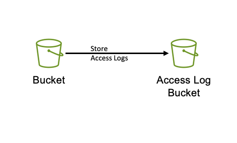
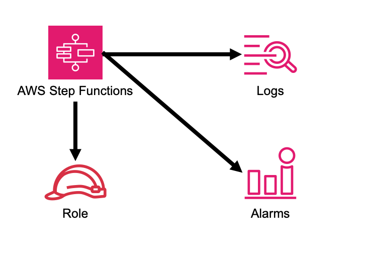
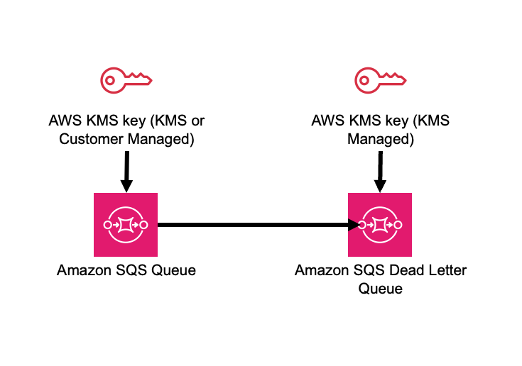

# aws-constructs-factories module
<!--BEGIN STABILITY BANNER-->

---


> All classes are under active development and subject to non-backward compatible changes or removal in any
> future version. These are not subject to the [Semantic Versioning](https://semver.org/) model.
> This means that while you may use them, you may need to update your source code when upgrading to a newer version of this package.

---
<!--END STABILITY BANNER-->

| **Reference Documentation**:| <span style="font-weight: normal">https://docs.aws.amazon.com/solutions/latest/constructs/</span>|
|:-------------|:-------------|
<div style="height:8px"></div>

| **Language**     | **Package**        |
|:-------------|-----------------|
| Python|`aws_solutions_constructs.aws_constructs_factories`|
| Typescript|`@aws-solutions-constructs/aws-constructs-factories`|
| Java|`software.amazon.awsconstructs.services.constructsfactories`|

## Overview
This AWS Solutions Construct exposes the same code used to create our underlying resources as factories, so clients can create individual resources that are well-architected.
There are factories to create:

[Amazon S3 buckets](https://docs.aws.amazon.com/solutions/latest/constructs/aws-constructs-factories.html#s3-buckets) - Create a well architected S3 bucket (e.g. - includes an access logging bucket)
[AWS Step Functions state machines](https://docs.aws.amazon.com/solutions/latest/constructs/aws-constructs-factories.html#step-functions-state-machines) - Create a well architected Step Functions state machine and log group (e.g. log group has /aws/vendedlogs/ name prefix to avoid resource policy issues)

## S3 Buckets

Create fully well-architected S3 buckets with as little as one function call. Here is a minimal deployable pattern definition:

Typescript
``` typescript
import { Construct } from 'constructs';
import { Stack, StackProps } from 'aws-cdk-lib';
import { ConstructsFactories } from '@aws-solutions-constructs/aws-constructs-factories';

const factories = new ConstructsFactories(this, 'MyFactories');

factories.s3BucketFactory('GoodBucket', {});
```

Python
``` python
from aws_cdk import (
    Stack,
)
from constructs import Construct

from aws_solutions_constructs import (
    aws_constructs_factories as cf
)

factories = cf.ConstructsFactories(self, 'MyFactories')
factories.s3_bucket_factory('GoodBucket')
```

Java
``` java
import software.constructs.Construct;
import software.amazon.awscdk.Stack;
import software.amazon.awscdk.StackProps;

import software.amazon.awsconstructs.services.constructsfactories.ConstructsFactories;
import software.amazon.awsconstructs.services.constructsfactories.S3BucketFactoryProps;

final ConstructsFactories factories = new ConstructsFactories(this, "MyFactories");
factories.s3BucketFactory("GoodBucket", 
  new S3BucketFactoryProps.Builder().build());
```

# S3BucketFactory Function Signature

``` typescript
s3BucketFactory(id: string, props: S3BucketFactoryProps): S3BucketFactoryResponse
```

# S3BucketFactoryProps

| **Name**     | **Type**        | **Description** |
|:-------------|:----------------|-----------------|
|bucketProps?|[`s3.BucketProps`](https://docs.aws.amazon.com/cdk/api/v2/docs/aws-cdk-lib.aws_s3.BucketProps.html)|Optional user provided props to override the default props for the S3 Bucket.|
|logS3AccessLogs?|`boolean`|Whether to turn on Access Logging for the S3 bucket. Creates an S3 bucket with associated storage costs for the logs. Enabling Access Logging is a best practice. default - true|
|loggingBucketProps?|[`s3.BucketProps`](https://docs.aws.amazon.com/cdk/api/v2/docs/aws-cdk-lib.aws_s3.BucketProps.html)|Optional user provided props to override the default props for the S3 Logging Bucket.|

# S3BucketFactoryResponse

| **Name**     | **Type**        | **Description** |
|:-------------|:----------------|-----------------|
|s3Bucket|[`s3.Bucket`](https://docs.aws.amazon.com/cdk/api/v2/docs/aws-cdk-lib.aws_s3.Bucket.html)|The s3.Bucket created by the factory. |
|s3LoggingBucket?|[`s3.Bucket`](https://docs.aws.amazon.com/cdk/api/v2/docs/aws-cdk-lib.aws_s3.Bucket.html)|The s3.Bucket created by the construct as the logging bucket for the primary bucket. If the logS3AccessLogs property is false, this value will be undefined.|

# Default settings

Out of the box implementation of the Construct without any override will set the following defaults:

* An S3 Content Bucket
  * AWS managed Server Side Encryption (AES256)
  * Lifecycle rule to transition objects to Glacier storage class in 90 days
  * Access Logging enabled
  * All Public access blocked
  * Versioning enabled
  * UpdateReplacePolicy is delete
  * Deletion policy is delete
  * Bucket policy requiring SecureTransport
* An S3 Bucket for Access Logs
  * AWS managed Server Side Encryption (AES256)
  * All public access blocked
  * Versioning enabled
  * UpdateReplacePolicy is delete
  * Deletion policy is delete
  * Bucket policy requiring SecureTransport
  * Bucket policy granting PutObject privileges to the S3 logging service, from the content bucket in the content bucket account.
  * cfn_nag suppression of access logging finding (not logging access to the access log bucket)

# Architecture


## Step Functions State Machines

Create fully well-architected Step Functions state machine with log group. The log group name includes the vendedlogs prefix. Here
but is unique to the stack, avoiding naming collions between instances. is a minimal deployable pattern definition:

Typescript
``` typescript
import { App, Stack } from "aws-cdk-lib";
import { ConstructsFactories } from "../../lib";
import { generateIntegStackName, CreateTestStateMachineDefinitionBody } from '@aws-solutions-constructs/core';
import { IntegTest } from '@aws-cdk/integ-tests-alpha';

const placeholderTask = new sftasks.EvaluateExpression(this, 'placeholder', {
  expression: '$.argOne + $.argTwo'
});

const factories = new ConstructsFactories(this, 'minimalImplementation');

factories.stateMachineFactory('testsm', {
  stateMachineProps: {
    definitionBody: sfn.DefinitionBody.fromChainable(placeholderTask)
  }
});
```

Python
``` python

# Pending

```

Java
``` java

// Pending

```

# stateMachineFactory Function Signature

``` typescript
stateMachineFactory(id: string, props: StateMachineFactoryProps): StateMachineFactoryResponse
```

# StateMachineFactoryProps

| **Name**     | **Type**        | **Description** |
|:-------------|:----------------|-----------------|
|stateMachineProps|[`sfn.StateMachineProps`](https://docs.aws.amazon.com/cdk/api/v2/docs/aws-cdk-lib.aws_stepfunctions.StateMachineProps.html)|The CDK properties that define the state machine. This property is required and must include a definitionBody or definition (definition is deprecated)|
|logGroup?|[]`logs.LogGroup`](https://docs.aws.amazon.com/cdk/api/v2/docs/aws-cdk-lib.aws_logs.LogGroup.html)|An existing LogGroup to which the new state machine will write log entries. Default: none, the construct will create a new log group.|

# StateMachineFactoryResponse

| **Name**     | **Type**        | **Description** |
|:-------------|:----------------|-----------------|
|stateMachineProps|[`sfn.StateMachineProps`](https://docs.aws.amazon.com/cdk/api/v2/docs/aws-cdk-lib.aws_stepfunctions.StateMachineProps.html)||
|logGroup|[]`logs.LogGroupProps`](https://docs.aws.amazon.com/cdk/api/v2/docs/aws-cdk-lib.aws_logs.LogGroupProps.html)||

# Default settings

Out of the box implementation of the Construct without any override will set the following defaults:

* An AWS Step Functions State Machine
  * Configured to log to the new log group at LogLevel.ERROR
* Amazon CloudWatch Logs Log Group
  * Log name is prefaced with /aws/vendedlogs/ to avoid resource policy [issues](https://docs.aws.amazon.com/step-functions/latest/dg/cw-logs.html#cloudwatch-iam-policy). The Log Group name is still created to be unique to the stack to avoid name collisions. 

# Architecture


## SQS Queues

Create SQS queues complete with DLQs and KMS CMKs with one function call. Here is a minimal deployable pattern definition:

Typescript
``` typescript
import { Construct } from 'constructs';
import { Stack, StackProps } from 'aws-cdk-lib';
import { ConstructsFactories } from '@aws-solutions-constructs/aws-constructs-factories';

const factories = new ConstructsFactories(this, 'MyFactories');

factories.sqsQueueFacgory('GoodQueue', {});
```

Python
``` python
Pending
```

Java
``` java
Pendiong
```

# SqsQueueFactory Function Signature

``` typescript
SqsQueueFactory(id: string, props: SqsQueueFactoryProps): SqsQueueFactoryResponse
```

# SqsQueueFactoryProps

| **Name**     | **Type**        | **Description** |
|:-------------|:----------------|-----------------|
|queueProps?|sqs.QueueProps|Optional user provided props to override the default props for the primary queue.|
|enableEncryptionWithCustomerManagedKey?|boolean|If no key is provided, this flag determines whether the queue is encrypted with a new CMK or an AWS managed key. This flag is ignored if any of the following are defined: queueProps.encryptionMasterKey, encryptionKey or encryptionKeyProps. default - False if queueProps.encryptionMasterKey, encryptionKey, and encryptionKeyProps are all undefined.|
|encryptionKey?|kms.Key|An optional, imported encryption key to encrypt the SQS Queue with. Default - none|
|encryptionKeyProps?|kms.KeyProps|Optional user provided properties to override the default properties for the KMS encryption key used to encrypt the SQS Queue with. @default - None|
|deployDeadLetterQueue?|boolean|Whether to deploy a secondary queue to be used as a dead letter queue.|
|deadLetterQueueProps?|sqs.QueueProps|Optional user provided properties for the dead letter queue|
|maxReceiveCount?|number|The number of times a message can be unsuccessfully dequeued before being moved to the dead letter queue. default - [code](https://github.com/awslabs/aws-solutions-constructs/blob/8b30791902e09db2f7c49410a03d5d95ccc2ef51/source/patterns/%40aws-solutions-constructs/core/lib/sqs-defaults.ts#L32)|

# SqsQueueFactoryResponse

| **Name**     | **Type**        | **Description** |
|:-------------|:----------------|-----------------|
|queue|sqs.Queue|The queue created by the factory.|
|key|kms.IKey|The key used to encrypt the queue, if the queue was configured to use a CMK|
|deadLetterQueue?|sqs.DeadLetterQueue|The dead letter queue associated with the queue created by the factory|

# Default settings

Out of the box implementation of the Construct without any override will set the following defaults:

* An SQS queue
  * Encrypted by default with KMS managed key by default, can be KMS CMK if flag is set
  * Only queue owner can perform operations by default (your IAM policies can override)
  * Enforced encryption for data in transit
  * DLQ configured
* An SQS dead letter queue
  * Receives messages not processable in maxReceiveCount attempts
  * Encrypted with KMS managed key
  * Enforced encryption for data in transit

# Architecture



***
&copy; Copyright Amazon.com, Inc. or its affiliates. All Rights Reserved.
