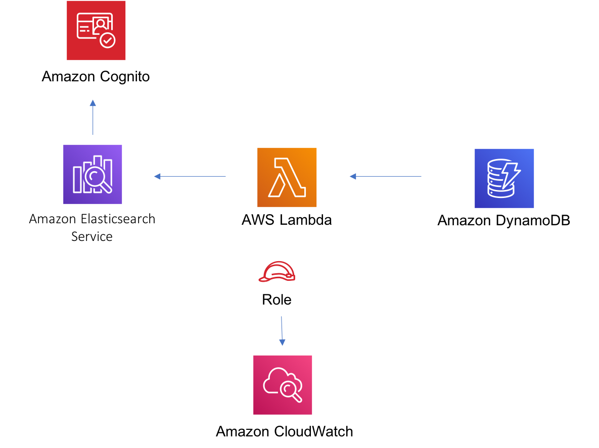

//!!NODE_ROOT <section>
//== aws-dynamodbstreams-lambda-elasticsearch-kibana module

[.topic]
= aws-dynamodbstreams-lambda-elasticsearch-kibana
:info_doctype: section
:info_title: aws-dynamodbstreams-lambda-elasticsearch-kibana

image::https://img.shields.io/badge/stability-Experimental-important.svg?style=for-the-badge[Stability:Experimental]

____
All classes are under active development and subject to non-backward
compatible changes or removal in any future version. These are not
subject to the https://semver.org/[Semantic Versioning] model. This
means that while you may use them, you may need to update your source
code when upgrading to a newer version of this package.
____

[width="100%",cols="<50%,<50%",options="header",]
|===
|*Reference Documentation*:
|https://docs.aws.amazon.com/solutions/latest/constructs/
|===

[width="100%",cols="<46%,54%",options="header",]
|===
|*Language* |*Package*
|image:https://docs.aws.amazon.com/cdk/api/latest/img/python32.png[Python
Logo] Python
|`aws_solutions_constructs.aws_dynamodbstreams_elasticsearch_kibana`

|image:https://docs.aws.amazon.com/cdk/api/latest/img/typescript32.png[Typescript
Logo] Typescript
|`@aws-solutions-constructs/aws-dynamodbstreams-lambda-elasticsearch-kibana`

|image:https://docs.aws.amazon.com/cdk/api/latest/img/java32.png[Java
Logo] Java
|`software.amazon.awsconstructs.services.dynamodbstreamslambdaelasticsearchkibana`
|===

== Overview

This AWS Solutions Construct implements Amazon DynamoDB table with
stream, AWS Lambda function and Amazon Elasticsearch Service with the
least privileged permissions.

*Some cluster configurations (e.g VPC access) require the existence of
the `AWSServiceRoleForAmazonElasticsearchService` Service-Linked Role in
your account.*

*You will need to create the service-linked role using the AWS CLI once
in any account using this construct (it may have already been run to
support other stacks):*

....
aws iam create-service-linked-role --aws-service-name es.amazonaws.com
....

Here is a minimal deployable pattern definition:

====
[role="tablist"]
Typescript::
+
[source,typescript]
----
import { Construct } from 'constructs';
import { Stack, StackProps, Aws } from 'aws-cdk-lib';
import { DynamoDBStreamsToLambdaToElasticSearchAndKibana, DynamoDBStreamsToLambdaToElasticSearchAndKibanaProps } from '@aws-solutions-constructs/aws-dynamodbstreams-lambda-elasticsearch-kibana';
import * as lambda from 'aws-cdk-lib/aws-lambda';

const constructProps: DynamoDBStreamsToLambdaToElasticSearchAndKibanaProps = {
  lambdaFunctionProps: {
    code: lambda.Code.fromAsset(`lambda`),
    runtime: lambda.Runtime.NODEJS_20_X,
    handler: 'index.handler'
  },
  domainName: 'test-domain',
  // NOTE: Ensure the Cognito domain name is globally unique
  cognitoDomainName: 'globallyuniquedomain' + Aws.ACCOUNT_ID
};

new DynamoDBStreamsToLambdaToElasticSearchAndKibana(this, 'test-dynamodbstreams-lambda-elasticsearch-kibana', constructProps);
----

Python::
+
[source,python]
----
from aws_solutions_constructs.aws_dynamodbstreams_lambda_elasticsearch_kibana import DynamoDBStreamsToLambdaToElasticSearchAndKibana, DynamoDBStreamsToLambdaToElasticSearchAndKibanaProps
from aws_cdk import (
    Stack,
    aws_lambda as _lambda,
    Aws,
)
from constructs import Construct

DynamoDBStreamsToLambdaToElasticSearchAndKibana(
    self, 'test-dynamodbstreams-lambda-elasticsearch-kibana',
    lambda_function_props=_lambda.FunctionProps(
        code=_lambda.Code.from_asset('lambda'),
        runtime=_lambda.Runtime.PYTHON_3_11,
        handler='index.handler'
    ),
    domain_name='test-domain',
    # NOTE: Ensure the Cognito domain name is globally unique
    cognito_domain_name='globallyuniquedomain' + Aws.ACCOUNT_ID)
----

Java::
+
[source,java]
----
import software.constructs.Construct;

import software.amazon.awscdk.Aws;
import software.amazon.awscdk.Stack;
import software.amazon.awscdk.StackProps;
import software.amazon.awscdk.services.lambda.*;
import software.amazon.awscdk.services.lambda.Runtime;
import software.amazon.awsconstructs.services.dynamodbstreamslambdaelasticsearchkibana.*;

new DynamoDBStreamsToLambdaToElasticSearchAndKibana(this, "test-dynamodb-stream-lambda-elasticsearch-kibana",
        new DynamoDBStreamsToLambdaToElasticSearchAndKibanaProps.Builder()
                .lambdaFunctionProps(new FunctionProps.Builder()
                        .runtime(Runtime.NODEJS_20_X)
                        .code(Code.fromAsset("lambda"))
                        .handler("index.handler")
                        .build())
                .domainName("test-domain")
                .cognitoDomainName("globallyuniquedomain" + Aws.ACCOUNT_ID)
                .build());
----
====

== Pattern Construct Props

[width="100%",cols="<30%,<35%,35%",options="header",]
|===
|*Name* |*Type* |*Description*
|existingLambdaObj?
|https://docs.aws.amazon.com/cdk/api/v2/docs/aws-cdk-lib.aws_lambda.Function.html[`lambda.Function`]
|Existing instance of Lambda Function object, providing both this and
`lambdaFunctionProps` will cause an error.

|lambdaFunctionProps?
|https://docs.aws.amazon.com/cdk/api/v2/docs/aws-cdk-lib.aws_lambda.FunctionProps.html[`lambda.FunctionProps`]
|User provided props to override the default props for the Lambda
function.

|dynamoTableProps?
|https://docs.aws.amazon.com/cdk/api/v2/docs/aws-cdk-lib.aws_dynamodb.TableProps.html[`dynamodb.TableProps`]
|Optional user provided props to override the default props for DynamoDB
Table

|existingTableInterface?
|https://docs.aws.amazon.com/cdk/api/v2/docs/aws-cdk-lib.aws_dynamodb.ITable.html[`dynamodb.ITable`]
|Existing instance of DynamoDB table object or interface, providing both
this and `dynamoTableProps` will cause an error.

|dynamoEventSourceProps?
|https://docs.aws.amazon.com/cdk/api/v2/docs/aws-cdk-lib.aws_lambda_event_sources.DynamoEventSourceProps.html[`aws-lambda-event-sources.DynamoEventSourceProps`]
|Optional user provided props to override the default props for DynamoDB
Event Source

|esDomainProps?
|https://docs.aws.amazon.com/cdk/api/v2/docs/aws-cdk-lib.aws_elasticsearch.CfnDomainProps.html[`elasticsearch.CfnDomainProps`]
|Optional user provided props to override the default props for the
Elasticsearch Service

|domainName |`string` |Domain name for the Cognito and the Elasticsearch
Service

|cognitoDomainName? |`string` |Optional Cognito Domain Name, if provided
it will be used for Cognito Domain, and domainName will be used for the
Elasticsearch Domain.

|deploySqsDlqQueue? |`boolean` |Whether to deploy a SQS dead letter
queue when a data record reaches the Maximum Retry Attempts or Maximum
Record Age, its metadata like shard ID and stream ARN will be sent to an
SQS queue.

|sqsDlqQueueProps?
|https://docs.aws.amazon.com/cdk/api/v2/docs/aws-cdk-lib.aws_sqs.QueueProps.html[`sqs.QueueProps`]
|Optional user provided properties for the SQS dead letter queue

|createCloudWatchAlarms? |`boolean` |Whether to create recommended
CloudWatch alarms

|existingVpc?
|https://docs.aws.amazon.com/cdk/api/v2/docs/aws-cdk-lib.aws_ec2.IVpc.html[`ec2.IVpc`]
|An existing VPC in which to deploy the construct. Providing both this
and `vpcProps` is an error.

|deployVpc? |`boolean` |Whether to create a new VPC based on `vpcProps`
into which to deploy this pattern. Setting this to true will deploy the
minimal, most private VPC to run the pattern:

|vpcProps?
|https://docs.aws.amazon.com/cdk/api/v2/docs/aws-cdk-lib.aws_ec2.VpcProps.html[`ec2.VpcProps`]
|Optional user-provided properties to override the default properties
for the new VPC. `enableDnsHostnames`, `enableDnsSupport`, `natGateways`
and `subnetConfiguration` are set by the Construct, so any values for
those properties supplied here will be overridden. If `deployVpc?` is
not `true` then this property will be ignored.
|===

== Pattern Properties

[width="100%",cols="<30%,<35%,35%",options="header",]
|===
|*Name* |*Type* |*Description*
|dynamoTableInterface
|https://docs.aws.amazon.com/cdk/api/v2/docs/aws-cdk-lib.aws_dynamodb.ITable.html[`dynamodb.ITable`]
|Returns an instance of dynamodb.ITable created by the construct

|dynamoTable?
|https://docs.aws.amazon.com/cdk/api/v2/docs/aws-cdk-lib.aws_dynamodb.Table.html[`dynamodb.Table`]
|Returns an instance of dynamodb.Table created by the construct.
IMPORTANT: If existingTableInterface was provided in Pattern Construct
Props, this property will be `undefined`

|lambdaFunction
|https://docs.aws.amazon.com/cdk/api/v2/docs/aws-cdk-lib.aws_lambda.Function.html[`lambda.Function`]
|Returns an instance of lambda.Function created by the construct

|userPool
|https://docs.aws.amazon.com/cdk/api/v2/docs/aws-cdk-lib.aws_cognito.UserPool.html[`cognito.UserPool`]
|Returns an instance of cognito.UserPool created by the construct

|userPoolClient
|https://docs.aws.amazon.com/cdk/api/v2/docs/aws-cdk-lib.aws_cognito.UserPoolClient.html[`cognito.UserPoolClient`]
|Returns an instance of cognito.UserPoolClient created by the construct

|identityPool
|https://docs.aws.amazon.com/cdk/api/v2/docs/aws-cdk-lib.aws_cognito.CfnIdentityPool.html[`cognito.CfnIdentityPool`]
|Returns an instance of cognito.CfnIdentityPool created by the construct

|elasticsearchDomain
|https://docs.aws.amazon.com/cdk/api/v2/docs/aws-cdk-lib.aws_elasticsearch.CfnDomain.html[`elasticsearch.CfnDomain`]
|Returns an instance of elasticsearch.CfnDomain created by the construct

|elasticsearchDomain
|https://docs.aws.amazon.com/cdk/api/v2/docs/aws-cdk-lib.aws_iam.Role.html[`iam.Role`]
|Returns an instance of iam.Role created by the construct for
elasticsearch.CfnDomain

|cloudwatchAlarms?
|https://docs.aws.amazon.com/cdk/api/v2/docs/aws-cdk-lib.aws_cloudwatch.Alarm.html[`cloudwatch.Alarm++[]++`]
|Returns a list of cloudwatch.Alarm created by the construct

|vpc?
|https://docs.aws.amazon.com/cdk/api/v2/docs/aws-cdk-lib.aws_ec2.IVpc.html[`ec2.IVpc`]
|Returns an instance of the VPC created by the pattern, if `deployVpc?`
is `true`, or `existingVpc?` is provided.
|===

== Lambda Function

This pattern requires a lambda function that can post data into the
Elasticsearch from DynamoDB stream. A sample function is provided
https://github.com/awslabs/aws-solutions-constructs/blob/master/source/patterns/%40aws-solutions-constructs/aws-dynamodbstreams-lambda-elasticsearch-kibana/test/lambda/index.js[here].

== Default settings

Out of the box implementation of the Construct without any override will
set the following defaults:

==== Amazon DynamoDB Table

* Set the billing mode for DynamoDB Table to On-Demand (Pay per request)
* Enable server-side encryption for DynamoDB Table using AWS managed KMS
Key
* Creates a partition key called '`id`' for DynamoDB Table
* Retain the Table when deleting the CloudFormation stack
* Enable continuous backups and point-in-time recovery

==== AWS Lambda Function

* Configure limited privilege access IAM role for Lambda function
* Enable reusing connections with Keep-Alive for NodeJs Lambda function
* Enable X-Ray Tracing
* Enable Failure-Handling features like enable bisect on function Error,
set defaults for Maximum Record Age (24 hours) & Maximum Retry Attempts
(500) and deploy SQS dead-letter queue as destination on failure
* Set Environment Variables
** AWS_NODEJS_CONNECTION_REUSE_ENABLED (for Node 10.x
and higher functions)

==== Amazon Cognito

* Set password policy for User Pools
* Enforce the advanced security mode for User Pools

==== Amazon Elasticsearch Service

* Deploy best practices CloudWatch Alarms for the Elasticsearch Domain
* Secure the Kibana dashboard access with Cognito User Pools
* Enable server-side encryption for Elasticsearch Domain using AWS
managed KMS Key
* Enable node-to-node encryption for Elasticsearch Domain
* Configure the cluster for the Amazon ES domain

== Architecture

\\ github block

'''''

© Copyright Amazon.com, Inc. or its affiliates. All Rights Reserved.
