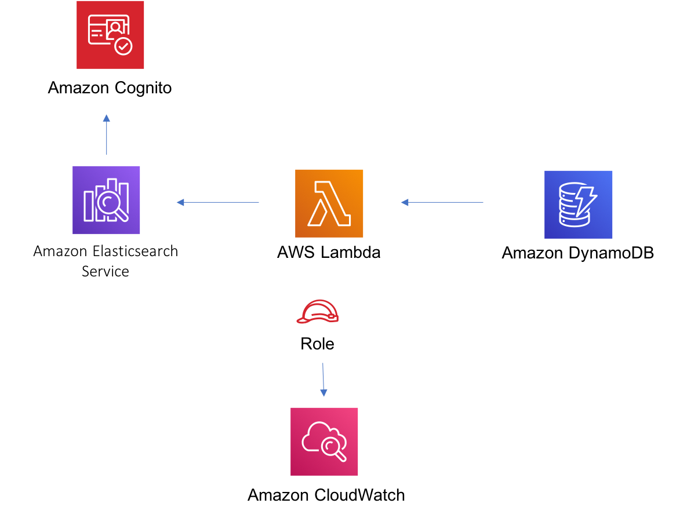

# aws-dynamodbstreams-lambda-elasticsearch-kibana module
<!--BEGIN STABILITY BANNER-->

---


> All classes are under active development and subject to non-backward compatible changes or removal in any
> future version. These are not subject to the [Semantic Versioning](https://semver.org/) model.
> This means that while you may use them, you may need to update your source code when upgrading to a newer version of this package.

---
<!--END STABILITY BANNER-->

| **Reference Documentation**:| <span style="font-weight: normal">https://docs.aws.amazon.com/solutions/latest/constructs/</span>|
|:-------------|:-------------|
<div style="height:8px"></div>

| **Language**     | **Package**        |
|:-------------|-----------------|
| Python|`aws_solutions_constructs.aws_dynamodbstreams_elasticsearch_kibana`|
| Typescript|`@aws-solutions-constructs/aws-dynamodbstreams-lambda-elasticsearch-kibana`|
| Java|`software.amazon.awsconstructs.services.dynamodbstreamslambdaelasticsearchkibana`|

## Overview
This AWS Solutions Construct implements Amazon DynamoDB table with stream, AWS Lambda function and Amazon Elasticsearch Service with the least privileged permissions.

**Some cluster configurations (e.g VPC access) require the existence of the `AWSServiceRoleForAmazonElasticsearchService` Service-Linked Role in your account.**

**You will need to create the service-linked role using the AWS CLI once in any account using this construct (it may have already been run to support other stacks):**
```
aws iam create-service-linked-role --aws-service-name es.amazonaws.com
```

Here is a minimal deployable pattern definition:

Typescript
``` typescript
import { Construct } from 'constructs';
import { Stack, StackProps, Aws } from 'aws-cdk-lib';
import { DynamoDBStreamsToLambdaToElasticSearchAndKibana, DynamoDBStreamsToLambdaToElasticSearchAndKibanaProps } from '@aws-solutions-constructs/aws-dynamodbstreams-lambda-elasticsearch-kibana';
import * as lambda from 'aws-cdk-lib/aws-lambda';

const constructProps: DynamoDBStreamsToLambdaToElasticSearchAndKibanaProps = {
  lambdaFunctionProps: {
    code: lambda.Code.fromAsset(`lambda`),
    runtime: lambda.Runtime.NODEJS_14_X,
    handler: 'index.handler'
  },
  domainName: 'test-domain',
  // TODO: Ensure the Cognito domain name is globally unique
  cognitoDomainName: 'globallyuniquedomain' + Aws.ACCOUNT_ID
};

new DynamoDBStreamsToLambdaToElasticSearchAndKibana(this, 'test-dynamodbstreams-lambda-elasticsearch-kibana', constructProps);
```

Python
``` Python
from aws_solutions_constructs.aws_dynamodbstreams_lambda_elasticsearch_kibana import DynamoDBStreamsToLambdaToElasticSearchAndKibana, DynamoDBStreamsToLambdaToElasticSearchAndKibanaProps
from aws_cdk import (
    Stack,
    aws_lambda as _lambda,
    Aws,
)
from constructs import Construct

DynamoDBStreamsToLambdaToElasticSearchAndKibana(
    self, 'test-dynamodbstreams-lambda-elasticsearch-kibana',
    lambda_function_props=_lambda.FunctionProps(
        code=_lambda.Code.from_asset('lambda'),
        runtime=_lambda.Runtime.PYTHON_3_9,
        handler='index.handler'
    ),
    domain_name='test-domain',
    # TODO: Ensure the Cognito domain name is globally unique
    cognito_domain_name='globallyuniquedomain' + Aws.ACCOUNT_ID)
```

Java
``` java
import software.constructs.Construct;

import software.amazon.awscdk.Aws;
import software.amazon.awscdk.Stack;
import software.amazon.awscdk.StackProps;
import software.amazon.awscdk.services.lambda.*;
import software.amazon.awscdk.services.lambda.Runtime;
import software.amazon.awsconstructs.services.dynamodbstreamslambdaelasticsearchkibana.*;

new DynamoDBStreamsToLambdaToElasticSearchAndKibana(this, "test-dynamodb-stream-lambda-elasticsearch-kibana",
        new DynamoDBStreamsToLambdaToElasticSearchAndKibanaProps.Builder()
                .lambdaFunctionProps(new FunctionProps.Builder()
                        .runtime(Runtime.NODEJS_14_X)
                        .code(Code.fromAsset("lambda"))
                        .handler("index.handler")
                        .build())
                .domainName("test-domain")
                .cognitoDomainName("globallyuniquedomain" + Aws.ACCOUNT_ID)
                .build());
```

## Pattern Construct Props

| **Name**     | **Type**        | **Description** |
|:-------------|:----------------|-----------------|
|existingLambdaObj?|[`lambda.Function`](https://docs.aws.amazon.com/cdk/api/latest/docs/@aws-cdk_aws-lambda.Function.html)|Existing instance of Lambda Function object, providing both this and `lambdaFunctionProps` will cause an error.|
|lambdaFunctionProps?|[`lambda.FunctionProps`](https://docs.aws.amazon.com/cdk/api/latest/docs/@aws-cdk_aws-lambda.FunctionProps.html)|User provided props to override the default props for the Lambda function.|
|dynamoTableProps?|[`dynamodb.TableProps`](https://docs.aws.amazon.com/cdk/api/latest/docs/@aws-cdk_aws-dynamodb.TableProps.html)|Optional user provided props to override the default props for DynamoDB Table|
|existingTableInterface?|[`dynamodb.ITable`](https://docs.aws.amazon.com/cdk/api/latest/docs/@aws-cdk_aws-dynamodb.ITable.html)|Existing instance of DynamoDB table object or interface, providing both this and `dynamoTableProps` will cause an error.|
|dynamoEventSourceProps?|[`aws-lambda-event-sources.DynamoEventSourceProps`](https://docs.aws.amazon.com/cdk/api/latest/docs/@aws-cdk_aws-lambda-event-sources.DynamoEventSourceProps.html)|Optional user provided props to override the default props for DynamoDB Event Source|
|esDomainProps?|[`elasticsearch.CfnDomainProps`](https://docs.aws.amazon.com/cdk/api/latest/docs/@aws-cdk_aws-elasticsearch.CfnDomainProps.html)|Optional user provided props to override the default props for the Elasticsearch Service|
|domainName|`string`|Domain name for the Cognito and the Elasticsearch Service|
|createCloudWatchAlarms|`boolean`|Whether to create recommended CloudWatch alarms|

## Pattern Properties

| **Name**     | **Type**        | **Description** |
|:-------------|:----------------|-----------------|
|dynamoTableInterface|[`dynamodb.ITable`](https://docs.aws.amazon.com/cdk/api/latest/docs/@aws-cdk_aws-dynamodb.ITable.html)|Returns an instance of dynamodb.ITable created by the construct|
|dynamoTable?|[`dynamodb.Table`](https://docs.aws.amazon.com/cdk/api/latest/docs/@aws-cdk_aws-dynamodb.Table.html)|Returns an instance of dynamodb.Table created by the construct. IMPORTANT: If existingTableInterface was provided in Pattern Construct Props, this property will be `undefined`|
|lambdaFunction|[`lambda.Function`](https://docs.aws.amazon.com/cdk/api/latest/docs/@aws-cdk_aws-lambda.Function.html)|Returns an instance of lambda.Function created by the construct|
|userPool|[`cognito.UserPool`](https://docs.aws.amazon.com/cdk/api/latest/docs/@aws-cdk_aws-cognito.UserPool.html)|Returns an instance of cognito.UserPool created by the construct|
|userPoolClient|[`cognito.UserPoolClient`](https://docs.aws.amazon.com/cdk/api/latest/docs/@aws-cdk_aws-cognito.UserPoolClient.html)|Returns an instance of cognito.UserPoolClient created by the construct|
|identityPool|[`cognito.CfnIdentityPool`](https://docs.aws.amazon.com/cdk/api/latest/docs/@aws-cdk_aws-cognito.CfnIdentityPool.html)|Returns an instance of cognito.CfnIdentityPool created by the construct|
|elasticsearchDomain|[`elasticsearch.CfnDomain`](https://docs.aws.amazon.com/cdk/api/latest/docs/@aws-cdk_aws-elasticsearch.CfnDomain.html)|Returns an instance of elasticsearch.CfnDomain created by the construct|
|elasticsearchDomain|[`iam.Role`](https://docs.aws.amazon.com/cdk/api/latest/docs/@aws-cdk_aws-iam.Role.html)|Returns an instance of iam.Role created by the construct for elasticsearch.CfnDomain|
|cloudwatchAlarms?|[`cloudwatch.Alarm[]`](https://docs.aws.amazon.com/cdk/api/latest/docs/@aws-cdk_aws-cloudwatch.Alarm.html)|Returns a list of cloudwatch.Alarm created by the construct|

## Lambda Function

This pattern requires a lambda function that can post data into the Elasticsearch from DynamoDB stream. A sample function is provided [here](https://github.com/awslabs/aws-solutions-constructs/blob/master/source/patterns/%40aws-solutions-constructs/aws-dynamodbstreams-lambda-elasticsearch-kibana/test/lambda/index.js).

## Default settings

Out of the box implementation of the Construct without any override will set the following defaults:

### Amazon DynamoDB Table
* Set the billing mode for DynamoDB Table to On-Demand (Pay per request)
* Enable server-side encryption for DynamoDB Table using AWS managed KMS Key
* Creates a partition key called 'id' for DynamoDB Table
* Retain the Table when deleting the CloudFormation stack
* Enable continuous backups and point-in-time recovery

### AWS Lambda Function
* Configure limited privilege access IAM role for Lambda function
* Enable reusing connections with Keep-Alive for NodeJs Lambda function
* Enable X-Ray Tracing
* Enable Failure-Handling features like enable bisect on function Error, set defaults for Maximum Record Age (24 hours) & Maximum Retry Attempts (500) and deploy SQS dead-letter queue as destination on failure
* Set Environment Variables
  * AWS_NODEJS_CONNECTION_REUSE_ENABLED (for Node 10.x and higher functions)

### Amazon Cognito
* Set password policy for User Pools
* Enforce the advanced security mode for User Pools

### Amazon Elasticsearch Service
* Deploy best practices CloudWatch Alarms for the Elasticsearch Domain
* Secure the Kibana dashboard access with Cognito User Pools
* Enable server-side encryption for Elasticsearch Domain using AWS managed KMS Key
* Enable node-to-node encryption for Elasticsearch Domain
* Configure the cluster for the Amazon ES domain

## Architecture


***
&copy; Copyright 2022 Amazon.com, Inc. or its affiliates. All Rights Reserved.