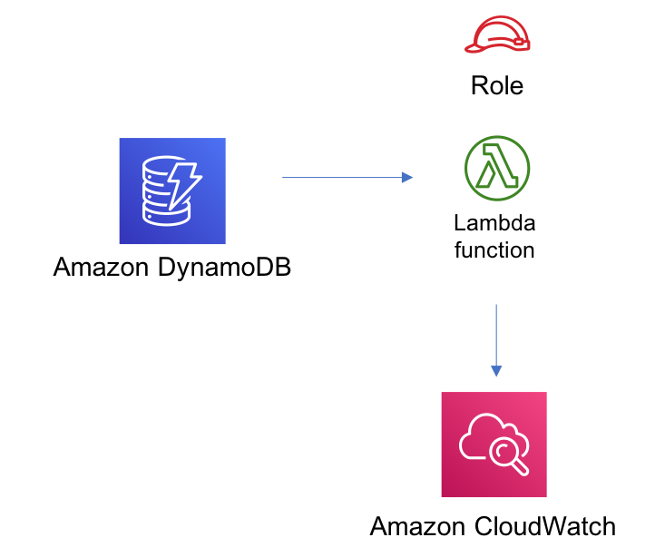

# aws-dynamodbstreams-lambda module
<!--BEGIN STABILITY BANNER-->

---


> All classes are under active development and subject to non-backward compatible changes or removal in any
> future version. These are not subject to the [Semantic Versioning](https://semver.org/) model.
> This means that while you may use them, you may need to update your source code when upgrading to a newer version of this package.

---
<!--END STABILITY BANNER-->

| **Reference Documentation**:| <span style="font-weight: normal">https://docs.aws.amazon.com/solutions/latest/constructs/</span>|
|:-------------|:-------------|
<div style="height:8px"></div>

| **Language**     | **Package**        |
|:-------------|-----------------|
| Python|`aws_solutions_constructs.aws_dynamodbstreams_lambda`|
| Typescript|`@aws-solutions-constructs/aws-dynamodbstreams-lambda`|
| Java|`software.amazon.awsconstructs.services.dynamodbstreamslambda`|

## Overview
This AWS Solutions Construct implements a pattern Amazon DynamoDB table with stream to invoke the AWS Lambda function  with the least privileged permissions.

Here is a minimal deployable pattern definition:

Typescript
``` typescript
import { Construct } from 'constructs';
import { Stack, StackProps } from 'aws-cdk-lib';
import { DynamoDBStreamsToLambdaProps,  DynamoDBStreamsToLambda} from '@aws-solutions-constructs/aws-dynamodbstreams-lambda';
import * as lambda from 'aws-cdk-lib/aws-lambda';

new DynamoDBStreamsToLambda(this, 'test-dynamodbstreams-lambda', {
  lambdaFunctionProps: {
      code: lambda.Code.fromAsset(`lambda`),
      runtime: lambda.Runtime.NODEJS_16_X,
      handler: 'index.handler'
  },
});
```

Python
``` python
from aws_solutions_constructs.aws_dynamodbstreams_lambda import DynamoDBStreamsToLambda
from aws_cdk import (
  aws_lambda as _lambda,
  Stack
)
from constructs import Construct

DynamoDBStreamsToLambda(self, 'test-dynamodbstreams-lambda',
                        lambda_function_props=_lambda.FunctionProps(
                            code=_lambda.Code.from_asset('lambda'),
                            runtime=_lambda.Runtime.PYTHON_3_9,
                            handler='index.handler'
                        )
                        )
```

Java
``` java
import software.constructs.Construct;

import software.amazon.awscdk.Stack;
import software.amazon.awscdk.StackProps;
import software.amazon.awscdk.services.lambda.*;
import software.amazon.awscdk.services.lambda.Runtime;
import software.amazon.awsconstructs.services.dynamodbstreamslambda.*;

new DynamoDBStreamsToLambda(this, "test-dynamodbstreams-lambda",
        new DynamoDBStreamsToLambdaProps.Builder()
                .lambdaFunctionProps(new FunctionProps.Builder()
                        .runtime(Runtime.NODEJS_16_X)
                        .code(Code.fromAsset("lambda"))
                        .handler("index.handler")
                        .build())
                .build());
```

## Pattern Construct Props

| **Name**     | **Type**        | **Description** |
|:-------------|:----------------|-----------------|
|existingLambdaObj?|[`lambda.Function`](https://docs.aws.amazon.com/cdk/api/v2/docs/aws-cdk-lib.aws_lambda.Function.html)|Existing instance of Lambda Function object, providing both this and `lambdaFunctionProps` will cause an error.|
|lambdaFunctionProps?|[`lambda.FunctionProps`](https://docs.aws.amazon.com/cdk/api/v2/docs/aws-cdk-lib.aws_lambda.FunctionProps.html)|User provided props to override the default props for the Lambda function.|
|dynamoTableProps?|[`dynamodb.TableProps`](https://docs.aws.amazon.com/cdk/api/v2/docs/aws-cdk-lib.aws_dynamodb.TableProps.html)|Optional user provided props to override the default props for DynamoDB Table|
|existingTableInterface?|[`dynamodb.ITable`](https://docs.aws.amazon.com/cdk/api/v2/docs/aws-cdk-lib.aws_dynamodb.ITable.html)|Existing instance of DynamoDB table object or interface, providing both this and `dynamoTableProps` will cause an error.|
|dynamoEventSourceProps?|[`aws-lambda-event-sources.DynamoEventSourceProps`](https://docs.aws.amazon.com/cdk/api/v2/docs/aws-cdk-lib.aws_lambda_event_sources.DynamoEventSourceProps.html)|Optional user provided props to override the default props for DynamoDB Event Source|

## Pattern Properties

| **Name**     | **Type**        | **Description** |
|:-------------|:----------------|-----------------|
|dynamoTableInterface|[`dynamodb.ITable`](https://docs.aws.amazon.com/cdk/api/v2/docs/aws-cdk-lib.aws_dynamodb.ITable.html)|Returns an instance of dynamodb.ITable created by the construct|
|dynamoTable?|[`dynamodb.Table`](https://docs.aws.amazon.com/cdk/api/v2/docs/aws-cdk-lib.aws_dynamodb.Table.html)|Returns an instance of dynamodb.Table created by the construct. IMPORTANT: If existingTableInterface was provided in Pattern Construct Props, this property will be `undefined`|
|lambdaFunction|[`lambda.Function`](https://docs.aws.amazon.com/cdk/api/v2/docs/aws-cdk-lib.aws_lambda.Function.html)|Returns an instance of lambda.Function created by the construct|

## Default settings

Out of the box implementation of the Construct without any override will set the following defaults:

### Amazon DynamoDB Table
* Set the billing mode for DynamoDB Table to On-Demand (Pay per request)
* Enable server-side encryption for DynamoDB Table using AWS managed KMS Key
* Creates a partition key called 'id' for DynamoDB Table
* Retain the Table when deleting the CloudFormation stack
* Enable continuous backups and point-in-time recovery

### AWS Lambda Function
* Configure limited privilege access IAM role for Lambda function
* Enable reusing connections with Keep-Alive for NodeJs Lambda function
* Enable X-Ray Tracing
* Enable Failure-Handling features like enable bisect on function Error, set defaults for Maximum Record Age (24 hours) & Maximum Retry Attempts (500) and deploy SQS dead-letter queue as destination on failure
* Set Environment Variables
  * AWS_NODEJS_CONNECTION_REUSE_ENABLED (for Node 10.x and higher functions)

## Architecture


***
&copy; Copyright Amazon.com, Inc. or its affiliates. All Rights Reserved.
