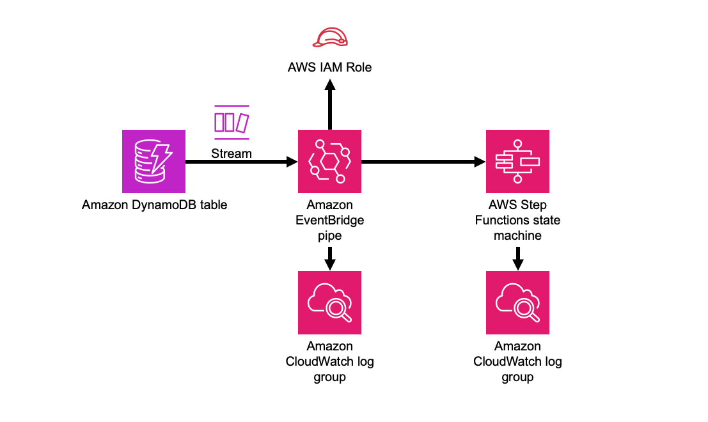

# aws-dynamodbstreams-pipes-stepfunctions module
<!--BEGIN STABILITY BANNER-->

---


---
<!--END STABILITY BANNER-->

| **Reference Documentation**:| <span style="font-weight: normal">https://docs.aws.amazon.com/solutions/latest/constructs/</span>|
|:-------------|:-------------|
<div style="height:8px"></div>

| **Language**     | **Package**        |
|:-------------|-----------------|
| Python|`aws_solutions_constructs.aws_dynamodbstreams_pipes_stepfunctions`|
| Typescript|`@aws-solutions-constructs/aws-dynamodbstreams-pipes-stepfunctions`|
| Java|`software.amazon.awsconstructs.services.dynamodbstreamspipesstepfunctions`|

## Overview
This AWS Solutions Construct implements an Amazon DynamoDB table with stream that that executes an AWS Step Functions state machine via an Amazon Eventbridge pipe.

Here is a minimal deployable pattern definition:

Typescript
``` typescript
import { Construct } from 'constructs';
import { Stack, StackProps } from 'aws-cdk-lib';
import * as sfn from 'aws-cdk-lib/aws-stepfunctions';
import { DynamoDBStreamsToPipesToStepfunctions, DynamoDBStreamsToPipesToStepfunctionsProps } from "@aws-solutions-constructs/aws-dynamodbstreams-pipes-stepfunctions";

    const startState = new sfn.Pass(this, 'StartState');
    
    new DynamoDBStreamsToPipesToStepfunctions(this, 'DynamoDBStreamsToPipesToStepfunctionsPattern', {
      stateMachineProps: {
        definitionBody: sfn.DefinitionBody.fromChainable(sfn.Chain.start(new sfn.Pass(this, 'Pass'))),
      }
    });
```

Python
```python
from constructs import Construct
from aws_cdk import (
    aws_stepfunctions as _sfn,
    Stack
)
from aws_solutions_constructs import (
    aws_dynamodbstreams_pipes_stepfunctions as dynamodbstreams_pipes_stepfunctions
)

dynamodbstreams_pipes_stepfunctions.DynamoDBStreamsToPipesToStepfunctions(
    self, 'DynamoDBStreamsToPipesToStepfunctions',
    state_machine_props=_sfn.StateMachineProps(
        definition_body=_sfn.DefinitionBody.from_chainable(_sfn.Chain.start(_sfn.Pass(self, "pass")))
    )
)
```

Java
```java
package com.myorg;

import software.constructs.Construct;
import software.amazon.awscdk.Stack;
import software.amazon.awscdk.StackProps;

import software.amazon.awscdk.services.stepfunctions.*;
import software.amazon.awsconstructs.services.dynamodbstreamspipesstepfunctions.DynamoDBStreamsToPipesToStepfunctions;
import software.amazon.awsconstructs.services.dynamodbstreamspipesstepfunctions.DynamoDBStreamsToPipesToStepfunctionsProps;

new DynamoDBStreamsToPipesToStepfunctions(this, "DynamoDBStreamsToLambdaToStepfunctionsPattern",
    DynamoDBStreamsToPipesToStepfunctionsProps.builder()
        .stateMachineProps(StateMachineProps.builder()
            .definitionBody(DefinitionBody.fromChainable(Chain.start(new Pass(scope, "Pass"))))
            .build())
        .build());

```

## Pattern Construct Props

| **Name**     | **Type**        | **Description** |
|:-------------|:----------------|-----------------|
|dynamoTableProps?|[`dynamodb.TableProps`](https://docs.aws.amazon.com/cdk/api/v2/docs/aws-cdk-lib.aws_dynamodb.TableProps.html)|Optional user provided props to override the default props for DynamoDB Table|
|existingTableInterface?|[`dynamodb.ITable`](https://docs.aws.amazon.com/cdk/api/v2/docs/aws-cdk-lib.aws_dynamodb.ITable.html)|Existing instance of DynamoDB table object or interface, providing both this and `dynamoTableProps` will cause an error.|
|dynamoEventSourceProps?|[`aws-lambda-event-sources.DynamoEventSourceProps`](https://docs.aws.amazon.com/cdk/api/v2/docs/aws-cdk-lib.aws_lambda_event_sources.DynamoEventSourceProps.html)|Optional user provided props to override the default props for DynamoDB Event Source|
|stateMachineProps|[`sfn.StateMachineProps`](https://docs.aws.amazon.com/cdk/api/v2/docs/aws-cdk-lib.aws_stepfunctions.StateMachineProps.html)|User provided props for the sfn.StateMachine.|
|createCloudWatchAlarms?|`boolean`|Whether to create recommended CloudWatch alarms|
| logGroupProps? | [logs.logGroupProps ](https://docs.aws.amazon.com/cdk/api/v2/docs/aws-cdk-lib.aws_logs.LogGroupProps.html)| Optional user provided props to override the default props for for the CloudWatchLogs LogGroup for the state machine. |
|pipeProps?|[ pipes.CfnPipeProps ](https://docs.aws.amazon.com/cdk/api/v2/docs/aws-cdk-lib.aws_pipes.CfnPipeProps.html)|Optional customer provided settings for the EventBridge pipe. source, target, roleArn and enrichment settings are set by the construct and cannot be overriden here. The construct will generate default sourceParameters, targetParameters and logConfiguration (found [here](link)) that can be overriden by populating those values in these props. If the client wants to implement enrichment or a filter, this is where that information can be provided. Any other props can be freely overridden. If a client wants to set values such as batchSize, that can be done here in the sourceParameters property.|
| enrichmentFunction? | [lambda.Function ](https://docs.aws.amazon.com/cdk/api/v2/docs/aws-cdk-lib.aws_lambda.Function.html) | Optional - Lambda function that the construct will configure to be called to enrich the message between source and target. The construct will configure the pipe IAM role to allow invoking the function (but will not affect the IArole assigned to the function). Specifying both this and enrichmentStateMachine is an error. Default - undefined |
| enrichmentStateMachine? | [sfn.StateMachine ](https://docs.aws.amazon.com/cdk/api/v2/docs/aws-cdk-lib.aws_stepfunctions.StateMachine.html) | Optional - Step Functions state machine that the construct will configure to be called to enrich the message between source and target. The construct will configure the pipe IAM role to allow executing the state machine (but will not affect the IAM role assigned to the state machine). Specifying both this and enrichmentStateMachine is an error. Default - undefined |
|logLevel?|PipesLogLevel|Threshold for what messages the new pipe sends to the log, PipesLogLevel.OFF, PipesLogLevel.ERROR, PipesLogLevel.INFO, PipesLogLevel.TRACE. The default is INFO. Setting the level to OFF will prevent any log group from being created. Providing pipeProps.logConfiguration will controls all aspects of logging and any construct provided log configuration is disabled. If pipeProps.logConfiguration is provided then specifying this or pipeLogProps is an error. |
|pipeLogProps?|[logs.LogGroupProps]()| Default behavior is for the this construct to create a new CloudWatch Logs log group for the pipe. These props are used to override defaults set by AWS or this construct. If there are concerns about the cost of log storage, this is where a client can specify a shorter retention duration (in days) |

## Pattern Properties

| **Name**     | **Type**        | **Description** |
|:-------------|:----------------|-----------------|
|dynamoTableInterface|[`dynamodb.ITable`](https://docs.aws.amazon.com/cdk/api/v2/docs/aws-cdk-lib.aws_dynamodb.ITable.html)|Returns an instance of dynamodb.ITable created by the construct|
|dynamoTable?|[`dynamodb.Table`](https://docs.aws.amazon.com/cdk/api/v2/docs/aws-cdk-lib.aws_dynamodb.Table.html)|Returns an instance of dynamodb.Table created by the construct. IMPORTANT: If existingTableInterface was provided in Pattern Construct |stateMachine|[`sfn.StateMachine`](https://docs.aws.amazon.com/cdk/api/v2/docs/aws-cdk-lib.aws_stepfunctions.StateMachine.html)|Returns an instance of StateMachine created by the construct.|
|stateMachineLogGroup|[`logs.ILogGroup`](https://docs.aws.amazon.com/cdk/api/v2/docs/aws-cdk-lib.aws_logs.ILogGroup.html)|Returns an instance of the ILogGroup created by the construct for StateMachine|
|cloudwatchAlarms?|[`cloudwatch.Alarm[]`](https://docs.aws.amazon.com/cdk/api/v2/docs/aws-cdk-lib.aws_cloudwatch.Alarm.html)|Returns a list of alarms created by the construct.|
|pipe|[ pipes.CfnPipe](https://docs.aws.amazon.com/cdk/api/v2/docs/aws-cdk-lib.aws_pipes.CfnPipe.html)| The L1 pipe construct created by this Solutions Construct. |
| pipeRole | [iam.Role ](https://docs.aws.amazon.com/cdk/api/v2/docs/aws-cdk-lib.aws_iam.Role.html) | The role created that allows the pipe to access both the source and the target. |

## Default settings

Out of the box implementation of the Construct without any override will set the following defaults:

### Amazon DynamoDB Table
* Set the billing mode for DynamoDB Table to On-Demand (Pay per request)
* Enable server-side encryption for DynamoDB Table using AWS managed KMS Key
* Creates a partition key called 'id' for DynamoDB Table
* Retain the Table when deleting the CloudFormation stack
* Enable continuous backups and point-in-time recovery
* A DynamoDB stream based on the table.

### AWS Step Functions State Machine
* Deploy Step Functions standard state machine
* Create CloudWatch log group with /vendedlogs/ prefix in name
* Deploy best practices CloudWatch Alarms for the Step Functions

### AWS EventBridge Pipe
* Pipe configured with an DynamoDB stream source and state machine target
* A least privilege IAM role assigned to the pipe to access the queue and state machine
* CloudWatch logs set up at the 'INFO' level
* Encrypted with an AWS managed KMS key

## Architecture


***
&copy; Copyright Amazon.com, Inc. or its affiliates. All Rights Reserved.