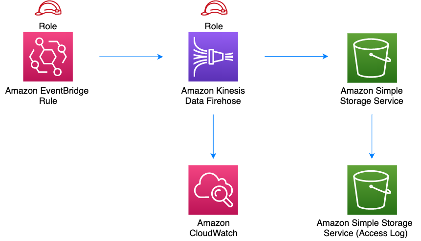

//!!NODE_ROOT <section>
//== aws-eventbridge-kinesisfirehose-s3 module

[.topic]
= aws-eventbridge-kinesisfirehose-s3
:info_doctype: section
:info_title: aws-eventbridge-kinesisfirehose-s3

image::https://img.shields.io/badge/cfn--resources-Stable-success.svg?style=for-the-badge[Stability:
Stable]

[width="100%",cols="<50%,<50%",options="header",]
|===
|*Reference Documentation*:
|https://docs.aws.amazon.com/solutions/latest/constructs/
|===

[width="100%",cols="<46%,54%",options="header",]
|===
|*Language* |*Package*
|image:https://docs.aws.amazon.com/cdk/api/latest/img/python32.png[Python
Logo] Python
|`aws_solutions_constructs.aws_eventbridge_kinesisfirehose_s3`

|image:https://docs.aws.amazon.com/cdk/api/latest/img/typescript32.png[Typescript
Logo] Typescript
|`@aws-solutions-constructs/aws-eventbridge-kinesisfirehose-s3`

|image:https://docs.aws.amazon.com/cdk/api/latest/img/java32.png[Java
Logo] Java
|`software.amazon.awsconstructs.services.eventbridgekinesisfirehoses3`
|===

== Overview

This AWS Solutions Construct implements an Amazon EventBridge Rule to
send data to an Amazon Kinesis Data Firehose delivery stream connected
to an Amazon S3 bucket.

Here is a minimal deployable pattern definition:

====
[role="tablist"]
Typescript::
+
[source,typescript]
----
import { Construct } from 'constructs';
import { Stack, StackProps, Duration } from 'aws-cdk-lib';
import { EventbridgeToKinesisFirehoseToS3, EventbridgeToKinesisFirehoseToS3Props } from '@aws-solutions-constructs/aws-eventbridge-kinesisfirehose-s3';
import * as events from 'aws-cdk-lib/aws-events';

const EventbridgeToKinesisFirehoseToS3Props: EventbridgeToKinesisFirehoseToS3Props = {
  eventRuleProps: {
    schedule: events.Schedule.rate(Duration.minutes(5))
  }
};

new EventbridgeToKinesisFirehoseToS3(this, 'test-eventbridge-firehose-s3', EventbridgeToKinesisFirehoseToS3Props);
----

Python::
+
[source,python]
----
from aws_solutions_constructs.aws_eventbridge_kinesis_firehose_s3 import EventbridgeToKinesisFirehoseToS3, EventbridgeToKinesisFirehoseToS3Props
from aws_cdk import (
    aws_events as events,
    Duration,
    Stack
)
from constructs import Construct

EventbridgeToKinesisFirehoseToS3(self, 'test-eventbridge-firehose-s3',
                                event_rule_props=events.RuleProps(
                                    schedule=events.Schedule.rate(
                                        Duration.minutes(5))
                                ))
----

Java::
+
[source,java]
----
import software.constructs.Construct;

import software.amazon.awscdk.Stack;
import software.amazon.awscdk.StackProps;
import software.amazon.awscdk.Duration;
import software.amazon.awscdk.services.events.*;
import software.amazon.awsconstructs.services.eventbridgekinesisfirehoses3.*;

new EventbridgeToKinesisFirehoseToS3(this, "test-eventbridge-firehose-s3",
        new EventbridgeToKinesisFirehoseToS3Props.Builder()
                .eventRuleProps(new RuleProps.Builder()
                        .schedule(Schedule.rate(Duration.minutes(5)))
                        .build())
                .build());
----
====

== Pattern Construct Props

[width="100%",cols="<30%,<35%,35%",options="header",]
|===
|*Name* |*Type* |*Description*
|existingEventBusInterface?
|https://docs.aws.amazon.com/cdk/api/v2/docs/aws-cdk-lib.aws_events.IEventBus.html[`events.IEventBus`]
|Optional user-provided custom EventBus for construct to use. Providing
both this and `eventBusProps` results an error.

|eventBusProps?
|https://docs.aws.amazon.com/cdk/api/v2/docs/aws-cdk-lib.aws_events.EventBusProps.html[`events.EventBusProps`]
|Optional user-provided properties to override the default properties
when creating a custom EventBus. Setting this value to `++{++}` will
create a custom EventBus using all default properties. If neither this
nor `existingEventBusInterface` is provided the construct will use the
`default` EventBus. Providing both this and `existingEventBusInterface`
results an error.

|eventRuleProps
|https://docs.aws.amazon.com/cdk/api/v2/docs/aws-cdk-lib.aws_events.RuleProps.html[`events.RuleProps`]
|User provided eventRuleProps to override the defaults.

|kinesisFirehoseProps?
|https://docs.aws.amazon.com/cdk/api/v2/docs/aws-cdk-lib.aws_kinesisfirehose.CfnDeliveryStreamProps.html[`kinesisfirehose.CfnDeliveryStreamProps`]
|Optional user provided props to override the default props for Kinesis
Firehose Delivery Stream

|existingBucketObj?
|https://docs.aws.amazon.com/cdk/api/v2/docs/aws-cdk-lib.aws_s3.IBucket.html[`s3.IBucket`]
|Existing instance of S3 Bucket object. If this is provided, then also
providing bucketProps is an error.

|bucketProps?
|https://docs.aws.amazon.com/cdk/api/v2/docs/aws-cdk-lib.aws_s3.BucketProps.html[`s3.BucketProps`]
|User provided props to override the default props for the S3 Bucket.

|logGroupProps?
|https://docs.aws.amazon.com/cdk/api/v2/docs/aws-cdk-lib.aws_logs.LogGroupProps.html[`logs.LogGroupProps`]
|User provided props to override the default props for for the
CloudWatchLogs LogGroup.

|loggingBucketProps?
|https://docs.aws.amazon.com/cdk/api/v2/docs/aws-cdk-lib.aws_s3.BucketProps.html[`s3.BucketProps`]
|Optional user provided props to override the default props for the S3
Logging Bucket.

|logS3AccessLogs? |boolean |Whether to turn on Access Logging for the S3
bucket. Creates an S3 bucket with associated storage costs for the logs.
Enabling Access Logging is a best practice. default - true
|===

NOTE: `existingLoggingBucketObj` has been deprecated - to specify an
existing Log Bucket, use `bucketProps.serverAccessLogsBucket`.

== Pattern Properties

[width="100%",cols="<30%,<35%,35%",options="header",]
|===
|*Name* |*Type* |*Description*
|eventBus?
|https://docs.aws.amazon.com/cdk/api/v2/docs/aws-cdk-lib.aws_events.IEventBus.html[`events.IEventBus`]
|Returns the instance of events.IEventBus used by the construct

|eventsRule
|https://docs.aws.amazon.com/cdk/api/v2/docs/aws-cdk-lib.aws_events.Rule.html[`events.Rule`]
|Returns an instance of events.Rule created by the construct.

|kinesisFirehose
|https://docs.aws.amazon.com/cdk/api/v2/docs/aws-cdk-lib.aws_kinesisfirehose.CfnDeliveryStream.html[`kinesisfirehose.CfnDeliveryStream`]
|Returns an instance of kinesisfirehose.CfnDeliveryStream created by the
construct

|s3Bucket?
|https://docs.aws.amazon.com/cdk/api/v2/docs/aws-cdk-lib.aws_s3.Bucket.html[`s3.Bucket`]
|Returns an instance of s3.Bucket created by the construct

|s3LoggingBucket?
|https://docs.aws.amazon.com/cdk/api/v2/docs/aws-cdk-lib.aws_s3.Bucket.html[`s3.Bucket`]
|Returns an instance of s3.Bucket created by the construct as the
logging bucket for the primary bucket.

|eventsRole
|https://docs.aws.amazon.com/cdk/api/v2/docs/aws-cdk-lib.aws_iam.Role.html[`iam.Role`]
|Returns an instance of the iam.Role created by the construct for Events
Rule

|kinesisFirehoseRole
|https://docs.aws.amazon.com/cdk/api/v2/docs/aws-cdk-lib.aws_iam.Role.html[`iam.Role`]
|Returns an instance of the iam.Role created by the construct for
Kinesis Data Firehose delivery stream

|kinesisFirehoseLogGroup
|https://docs.aws.amazon.com/cdk/api/v2/docs/aws-cdk-lib.aws_logs.LogGroup.html[`logs.LogGroup`]
|Returns an instance of the LogGroup created by the construct for
Kinesis Data Firehose delivery stream

|s3BucketInterface
|https://docs.aws.amazon.com/cdk/api/v2/docs/aws-cdk-lib.aws_s3.IBucket.html[`s3.IBucket`]
|Returns an instance of s3.IBucket created by the construct
|===

== Default settings

Out of the box implementation of the Construct without any override will
set the following defaults:

==== Amazon EventBridge Rule

* Configure least privilege access IAM role for Amazon EventBridge Rule
to publish to the Kinesis Firehose Delivery Stream.

==== Amazon Kinesis Firehose

* Enable CloudWatch logging for Kinesis Firehose
* Configure least privilege access IAM role for Amazon Kinesis Firehose

==== Amazon S3 Bucket

* Configure Access logging for S3 Bucket
* Enable server-side encryption for S3 Bucket using AWS managed KMS Key
* Turn on the versioning for S3 Bucket
* Don’t allow public access for S3 Bucket
* Retain the S3 Bucket when deleting the CloudFormation stack
* Applies Lifecycle rule to move noncurrent object versions to Glacier
storage after 90 days

== Architecture

\\ github block

'''''

© Copyright Amazon.com, Inc. or its affiliates. All Rights Reserved.
