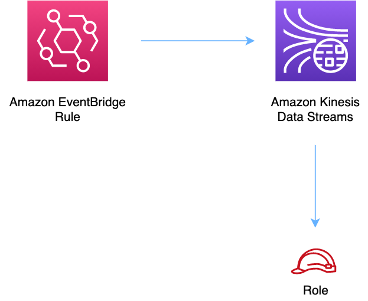

//!!NODE_ROOT <section>
//== aws-eventbridge-kinesisstreams module

[.topic]
= aws-eventbridge-kinesisstreams
:info_doctype: section
:info_title: aws-eventbridge-kinesisstreams

image:https://img.shields.io/badge/stability-Experimental-important.svg?style=for-the-badge[Stability:Experimental]

____
All classes are under active development and subject to non-backward
compatible changes or removal in any future version. These are not
subject to the https://semver.org/[Semantic Versioning] model. This
means that while you may use them, you may need to update your source
code when upgrading to a newer version of this package.
____

[width="100%",cols="<50%,<50%",options="header",]
|===
|*Reference Documentation*:
|https://docs.aws.amazon.com/solutions/latest/constructs/
|===

[width="100%",cols="<46%,54%",options="header",]
|===
|*Language* |*Package*
|image:https://docs.aws.amazon.com/cdk/api/img/python32.png[Python
Logo] Python
|`aws_solutions_constructs.aws_eventbridge_kinesisstreams`

|image:https://docs.aws.amazon.com/cdk/api/img/typescript32.png[Typescript
Logo] Typescript
|`@aws-solutions-constructs/aws-eventbridge-kinesisstreams`

|image:https://docs.aws.amazon.com/cdk/api/img/java32.png[Java
Logo] Java
|`software.amazon.awsconstructs.services.eventbridgekinesisstreams`
|===

== Overview

This AWS Solutions Construct implements an Amazon EventBridge rule to
send data to an Amazon Kinesis Data Stream

Here is a minimal deployable pattern definition:

====
[role="tablist"]
Typescript::
+
[source,typescript]
----
import { Construct } from 'constructs';
import { Stack, StackProps, Duration } from 'aws-cdk-lib';
import { EventbridgeToKinesisStreams, EventbridgeToKinesisStreamsProps } from "@aws-solutions-constructs/aws-eventbridge-kinesisstreams";
import * as events from 'aws-cdk-lib/aws-events';

const constructProps: EventbridgeToKinesisStreamsProps = {
  eventRuleProps: {
    schedule: events.Schedule.rate(Duration.minutes(5)),
  }
};

new EventbridgeToKinesisStreams(this, 'test-eventbridge-kinesis-streams', constructProps);
----

Python::
+
[source,python]
----
from aws_solutions_constructs.aws_eventbridge_kinesis_streams import EventbridgeToKinesisStreams, EventbridgeToKinesisStreamsProps
from aws_cdk import (
    aws_events as events,
    Duration,
    Stack
)
from constructs import Construct

EventbridgeToKinesisStreams(self, 'test-eventbridge-kinesis-streams',
    event_rule_props=events.RuleProps(
        schedule=events.Schedule.rate(Duration.minutes(5)),
    ))
----

Java::
+
[source,java]
----
import software.constructs.Construct;

import software.amazon.awscdk.Stack;
import software.amazon.awscdk.StackProps;
import software.amazon.awscdk.Duration;
import software.amazon.awscdk.services.events.*;
import software.amazon.awsconstructs.services.eventbridgekinesisstreams.*;

new EventbridgeToKinesisStreams(this, "test-eventbridge-kinesis-streams",
        new EventbridgeToKinesisStreamsProps.Builder()
                .eventRuleProps(new RuleProps.Builder()
                        .schedule(Schedule.rate(Duration.minutes(5)))
                        .build())
                .build());
----
====

== Pattern Construct Props

[width="100%",cols="<30%,<35%,35%",options="header",]
|===
|*Name* |*Type* |*Description*
|existingEventBusInterface?
|https://docs.aws.amazon.com/cdk/api/v2/docs/aws-cdk-lib.aws_events.IEventBus.html[`events.IEventBus`]
|Optional - user provided custom event bus for this construct to use. Providing both this and `eventBusProps` is
an error.

|eventBusProps?
|https://docs.aws.amazon.com/cdk/api/v2/docs/aws-cdk-lib.aws_events.EventBusProps.html[`events.EventBusProps`]
|Optional - user provided properties to override the default properties when creating a custom EventBus. Setting
this value to `{}` will create a custom EventBus using all default properties. If neither this nor
`existingEventBusInterface` is provided the construct will use the default EventBus. Providing both this and
`existingEventBusInterface` results an error.

|eventRuleProps
|https://docs.aws.amazon.com/cdk/api/v2/docs/aws-cdk-lib.aws_events.RuleProps.html[`events.RuleProps`]
|User provided eventRuleProps to override the defaults.

|existingStreamObj?
|https://docs.aws.amazon.com/cdk/api/v2/docs/aws-cdk-lib.aws_kinesis.Stream.html[`kinesis.Stream`]
|Existing instance of Kinesis Stream, providing both this and
`kinesisStreamProps` will cause an error.

|kinesisStreamProps?
|https://docs.aws.amazon.com/cdk/api/v2/docs/aws-cdk-lib.aws_kinesis.StreamProps.html[`kinesis.StreamProps`]
|Optional user-provided props to override the default props for the
Kinesis stream.

|createCloudWatchAlarms |`boolean` |Whether to create recommended
CloudWatch alarms.
|===

== Pattern Properties

[width="100%",cols="<30%,<35%,35%",options="header",]
|===
|*Name* |*Type* |*Description*
|eventBus?
|https://docs.aws.amazon.com/cdk/api/v2/docs/aws-cdk-lib.aws_events.IEventBus.html[`events.IEventBus`]
|Returns the instance of events.IEventBus used by the construct

|eventsRule
|https://docs.aws.amazon.com/cdk/api/v2/docs/aws-cdk-lib.aws_events.Rule.html[`events.Rule`]
|Returns an instance of events.Rule created by the construct.

|kinesisStream
|https://docs.aws.amazon.com/cdk/api/v2/docs/aws-cdk-lib.aws_kinesis.Stream.html[`kinesis.Stream`]
|Returns an instance of the Kinesis stream created by the pattern.

|eventsRole?
|https://docs.aws.amazon.com/cdk/api/v2/docs/aws-cdk-lib.aws_iam.Role.html[`iam.Role`]
|Returns an instance of the iam.Role created by the construct for events
rule.

|cloudwatchAlarms?
|https://docs.aws.amazon.com/cdk/api/v2/docs/aws-cdk-lib.aws_cloudwatch.Alarm.html[`cloudwatch.Alarm[\]`]
|Returns an instance of the cloudwatch.Alarm[] created by the
construct.
|===

== Default settings

Out of the box implementation of the Construct without any override will
set the following defaults:

=== Amazon EventBridge Rule

* Configure least privilege access IAM role for EventBridge Rule to
publish to the Kinesis Data Stream.

=== Amazon Kinesis Stream

* Enable server-side encryption for Kinesis Data Stream using AWS
Managed KMS Key.

== Architecture

// github block

'''''

© Copyright Amazon.com, Inc. or its affiliates. All Rights Reserved.
