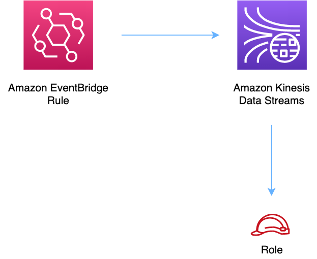

# aws-eventbridge-kinesisstreams module
<!--BEGIN STABILITY BANNER-->

---


> All classes are under active development and subject to non-backward compatible changes or removal in any
> future version. These are not subject to the [Semantic Versioning](https://semver.org/) model.
> This means that while you may use them, you may need to update your source code when upgrading to a newer version of this package.

---
<!--END STABILITY BANNER-->

| **Reference Documentation**:| <span style="font-weight: normal">https://docs.aws.amazon.com/solutions/latest/constructs/</span>|
|:-------------|:-------------|
<div style="height:8px"></div>

| **Language**     | **Package**        |
|:-------------|-----------------|
| Python|`aws_solutions_constructs.aws_eventbridge_kinesisstreams`|
| Typescript|`@aws-solutions-constructs/aws-eventbridge-kinesisstreams`|
| Java|`software.amazon.awsconstructs.services.eventbridgekinesisstreams`|

This AWS Solutions Construct implements an Amazon EventBridge rule to send data to an Amazon Kinesis Data Stream

Here is a minimal deployable pattern definition in Typescript:

``` typescript
import * as cdk from '@aws-cdk/core';
import {EventbridgeToKinesisStreams, EventbridgeToKinesisStreamsProps} from "@aws-solutions-constructs/aws-eventbridge-kinesisstreams";

const props: EventbridgeToKinesisStreamsProps = {
    eventRuleProps: {
      schedule: events.Schedule.rate(Duration.minutes(5)),
    }
};

new EventbridgeToKinesisStreams(this, 'test-eventbridge-kinesis-streams', props);
```

## Initializer

``` text
new EventbridgeToKinesisStreams(scope: Construct, id: string, props: EventbridgeToKinesisStreamsProps);
```

_Parameters_

* scope [`Construct`](https://docs.aws.amazon.com/cdk/api/latest/docs/@aws-cdk_core.Construct.html)
* id `string`
* props [`EventbridgeToKinesisStreamsProps`](#pattern-construct-props)

## Pattern Construct Props

| **Name**     | **Type**        | **Description** |
|:-------------|:----------------|-----------------|
|existingEventBusInterface?|[`events.IEventBus`](https://docs.aws.amazon.com/cdk/api/latest/docs/@aws-cdk_aws-events.IEventBus.html)| Optional user-provided custom EventBus for construct to use. Providing both this and `eventBusProps` results an error.|
|eventBusProps?|[`events.EventBusProps`](https://docs.aws.amazon.com/cdk/api/latest/docs/@aws-cdk_aws-events.EventBusProps.html)|Optional user-provided properties to override the default properties when creating a custom EventBus. Setting this value to `{}` will create a custom EventBus using all default properties. If neither this nor `existingEventBusInterface` is provided the construct will use the `default` EventBus. Providing both this and `existingEventBusInterface` results an error.|
|eventRuleProps|[`events.RuleProps`](https://docs.aws.amazon.com/cdk/api/latest/docs/@aws-cdk_aws-events.RuleProps.html)|User provided eventRuleProps to override the defaults. |
|existingStreamObj?|[`kinesis.Stream`](https://docs.aws.amazon.com/cdk/api/latest/docs/@aws-cdk_aws-kinesis.Stream.html)|Existing instance of Kinesis Stream, providing both this and `kinesisStreamProps` will cause an error.|
|kinesisStreamProps?|[`kinesis.StreamProps`](https://docs.aws.amazon.com/cdk/api/latest/docs/@aws-cdk_aws-kinesis.StreamProps.html)|Optional user-provided props to override the default props for the Kinesis stream. |
|createCloudWatchAlarms|`boolean`|Whether to create recommended CloudWatch alarms. |

## Pattern Properties

| **Name**     | **Type**        | **Description** |
|:-------------|:----------------|-----------------|
|eventBus?|[`events.IEventBus`](https://docs.aws.amazon.com/cdk/api/latest/docs/@aws-cdk_aws-events.IEventBus.html)|Returns the instance of events.IEventBus used by the construct|
|eventsRule|[`events.Rule`](https://docs.aws.amazon.com/cdk/api/latest/docs/@aws-cdk_aws-events.Rule.html)|Returns an instance of events.Rule created by the construct.|
|kinesisStream|[`kinesis.Stream`](https://docs.aws.amazon.com/cdk/api/latest/docs/@aws-cdk_aws-kinesis.Stream.html)|Returns an instance of the Kinesis stream created by the pattern.|
|eventsRole?|[`iam.Role`](https://docs.aws.amazon.com/cdk/api/latest/docs/@aws-cdk_aws-iam.Role.html)|Returns an instance of the iam.Role created by the construct for events rule.|

## Default settings

Out of the box implementation of the Construct without any override will set the following defaults:

### Amazon EventBridge Rule
* Configure least privilege access IAM role for EventBridge Rule to publish to the Kinesis Data Stream.

### Amazon Kinesis Stream
* Enable server-side encryption for Kinesis Data Stream using AWS Managed KMS Key.

## Architecture


***
&copy; Copyright 2021 Amazon.com, Inc. or its affiliates. All Rights Reserved.