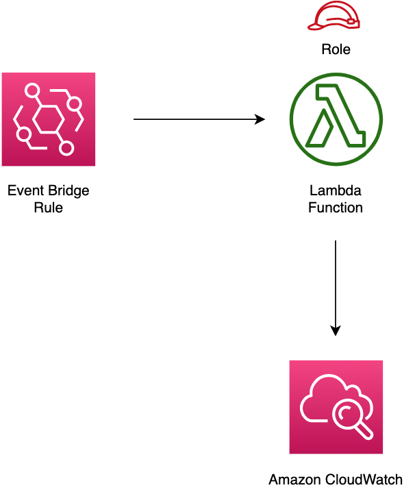

# aws-eventbridge-lambda module
<!--BEGIN STABILITY BANNER-->

---


---
<!--END STABILITY BANNER-->

| **Reference Documentation**:| <span style="font-weight: normal">https://docs.aws.amazon.com/solutions/latest/constructs/</span>|
|:-------------|:-------------|
<div style="height:8px"></div>

| **Language**     | **Package**        |
|:-------------|-----------------|
| Python|`aws_solutions_constructs.aws_eventbridge_lambda`|
| Typescript|`@aws-solutions-constructs/aws-eventbridge-lambda`|
| Java|`software.amazon.awsconstructs.services.eventbridgelambda`|

## Overview
This AWS Solutions Construct implements an AWS EventBridge rule and an AWS Lambda function.

Here is a minimal deployable pattern definition:

Typescript
``` typescript
import { Construct } from 'constructs';
import { Stack, StackProps, Duration } from 'aws-cdk-lib';
import { EventbridgeToLambdaProps, EventbridgeToLambda } from '@aws-solutions-constructs/aws-eventbridge-lambda';
import * as lambda from 'aws-cdk-lib/aws-lambda';
import * as events from 'aws-cdk-lib/aws-events';

const constructProps: EventbridgeToLambdaProps = {
  lambdaFunctionProps: {
    code: lambda.Code.fromAsset(`lambda`),
    runtime: lambda.Runtime.NODEJS_14_X,
    handler: 'index.handler'
  },
  eventRuleProps: {
    schedule: events.Schedule.rate(Duration.minutes(5))
  }
};

new EventbridgeToLambda(this, 'test-eventbridge-lambda', constructProps);
```

Python
``` python
from aws_solutions_constructs.aws_eventbridge_lambda import EventbridgeToLambda, EventbridgeToLambdaProps
from aws_cdk import (
    aws_lambda as _lambda,
    aws_events as events,
    Duration,
    Stack
)
from constructs import Construct

EventbridgeToLambda(self, 'test-eventbridge-lambda',
                    lambda_function_props=_lambda.FunctionProps(
                        code=_lambda.Code.from_asset('lambda'),
                        runtime=_lambda.Runtime.PYTHON_3_9,
                        handler='index.handler'
                    ),
                    event_rule_props=events.RuleProps(
                        schedule=events.Schedule.rate(
                            Duration.minutes(5))
                    ))
```

Java
``` java
import software.constructs.Construct;

import software.amazon.awscdk.Stack;
import software.amazon.awscdk.StackProps;
import software.amazon.awscdk.Duration;
import software.amazon.awscdk.services.events.*;
import software.amazon.awscdk.services.lambda.*;
import software.amazon.awscdk.services.lambda.Runtime;
import software.amazon.awsconstructs.services.eventbridgelambda.*;

new EventbridgeToLambda(this, "test-eventbridge-lambda",
        new EventbridgeToLambdaProps.Builder()
                .lambdaFunctionProps(new FunctionProps.Builder()
                        .runtime(Runtime.NODEJS_14_X)
                        .code(Code.fromAsset("lambda"))
                        .handler("index.handler")
                        .build())
                .eventRuleProps(new RuleProps.Builder()
                        .schedule(Schedule.rate(Duration.minutes(5)))
                        .build())
                .build());
```

## Pattern Construct Props

| **Name**     | **Type**        | **Description** |
|:-------------|:----------------|-----------------|
|existingLambdaObj?|[`lambda.Function`](https://docs.aws.amazon.com/cdk/api/latest/docs/@aws-cdk_aws-lambda.Function.html)|Existing instance of Lambda Function object, providing both this and `lambdaFunctionProps` will cause an error.|
|lambdaFunctionProps?|[`lambda.FunctionProps`](https://docs.aws.amazon.com/cdk/api/latest/docs/@aws-cdk_aws-lambda.FunctionProps.html)|User provided props to override the default props for the Lambda function.|
|existingEventBusInterface?|[`events.IEventBus`](https://docs.aws.amazon.com/cdk/api/latest/docs/@aws-cdk_aws-events.IEventBus.html)| Optional user-provided custom EventBus for construct to use. Providing both this and `eventBusProps` results an error.|
|eventBusProps?|[`events.EventBusProps`](https://docs.aws.amazon.com/cdk/api/latest/docs/@aws-cdk_aws-events.EventBusProps.html)|Optional user-provided properties to override the default properties when creating a custom EventBus. Setting this value to `{}` will create a custom EventBus using all default properties. If neither this nor `existingEventBusInterface` is provided the construct will use the `default` EventBus. Providing both this and `existingEventBusInterface` results an error.|
|eventRuleProps|[`events.RuleProps`](https://docs.aws.amazon.com/cdk/api/latest/docs/@aws-cdk_aws-events.RuleProps.html)|User provided eventRuleProps to override the defaults|

## Pattern Properties

| **Name**     | **Type**        | **Description** |
|:-------------|:----------------|-----------------|
|eventBus?|[`events.IEventBus`](https://docs.aws.amazon.com/cdk/api/latest/docs/@aws-cdk_aws-events.IEventBus.html)|Returns the instance of events.IEventBus used by the construct|
|eventsRule|[`events.Rule`](https://docs.aws.amazon.com/cdk/api/latest/docs/@aws-cdk_aws-events.Rule.html)|Returns an instance of events.Rule created by the construct|
|lambdaFunction|[`lambda.Function`](https://docs.aws.amazon.com/cdk/api/latest/docs/@aws-cdk_aws-lambda.Function.html)|Returns an instance of lambda.Function created by the construct|

## Default settings

Out of the box implementation of the Construct without any override will set the following defaults:

### Amazon EventBridge Rule
* Grant least privilege permissions to EventBridge rule to trigger the Lambda Function

### AWS Lambda Function
* Configure limited privilege access IAM role for Lambda function
* Enable reusing connections with Keep-Alive for NodeJs Lambda function
* Enable X-Ray Tracing
* Set Environment Variables
* AWS_NODEJS_CONNECTION_REUSE_ENABLED (for Node 10.x and higher functions)

## Architecture


***
&copy; Copyright 2022 Amazon.com, Inc. or its affiliates. All Rights Reserved.
