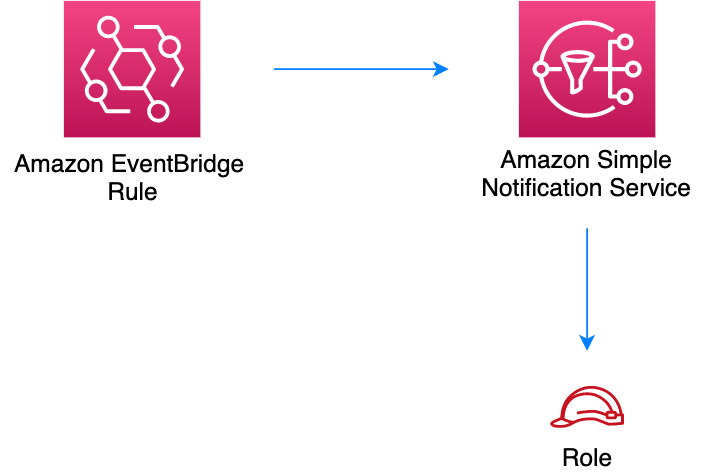

# aws-eventbridge-sns module
<!--BEGIN STABILITY BANNER-->

---


---
<!--END STABILITY BANNER-->

| **Reference Documentation**:| <span style="font-weight: normal">https://docs.aws.amazon.com/solutions/latest/constructs/</span>|
|:-------------|:-------------|
<div style="height:8px"></div>

| **Language**     | **Package**        |
|:-------------|-----------------|
| Python|`aws_solutions_constructs.aws_eventbridge_sns`|
| Typescript|`@aws-solutions-constructs/aws-eventbridge-sns`|
| Java|`software.amazon.awsconstructs.services.eventbridgesns`|

## Overview
This AWS Solutions Construct implements an AWS Events rule and an AWS SNS Topic.

Here is a minimal deployable pattern definition:

Typescript
``` typescript
import { Construct } from 'constructs';
import { Stack, StackProps, Duration } from 'aws-cdk-lib';
import * as events from 'aws-cdk-lib/aws-events';
import * as iam from 'aws-cdk-lib/aws-iam';
import { EventbridgeToSnsProps, EventbridgeToSns } from "@aws-solutions-constructs/aws-eventbridge-sns";

const constructProps: EventbridgeToSnsProps = {
  eventRuleProps: {
    schedule: events.Schedule.rate(Duration.minutes(5))
  }
};

const constructStack = new EventbridgeToSns(this, 'test-construct', constructProps);

// Grant yourself permissions to use the Customer Managed KMS Key
const policyStatement = new iam.PolicyStatement({
  actions: ["kms:Encrypt", "kms:Decrypt"],
  effect: iam.Effect.ALLOW,
  principals: [new iam.AccountRootPrincipal()],
  resources: ["*"]
});

constructStack.encryptionKey?.addToResourcePolicy(policyStatement);
```

Python
``` Python
from aws_solutions_constructs.aws_eventbridge_sns import EventbridgeToSns, EventbridgeToSnsProps
from aws_cdk import (
    aws_events as events,
    aws_iam as iam,
    Duration,
    Stack
)
from constructs import Construct

construct_stack = EventbridgeToSns(self, 'test-construct',
                                    event_rule_props=events.RuleProps(
                                        schedule=events.Schedule.rate(
                                            Duration.minutes(5))
                                    ))

# Grant yourself permissions to use the Customer Managed KMS Key
policy_statement = iam.PolicyStatement(
    actions=["kms:Encrypt", "kms:Decrypt"],
    effect=iam.Effect.ALLOW,
    principals=[iam.AccountRootPrincipal()],
    resources=["*"]
)

construct_stack.encryption_key.add_to_resource_policy(policy_statement)
```

Java
``` java
import software.constructs.Construct;
import java.util.List;

import software.amazon.awscdk.Stack;
import software.amazon.awscdk.StackProps;
import software.amazon.awscdk.Duration;
import software.amazon.awscdk.services.events.*;
import software.amazon.awscdk.services.iam.*;
import software.amazon.awsconstructs.services.eventbridgesns.*;

final EventbridgeToSns constructStack = new EventbridgeToSns(this, "test-construct",
        new EventbridgeToSnsProps.Builder()
                .eventRuleProps(new RuleProps.Builder()
                        .schedule(Schedule.rate(Duration.minutes(5)))
                        .build())
                .build());

// Grant yourself permissions to use the Customer Managed KMS Key
final PolicyStatement policyStatement = PolicyStatement.Builder.create()
        .actions(List.of("kms:Encrypt", "kms:Decrypt"))
        .effect(Effect.ALLOW)
        .principals(List.of(new AccountRootPrincipal()))
        .resources(List.of("*"))
        .build();

constructStack.getEncryptionKey().addToResourcePolicy(policyStatement);
```

## Pattern Construct Props

| **Name**     | **Type**        | **Description** |
|:-------------|:----------------|-----------------|
|eventRuleProps|[`events.RuleProps`](https://docs.aws.amazon.com/cdk/api/v2/docs/aws-cdk-lib.aws_events.RuleProps.html)|User provided eventRuleProps to override the defaults. |
|existingTopicObj?|[`sns.Topic`](https://docs.aws.amazon.com/cdk/api/v2/docs/aws-cdk-lib.aws_lambda.Function.html)|Existing instance of SNS Topic object, providing both this and `topicProps` will cause an error.|
|topicProps?|[`sns.TopicProps`](https://docs.aws.amazon.com/cdk/api/v2/docs/aws-cdk-lib.aws_sns.TopicProps.html)|User provided props to override the default props for the SNS Topic. |
|existingEventBusInterface?|[`events.IEventBus`](https://docs.aws.amazon.com/cdk/api/v2/docs/aws-cdk-lib.aws_events.IEventBus.html)| Optional user-provided custom EventBus for construct to use. Providing both this and `eventBusProps` results an error.|
|eventBusProps?|[`events.EventBusProps`](https://docs.aws.amazon.com/cdk/api/v2/docs/aws-cdk-lib.aws_events.EventBusProps.html)|Optional user-provided properties to override the default properties when creating a custom EventBus. Setting this value to `{}` will create a custom EventBus using all default properties. If neither this nor `existingEventBusInterface` is provided the construct will use the `default` EventBus. Providing both this and `existingEventBusInterface` results an error.|
|enableEncryptionWithCustomerManagedKey?|`boolean`|If no key is provided, this flag determines whether the SNS Topic is encrypted with a new CMK or an AWS managed key. This flag is ignored if any of the following are defined: topicProps.masterKey, encryptionKey or encryptionKeyProps.|
|encryptionKey?|[`kms.Key`](https://docs.aws.amazon.com/cdk/api/v2/docs/aws-cdk-lib.aws_kms.Key.html)|An optional, imported encryption key to encrypt the SNS Topic with.|
|encryptionKeyProps?|[`kms.KeyProps`](https://docs.aws.amazon.com/cdk/api/v2/docs/aws-cdk-lib.aws_kms.Key.html#construct-props)|Optional user provided properties to override the default properties for the KMS encryption key used to encrypt the SNS Topic with.|

## Pattern Properties

| **Name**     | **Type**        | **Description** |
|:-------------|:----------------|-----------------|
|eventBus?|[`events.IEventBus`](https://docs.aws.amazon.com/cdk/api/v2/docs/aws-cdk-lib.aws_events.IEventBus.html)|Returns the instance of events.IEventBus used by the construct|
|eventsRule|[`events.Rule`](https://docs.aws.amazon.com/cdk/api/v2/docs/aws-cdk-lib.aws_events.Rule.html)|Returns an instance of events.Rule created by the construct|
|snsTopic|[`sns.Topic`](https://docs.aws.amazon.com/cdk/api/v2/docs/aws-cdk-lib.aws_sns.Topic.html)|Returns an instance of sns.Topic created by the construct|
|encryptionKey?|[`kms.Key`](https://docs.aws.amazon.com/cdk/api/v2/docs/aws-cdk-lib.aws_kms.Key.html)|Returns an instance of kms Key used for the SNS Topic.|

## Default settings

Out of the box implementation of the Construct without any override will set the following defaults:

### Amazon EventBridge Rule
* Grant least privilege permissions to EventBridge Rule to publish to the SNS Topic.

### Amazon SNS Topic
* Configure least privilege access permissions for SNS Topic.
* Enable server-side encryption forSNS Topic using Customer managed KMS Key.
* Enforce encryption of data in transit.

## Architecture


***
&copy; Copyright Amazon.com, Inc. or its affiliates. All Rights Reserved.
